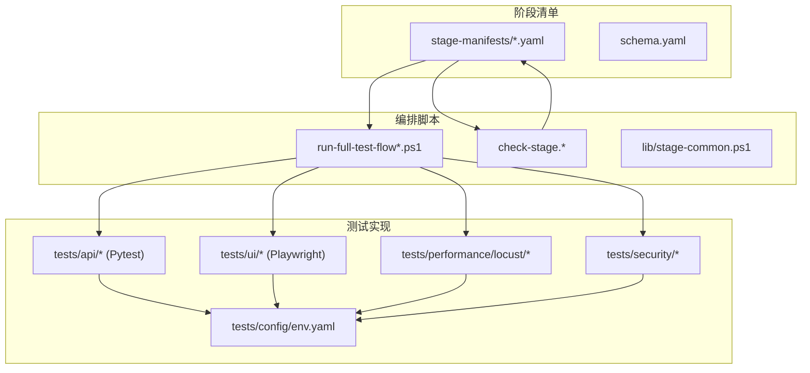
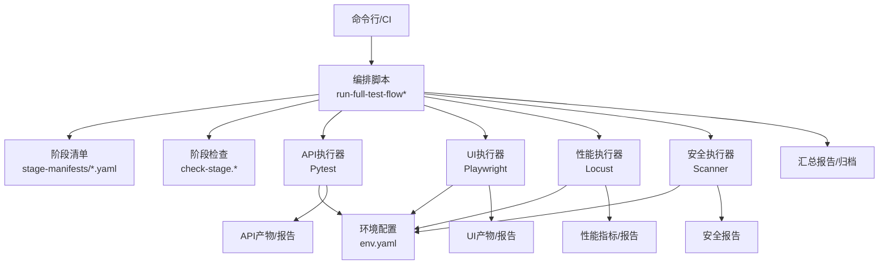
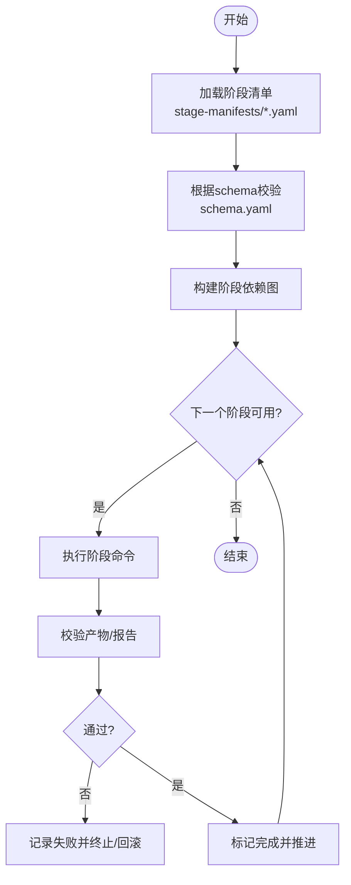
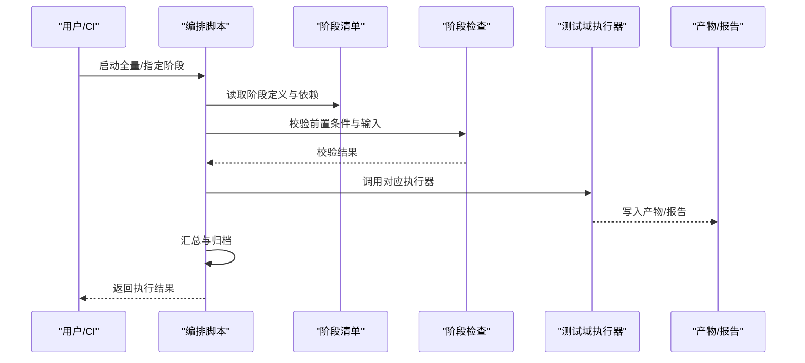
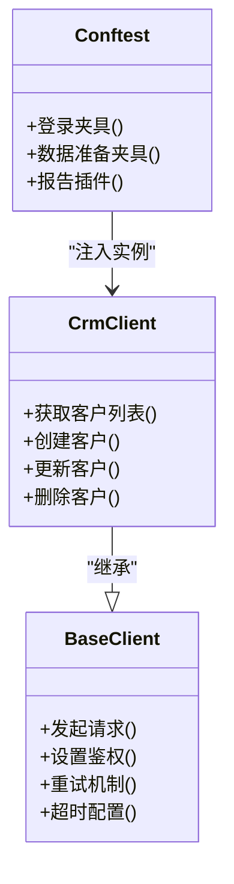
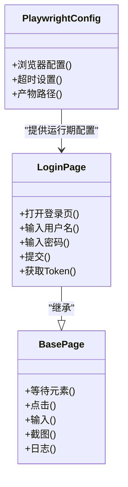
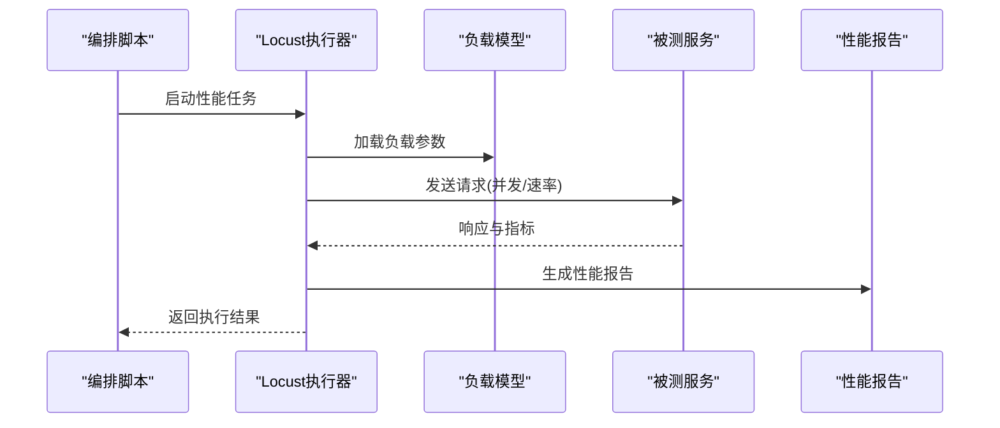
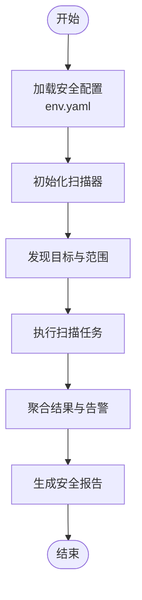
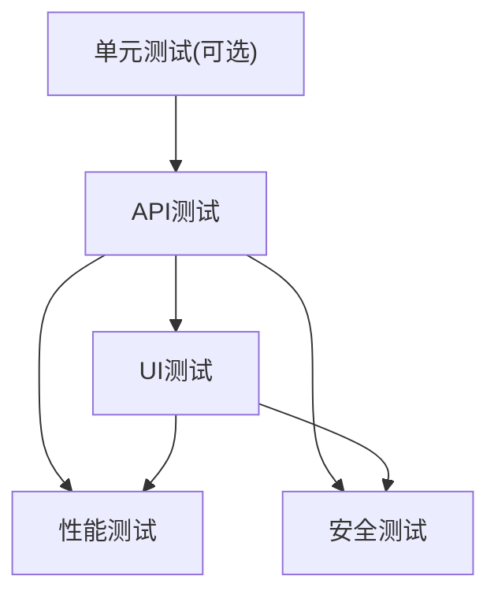
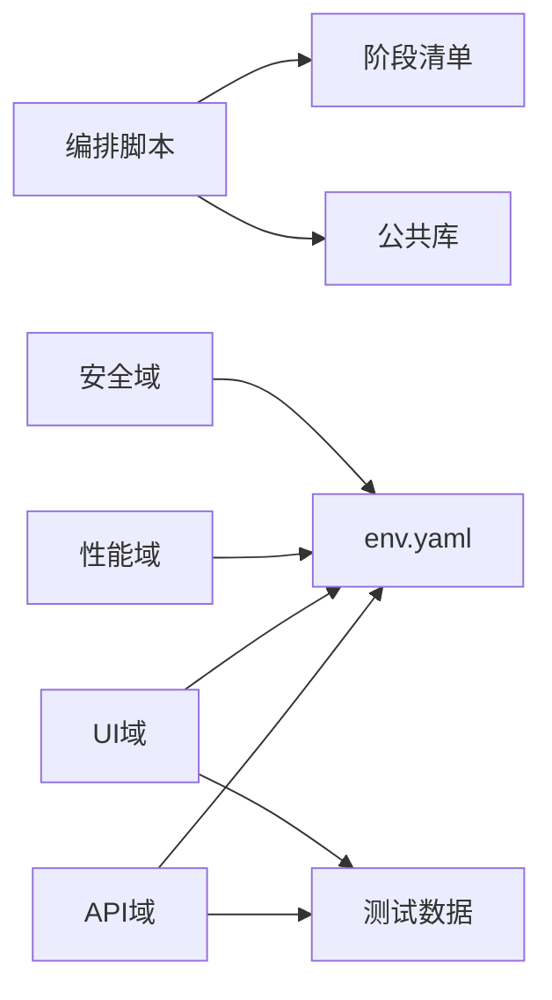

# 架构设计

<cite>
**本文档引用的文件**   
- [stage-manifests/01-req-analysis.yaml](file://stage-manifests/01-req-analysis.yaml)
- [stage-manifests/02-test-design.yaml](file://stage-manifests/02-test-design.yaml)
- [stage-manifests/03-case-generation.yaml](file://stage-manifests/03-case-generation.yaml)
- [stage-manifests/04-case-review.yaml](file://stage-manifests/04-case-review.yaml)
- [stage-manifests/05-api-automation.yaml](file://stage-manifests/05-api-automation.yaml)
- [stage-manifests/06-ui-automation.yaml](file://stage-manifests/06-ui-automation.yaml)
- [stage-manifests/07-performance.yaml](file://stage-manifests/07-performance.yaml)
- [stage-manifests/08-security.yaml](file://stage-manifests/08-security.yaml)
- [stage-manifests/09-system-test-report.yaml](file://stage-manifests/09-system-test-report.yaml)
- [stage-manifests/10-knowledge-base.yaml](file://stage-manifests/10-knowledge-base.yaml)
- [stage-manifests/schema.yaml](file://stage-manifests/schema.yaml)
- [scripts/run-full-test-flow.ps1](file://scripts/run-full-test-flow.ps1)
- [scripts/run-full-test-flow-simple.ps1](file://scripts/run-full-test-flow-simple.ps1)
- [scripts/check-stage.sh](file://scripts/check-stage.sh)
- [scripts/check-stage.ps1](file://scripts/check-stage.ps1)
- [scripts/lib/stage-common.ps1](file://scripts/lib/stage-common.ps1)
- [tests/config/env.yaml](file://tests/config/env.yaml)
- [tests/api/conftest.py](file://tests/api/conftest.py)
- [tests/api/pytest.ini](file://tests/api/pytest.ini)
- [tests/api/clients/base_client.py](file://tests/api/clients/base_client.py)
- [tests/api/clients/crm_client.py](file://tests/api/clients/crm_client.py)
- [tests/ui/playwright.config.ts](file://tests/ui/playwright.config.ts)
- [tests/ui/global-setup.ts](file://tests/ui/global-setup.ts)
- [tests/ui/pages/BasePage.ts](file://tests/ui/pages/BasePage.ts)
- [tests/ui/pages/LoginPage.ts](file://tests/ui/pages/LoginPage.ts)
- [tests/ui/specs/crm/crm-smoke.spec.ts](file://tests/ui/specs/crm/crm-smoke.spec.ts)
- [tests/performance/locust/README.md](file://tests/performance/locust/README.md)
- [tests/performance/locust/config/load_profiles.yaml](file://tests/performance/locust/config/load_profiles.yaml)
- [tests/security/scanner/security_scanner.py](file://tests/security/scanner/security_scanner.py)
</cite>

## 目录
1. [引言](#引言)
2. [项目结构](#项目结构)
3. [核心组件](#核心组件)
4. [架构总览](#架构总览)
5. [详细组件分析](#详细组件分析)
6. [依赖关系分析](#依赖关系分析)
7. [性能考量](#性能考量)
8. [故障排查指南](#故障排查指南)
9. [结论](#结论)
10. [附录](#附录)

## 引言
本架构设计文档面向AutoTest Hub框架，目标是系统化阐述整体系统架构、分层与模块化设计、测试金字塔落地方式、关键设计模式应用、阶段清单管理与YAML配置结构、系统边界与扩展点、以及集成策略。文档同时提供架构图与组件关系图，帮助开发者快速理解系统结构与关键决策。

## 项目结构
AutoTest Hub采用“多语言、多工具、按领域分层”的组织方式：
- 阶段清单（stage-manifests）：以YAML描述各阶段任务、输入输出、依赖与执行参数，驱动端到端流水线。
- 脚本层（scripts）：编排与检查阶段执行的Shell/PowerShell脚本，统一入口与公共能力。
- 测试实现（tests）：按测试类型划分API、UI、性能、安全等子域，各自使用主流工具链（Pytest、Playwright、Locust、自定义扫描器）。
- 配置与数据（tests/config、tests/data）：环境配置、用例数据与共享资源。
- 文档与资产（docs）：需求、方案、用例、缺陷、知识沉淀等。

图表来源
- [stage-manifests/schema.yaml](file://stage-manifests/schema.yaml)
- [scripts/run-full-test-flow.ps1](file://scripts/run-full-test-flow.ps1)
- [scripts/check-stage.sh](file://scripts/check-stage.sh)
- [tests/config/env.yaml](file://tests/config/env.yaml)

章节来源
- [stage-manifests/schema.yaml](file://stage-manifests/schema.yaml)
- [scripts/run-full-test-flow.ps1](file://scripts/run-full-test-flow.ps1)
- [scripts/check-stage.sh](file://scripts/check-stage.sh)
- [tests/config/env.yaml](file://tests/config/env.yaml)

## 核心组件
- 阶段清单管理器：基于YAML的阶段定义与校验，支撑可组合的流水线编排。
- 编排脚本：跨平台（PowerShell/Shell）的统一入口，负责顺序/条件执行阶段、收集产物、失败回滚与报告汇总。
- 测试域实现：
  - API自动化：Pytest + 客户端封装（BaseClient/CrmClient），支持鉴权、断言与数据准备。
  - UI自动化：Playwright + 页面对象（BasePage及业务页面），集中管理浏览器会话与登录态。
  - 性能测试：Locust + 负载模型（load_profiles.yaml），覆盖API与UI场景。
  - 安全测试：自定义扫描器，结合配置与环境进行漏洞探测。
- 配置中心：env.yaml统一管理目标环境、凭据、开关与路径。

章节来源
- [stage-manifests/05-api-automation.yaml](file://stage-manifests/05-api-automation.yaml)
- [stage-manifests/06-ui-automation.yaml](file://stage-manifests/06-ui-automation.yaml)
- [stage-manifests/07-performance.yaml](file://stage-manifests/07-performance.yaml)
- [stage-manifests/08-security.yaml](file://stage-manifests/08-security.yaml)
- [tests/api/conftest.py](file://tests/api/conftest.py)
- [tests/api/clients/base_client.py](file://tests/api/clients/base_client.py)
- [tests/api/clients/crm_client.py](file://tests/api/clients/crm_client.py)
- [tests/ui/playwright.config.ts](file://tests/ui/playwright.config.ts)
- [tests/ui/global-setup.ts](file://tests/ui/global-setup.ts)
- [tests/ui/pages/BasePage.ts](file://tests/ui/pages/BasePage.ts)
- [tests/performance/locust/config/load_profiles.yaml](file://tests/performance/locust/config/load_profiles.yaml)
- [tests/security/scanner/security_scanner.py](file://tests/security/scanner/security_scanner.py)
- [tests/config/env.yaml](file://tests/config/env.yaml)

## 架构总览
系统采用“清单驱动 + 脚本编排 + 多域测试实现”的分层架构：
- 表现层（用户交互）：通过命令行或CI触发run-full-test-flow脚本，选择阶段或全量流程。
- 编排层（Stage Orchestrator）：解析阶段清单，校验阶段依赖与输入输出，调用具体测试域执行器。
- 测试域层（Test Domains）：API/UI/性能/安全各自独立实现，遵循统一契约（输入/输出/状态码/产物）。
- 配置与数据层：env.yaml与data目录提供环境与数据支撑。
- 产物与报告层：各阶段产出日志、截图、视频、覆盖率、性能指标与安全报告，供后续阶段消费。

图表来源
- [scripts/run-full-test-flow.ps1](file://scripts/run-full-test-flow.ps1)
- [scripts/check-stage.sh](file://scripts/check-stage.sh)
- [stage-manifests/05-api-automation.yaml](file://stage-manifests/05-api-automation.yaml)
- [stage-manifests/06-ui-automation.yaml](file://stage-manifests/06-ui-automation.yaml)
- [stage-manifests/07-performance.yaml](file://stage-manifests/07-performance.yaml)
- [stage-manifests/08-security.yaml](file://stage-manifests/08-security.yaml)
- [tests/config/env.yaml](file://tests/config/env.yaml)

## 详细组件分析

### 阶段清单管理系统（YAML驱动）
- 设计要点
  - 每个阶段一个YAML文件，包含阶段ID、名称、前置依赖、输入/输出、执行命令、重试与超时、产物校验规则等。
  - schema.yaml定义清单结构的JSON Schema，用于静态校验，确保一致性。
  - 编排脚本读取清单并构建有向无环图（DAG），按拓扑序执行；遇到失败可中止或继续（由策略决定）。
- 典型阶段
  - 需求分析、测试设计、用例生成、用例评审、API自动化、UI自动化、性能、安全、系统测试报告、知识库沉淀。
- 数据流
  - 上游阶段产物作为下游阶段输入；例如用例评审通过后进入自动化执行；性能与安全结果汇入系统测试报告。

图表来源
- [stage-manifests/schema.yaml](file://stage-manifests/schema.yaml)
- [scripts/check-stage.sh](file://scripts/check-stage.sh)
- [scripts/check-stage.ps1](file://scripts/check-stage.ps1)
- [scripts/lib/stage-common.ps1](file://scripts/lib/stage-common.ps1)

章节来源
- [stage-manifests/schema.yaml](file://stage-manifests/schema.yaml)
- [stage-manifests/01-req-analysis.yaml](file://stage-manifests/01-req-analysis.yaml)
- [stage-manifests/02-test-design.yaml](file://stage-manifests/02-test-design.yaml)
- [stage-manifests/03-case-generation.yaml](file://stage-manifests/03-case-generation.yaml)
- [stage-manifests/04-case-review.yaml](file://stage-manifests/04-case-review.yaml)
- [stage-manifests/05-api-automation.yaml](file://stage-manifests/05-api-automation.yaml)
- [stage-manifests/06-ui-automation.yaml](file://stage-manifests/06-ui-automation.yaml)
- [stage-manifests/07-performance.yaml](file://stage-manifests/07-performance.yaml)
- [stage-manifests/08-security.yaml](file://stage-manifests/08-security.yaml)
- [stage-manifests/09-system-test-report.yaml](file://stage-manifests/09-system-test-report.yaml)
- [stage-manifests/10-knowledge-base.yaml](file://stage-manifests/10-knowledge-base.yaml)
- [scripts/check-stage.sh](file://scripts/check-stage.sh)
- [scripts/check-stage.ps1](file://scripts/check-stage.ps1)
- [scripts/lib/stage-common.ps1](file://scripts/lib/stage-common.ps1)

### 编排脚本与流水线控制
- 入口脚本
  - run-full-test-flow.ps1 / run-full-test-flow-simple.ps1：提供全量或简化流程入口，支持选择阶段、并行度、失败策略与产物归档。
- 阶段检查
  - check-stage.sh / check-stage.ps1：校验阶段前置条件、环境变量、依赖工具与输入产物完整性。
- 公共库
  - lib/stage-common.ps1：封装通用函数（日志、错误处理、重试、路径解析、产物打包等）。

图表来源
- [scripts/run-full-test-flow.ps1](file://scripts/run-full-test-flow.ps1)
- [scripts/run-full-test-flow-simple.ps1](file://scripts/run-full-test-flow-simple.ps1)
- [scripts/check-stage.sh](file://scripts/check-stage.sh)
- [scripts/check-stage.ps1](file://scripts/check-stage.ps1)
- [scripts/lib/stage-common.ps1](file://scripts/lib/stage-common.ps1)

章节来源
- [scripts/run-full-test-flow.ps1](file://scripts/run-full-test-flow.ps1)
- [scripts/run-full-test-flow-simple.ps1](file://scripts/run-full-test-flow-simple.ps1)
- [scripts/check-stage.sh](file://scripts/check-stage.sh)
- [scripts/check-stage.ps1](file://scripts/check-stage.ps1)
- [scripts/lib/stage-common.ps1](file://scripts/lib/stage-common.ps1)

### API自动化组件（Pytest + 客户端封装）
- 设计要点
  - BaseClient：封装HTTP基础能力（连接、鉴权、重试、超时、日志）。
  - CrmClient：在BaseClient之上实现CRM领域接口方法，屏蔽协议细节。
  - conftest.py：提供全局夹具（如登录态、测试数据、报告插件）。
  - pytest.ini：定义测试发现规则、插件与选项。
- 数据流
  - 用例 -> CrmClient -> BaseClient -> 被测服务 -> 响应断言 -> 产物（日志/报告）。

图表来源
- [tests/api/clients/base_client.py](file://tests/api/clients/base_client.py)
- [tests/api/clients/crm_client.py](file://tests/api/clients/crm_client.py)
- [tests/api/conftest.py](file://tests/api/conftest.py)
- [tests/api/pytest.ini](file://tests/api/pytest.ini)

章节来源
- [tests/api/clients/base_client.py](file://tests/api/clients/base_client.py)
- [tests/api/clients/crm_client.py](file://tests/api/clients/crm_client.py)
- [tests/api/conftest.py](file://tests/api/conftest.py)
- [tests/api/pytest.ini](file://tests/api/pytest.ini)

### UI自动化组件（Playwright + 页面对象）
- 设计要点
  - BasePage：封装通用页面操作（等待、定位、截图、日志）。
  - LoginPage：登录相关交互，维护会话与Token。
  - playwright.config.ts：浏览器、超时、并行、产物路径等配置。
  - global-setup.ts：全局初始化（如预置账号、清理环境）。
- 数据流
  - 用例 -> Page对象 -> Playwright引擎 -> 浏览器 -> 被测前端 -> 截图/视频/Trace。

图表来源
- [tests/ui/pages/BasePage.ts](file://tests/ui/pages/BasePage.ts)
- [tests/ui/pages/LoginPage.ts](file://tests/ui/pages/LoginPage.ts)
- [tests/ui/playwright.config.ts](file://tests/ui/playwright.config.ts)
- [tests/ui/global-setup.ts](file://tests/ui/global-setup.ts)

章节来源
- [tests/ui/pages/BasePage.ts](file://tests/ui/pages/BasePage.ts)
- [tests/ui/pages/LoginPage.ts](file://tests/ui/pages/LoginPage.ts)
- [tests/ui/playwright.config.ts](file://tests/ui/playwright.config.ts)
- [tests/ui/global-setup.ts](file://tests/ui/global-setup.ts)

### 性能测试组件（Locust + 负载模型）
- 设计要点
  - locustfile_*：定义用户行为与并发模型。
  - load_profiles.yaml：不同负载场景的参数化配置（并发数、持续时间、RPS等）。
  - README.md：使用说明与最佳实践。
- 数据流
  - 编排脚本 -> Locust执行器 -> 负载模型 -> 被测服务 -> 性能指标与报告。

图表来源
- [tests/performance/locust/README.md](file://tests/performance/locust/README.md)
- [tests/performance/locust/config/load_profiles.yaml](file://tests/performance/locust/config/load_profiles.yaml)

章节来源
- [tests/performance/locust/README.md](file://tests/performance/locust/README.md)
- [tests/performance/locust/config/load_profiles.yaml](file://tests/performance/locust/config/load_profiles.yaml)

### 安全测试组件（自定义扫描器）
- 设计要点
  - security_scanner.py：封装扫描任务调度、规则加载、结果聚合与告警。
  - 与env.yaml联动，读取目标URL、认证信息、扫描范围与阈值。
- 数据流
  - 编排脚本 -> 扫描器 -> 规则/配置 -> 被测服务 -> 安全报告。

图表来源
- [tests/security/scanner/security_scanner.py](file://tests/security/scanner/security_scanner.py)
- [tests/config/env.yaml](file://tests/config/env.yaml)

章节来源
- [tests/security/scanner/security_scanner.py](file://tests/security/scanner/security_scanner.py)
- [tests/config/env.yaml](file://tests/config/env.yaml)

### 测试金字塔与层次关系
- 层级说明
  - 单元测试（可选扩展）：最小粒度的函数/类验证，快速反馈。
  - API测试：覆盖核心业务逻辑与接口契约，稳定且高效。
  - UI测试：覆盖关键用户旅程与回归，稳定性要求高。
  - 性能测试：评估容量与瓶颈，关注吞吐、延迟与资源占用。
  - 安全测试：识别常见漏洞与风险，贯穿全流程。
- 数据流与依赖
  - API与UI用例复用同一份环境配置与测试数据；性能与安全测试依赖稳定的API/UI基线。

[此图为概念性图示，不直接映射到具体源码文件]

## 依赖关系分析
- 内部依赖
  - 编排脚本依赖阶段清单与公共库；测试域依赖配置与数据。
  - UI与API共用鉴权与测试数据，避免重复准备。
- 外部依赖
  - Pytest、Playwright、Locust为第三方执行引擎；需通过脚本安装与版本锁定。
- 潜在循环
  - 阶段清单应保证无环；编排脚本在构建DAG时检测并拒绝循环依赖。

图表来源
- [scripts/run-full-test-flow.ps1](file://scripts/run-full-test-flow.ps1)
- [scripts/lib/stage-common.ps1](file://scripts/lib/stage-common.ps1)
- [tests/config/env.yaml](file://tests/config/env.yaml)

章节来源
- [scripts/run-full-test-flow.ps1](file://scripts/run-full-test-flow.ps1)
- [scripts/lib/stage-common.ps1](file://scripts/lib/stage-common.ps1)
- [tests/config/env.yaml](file://tests/config/env.yaml)

## 性能考量
- 并行与隔离
  - UI与API测试可并行执行，但需隔离浏览器会话与数据库事务，避免数据污染。
- 资源限制
  - 性能测试需限制并发与持续时间，防止对共享环境造成压力过大。
- 缓存与预热
  - 首次运行建议预热缓存与索引，减少冷启动对结果的干扰。
- 产物管理
  - 定期清理截图、视频与Trace，避免磁盘膨胀影响CI稳定性。

[本节为通用指导，无需特定文件引用]

## 故障排查指南
- 常见问题
  - 阶段前置条件缺失：检查check-stage输出与env.yaml变量是否齐全。
  - 浏览器无法启动：确认playwright.config.ts与global-setup.ts配置，必要时重新安装浏览器。
  - 鉴权失败：核对登录夹具与CrmClient的Token刷新逻辑。
  - 性能报告异常：检查负载模型参数与目标服务健康状态。
- 诊断步骤
  - 启用详细日志与Trace；查看阶段产物与中间报告；逐步缩小执行范围定位问题。

章节来源
- [scripts/check-stage.sh](file://scripts/check-stage.sh)
- [scripts/check-stage.ps1](file://scripts/check-stage.ps1)
- [tests/ui/playwright.config.ts](file://tests/ui/playwright.config.ts)
- [tests/ui/global-setup.ts](file://tests/ui/global-setup.ts)
- [tests/api/conftest.py](file://tests/api/conftest.py)
- [tests/api/clients/crm_client.py](file://tests/api/clients/crm_client.py)
- [tests/performance/locust/config/load_profiles.yaml](file://tests/performance/locust/config/load_profiles.yaml)

## 结论
AutoTest Hub通过“清单驱动 + 脚本编排 + 多域测试实现”的分层架构，实现了从需求到报告的可追溯流水线。阶段清单与Schema保障一致性与可演进性；API/UI/性能/安全各司其职又相互协作；页面对象、工厂与配置驱动等模式提升了可维护性与可扩展性。建议在持续集成中固化该流程，并结合度量与告警提升质量与效率。

## 附录
- 扩展点设计
  - 新增阶段：在stage-manifests下添加YAML，并在编排脚本中注册执行策略。
  - 新增测试域：实现统一契约（输入/输出/状态码/产物），并通过清单接入。
  - 配置扩展：在env.yaml中增加新键值，并在各域中按需读取。
- 集成策略
  - CI/CD：将run-full-test-flow作为主流水线入口，按分支与标签触发不同阶段集合。
  - 制品归档：将报告与产物上传至制品库，便于回溯与审计。

[本节为概念性内容，无需特定文件引用]