# 组件交互机制

<cite>
**本文引用的文件**   
- [stage-manifests/05-api-automation.yaml](file://stage-manifests/05-api-automation.yaml)
- [stage-manifests/06-ui-automation.yaml](file://stage-manifests/06-ui-automation.yaml)
- [stage-manifests/07-performance.yaml](file://stage-manifests/07-performance.yaml)
- [stage-manifests/08-security.yaml](file://stage-manifests/08-security.yaml)
- [stage-manifests/09-system-test-report.yaml](file://stage-manifests/09-system-test-report.yaml)
- [stage-manifests/schema.yaml](file://stage-manifests/schema.yaml)
- [scripts/run-full-test-flow.ps1](file://scripts/run-full-test-flow.ps1)
- [scripts/run-full-test-flow-simple.ps1](file://scripts/run-full-test-flow-simple.ps1)
- [scripts/run-api-tests.ps1](file://scripts/run-api-tests.ps1)
- [scripts/run-ui-tests.ps1](file://scripts/run-ui-tests.ps1)
- [scripts/run-perf-tests.ps1](file://scripts/run-perf-tests.ps1)
- [scripts/run-security-tests.ps1](file://scripts/run-security-tests.ps1)
- [scripts/run-system-report.py](file://scripts/run-system-report.py)
- [tests/api/conftest.py](file://tests/api/conftest.py)
- [tests/api/pytest.ini](file://tests/api/pytest.ini)
- [tests/config/env.yaml](file://tests/config/env.yaml)
- [tests/ui/playwright.config.ts](file://tests/ui/playwright.config.ts)
- [tests/ui/global-setup.ts](file://tests/ui/global-setup.ts)
- [tests/performance/locust/utils/report_generator.py](file://tests/performance/locust/utils/report_generator.py)
</cite>

## 目录
1. [简介](#简介)
2. [项目结构](#项目结构)
3. [核心组件](#核心组件)
4. [架构总览](#架构总览)
5. [详细组件分析](#详细组件分析)
6. [依赖关系分析](#依赖关系分析)
7. [性能与并发](#性能与并发)
8. [故障排查指南](#故障排查指南)
9. [结论](#结论)
10. [附录](#附录)

## 简介
本文件面向AutoTest Hub框架的“组件交互机制”，聚焦以下目标：
- 描述测试执行器与管理器的协作方式
- 说明配置系统与测试用例的集成路径
- 解释报告生成器与测试结果的对接流程
- 阐述事件驱动在测试编排中的应用
- 说明异步任务处理与并发执行机制
- 文档化组件间的依赖注入模式与接口契约
- 提供时序图与状态转换图，展示复杂场景下的协作流程
- 定义错误传播与异常处理策略

## 项目结构
仓库采用“阶段清单 + 脚本编排 + 多语言测试套件”的分层组织：
- 阶段清单（YAML）：声明式地定义各类型测试的执行参数、资源与环境
- 编排脚本（PowerShell/Python）：串联阶段清单，驱动API/UI/性能/安全等测试并汇总报告
- 测试套件：按领域划分（API、UI、性能、安全），各自维护配置与用例
- 公共配置：环境配置集中管理，供各套件共享

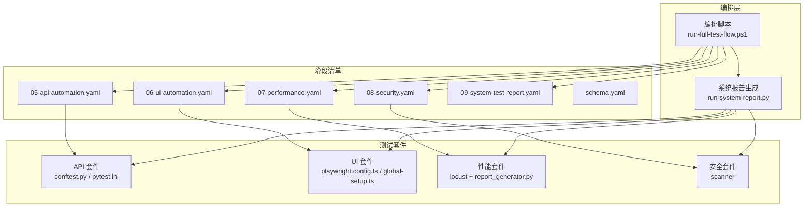

图表来源
- [scripts/run-full-test-flow.ps1](file://scripts/run-full-test-flow.ps1)
- [scripts/run-system-report.py](file://scripts/run-system-report.py)
- [stage-manifests/05-api-automation.yaml](file://stage-manifests/05-api-automation.yaml)
- [stage-manifests/06-ui-automation.yaml](file://stage-manifests/06-ui-automation.yaml)
- [stage-manifests/07-performance.yaml](file://stage-manifests/07-performance.yaml)
- [stage-manifests/08-security.yaml](file://stage-manifests/08-security.yaml)
- [stage-manifests/09-system-test-report.yaml](file://stage-manifests/09-system-test-report.yaml)
- [stage-manifests/schema.yaml](file://stage-manifests/schema.yaml)
- [tests/api/conftest.py](file://tests/api/conftest.py)
- [tests/api/pytest.ini](file://tests/api/pytest.ini)
- [tests/ui/playwright.config.ts](file://tests/ui/playwright.config.ts)
- [tests/ui/global-setup.ts](file://tests/ui/global-setup.ts)
- [tests/performance/locust/utils/report_generator.py](file://tests/performance/locust/utils/report_generator.py)

章节来源
- [stage-manifests/schema.yaml](file://stage-manifests/schema.yaml)
- [stage-manifests/05-api-automation.yaml](file://stage-manifests/05-api-automation.yaml)
- [stage-manifests/06-ui-automation.yaml](file://stage-manifests/06-ui-automation.yaml)
- [stage-manifests/07-performance.yaml](file://stage-manifests/07-performance.yaml)
- [stage-manifests/08-security.yaml](file://stage-manifests/08-security.yaml)
- [stage-manifests/09-system-test-report.yaml](file://stage-manifests/09-system-test-report.yaml)
- [scripts/run-full-test-flow.ps1](file://scripts/run-full-test-flow.ps1)
- [scripts/run-system-report.py](file://scripts/run-system-report.py)
- [tests/api/conftest.py](file://tests/api/conftest.py)
- [tests/api/pytest.ini](file://tests/api/pytest.ini)
- [tests/ui/playwright.config.ts](file://tests/ui/playwright.config.ts)
- [tests/ui/global-setup.ts](file://tests/ui/global-setup.ts)
- [tests/performance/locust/utils/report_generator.py](file://tests/performance/locust/utils/report_generator.py)

## 核心组件
- 编排器（Orchestrator）
  - 职责：读取阶段清单，按顺序或并行调度各类型测试；收集产物；触发报告生成。
  - 入口：主编排脚本。
- 阶段清单（Stage Manifests）
  - 职责：以声明式方式描述测试集的参数、过滤条件、并发度、超时、环境变量等。
  - 契约：遵循统一Schema校验。
- 测试执行器（Executors）
  - API执行器：基于pytest，通过conftest加载夹具与配置。
  - UI执行器：基于Playwright，通过配置文件与全局初始化完成浏览器会话准备。
  - 性能执行器：基于Locust，产出指标与报告。
  - 安全执行器：调用扫描工具并输出结果。
- 配置系统（Config System）
  - 职责：集中管理运行期配置（如env.yaml），被各套件按需消费。
- 报告生成器（Report Generator）
  - 职责：聚合各套件产物，生成系统级报告。
- 事件总线（Event Bus）
  - 职责：在各阶段间传递关键事件（开始、结束、失败、告警），用于编排与报告联动。

章节来源
- [scripts/run-full-test-flow.ps1](file://scripts/run-full-test-flow.ps1)
- [stage-manifests/schema.yaml](file://stage-manifests/schema.yaml)
- [tests/api/conftest.py](file://tests/api/conftest.py)
- [tests/api/pytest.ini](file://tests/api/pytest.ini)
- [tests/ui/playwright.config.ts](file://tests/ui/playwright.config.ts)
- [tests/ui/global-setup.ts](file://tests/ui/global-setup.ts)
- [tests/performance/locust/utils/report_generator.py](file://tests/performance/locust/utils/report_generator.py)
- [scripts/run-system-report.py](file://scripts/run-system-report.py)

## 架构总览
整体采用“声明式编排 + 事件驱动 + 插件化执行器”的架构：
- 编排器解析阶段清单，将每个阶段视为一个可独立执行的“任务单元”
- 各执行器实现统一的“启动/停止/上报”接口契约
- 事件总线贯穿生命周期，支持异步回调与重试
- 报告生成器订阅事件与产物，进行聚合与渲染

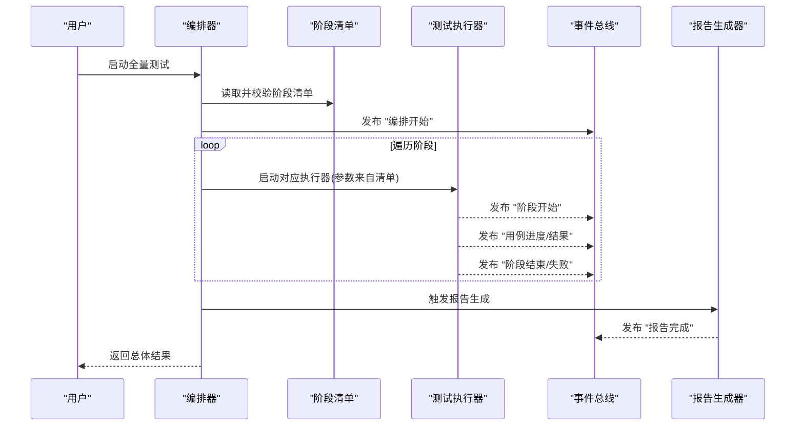

图表来源
- [scripts/run-full-test-flow.ps1](file://scripts/run-full-test-flow.ps1)
- [stage-manifests/schema.yaml](file://stage-manifests/schema.yaml)
- [scripts/run-system-report.py](file://scripts/run-system-report.py)

## 详细组件分析

### 编排器与阶段清单
- 编排器负责：
  - 解析阶段清单，校验字段与约束
  - 根据并发策略调度执行器
  - 捕获异常并转换为标准化事件
  - 协调报告生成
- 阶段清单约定：
  - 统一Schema定义字段、类型、默认值与必填项
  - 包含执行命令、工作目录、环境变量、超时、重试、过滤规则等

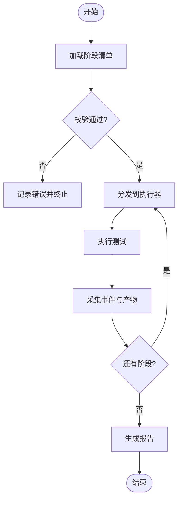

图表来源
- [stage-manifests/schema.yaml](file://stage-manifests/schema.yaml)
- [scripts/run-full-test-flow.ps1](file://scripts/run-full-test-flow.ps1)

章节来源
- [stage-manifests/schema.yaml](file://stage-manifests/schema.yaml)
- [scripts/run-full-test-flow.ps1](file://scripts/run-full-test-flow.ps1)

### API 测试执行器（pytest）
- 配置与夹具
  - conftest.py：集中注册夹具、钩子、日志与断言增强
  - pytest.ini：定义标记、并行选项、缓存与报告插件
- 数据与认证
  - 通过配置系统注入测试账号、基址、超时等
- 事件与产物
  - 通过pytest钩子与插件输出结构化结果，供上层聚合

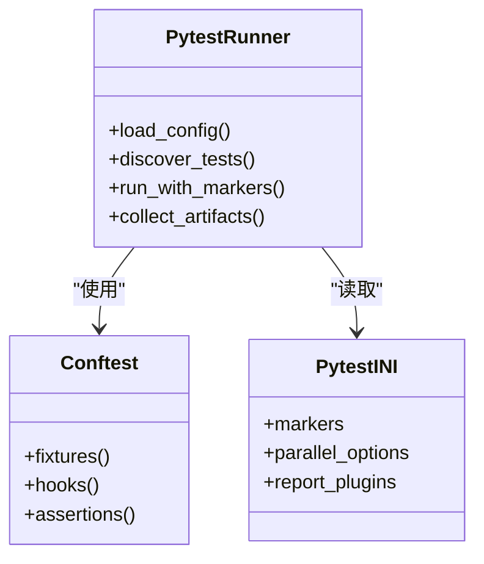

图表来源
- [tests/api/conftest.py](file://tests/api/conftest.py)
- [tests/api/pytest.ini](file://tests/api/pytest.ini)

章节来源
- [tests/api/conftest.py](file://tests/api/conftest.py)
- [tests/api/pytest.ini](file://tests/api/pytest.ini)

### UI 测试执行器（Playwright）
- 配置与初始化
  - playwright.config.ts：浏览器、视口、超时、截图/视频、并行度
  - global-setup.ts：全局登录态、环境准备、清理
- 页面对象与工具
  - pages/：封装页面交互
  - utils/：表单、选择器、加密等通用能力
- 产物
  - 截图、视频、trace、控制台日志

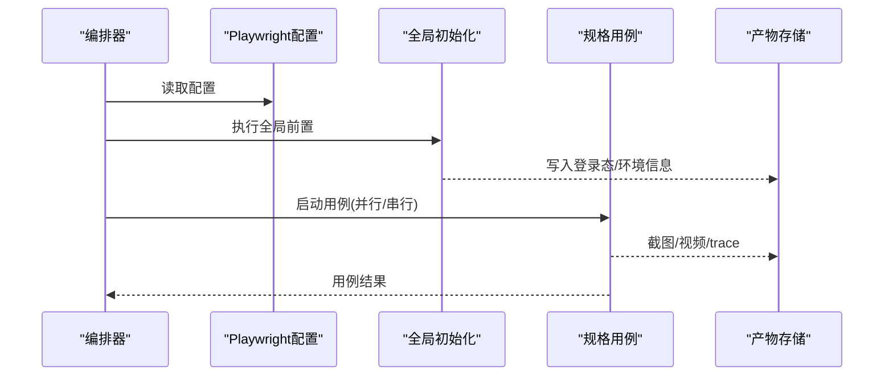

图表来源
- [tests/ui/playwright.config.ts](file://tests/ui/playwright.config.ts)
- [tests/ui/global-setup.ts](file://tests/ui/global-setup.ts)

章节来源
- [tests/ui/playwright.config.ts](file://tests/ui/playwright.config.ts)
- [tests/ui/global-setup.ts](file://tests/ui/global-setup.ts)

### 性能测试执行器（Locust）
- 负载模型与脚本
  - locustfile_*：定义用户行为与并发模型
  - config/load_profiles.yaml：不同负载曲线与参数
- 报告生成
  - report_generator.py：汇总指标、生成可视化报告
- 产物
  - 指标CSV、HTML报告、错误统计

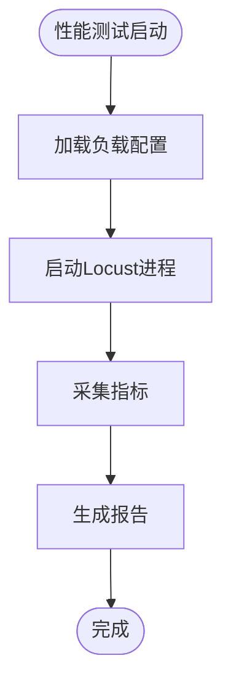

图表来源
- [tests/performance/locust/utils/report_generator.py](file://tests/performance/locust/utils/report_generator.py)

章节来源
- [tests/performance/locust/utils/report_generator.py](file://tests/performance/locust/utils/report_generator.py)

### 安全测试执行器
- 扫描器
  - scanner/security_scanner.py：调用安全扫描工具，解析结果
- 产物
  - 漏洞列表、风险等级、修复建议

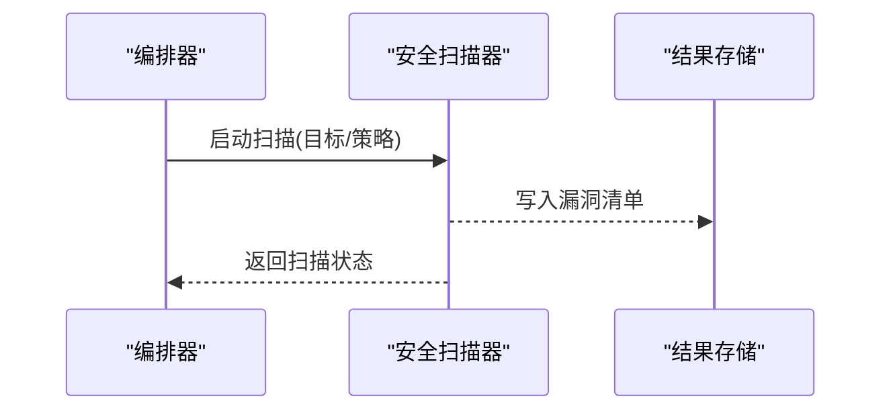

章节来源
- [tests/security/scanner/security_scanner.py](file://tests/security/scanner/security_scanner.py)

### 配置系统与用例集成
- 集中配置
  - tests/config/env.yaml：运行期环境、凭据、开关
- 注入路径
  - API：通过pytest fixtures读取并注入
  - UI：通过Playwright配置与全局初始化注入
  - 性能/安全：通过各自脚本或配置加载
- 版本与覆盖
  - 多环境切换、敏感信息隔离、灰度开关

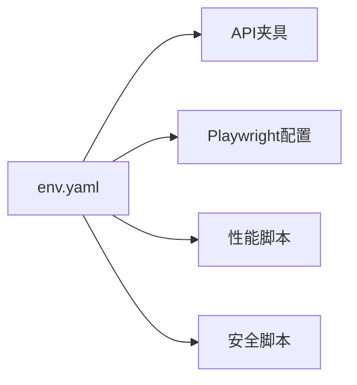

图表来源
- [tests/config/env.yaml](file://tests/config/env.yaml)
- [tests/api/conftest.py](file://tests/api/conftest.py)
- [tests/ui/playwright.config.ts](file://tests/ui/playwright.config.ts)

章节来源
- [tests/config/env.yaml](file://tests/config/env.yaml)
- [tests/api/conftest.py](file://tests/api/conftest.py)
- [tests/ui/playwright.config.ts](file://tests/ui/playwright.config.ts)

### 报告生成器与测试结果对接
- 输入
  - API：pytest产物（XML/JSON/HTML）
  - UI：Playwright产物（截图/视频/trace）
  - 性能：Locust指标与报告
  - 安全：扫描结果
- 处理
  - 归一化数据结构、去重、关联用例ID
  - 计算通过率、回归趋势、风险分布
- 输出
  - 系统级报告（HTML/PDF/Markdown）

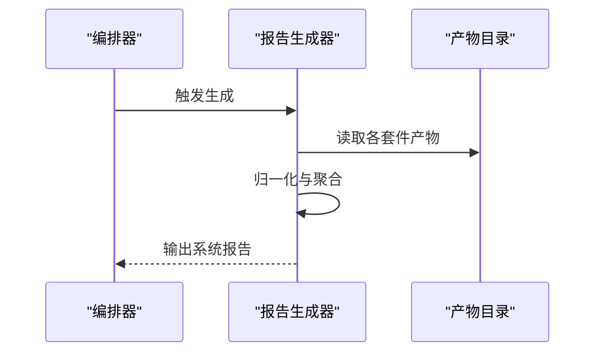

图表来源
- [scripts/run-system-report.py](file://scripts/run-system-report.py)

章节来源
- [scripts/run-system-report.py](file://scripts/run-system-report.py)

### 事件驱动与异步编排
- 事件模型
  - 阶段级：开始/结束/失败
  - 用例级：开始/跳过/失败/成功
  - 产物级：可用/损坏/缺失
- 异步与并发
  - 编排器按阶段并发调度执行器
  - 执行器内部可按框架能力并发（pytest-xdist、Playwright workers、Locust vusers）
- 可靠性
  - 幂等事件、重试与退避、死信队列（可选）

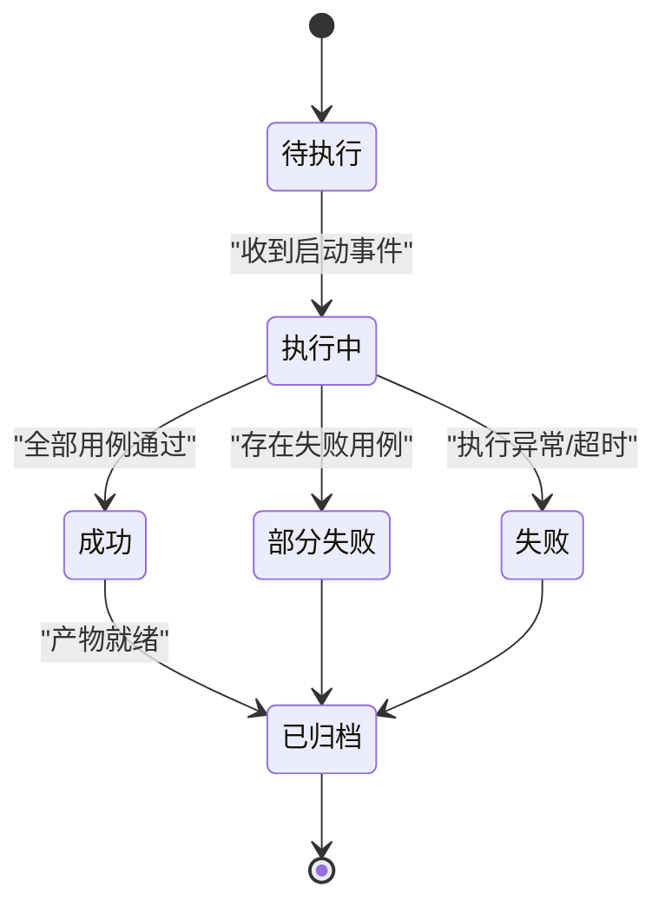

图表来源
- [scripts/run-full-test-flow.ps1](file://scripts/run-full-test-flow.ps1)
- [scripts/run-system-report.py](file://scripts/run-system-report.py)

章节来源
- [scripts/run-full-test-flow.ps1](file://scripts/run-full-test-flow.ps1)
- [scripts/run-system-report.py](file://scripts/run-system-report.py)

### 依赖注入模式与接口契约
- 依赖注入模式
  - 配置注入：通过夹具/配置文件/环境变量注入
  - 服务注入：执行器之间通过事件总线或共享产物目录解耦
  - 扩展点：新增执行器只需实现“启动/停止/上报”契约
- 接口契约（抽象）
  - 启动：接收阶段清单参数，返回执行上下文
  - 停止：优雅关闭，释放资源
  - 上报：周期性推送事件与中间结果
  - 健康检查：存活探针与资源占用

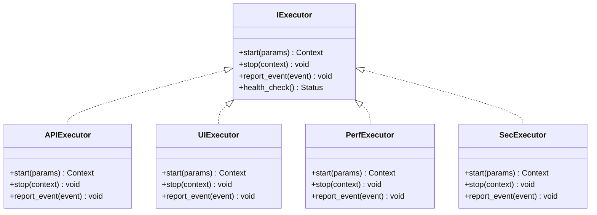

[此图为概念性契约示意，不直接映射具体源码文件]

## 依赖关系分析
- 外部依赖
  - pytest、pytest-xdist（API）
  - Playwright（UI）
  - Locust（性能）
  - 安全扫描工具（安全）
- 内部耦合
  - 编排器对阶段清单强依赖
  - 报告生成器对各套件产物弱依赖（通过约定路径与格式）
  - 配置系统为横向依赖，所有执行器均可能读取

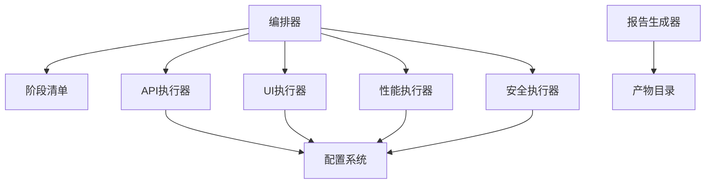

图表来源
- [scripts/run-full-test-flow.ps1](file://scripts/run-full-test-flow.ps1)
- [stage-manifests/schema.yaml](file://stage-manifests/schema.yaml)
- [tests/config/env.yaml](file://tests/config/env.yaml)

章节来源
- [scripts/run-full-test-flow.ps1](file://scripts/run-full-test-flow.ps1)
- [stage-manifests/schema.yaml](file://stage-manifests/schema.yaml)
- [tests/config/env.yaml](file://tests/config/env.yaml)

## 性能与并发
- 并发策略
  - 阶段级：并行执行不同类型测试（需评估资源竞争）
  - 用例级：pytest-xdist、Playwright workers、Locust vusers
- 资源隔离
  - 端口/临时目录/浏览器实例隔离
  - 数据库/消息队列等共享资源的读写锁
- 吞吐与稳定性
  - 合理设置超时与重试
  - 监控CPU/内存/IO，避免抖动
  - 产物压缩与增量上传

[本节为通用指导，不直接分析具体文件]

## 故障排查指南
- 常见问题
  - 阶段清单校验失败：检查字段类型、必填项与枚举值
  - 执行器启动失败：确认依赖安装、环境变量与权限
  - 产物缺失：核对输出路径与命名约定
  - 报告生成失败：检查输入产物完整性与格式
- 定位手段
  - 启用详细日志与调试模式
  - 查看各执行器日志与中间产物
  - 使用健康检查接口判断执行器状态
- 恢复策略
  - 幂等重试与断点续跑
  - 回滚至上一稳定阶段
  - 降级执行（仅关键路径）

章节来源
- [stage-manifests/schema.yaml](file://stage-manifests/schema.yaml)
- [scripts/run-full-test-flow.ps1](file://scripts/run-full-test-flow.ps1)
- [scripts/run-system-report.py](file://scripts/run-system-report.py)

## 结论
AutoTest Hub通过“声明式阶段清单 + 事件驱动编排 + 插件化执行器”的架构，实现了跨语言、跨工具的测试协同。该设计具备良好的可扩展性与可观测性，便于在复杂场景下稳定运行并快速定位问题。后续可在事件总线引入持久化与回放能力，进一步提升编排的可追溯性与容错性。

## 附录
- 术语
  - 阶段清单：描述单次测试任务的声明式配置
  - 事件总线：组件间异步通信的媒介
  - 产物：测试过程中产生的中间与最终结果
- 参考脚本与清单
  - 全量编排：run-full-test-flow.ps1
  - 简化编排：run-full-test-flow-simple.ps1
  - 子系统脚本：run-api-tests.ps1、run-ui-tests.ps1、run-perf-tests.ps1、run-security-tests.ps1
  - 报告生成：run-system-report.py
  - 阶段清单：05~09系列与schema.yaml

章节来源
- [scripts/run-full-test-flow.ps1](file://scripts/run-full-test-flow.ps1)
- [scripts/run-full-test-flow-simple.ps1](file://scripts/run-full-test-flow-simple.ps1)
- [scripts/run-api-tests.ps1](file://scripts/run-api-tests.ps1)
- [scripts/run-ui-tests.ps1](file://scripts/run-ui-tests.ps1)
- [scripts/run-perf-tests.ps1](file://scripts/run-perf-tests.ps1)
- [scripts/run-security-tests.ps1](file://scripts/run-security-tests.ps1)
- [scripts/run-system-report.py](file://scripts/run-system-report.py)
- [stage-manifests/05-api-automation.yaml](file://stage-manifests/05-api-automation.yaml)
- [stage-manifests/06-ui-automation.yaml](file://stage-manifests/06-ui-automation.yaml)
- [stage-manifests/07-performance.yaml](file://stage-manifests/07-performance.yaml)
- [stage-manifests/08-security.yaml](file://stage-manifests/08-security.yaml)
- [stage-manifests/09-system-test-report.yaml](file://stage-manifests/09-system-test-report.yaml)
- [stage-manifests/schema.yaml](file://stage-manifests/schema.yaml)