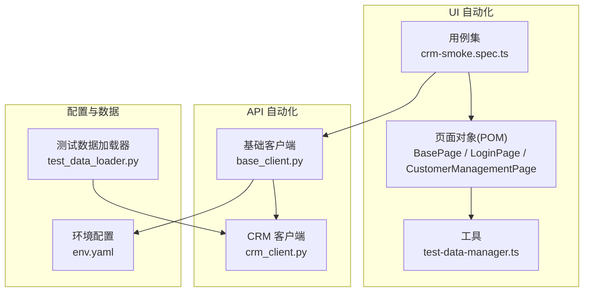
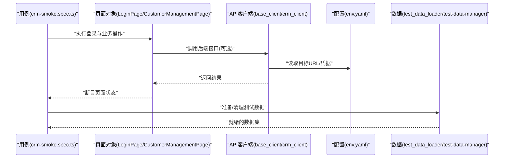
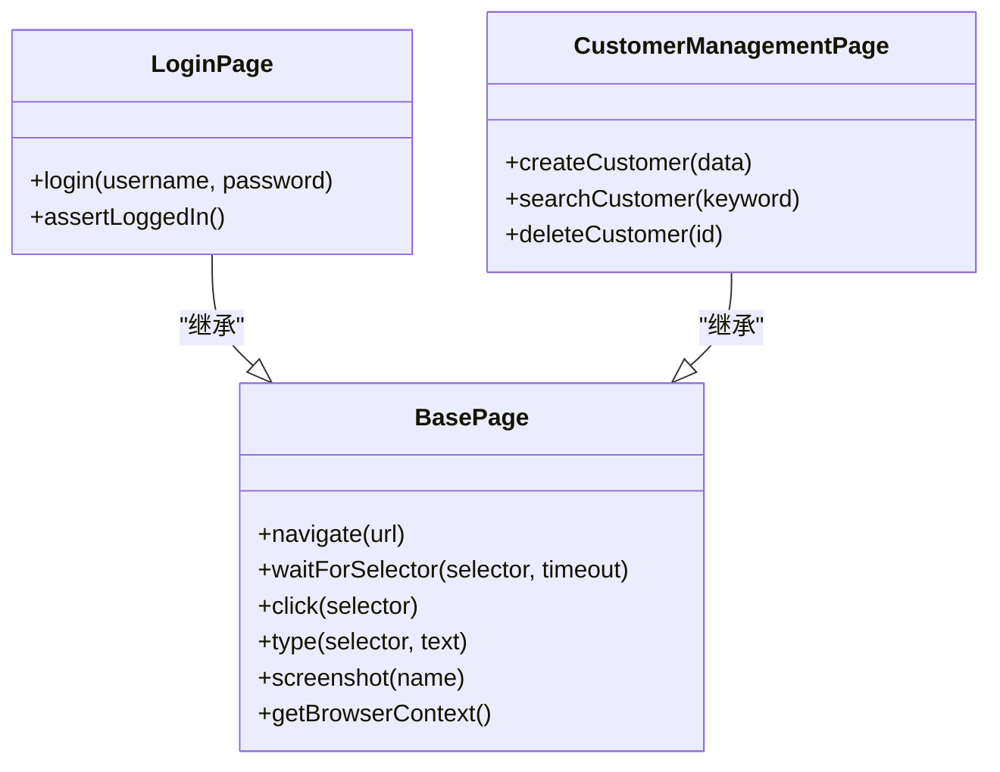
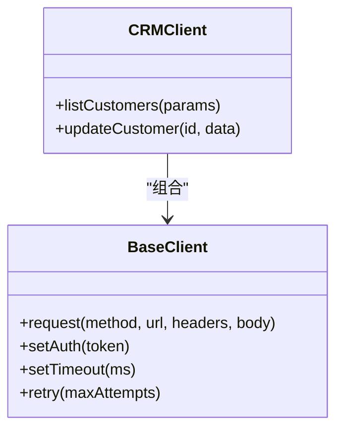
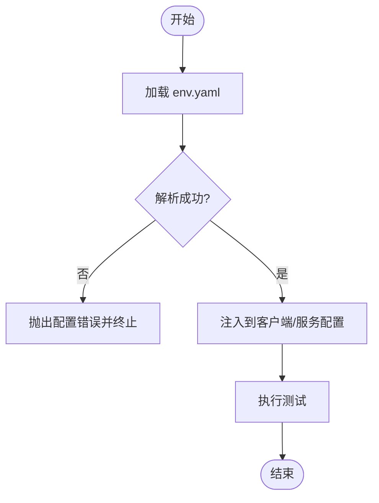
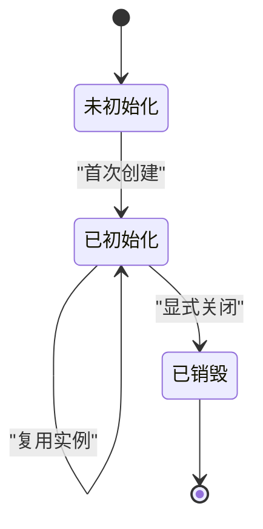
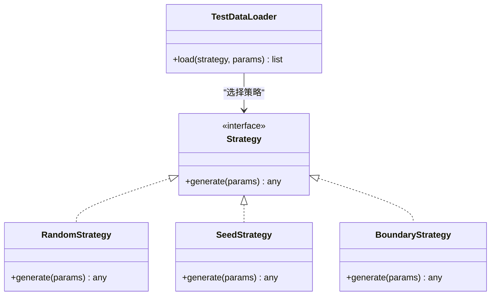
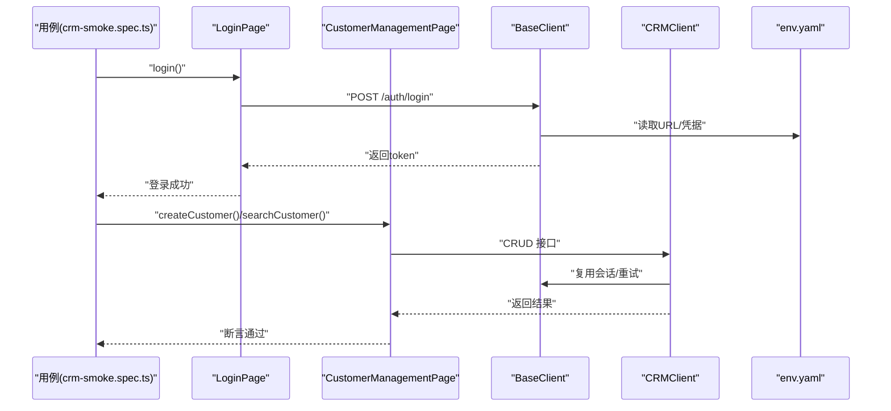
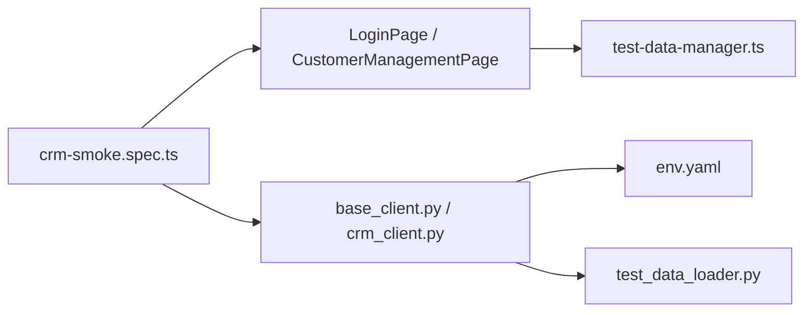

# 设计模式应用

<cite>
**本文引用的文件**   
- [tests/ui/pages/BasePage.ts](file://tests/ui/pages/BasePage.ts)
- [tests/ui/pages/LoginPage.ts](file://tests/ui/pages/LoginPage.ts)
- [tests/ui/pages/CustomerManagementPage.ts](file://tests/ui/pages/CustomerManagementPage.ts)
- [tests/ui/specs/crm/crm-smoke.spec.ts](file://tests/ui/specs/crm/crm-smoke.spec.ts)
- [tests/api/clients/base_client.py](file://tests/api/clients/base_client.py)
- [tests/api/clients/crm_client.py](file://tests/api/clients/crm_client.py)
- [tests/config/env.yaml](file://tests/config/env.yaml)
- [tests/performance/utils/test_data_loader.py](file://tests/performance/utils/test_data_loader.py)
- [tests/ui/utils/test-data-manager.ts](file://tests/ui/utils/test-data-manager.ts)
</cite>

## 目录
1. [简介](#简介)
2. [项目结构](#项目结构)
3. [核心组件](#核心组件)
4. [架构总览](#架构总览)
5. [详细组件分析](#详细组件分析)
6. [依赖关系分析](#依赖关系分析)
7. [性能考量](#性能考量)
8. [故障排查指南](#故障排查指南)
9. [结论](#结论)
10. [附录](#附录)

## 简介
本文件聚焦于 AutoTest Hub 框架中关键设计模式的工程化落地，围绕以下模式展开：
- 页面对象模式（POM）在 UI 测试中的实现与复用
- 工厂模式在 API 客户端创建中的应用
- 配置驱动模式在多环境管理中的使用
- 单例模式在连接池/共享资源管理中的作用
- 策略模式在测试数据生成中的应用

通过上述模式，本项目有效解决了 UI 元素变更导致的用例脆弱、多环境切换复杂、重复初始化开销大、测试数据构造繁琐等常见问题，显著提升了代码复用性与可维护性。

## 项目结构
UI 层采用 TypeScript + Playwright，API 层采用 Python + pytest，性能与工具脚本位于 tests/performance 与 scripts 目录。关键目录与职责如下：
- tests/ui/pages：页面对象封装，统一页面交互能力
- tests/ui/specs：按业务域组织的端到端用例
- tests/api/clients：API 客户端抽象与具体实现
- tests/config：环境配置（YAML），支撑配置驱动
- tests/performance/utils：性能测试辅助工具（含数据加载）
- tests/ui/utils：UI 侧通用工具（含测试数据管理）

图表来源
- [tests/ui/pages/BasePage.ts](file://tests/ui/pages/BasePage.ts)
- [tests/ui/pages/LoginPage.ts](file://tests/ui/pages/LoginPage.ts)
- [tests/ui/pages/CustomerManagementPage.ts](file://tests/ui/pages/CustomerManagementPage.ts)
- [tests/ui/specs/crm/crm-smoke.spec.ts](file://tests/ui/specs/crm/crm-smoke.spec.ts)
- [tests/api/clients/base_client.py](file://tests/api/clients/base_client.py)
- [tests/api/clients/crm_client.py](file://tests/api/clients/crm_client.py)
- [tests/config/env.yaml](file://tests/config/env.yaml)
- [tests/performance/utils/test_data_loader.py](file://tests/performance/utils/test_data_loader.py)

章节来源
- [tests/ui/pages/BasePage.ts](file://tests/ui/pages/BasePage.ts)
- [tests/ui/pages/LoginPage.ts](file://tests/ui/pages/LoginPage.ts)
- [tests/ui/pages/CustomerManagementPage.ts](file://tests/ui/pages/CustomerManagementPage.ts)
- [tests/ui/specs/crm/crm-smoke.spec.ts](file://tests/ui/specs/crm/crm-smoke.spec.ts)
- [tests/api/clients/base_client.py](file://tests/api/clients/base_client.py)
- [tests/api/clients/crm_client.py](file://tests/api/clients/crm_client.py)
- [tests/config/env.yaml](file://tests/config/env.yaml)
- [tests/performance/utils/test_data_loader.py](file://tests/performance/utils/test_data_loader.py)

## 核心组件
- 页面对象（POM）
  - BasePage：提供浏览器实例、等待策略、定位器封装、截图与日志等通用能力
  - LoginPage：登录流程封装，包含输入、点击、断言等原子操作
  - CustomerManagementPage：客户管理页面的增删改查操作封装
- API 客户端
  - base_client.py：HTTP 请求封装、重试、超时、鉴权头注入、响应校验等
  - crm_client.py：面向 CRM 业务的接口聚合，基于 base_client 构建
- 配置与环境
  - env.yaml：不同环境（dev/staging/prod）的 URL、凭据、开关等
- 测试数据
  - test_data_loader.py：从 YAML/CSV/JSON 或随机策略加载测试数据
  - test-data-manager.ts：UI 侧数据准备与清理的统一入口

章节来源
- [tests/ui/pages/BasePage.ts](file://tests/ui/pages/BasePage.ts)
- [tests/ui/pages/LoginPage.ts](file://tests/ui/pages/LoginPage.ts)
- [tests/ui/pages/CustomerManagementPage.ts](file://tests/ui/pages/CustomerManagementPage.ts)
- [tests/api/clients/base_client.py](file://tests/api/clients/base_client.py)
- [tests/api/clients/crm_client.py](file://tests/api/clients/crm_client.py)
- [tests/config/env.yaml](file://tests/config/env.yaml)
- [tests/performance/utils/test_data_loader.py](file://tests/performance/utils/test_data_loader.py)
- [tests/ui/utils/test-data-manager.ts](file://tests/ui/utils/test-data-manager.ts)

## 架构总览
下图展示了 UI 与 API 两条自动化流水线如何协同工作，并通过配置与数据层解耦环境与数据源。

图表来源
- [tests/ui/specs/crm/crm-smoke.spec.ts](file://tests/ui/specs/crm/crm-smoke.spec.ts)
- [tests/ui/pages/LoginPage.ts](file://tests/ui/pages/LoginPage.ts)
- [tests/ui/pages/CustomerManagementPage.ts](file://tests/ui/pages/CustomerManagementPage.ts)
- [tests/api/clients/base_client.py](file://tests/api/clients/base_client.py)
- [tests/api/clients/crm_client.py](file://tests/api/clients/crm_client.py)
- [tests/config/env.yaml](file://tests/config/env.yaml)
- [tests/performance/utils/test_data_loader.py](file://tests/performance/utils/test_data_loader.py)
- [tests/ui/utils/test-data-manager.ts](file://tests/ui/utils/test-data-manager.ts)

## 详细组件分析

### 页面对象模式（POM）
- 角色与职责
  - BasePage：封装浏览器上下文、等待策略、选择器、截图、日志等公共能力
  - LoginPage：将“输入用户名/密码”“点击登录”“断言跳转”等操作封装为方法
  - CustomerManagementPage：封装“新增/编辑/删除/查询”等业务操作
- 典型调用链
  - 用例仅关心业务流程，不关心 DOM 细节；当 UI 变化时，仅需修改对应 Page 类
- 最佳实践
  - 原子化操作：每个方法只做一件事，组合出高层业务方法
  - 显式等待：避免硬编码 sleep，提升稳定性
  - 失败快照：异常路径自动截图，便于定位

图表来源
- [tests/ui/pages/BasePage.ts](file://tests/ui/pages/BasePage.ts)
- [tests/ui/pages/LoginPage.ts](file://tests/ui/pages/LoginPage.ts)
- [tests/ui/pages/CustomerManagementPage.ts](file://tests/ui/pages/CustomerManagementPage.ts)

章节来源
- [tests/ui/pages/BasePage.ts](file://tests/ui/pages/BasePage.ts)
- [tests/ui/pages/LoginPage.ts](file://tests/ui/pages/LoginPage.ts)
- [tests/ui/pages/CustomerManagementPage.ts](file://tests/ui/pages/CustomerManagementPage.ts)

### 工厂模式（API 客户端创建）
- 动机
  - 不同业务域需要不同的 HTTP 客户端（如 CRM、ERP），但都共享基础能力（鉴权、重试、超时）
- 实现要点
  - base_client.py 提供统一的请求封装与错误处理
  - crm_client.py 基于 base_client 暴露领域方法（如获取客户列表、更新客户信息）
  - 可通过工厂函数/类根据参数动态返回具体客户端实例，避免 if/else 分支膨胀
- 优势
  - 新增业务只需扩展新客户端，不影响已有调用方
  - 统一的生命周期管理与资源释放

图表来源
- [tests/api/clients/base_client.py](file://tests/api/clients/base_client.py)
- [tests/api/clients/crm_client.py](file://tests/api/clients/crm_client.py)

章节来源
- [tests/api/clients/base_client.py](file://tests/api/clients/base_client.py)
- [tests/api/clients/crm_client.py](file://tests/api/clients/crm_client.py)

### 配置驱动模式（环境管理）
- 动机
  - 同一套用例需要在 dev/staging/prod 等多环境运行，URL、凭据、特性开关各不相同
- 实现要点
  - env.yaml 集中管理各环境的键值对
  - 客户端或服务启动前加载配置，注入到请求头、URL、超时等参数中
- 优势
  - 环境切换零代码改动，降低回归风险
  - 配置与逻辑解耦，便于审计与版本控制

图表来源
- [tests/config/env.yaml](file://tests/config/env.yaml)

章节来源
- [tests/config/env.yaml](file://tests/config/env.yaml)

### 单例模式（连接池/共享资源）
- 动机
  - 数据库连接、HTTP 会话、浏览器上下文等资源初始化成本高，需全局唯一实例复用
- 适用点
  - 在 API 层可维护一个全局连接池或会话对象
  - 在 UI 层可复用 BrowserContext 或认证态
- 注意事项
  - 线程安全：并发场景需加锁或使用线程局部存储
  - 生命周期：明确初始化与销毁时机，避免资源泄露

[本节为概念说明，无直接源码引用]

### 策略模式（测试数据生成）
- 动机
  - 不同场景需要不同数据构造策略（随机、种子固定、边界值、合规脱敏）
- 实现要点
  - 定义统一的数据生成接口
  - 针对每种策略实现具体类（如 RandomStrategy、SeedStrategy、BoundaryStrategy）
  - 由数据管理器根据配置或参数选择策略
- 优势
  - 新增策略无需改动现有用例
  - 数据生成逻辑集中管理，易于测试与替换

图表来源
- [tests/performance/utils/test_data_loader.py](file://tests/performance/utils/test_data_loader.py)

章节来源
- [tests/performance/utils/test_data_loader.py](file://tests/performance/utils/test_data_loader.py)

### 端到端示例：登录与 CRM 冒烟流程
- 用例通过 LoginPage 完成登录，再进入 CustomerManagementPage 执行简单 CRUD
- 若涉及数据准备，调用 test-data-manager.ts 或 test_data_loader.py 生成数据
- 所有网络请求由 API 客户端发起，URL/凭据来自 env.yaml

图表来源
- [tests/ui/specs/crm/crm-smoke.spec.ts](file://tests/ui/specs/crm/crm-smoke.spec.ts)
- [tests/ui/pages/LoginPage.ts](file://tests/ui/pages/LoginPage.ts)
- [tests/ui/pages/CustomerManagementPage.ts](file://tests/ui/pages/CustomerManagementPage.ts)
- [tests/api/clients/base_client.py](file://tests/api/clients/base_client.py)
- [tests/api/clients/crm_client.py](file://tests/api/clients/crm_client.py)
- [tests/config/env.yaml](file://tests/config/env.yaml)

章节来源
- [tests/ui/specs/crm/crm-smoke.spec.ts](file://tests/ui/specs/crm/crm-smoke.spec.ts)
- [tests/ui/pages/LoginPage.ts](file://tests/ui/pages/LoginPage.ts)
- [tests/ui/pages/CustomerManagementPage.ts](file://tests/ui/pages/CustomerManagementPage.ts)
- [tests/api/clients/base_client.py](file://tests/api/clients/base_client.py)
- [tests/api/clients/crm_client.py](file://tests/api/clients/crm_client.py)
- [tests/config/env.yaml](file://tests/config/env.yaml)

## 依赖关系分析
- 低耦合高内聚
  - UI 用例只依赖 Page 对象，不直接操作 DOM
  - API 客户端分层清晰：基础能力与业务接口分离
- 外部依赖
  - env.yaml 作为单一事实源，被多处消费
  - 数据加载器独立于用例，支持多种策略

图表来源
- [tests/ui/specs/crm/crm-smoke.spec.ts](file://tests/ui/specs/crm/crm-smoke.spec.ts)
- [tests/ui/pages/LoginPage.ts](file://tests/ui/pages/LoginPage.ts)
- [tests/ui/pages/CustomerManagementPage.ts](file://tests/ui/pages/CustomerManagementPage.ts)
- [tests/ui/utils/test-data-manager.ts](file://tests/ui/utils/test-data-manager.ts)
- [tests/api/clients/base_client.py](file://tests/api/clients/base_client.py)
- [tests/api/clients/crm_client.py](file://tests/api/clients/crm_client.py)
- [tests/config/env.yaml](file://tests/config/env.yaml)
- [tests/performance/utils/test_data_loader.py](file://tests/performance/utils/test_data_loader.py)

章节来源
- [tests/ui/specs/crm/crm-smoke.spec.ts](file://tests/ui/specs/crm/crm-smoke.spec.ts)
- [tests/ui/pages/LoginPage.ts](file://tests/ui/pages/LoginPage.ts)
- [tests/ui/pages/CustomerManagementPage.ts](file://tests/ui/pages/CustomerManagementPage.ts)
- [tests/ui/utils/test-data-manager.ts](file://tests/ui/utils/test-data-manager.ts)
- [tests/api/clients/base_client.py](file://tests/api/clients/base_client.py)
- [tests/api/clients/crm_client.py](file://tests/api/clients/crm_client.py)
- [tests/config/env.yaml](file://tests/config/env.yaml)
- [tests/performance/utils/test_data_loader.py](file://tests/performance/utils/test_data_loader.py)

## 性能考量
- 减少不必要的重连与会话重建：通过单例/连接池复用资源
- 合理设置超时与重试：避免慢网络导致的不稳定与长耗时
- 数据生成策略按需选择：大数据量场景优先使用种子或批量导入
- UI 等待策略优化：使用显式等待与最小化渲染时间

[本节为通用建议，无直接源码引用]

## 故障排查指南
- 环境配置问题
  - 现象：URL/凭据不正确导致鉴权失败或 404
  - 排查：检查 env.yaml 当前环境段是否正确加载
- 页面元素变更
  - 现象：UI 用例频繁失败
  - 排查：确认 Page 对象中的选择器是否最新，必要时增加显式等待
- 数据不一致
  - 现象：用例偶发失败或脏数据残留
  - 排查：确认数据加载策略与清理逻辑是否生效
- 并发与资源泄漏
  - 现象：连接池耗尽或内存增长
  - 排查：检查单例生命周期与异常路径的资源释放

章节来源
- [tests/config/env.yaml](file://tests/config/env.yaml)
- [tests/ui/pages/BasePage.ts](file://tests/ui/pages/BasePage.ts)
- [tests/performance/utils/test_data_loader.py](file://tests/performance/utils/test_data_loader.py)

## 结论
通过将页面对象、工厂、配置驱动、单例与策略等模式系统化落地，AutoTest Hub 实现了：
- UI 变更影响面收敛，用例更稳定
- 多环境一键切换，降低运维成本
- 资源复用与可控生命周期，提升吞吐与稳定性
- 数据生成灵活可扩展，覆盖更多边界场景

这些模式共同提升了测试自动化工程的复用性、可维护性与可演进性。

## 附录
- 术语
  - POM：页面对象模式
  - 工厂模式：根据参数动态创建对象
  - 配置驱动：以配置文件为中心驱动行为
  - 单例：全局唯一实例
  - 策略：可插拔算法/规则集合
- 参考路径
  - UI 页面对象：tests/ui/pages/*.ts
  - API 客户端：tests/api/clients/*.py
  - 环境配置：tests/config/env.yaml
  - 数据加载：tests/performance/utils/test_data_loader.py、tests/ui/utils/test-data-manager.ts