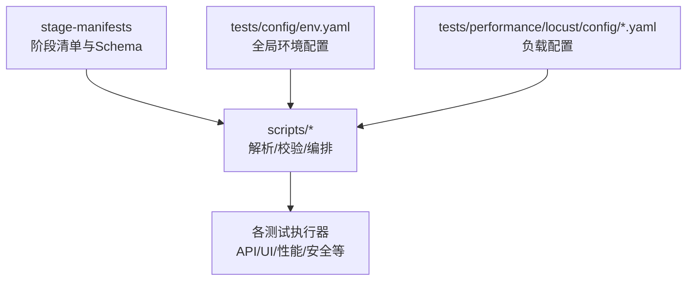
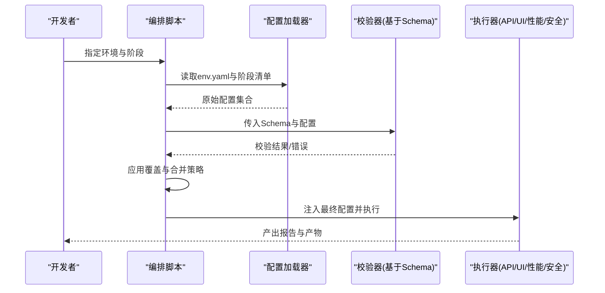
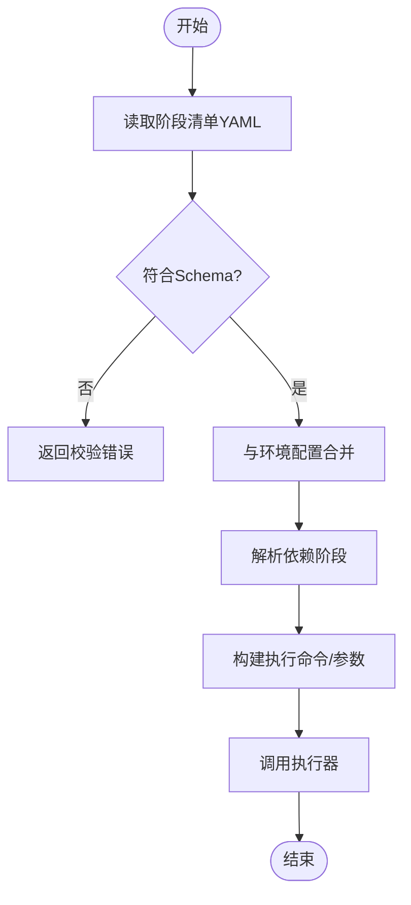
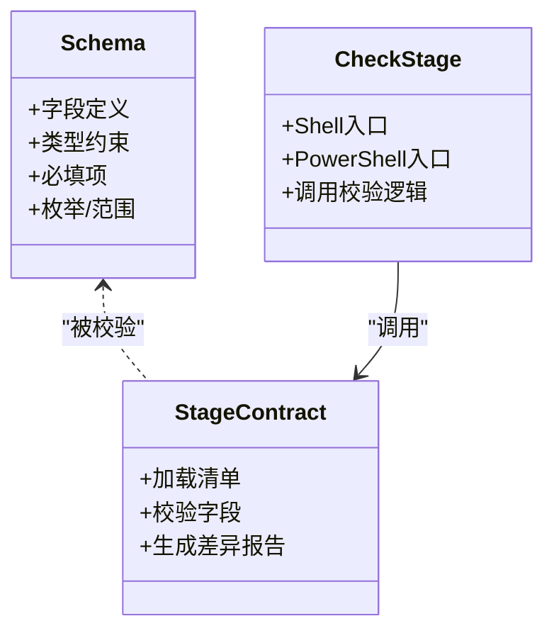
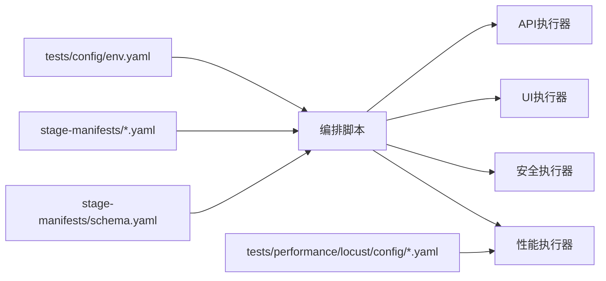

# 配置管理系统

<cite>
**本文引用的文件**   
- [stage-manifests/schema.yaml](file://stage-manifests/schema.yaml)
- [stage-manifests/01-req-analysis.yaml](file://stage-manifests/01-req-analysis.yaml)
- [stage-manifests/02-test-design.yaml](file://stage-manifests/02-test-design.yaml)
- [stage-manifests/03-case-generation.yaml](file://stage-manifests/03-case-generation.yaml)
- [stage-manifests/04-case-review.yaml](file://stage-manifests/04-case-review.yaml)
- [stage-manifests/05-api-automation.yaml](file://stage-manifests/05-api-automation.yaml)
- [stage-manifests/06-ui-automation.yaml](file://stage-manifests/06-ui-automation.yaml)
- [stage-manifests/07-performance.yaml](file://stage-manifests/07-performance.yaml)
- [stage-manifests/08-security.yaml](file://stage-manifests/08-security.yaml)
- [stage-manifests/09-system-test-report.yaml](file://stage-manifests/09-system-test-report.yaml)
- [stage-manifests/10-knowledge-base.yaml](file://stage-manifests/10-knowledge-base.yaml)
- [tests/config/env.yaml](file://tests/config/env.yaml)
- [scripts/check-stage.sh](file://scripts/check-stage.sh)
- [scripts/check-stage.ps1](file://scripts/check-stage.ps1)
- [scripts/lib/stage-common.ps1](file://scripts/lib/stage-common.ps1)
- [scripts/run-full-test-flow.ps1](file://scripts/run-full-test-flow.ps1)
- [scripts/run-full-test-flow-simple.ps1](file://scripts/run-full-test-flow-simple.ps1)
- [scripts/run-system-report.py](file://scripts/run-system-report.py)
- [scripts/integrate-all.py](file://scripts/integrate-all.py)
- [scripts/integrate-test-cases.py](file://scripts/integrate-test-cases.py)
- [scripts/integrate-exploration.py](file://scripts/integrate-exploration.py)
- [scripts/integrate-test-plan.py](file://scripts/integrate-test-plan.py)
- [scripts/set-test-env.ps1](file://scripts/set-test-env.ps1)
- [scripts/run-perf-tests.ps1](file://scripts/run-perf-tests.ps1)
- [scripts/run-perf-tests.sh](file://scripts/run-perf-tests.sh)
- [scripts/run-security-tests.ps1](file://scripts/run-security-tests.ps1)
- [scripts/run-security-tests.sh](file://scripts/run-security-tests.sh)
- [scripts/run-ui-tests.ps1](file://scripts/run-ui-tests.ps1)
- [scripts/run-ui-tests.sh](file://scripts/run-ui-tests.sh)
- [scripts/run-api-tests.ps1](file://scripts/run-api-tests.ps1)
- [scripts/run-api-tests.sh](file://scripts/run-api-tests.sh)
- [scripts/run-system-report.ps1](file://scripts/run-system-report.ps1)
- [scripts/generate-detailed-cases.py](file://scripts/generate-detailed-cases.py)
- [scripts/generate-coverage-matrix.py](file://scripts/generate-coverage-matrix.py)
- [scripts/scan-test-coverage.py](file://scripts/scan-test-coverage.py)
- [scripts/deep-analysis.py](file://scripts/deep-analysis.py)
- [scripts/stage_contract.py](file://scripts/stage_contract.py)
- [scripts/test-perf-content.py](file://scripts/test-perf-content.py)
- [scripts/test-perf-extract.py](file://scripts/test-perf-extract.py)
- [scripts/clean-test-data.ps1](file://scripts/clean-test-data.ps1)
- [scripts/check-bom.py](file://scripts/check-bom.py)
- [scripts/check-content.py](file://scripts/check-content.py)
- [scripts/check-encoding.py](file://scripts/check-encoding.py)
- [scripts/fix-bom.py](file://scripts/fix-bom.py)
- [scripts/fix-double-bom.py](file://scripts/fix-double-bom.py)
- [scripts/fix-encoding-final.py](file://scripts/fix-encoding-final.py)
- [scripts/fix-encoding.py](file://scripts/fix-encoding.py)
- [scripts/fix-ps1-encoding.py](file://scripts/fix-ps1-encoding.py)
- [tests/performance/locust/config/load_profiles.yaml](file://tests/performance/locust/config/load_profiles.yaml)
</cite>

## 目录
1. [简介](#简介)
2. [项目结构](#项目结构)
3. [核心组件](#核心组件)
4. [架构总览](#架构总览)
5. [详细组件分析](#详细组件分析)
6. [依赖关系分析](#依赖关系分析)
7. [性能与可扩展性](#性能与可扩展性)
8. [故障排查指南](#故障排查指南)
9. [结论](#结论)
10. [附录：模板与最佳实践](#附录模板与最佳实践)

## 简介
本文件面向AutoTest Hub框架的配置管理系统，聚焦于基于YAML的配置驱动架构。文档覆盖以下主题：
- 环境配置、阶段清单配置与负载配置文件的结构设计
- 配置文件的层次关系、继承机制与覆盖规则
- 配置验证机制、默认值处理与动态加载策略
- 多环境管理（开发、测试、生产）的差异化策略
- 配置模板与最佳实践，帮助开发者正确管理与扩展配置系统

## 项目结构
配置相关资产主要分布在如下位置：
- stage-manifests：阶段清单与Schema定义
- tests/config：全局环境配置
- scripts：运行期脚本，负责解析、校验与组装配置
- tests/performance/locust/config：负载测试配置

图表来源
- [stage-manifests/schema.yaml](file://stage-manifests/schema.yaml)
- [tests/config/env.yaml](file://tests/config/env.yaml)
- [scripts/check-stage.sh](file://scripts/check-stage.sh)
- [scripts/check-stage.ps1](file://scripts/check-stage.ps1)
- [scripts/run-full-test-flow.ps1](file://scripts/run-full-test-flow.ps1)
- [tests/performance/locust/config/load_profiles.yaml](file://tests/performance/locust/config/load_profiles.yaml)

章节来源
- [stage-manifests/schema.yaml](file://stage-manifests/schema.yaml)
- [tests/config/env.yaml](file://tests/config/env.yaml)
- [scripts/check-stage.sh](file://scripts/check-stage.sh)
- [scripts/check-stage.ps1](file://scripts/check-stage.ps1)
- [scripts/run-full-test-flow.ps1](file://scripts/run-full-test-flow.ps1)
- [tests/performance/locust/config/load_profiles.yaml](file://tests/performance/locust/config/load_profiles.yaml)

## 核心组件
- 阶段清单（Stage Manifest）：以YAML描述每个阶段的元数据、输入输出、依赖与参数，位于stage-manifests下，按序号组织。
- Schema定义：集中定义阶段清单的字段约束与类型，用于静态校验。
- 环境配置：tests/config/env.yaml提供全局运行时环境变量与路径映射。
- 负载配置：tests/performance/locust/config下的YAML文件描述并发、速率、持续时间等负载参数。
- 编排与校验脚本：scripts下提供跨平台脚本，负责读取、合并、校验与注入配置到具体执行器。

章节来源
- [stage-manifests/01-req-analysis.yaml](file://stage-manifests/01-req-analysis.yaml)
- [stage-manifests/02-test-design.yaml](file://stage-manifests/02-test-design.yaml)
- [stage-manifests/03-case-generation.yaml](file://stage-manifests/03-case-generation.yaml)
- [stage-manifests/04-case-review.yaml](file://stage-manifests/04-case-review.yaml)
- [stage-manifests/05-api-automation.yaml](file://stage-manifests/05-api-automation.yaml)
- [stage-manifests/06-ui-automation.yaml](file://stage-manifests/06-ui-automation.yaml)
- [stage-manifests/07-performance.yaml](file://stage-manifests/07-performance.yaml)
- [stage-manifests/08-security.yaml](file://stage-manifests/08-security.yaml)
- [stage-manifests/09-system-test-report.yaml](file://stage-manifests/09-system-test-report.yaml)
- [stage-manifests/10-knowledge-base.yaml](file://stage-manifests/10-knowledge-base.yaml)
- [tests/config/env.yaml](file://tests/config/env.yaml)
- [tests/performance/locust/config/load_profiles.yaml](file://tests/performance/locust/config/load_profiles.yaml)

## 架构总览
配置驱动的端到端流程：
- 启动时加载全局环境配置与阶段清单
- 依据Schema进行静态校验
- 根据当前环境与命令行参数进行覆盖与合并
- 将最终配置注入到对应执行器（API/UI/性能/安全等）

图表来源
- [scripts/check-stage.sh](file://scripts/check-stage.sh)
- [scripts/check-stage.ps1](file://scripts/check-stage.ps1)
- [scripts/run-full-test-flow.ps1](file://scripts/run-full-test-flow.ps1)
- [scripts/run-full-test-flow-simple.ps1](file://scripts/run-full-test-flow-simple.ps1)
- [scripts/run-system-report.py](file://scripts/run-system-report.py)
- [stage-manifests/schema.yaml](file://stage-manifests/schema.yaml)

## 详细组件分析

### 阶段清单配置（Stage Manifest）
- 文件组织：按序号命名，便于顺序执行与依赖管理。
- 典型字段（概念说明）：名称、版本、描述、输入/输出路径、依赖的阶段列表、可覆盖的参数键值对、执行命令或工具链引用等。
- 用途：作为“最小可执行单元”的描述，供编排脚本解析后驱动具体执行器。

图表来源
- [stage-manifests/01-req-analysis.yaml](file://stage-manifests/01-req-analysis.yaml)
- [stage-manifests/02-test-design.yaml](file://stage-manifests/02-test-design.yaml)
- [stage-manifests/03-case-generation.yaml](file://stage-manifests/03-case-generation.yaml)
- [stage-manifests/04-case-review.yaml](file://stage-manifests/04-case-review.yaml)
- [stage-manifests/05-api-automation.yaml](file://stage-manifests/05-api-automation.yaml)
- [stage-manifests/06-ui-automation.yaml](file://stage-manifests/06-ui-automation.yaml)
- [stage-manifests/07-performance.yaml](file://stage-manifests/07-performance.yaml)
- [stage-manifests/08-security.yaml](file://stage-manifests/08-security.yaml)
- [stage-manifests/09-system-test-report.yaml](file://stage-manifests/09-system-test-report.yaml)
- [stage-manifests/10-knowledge-base.yaml](file://stage-manifests/10-knowledge-base.yaml)
- [stage-manifests/schema.yaml](file://stage-manifests/schema.yaml)

章节来源
- [stage-manifests/schema.yaml](file://stage-manifests/schema.yaml)
- [stage-manifests/01-req-analysis.yaml](file://stage-manifests/01-req-analysis.yaml)
- [stage-manifests/02-test-design.yaml](file://stage-manifests/02-test-design.yaml)
- [stage-manifests/03-case-generation.yaml](file://stage-manifests/03-case-generation.yaml)
- [stage-manifests/04-case-review.yaml](file://stage-manifests/04-case-review.yaml)
- [stage-manifests/05-api-automation.yaml](file://stage-manifests/05-api-automation.yaml)
- [stage-manifests/06-ui-automation.yaml](file://stage-manifests/06-ui-automation.yaml)
- [stage-manifests/07-performance.yaml](file://stage-manifests/07-performance.yaml)
- [stage-manifests/08-security.yaml](file://stage-manifests/08-security.yaml)
- [stage-manifests/09-system-test-report.yaml](file://stage-manifests/09-system-test-report.yaml)
- [stage-manifests/10-knowledge-base.yaml](file://stage-manifests/10-knowledge-base.yaml)

### 环境配置（Global Environment）
- 位置：tests/config/env.yaml
- 作用：集中管理全局变量（如目标地址、凭据占位符、路径映射、开关标志等），供所有阶段与执行器共享。
- 使用方式：由编排脚本在启动时加载，并按当前环境选择不同分支或覆盖项。

章节来源
- [tests/config/env.yaml](file://tests/config/env.yaml)

### 负载配置（Performance Profiles）
- 位置：tests/performance/locust/config/load_profiles.yaml
- 作用：定义并发用户数、RPS、持续时间、预热时长等负载参数，供性能执行器读取。
- 扩展建议：可按场景拆分多个profile，通过命令行参数切换。

章节来源
- [tests/performance/locust/config/load_profiles.yaml](file://tests/performance/locust/config/load_profiles.yaml)

### 配置校验与契约（Schema & Contract）
- Schema定义：stage-manifests/schema.yaml集中声明阶段清单的字段类型、必填项与取值范围。
- 契约脚本：scripts/stage_contract.py用于在CI或本地预检中强化契约一致性。
- 校验入口：scripts/check-stage.{sh,ps1}提供跨平台校验能力。

图表来源
- [stage-manifests/schema.yaml](file://stage-manifests/schema.yaml)
- [scripts/stage_contract.py](file://scripts/stage_contract.py)
- [scripts/check-stage.sh](file://scripts/check-stage.sh)
- [scripts/check-stage.ps1](file://scripts/check-stage.ps1)

章节来源
- [stage-manifests/schema.yaml](file://stage-manifests/schema.yaml)
- [scripts/stage_contract.py](file://scripts/stage_contract.py)
- [scripts/check-stage.sh](file://scripts/check-stage.sh)
- [scripts/check-stage.ps1](file://scripts/check-stage.ps1)

### 动态加载与覆盖策略
- 加载顺序（概念性）：
  1) 基础环境配置（env.yaml）
  2) 阶段清单（按序号）
  3) 环境覆盖（dev/test/prod）
  4) 命令行参数覆盖（最高优先级）
- 覆盖规则：
  - 同名键高优先级覆盖低优先级
  - 嵌套对象采用深度合并
  - 数组通常采用替换策略（可通过约定改为追加）
- 动态注入：
  - 编排脚本在运行前将最终配置写入临时文件或环境变量，供下游执行器读取

章节来源
- [scripts/run-full-test-flow.ps1](file://scripts/run-full-test-flow.ps1)
- [scripts/run-full-test-flow-simple.ps1](file://scripts/run-full-test-flow-simple.ps1)
- [scripts/run-system-report.py](file://scripts/run-system-report.py)
- [scripts/set-test-env.ps1](file://scripts/set-test-env.ps1)

### 多环境管理策略
- 环境划分：开发（dev）、测试（test）、生产（prod）
- 差异化维度：
  - 目标服务地址、端口、协议
  - 凭据与密钥（建议使用外部密钥管理服务或受控的环境变量）
  - 日志级别、超时、重试次数
  - 功能开关与灰度标记
- 实现建议：
  - 在env.yaml中以环境为键组织配置块
  - 通过命令行参数或环境变量选择环境
  - 关键敏感信息不入库，仅存在于受控环境

章节来源
- [tests/config/env.yaml](file://tests/config/env.yaml)
- [scripts/set-test-env.ps1](file://scripts/set-test-env.ps1)

### 执行器集成点
- API测试：通过run-api-tests.{sh,ps1}读取配置并驱动客户端
- UI测试：通过run-ui-tests.{sh,ps1}读取浏览器与页面基址等配置
- 性能测试：通过run-perf-tests.{sh,ps1}读取负载profile
- 安全测试：通过run-security-tests.{sh,ps1}读取扫描目标与策略

章节来源
- [scripts/run-api-tests.ps1](file://scripts/run-api-tests.ps1)
- [scripts/run-api-tests.sh](file://scripts/run-api-tests.sh)
- [scripts/run-ui-tests.ps1](file://scripts/run-ui-tests.ps1)
- [scripts/run-ui-tests.sh](file://scripts/run-ui-tests.sh)
- [scripts/run-perf-tests.ps1](file://scripts/run-perf-tests.ps1)
- [scripts/run-perf-tests.sh](file://scripts/run-perf-tests.sh)
- [scripts/run-security-tests.ps1](file://scripts/run-security-tests.ps1)
- [scripts/run-security-tests.sh](file://scripts/run-security-tests.sh)

## 依赖关系分析
配置系统的依赖关系如下：
- 编排脚本依赖阶段清单与Schema
- 执行器依赖最终合并后的配置
- 负载配置独立但被性能执行器消费

图表来源
- [tests/config/env.yaml](file://tests/config/env.yaml)
- [stage-manifests/schema.yaml](file://stage-manifests/schema.yaml)
- [scripts/run-full-test-flow.ps1](file://scripts/run-full-test-flow.ps1)
- [scripts/run-perf-tests.ps1](file://scripts/run-perf-tests.ps1)
- [scripts/run-ui-tests.ps1](file://scripts/run-ui-tests.ps1)
- [scripts/run-api-tests.ps1](file://scripts/run-api-tests.ps1)
- [scripts/run-security-tests.ps1](file://scripts/run-security-tests.ps1)

章节来源
- [scripts/run-full-test-flow.ps1](file://scripts/run-full-test-flow.ps1)
- [scripts/run-perf-tests.ps1](file://scripts/run-perf-tests.ps1)
- [scripts/run-ui-tests.ps1](file://scripts/run-ui-tests.ps1)
- [scripts/run-api-tests.ps1](file://scripts/run-api-tests.ps1)
- [scripts/run-security-tests.ps1](file://scripts/run-security-tests.ps1)

## 性能与可扩展性
- 配置加载优化：
  - 缓存已解析的YAML，避免重复IO
  - 增量校验：仅对变更的阶段清单重新校验
- 合并策略优化：
  - 使用流式合并减少中间对象拷贝
  - 对大数组采用懒加载或分片注入
- 可扩展点：
  - 新增阶段只需添加清单文件并在编排脚本中注册
  - 新增环境只需在env.yaml中添加环境块并通过参数切换

[本节为通用指导，无需源码引用]

## 故障排查指南
常见问题与定位步骤：
- 校验失败
  - 检查阶段清单是否符合schema定义
  - 使用check-stage脚本复现并查看错误详情
- 配置未生效
  - 确认环境选择参数是否正确
  - 检查覆盖优先级：命令行 > 环境 > 阶段 > 基础
- 执行器无法读取配置
  - 确认配置注入方式（环境变量/临时文件）是否一致
  - 核对路径与权限

章节来源
- [scripts/check-stage.sh](file://scripts/check-stage.sh)
- [scripts/check-stage.ps1](file://scripts/check-stage.ps1)
- [scripts/run-full-test-flow.ps1](file://scripts/run-full-test-flow.ps1)
- [scripts/run-full-test-flow-simple.ps1](file://scripts/run-full-test-flow-simple.ps1)

## 结论
AutoTest Hub的配置管理系统以YAML为核心载体，围绕“阶段清单+Schema+环境配置+负载配置”形成清晰的层次结构。通过统一的编排脚本完成加载、校验、合并与注入，既保证了可维护性与可观测性，也为多环境与扩展提供了良好支撑。遵循本文的最佳实践，可显著提升配置管理的稳定性与效率。

[本节为总结性内容，无需源码引用]

## 附录：模板与最佳实践

### 阶段清单模板要点
- 必备字段：名称、版本、描述、输入/输出路径、依赖阶段、参数键值对
- 可选字段：标签、备注、重试策略、超时时间
- 命名规范：序号-模块-动作.yaml，保持可读性与排序稳定

章节来源
- [stage-manifests/01-req-analysis.yaml](file://stage-manifests/01-req-analysis.yaml)
- [stage-manifests/02-test-design.yaml](file://stage-manifests/02-test-design.yaml)
- [stage-manifests/03-case-generation.yaml](file://stage-manifests/03-case-generation.yaml)
- [stage-manifests/04-case-review.yaml](file://stage-manifests/04-case-review.yaml)
- [stage-manifests/05-api-automation.yaml](file://stage-manifests/05-api-automation.yaml)
- [stage-manifests/06-ui-automation.yaml](file://stage-manifests/06-ui-automation.yaml)
- [stage-manifests/07-performance.yaml](file://stage-manifests/07-performance.yaml)
- [stage-manifests/08-security.yaml](file://stage-manifests/08-security.yaml)
- [stage-manifests/09-system-test-report.yaml](file://stage-manifests/09-system-test-report.yaml)
- [stage-manifests/10-knowledge-base.yaml](file://stage-manifests/10-knowledge-base.yaml)

### 环境配置模板要点
- 按环境组织键空间：dev/test/prod
- 公共项下沉至顶层，差异项置于环境块
- 敏感信息使用占位符，由外部注入

章节来源
- [tests/config/env.yaml](file://tests/config/env.yaml)

### 负载配置模板要点
- 明确并发、RPS、持续时间、预热、阶梯增长等参数
- 按场景拆分profile，便于复用与对比

章节来源
- [tests/performance/locust/config/load_profiles.yaml](file://tests/performance/locust/config/load_profiles.yaml)

### 最佳实践清单
- 始终先过Schema校验再执行
- 使用幂等的覆盖策略，避免隐式状态
- 将不可变配置（如阶段清单）纳入版本控制
- 将可变配置（如环境参数）排除在仓库之外或使用受控注入
- 为关键配置增加注释与示例值
- 在CI中加入配置校验与最小化回归用例

[本节为通用指导，无需源码引用]