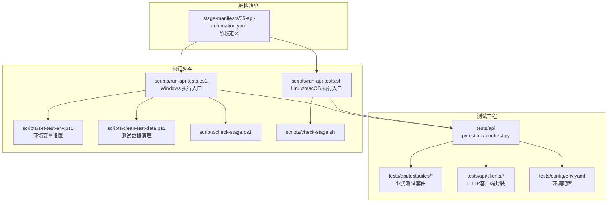
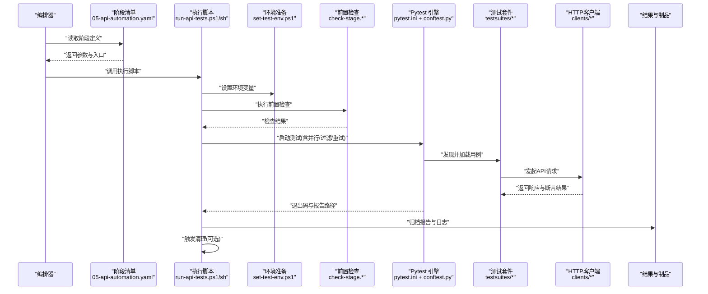
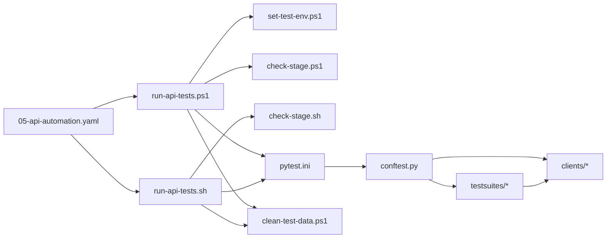

# API测试执行编排

<cite>
**本文引用的文件**   
- [scripts/run-api-tests.ps1](file://scripts/run-api-tests.ps1)
- [scripts/run-api-tests.sh](file://scripts/run-api-tests.sh)
- [tests/api/pytest.ini](file://tests/api/pytest.ini)
- [tests/api/conftest.py](file://tests/api/conftest.py)
- [tests/config/env.yaml](file://tests/config/env.yaml)
- [scripts/set-test-env.ps1](file://scripts/set-test-env.ps1)
- [scripts/clean-test-data.ps1](file://scripts/clean-test-data.ps1)
- [scripts/check-stage.ps1](file://scripts/check-stage.ps1)
- [scripts/check-stage.sh](file://scripts/check-stage.sh)
- [stage-manifests/05-api-automation.yaml](file://stage-manifests/05-api-automation.yaml)
</cite>

## 目录
1. [简介](#简介)
2. [项目结构](#项目结构)
3. [核心组件](#核心组件)
4. [架构总览](#架构总览)
5. [详细组件分析](#详细组件分析)
6. [依赖关系分析](#依赖关系分析)
7. [性能考虑](#性能考虑)
8. [故障排查指南](#故障排查指南)
9. [结论](#结论)
10. [附录](#附录)

## 简介
本技术文档聚焦于 AutoTest Hub 的 API 测试执行编排，围绕基于 Pytest 的 API 测试生命周期展开，涵盖测试发现、参数化执行与结果收集机制；对比 PowerShell 与 Shell 脚本的差异与兼容性处理；系统化说明测试环境配置管理、依赖安装与数据准备流程；解释并行执行策略、失败重试机制与资源清理方案；并提供按标签、模块与优先级的过滤与选择性执行方法，以及性能优化技巧与常见问题排查指南。

## 项目结构
API 测试相关的关键目录与文件：
- tests/api：Pytest 测试工程根，包含 pytest 配置、夹具与测试套件
- scripts：跨平台执行脚本（PowerShell 与 Shell），负责环境准备、依赖安装、测试运行与清理
- stage-manifests：阶段编排清单，定义 API 自动化阶段的入口与参数

图表来源
- [scripts/run-api-tests.ps1](file://scripts/run-api-tests.ps1)
- [scripts/run-api-tests.sh](file://scripts/run-api-tests.sh)
- [tests/api/pytest.ini](file://tests/api/pytest.ini)
- [tests/api/conftest.py](file://tests/api/conftest.py)
- [tests/config/env.yaml](file://tests/config/env.yaml)
- [scripts/set-test-env.ps1](file://scripts/set-test-env.ps1)
- [scripts/clean-test-data.ps1](file://scripts/clean-test-data.ps1)
- [scripts/check-stage.ps1](file://scripts/check-stage.ps1)
- [scripts/check-stage.sh](file://scripts/check-stage.sh)
- [stage-manifests/05-api-automation.yaml](file://stage-manifests/05-api-automation.yaml)

章节来源
- [scripts/run-api-tests.ps1](file://scripts/run-api-tests.ps1)
- [scripts/run-api-tests.sh](file://scripts/run-api-tests.sh)
- [tests/api/pytest.ini](file://tests/api/pytest.ini)
- [tests/api/conftest.py](file://tests/api/conftest.py)
- [tests/config/env.yaml](file://tests/config/env.yaml)
- [stage-manifests/05-api-automation.yaml](file://stage-manifests/05-api-automation.yaml)

## 核心组件
- Pytest 配置与插件
  - pytest.ini：集中定义测试发现路径、标记、日志、缓存、并行与报告输出等关键选项
  - conftest.py：提供全局夹具、会话级共享资源、钩子函数（如收集前后置、失败截图/日志收集）
- 测试套件与客户端
  - testsuites：按业务域组织测试用例，便于按模块筛选与分层执行
  - clients：封装 HTTP 请求、鉴权、重试与断言逻辑，统一错误码与响应解析
- 执行脚本
  - run-api-tests.ps1/sh：跨平台入口，负责参数解析、环境准备、依赖安装、测试运行、结果归档与清理
  - set-test-env.ps1：在 Windows 下注入环境变量（如目标地址、凭据、开关）
  - clean-test-data.ps1：执行后清理临时数据、缓存与中间产物
  - check-stage.ps1/sh：阶段前置检查（环境、依赖、端口连通性等）
- 编排清单
  - 05-api-automation.yaml：定义 API 自动化阶段的目标、参数与执行顺序，供上层流水线调用

章节来源
- [tests/api/pytest.ini](file://tests/api/pytest.ini)
- [tests/api/conftest.py](file://tests/api/conftest.py)
- [scripts/run-api-tests.ps1](file://scripts/run-api-tests.ps1)
- [scripts/run-api-tests.sh](file://scripts/run-api-tests.sh)
- [scripts/set-test-env.ps1](file://scripts/set-test-env.ps1)
- [scripts/clean-test-data.ps1](file://scripts/clean-test-data.ps1)
- [scripts/check-stage.ps1](file://scripts/check-stage.ps1)
- [scripts/check-stage.sh](file://scripts/check-stage.sh)
- [stage-manifests/05-api-automation.yaml](file://stage-manifests/05-api-automation.yaml)

## 架构总览
下图展示了从编排清单到 Pytest 执行的端到端流程，包括环境准备、依赖安装、测试运行、结果收集与清理。

图表来源
- [stage-manifests/05-api-automation.yaml](file://stage-manifests/05-api-automation.yaml)
- [scripts/run-api-tests.ps1](file://scripts/run-api-tests.ps1)
- [scripts/run-api-tests.sh](file://scripts/run-api-tests.sh)
- [scripts/set-test-env.ps1](file://scripts/set-test-env.ps1)
- [scripts/check-stage.ps1](file://scripts/check-stage.ps1)
- [scripts/check-stage.sh](file://scripts/check-stage.sh)
- [tests/api/pytest.ini](file://tests/api/pytest.ini)
- [tests/api/conftest.py](file://tests/api/conftest.py)

## 详细组件分析

### 执行脚本：PowerShell 与 Shell 差异与兼容
- 入口职责
  - run-api-tests.ps1：Windows 专用，支持 .NET/PowerShell 生态特性，适合本地开发或 Windows CI
  - run-api-tests.sh：POSIX 兼容，适用于 Linux/macOS 与通用 CI
- 参数与变量
  - 两者均接收目标环境、并发数、过滤条件、重试次数、报告路径等参数
  - PowerShell 使用 $env:* 注入环境变量；Shell 使用 export 或 env 命令
- 依赖安装
  - PowerShell 侧可结合 pip/virtualenv 或 choco/scoop（视团队规范）
  - Shell 侧通常通过 pip/python3 -m venv 完成隔离环境
- 错误处理
  - PowerShell 使用 try/catch/finally 与 $LASTEXITCODE
  - Shell 使用 set -e/-o pipefail 与 trap 捕获异常
- 兼容性建议
  - 对外暴露统一 CLI 签名，内部根据 OS 自动选择对应脚本
  - 将平台差异收敛至各自脚本内，避免上层编排耦合

章节来源
- [scripts/run-api-tests.ps1](file://scripts/run-api-tests.ps1)
- [scripts/run-api-tests.sh](file://scripts/run-api-tests.sh)
- [scripts/set-test-env.ps1](file://scripts/set-test-env.ps1)
- [scripts/check-stage.ps1](file://scripts/check-stage.ps1)
- [scripts/check-stage.sh](file://scripts/check-stage.sh)

### Pytest 配置与发现机制
- 发现规则
  - 通过 pytest.ini 指定测试目录与匹配模式，确保 testsuites 下的用例被正确发现
- 标记与过滤
  - 支持按标签（如 smoke、regression、priority）、模块路径、关键字进行筛选
- 并行执行
  - 启用 pytest-xdist 实现多进程并行，配合 --numprocesses 控制并发度
- 结果收集
  - 集成 allure 或 html 报告插件，输出结构化结果与附件
- 钩子与夹具
  - conftest.py 中定义 session/module/class/function 级夹具，集中管理鉴权、数据库连接、Mock 与资源释放

章节来源
- [tests/api/pytest.ini](file://tests/api/pytest.ini)
- [tests/api/conftest.py](file://tests/api/conftest.py)

### 测试发现与参数化执行
- 发现流程
  - Pytest 扫描 tests/api 目录，匹配 test_*.py 与 *_test.py 文件，递归加载类与方法
- 参数化
  - 使用 @pytest.mark.parametrize 或 fixture 生成数据驱动用例，提升覆盖率与可读性
- 执行顺序
  - 可通过 -k 表达式、--ignore 与 --deselect 精细控制执行范围
- 结果收集
  - 每个用例产出独立条目，聚合为整体报告；失败用例附带日志与截图（如有）

章节来源
- [tests/api/pytest.ini](file://tests/api/pytest.ini)
- [tests/api/conftest.py](file://tests/api/conftest.py)

### 结果收集与报告
- 报告格式
  - 支持 Allure/HTML/JUnit XML 等多格式，便于接入 CI 看板与质量门禁
- 附件与日志
  - 通过 conftest 钩子在失败时采集上下文（请求/响应、堆栈、系统信息）
- 持久化
  - 脚本将报告与日志归档至固定目录，便于追溯与审计

章节来源
- [tests/api/pytest.ini](file://tests/api/pytest.ini)
- [tests/api/conftest.py](file://tests/api/conftest.py)
- [scripts/run-api-tests.ps1](file://scripts/run-api-tests.ps1)
- [scripts/run-api-tests.sh](file://scripts/run-api-tests.sh)

### 测试环境配置管理
- 配置文件
  - env.yaml 集中管理不同环境的基址、凭据、功能开关与超时等
- 环境变量注入
  - set-test-env.ps1 在 Windows 下注入必要变量；Shell 侧可在 run-api-tests.sh 中直接 export
- 优先级
  - 命令行参数 > 环境变量 > 配置文件默认值，保证灵活覆盖

章节来源
- [tests/config/env.yaml](file://tests/config/env.yaml)
- [scripts/set-test-env.ps1](file://scripts/set-test-env.ps1)
- [scripts/run-api-tests.sh](file://scripts/run-api-tests.sh)

### 依赖安装与数据准备
- 依赖安装
  - 建议在虚拟环境中安装 pytest、pytest-xdist、allure-pytest、requests/httpx 等
  - 脚本在执行前检测并安装缺失依赖，确保幂等
- 数据准备
  - 通过 fixtures 或独立初始化脚本创建基础数据；必要时使用 Mock 降低外部依赖
- 数据清理
  - clean-test-data.ps1 用于清理缓存、临时文件与测试产生的脏数据

章节来源
- [scripts/run-api-tests.ps1](file://scripts/run-api-tests.ps1)
- [scripts/run-api-tests.sh](file://scripts/run-api-tests.sh)
- [scripts/clean-test-data.ps1](file://scripts/clean-test-data.ps1)
- [tests/api/conftest.py](file://tests/api/conftest.py)

### 并行执行策略
- 进程模型
  - 使用 pytest-xdist 的多进程模型，每个 worker 独立加载环境与数据
- 并发度
  - 依据 CPU 核数与 I/O 瓶颈调整 --numprocesses，避免过度竞争
- 资源隔离
  - 通过夹具与线程安全的数据源避免共享状态冲突
- 结果合并
  - xdist 自动汇总各 worker 结果，最终由报告插件统一输出

章节来源
- [tests/api/pytest.ini](file://tests/api/pytest.ini)
- [tests/api/conftest.py](file://tests/api/conftest.py)

### 失败重试机制
- 策略
  - 对偶发性失败（网络抖动、服务冷启动）启用重试，限制最大次数与间隔
- 实现
  - 可使用 pytest-rerunfailures 或在客户端层封装重试逻辑
- 注意事项
  - 重试需幂等，避免副作用累积；记录重试轨迹以便定位问题

章节来源
- [tests/api/pytest.ini](file://tests/api/pytest.ini)
- [tests/api/conftest.py](file://tests/api/conftest.py)

### 资源清理方案
- 清理时机
  - 测试结束后统一清理临时文件、缓存与生成的数据
- 清理范围
  - 仅清理本次运行产生的工件，避免误删共享资源
- 幂等性
  - 清理脚本应可重复执行且无副作用

章节来源
- [scripts/clean-test-data.ps1](file://scripts/clean-test-data.ps1)
- [scripts/run-api-tests.ps1](file://scripts/run-api-tests.ps1)
- [scripts/run-api-tests.sh](file://scripts/run-api-tests.sh)

### 过滤与选择性执行
- 按标签
  - 使用 -m 选择特定标记（如 smoke/regression/high_priority）
- 按模块
  - 使用路径过滤（如 tests/api/testsuites/crm）限定执行范围
- 按优先级
  - 自定义标记或文件名约定，结合 -k 表达式组合筛选
- 排除
  - 使用 --ignore 与 --deselect 排除不稳定或无关用例

章节来源
- [tests/api/pytest.ini](file://tests/api/pytest.ini)

### 编排与阶段清单
- 阶段定义
  - 05-api-automation.yaml 描述 API 自动化阶段的目标、参数与执行顺序
- 调用方式
  - 上层流水线读取清单，动态拼装执行脚本参数，实现一致的执行体验
- 扩展性
  - 新增阶段只需添加新的 YAML 清单，无需改动执行脚本

章节来源
- [stage-manifests/05-api-automation.yaml](file://stage-manifests/05-api-automation.yaml)

## 依赖关系分析

图表来源
- [stage-manifests/05-api-automation.yaml](file://stage-manifests/05-api-automation.yaml)
- [scripts/run-api-tests.ps1](file://scripts/run-api-tests.ps1)
- [scripts/run-api-tests.sh](file://scripts/run-api-tests.sh)
- [scripts/set-test-env.ps1](file://scripts/set-test-env.ps1)
- [scripts/check-stage.ps1](file://scripts/check-stage.ps1)
- [scripts/check-stage.sh](file://scripts/check-stage.sh)
- [tests/api/pytest.ini](file://tests/api/pytest.ini)
- [tests/api/conftest.py](file://tests/api/conftest.py)
- [scripts/clean-test-data.ps1](file://scripts/clean-test-data.ps1)

章节来源
- [stage-manifests/05-api-automation.yaml](file://stage-manifests/05-api-automation.yaml)
- [scripts/run-api-tests.ps1](file://scripts/run-api-tests.ps1)
- [scripts/run-api-tests.sh](file://scripts/run-api-tests.sh)
- [tests/api/pytest.ini](file://tests/api/pytest.ini)
- [tests/api/conftest.py](file://tests/api/conftest.py)

## 性能考虑
- 并行度调优
  - 根据 CPU 与网络状况调整 --numprocesses，避免上下文切换开销过大
- 用例粒度
  - 将长耗时用例拆分或异步化，减少阻塞
- 数据准备
  - 预构建基础数据，避免每次运行重复创建
- 缓存与复用
  - 复用鉴权令牌、会话与连接池，减少握手成本
- 报告与日志
  - 仅在失败时采集详细附件，降低 IO 压力
- 依赖预热
  - 提前安装依赖与镜像，缩短冷启动时间

[本节为通用指导，不直接分析具体文件]

## 故障排查指南
- 常见环境问题
  - Python/Pytest 版本不一致：锁定版本并使用虚拟环境
  - 端口或服务不可达：通过 check-stage.* 前置检查快速定位
- 权限与编码
  - PowerShell 执行策略与 BOM 编码问题：参考 fix-* 系列脚本思路修正
- 并行冲突
  - 共享资源竞争导致偶发失败：增加隔离或串行化关键步骤
- 报告缺失
  - 确认报告插件已安装且输出路径存在
- 重试风暴
  - 重试次数过多掩盖真实问题：结合日志与指标分析根因

章节来源
- [scripts/check-stage.ps1](file://scripts/check-stage.ps1)
- [scripts/check-stage.sh](file://scripts/check-stage.sh)
- [tests/api/pytest.ini](file://tests/api/pytest.ini)
- [tests/api/conftest.py](file://tests/api/conftest.py)

## 结论
通过统一的执行脚本与 Pytest 配置，AutoTest Hub 实现了跨平台的 API 测试编排。借助环境配置、并行执行、失败重试与完善的清理策略，测试具备高可用性与可维护性。结合阶段清单与过滤能力，可按需快速执行不同范围的用例集，满足日常回归与持续交付需求。

[本节为总结性内容，不直接分析具体文件]

## 附录
- 常用执行示例（以路径引用代替代码片段）
  - 全量执行：参见 [scripts/run-api-tests.ps1](file://scripts/run-api-tests.ps1)、[scripts/run-api-tests.sh](file://scripts/run-api-tests.sh)
  - 仅冒烟用例：参见 [tests/api/pytest.ini](file://tests/api/pytest.ini) 中的标记与过滤配置
  - 并行执行：参见 [tests/api/pytest.ini](file://tests/api/pytest.ini) 中的并行参数
  - 失败重试：参见 [tests/api/pytest.ini](file://tests/api/pytest.ini) 中的重试配置
  - 环境注入：参见 [scripts/set-test-env.ps1](file://scripts/set-test-env.ps1)
  - 数据清理：参见 [scripts/clean-test-data.ps1](file://scripts/clean-test-data.ps1)
  - 阶段编排：参见 [stage-manifests/05-api-automation.yaml](file://stage-manifests/05-api-automation.yaml)