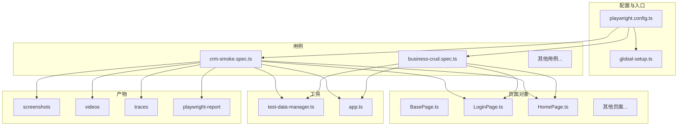
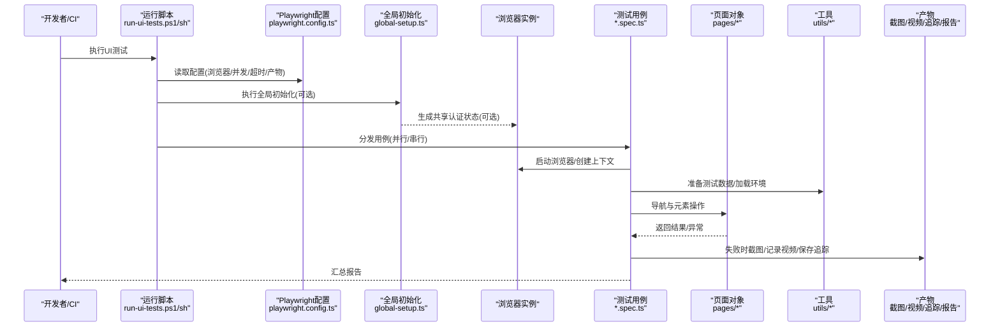
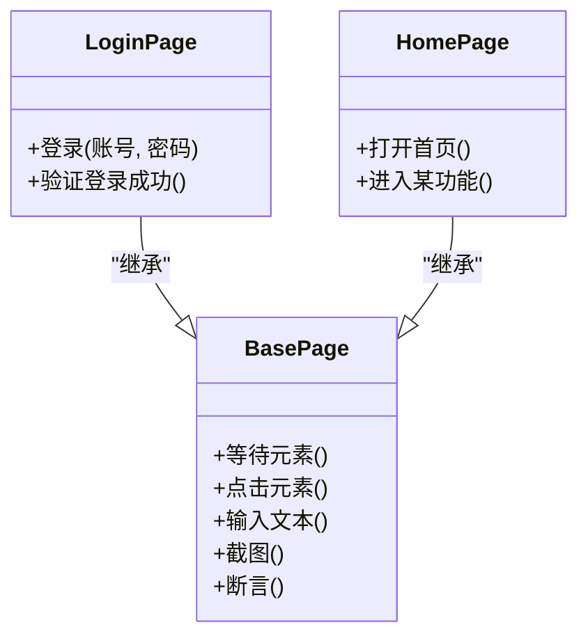
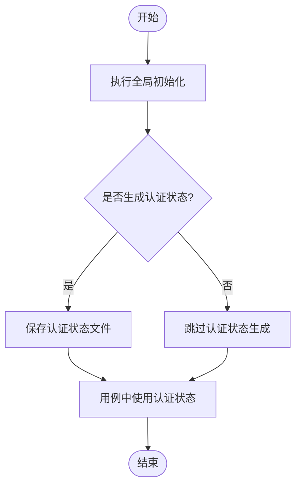
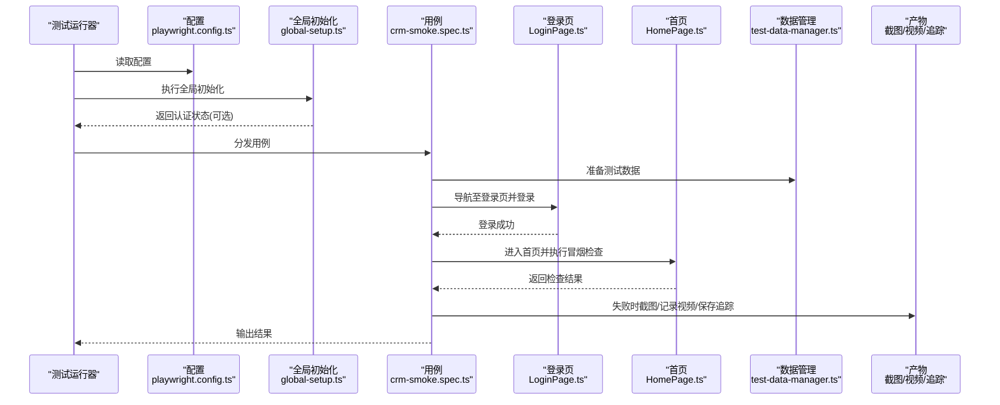
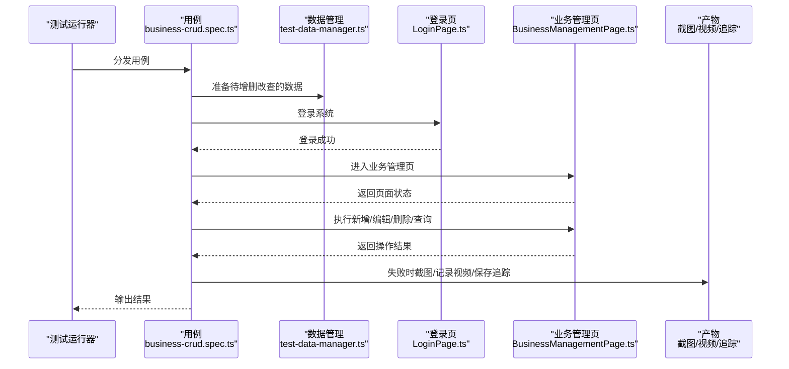
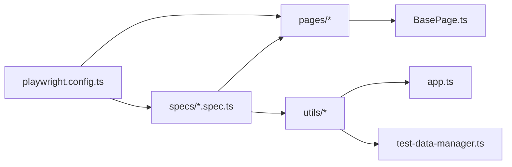

# UI自动化测试执行

<cite>
**本文引用的文件**   
- [playwright.config.ts](file://tests/ui/playwright.config.ts)
- [global-setup.ts](file://tests/ui/global-setup.ts)
- [BasePage.ts](file://tests/ui/pages/BasePage.ts)
- [LoginPage.ts](file://tests/ui/pages/LoginPage.ts)
- [HomePage.ts](file://tests/ui/pages/HomePage.ts)
- [crm-smoke.spec.ts](file://tests/ui/specs/crm/crm-smoke.spec.ts)
- [business-crud.spec.ts](file://tests/ui/specs/crm/business-crud.spec.ts)
- [test-data-manager.ts](file://tests/ui/utils/test-data-manager.ts)
- [app.ts](file://tests/ui/utils/app.ts)
- [run-ui-tests.ps1](file://scripts/run-ui-tests.ps1)
- [run-ui-tests.sh](file://scripts/run-ui-tests.sh)
</cite>

## 目录
1. [简介](#简介)
2. [项目结构](#项目结构)
3. [核心组件](#核心组件)
4. [架构总览](#架构总览)
5. [详细组件分析](#详细组件分析)
6. [依赖关系分析](#依赖关系分析)
7. [性能考虑](#性能考虑)
8. [故障排查指南](#故障排查指南)
9. [结论](#结论)
10. [附录](#附录)

## 简介
本技术文档面向AutoTest Hub的UI自动化测试执行编排，聚焦基于Playwright的端到端UI测试流程。内容涵盖浏览器实例管理、页面导航与元素操作、测试环境初始化配置、用户登录状态管理、测试数据准备、截图与视频录制机制、错误诊断信息与调试工具集成、并行执行策略、多浏览器与多环境支持，以及失败时的自动截图、日志收集与故障恢复机制，并提供跨浏览器兼容性处理与性能优化建议。

## 项目结构
UI自动化测试位于 tests/ui 目录下，采用“配置 + 全局初始化 + Page Object + 用例 + 工具 + 产物”的分层组织方式：
- 配置与入口
  - playwright.config.ts：Playwright运行配置（浏览器、超时、重试、并行、报告、截图/视频等）
  - global-setup.ts：全局初始化（如生成共享认证状态）
- 页面对象
  - pages/*：封装页面交互（登录、首页、业务管理等）
- 用例
  - specs/*：按模块划分的测试规格（CRM、系统、原型、诊断等）
- 工具
  - utils/*：通用工具（应用上下文、测试数据管理、表单辅助等）
- 产物
  - artifacts/screenshots、artifacts/videos、artifacts/traces：截图、视频、追踪文件
  - playwright-report：Playwright报告

图表来源
- [playwright.config.ts](file://tests/ui/playwright.config.ts)
- [global-setup.ts](file://tests/ui/global-setup.ts)
- [BasePage.ts](file://tests/ui/pages/BasePage.ts)
- [LoginPage.ts](file://tests/ui/pages/LoginPage.ts)
- [HomePage.ts](file://tests/ui/pages/HomePage.ts)
- [crm-smoke.spec.ts](file://tests/ui/specs/crm/crm-smoke.spec.ts)
- [business-crud.spec.ts](file://tests/ui/specs/crm/business-crud.spec.ts)
- [test-data-manager.ts](file://tests/ui/utils/test-data-manager.ts)
- [app.ts](file://tests/ui/utils/app.ts)

章节来源
- [playwright.config.ts](file://tests/ui/playwright.config.ts)
- [global-setup.ts](file://tests/ui/global-setup.ts)
- [BasePage.ts](file://tests/ui/pages/BasePage.ts)
- [LoginPage.ts](file://tests/ui/pages/LoginPage.ts)
- [HomePage.ts](file://tests/ui/pages/HomePage.ts)
- [crm-smoke.spec.ts](file://tests/ui/specs/crm/crm-smoke.spec.ts)
- [business-crud.spec.ts](file://tests/ui/specs/crm/business-crud.spec.ts)
- [test-data-manager.ts](file://tests/ui/utils/test-data-manager.ts)
- [app.ts](file://tests/ui/utils/app.ts)

## 核心组件
- Playwright配置中心
  - 负责浏览器选择、并发度、超时与重试、截图/视频/追踪开关、报告输出路径、全局钩子等。
- 全局初始化
  - 在全部用例开始前执行一次，用于准备共享资源（例如生成并持久化认证状态）。
- 页面对象模型（POM）
  - BasePage提供基础能力（等待、定位、断言、截图等），具体页面继承扩展。
- 用例编排
  - 通过spec文件组织业务流程，组合页面对象与工具完成端到端场景。
- 工具库
  - 测试数据管理器负责数据准备与清理；应用上下文提供URL、环境切换等。
- 产物与报告
  - 截图、视频、追踪文件与HTML报告集中输出，便于失败分析与回归对比。

章节来源
- [playwright.config.ts](file://tests/ui/playwright.config.ts)
- [global-setup.ts](file://tests/ui/global-setup.ts)
- [BasePage.ts](file://tests/ui/pages/BasePage.ts)
- [LoginPage.ts](file://tests/ui/pages/LoginPage.ts)
- [HomePage.ts](file://tests/ui/pages/HomePage.ts)
- [test-data-manager.ts](file://tests/ui/utils/test-data-manager.ts)
- [app.ts](file://tests/ui/utils/app.ts)

## 架构总览
下图展示了从脚本入口到用例执行的完整链路，包括浏览器启动、认证状态复用、页面交互与产物产出。

图表来源
- [run-ui-tests.ps1](file://scripts/run-ui-tests.ps1)
- [run-ui-tests.sh](file://scripts/run-ui-tests.sh)
- [playwright.config.ts](file://tests/ui/playwright.config.ts)
- [global-setup.ts](file://tests/ui/global-setup.ts)
- [crm-smoke.spec.ts](file://tests/ui/specs/crm/crm-smoke.spec.ts)
- [business-crud.spec.ts](file://tests/ui/specs/crm/business-crud.spec.ts)
- [BasePage.ts](file://tests/ui/pages/BasePage.ts)
- [LoginPage.ts](file://tests/ui/pages/LoginPage.ts)
- [HomePage.ts](file://tests/ui/pages/HomePage.ts)
- [test-data-manager.ts](file://tests/ui/utils/test-data-manager.ts)
- [app.ts](file://tests/ui/utils/app.ts)

## 详细组件分析

### 浏览器实例管理与上下文
- 浏览器选择
  - 通过配置文件指定目标浏览器（Chromium/Firefox/WebKit），可在不同环境或矩阵中切换。
- 上下文与会话
  - 使用浏览器上下文隔离会话，结合全局初始化生成的认证状态实现免登复用，减少重复登录开销。
- 生命周期
  - 每个用例可拥有独立上下文，或在必要时复用已认证的上下文以提升效率。

章节来源
- [playwright.config.ts](file://tests/ui/playwright.config.ts)
- [global-setup.ts](file://tests/ui/global-setup.ts)

### 页面导航与元素操作（POM）
- BasePage
  - 提供统一的基础方法：等待可见/可点击、定位器封装、截图、断言等，降低用例复杂度。
- LoginPage
  - 封装登录流程（输入用户名/密码、提交、等待跳转），可与全局认证状态配合。
- HomePage
  - 封装首页导航与常用入口，作为业务用例的起点。

图表来源
- [BasePage.ts](file://tests/ui/pages/BasePage.ts)
- [LoginPage.ts](file://tests/ui/pages/LoginPage.ts)
- [HomePage.ts](file://tests/ui/pages/HomePage.ts)

章节来源
- [BasePage.ts](file://tests/ui/pages/BasePage.ts)
- [LoginPage.ts](file://tests/ui/pages/LoginPage.ts)
- [HomePage.ts](file://tests/ui/pages/HomePage.ts)

### 测试环境初始化与用户登录状态管理
- 全局初始化
  - 在全部用例前执行一次，用于准备共享资源（如生成认证状态文件），后续用例可直接复用，避免每次登录。
- 认证状态复用
  - 通过上下文存储/恢复认证信息，提升执行速度并稳定登录态。
- 环境变量与URL
  - 通过工具或配置注入目标环境地址，支持开发/测试/预发等多环境切换。

图表来源
- [global-setup.ts](file://tests/ui/global-setup.ts)
- [app.ts](file://tests/ui/utils/app.ts)

章节来源
- [global-setup.ts](file://tests/ui/global-setup.ts)
- [app.ts](file://tests/ui/utils/app.ts)

### 测试数据准备与管理
- 测试数据管理器
  - 提供统一的测试数据加载、构造与清理能力，确保用例间数据隔离与可重复性。
- 数据驱动
  - 可按需为不同用例分支准备差异化数据，支持批量与边界值场景。

章节来源
- [test-data-manager.ts](file://tests/ui/utils/test-data-manager.ts)

### 截图与视频录制机制
- 截图
  - 在关键步骤或失败时自动截图，便于快速定位问题。
- 视频录制
  - 对用例执行过程进行录屏，结合追踪文件进行深度分析。
- 追踪文件
  - 保存网络请求、DOM快照、控制台日志等，用于离线回放与根因分析。

章节来源
- [playwright.config.ts](file://tests/ui/playwright.config.ts)

### 错误诊断与调试工具集成
- 失败自动截图
  - 在断言失败或异常捕获时触发截图，保留现场证据。
- 追踪与回放
  - 启用追踪后，可通过Playwright UI查看每一步操作与网络详情。
- 报告与可视化
  - 生成HTML报告，聚合通过率、耗时、失败详情与附件。

章节来源
- [playwright.config.ts](file://tests/ui/playwright.config.ts)

### 并行执行策略与用例分发
- 并行度控制
  - 通过配置项设置最大并发数，平衡速度与稳定性。
- 用例分组
  - 可按模块或优先级筛选执行，支持冒烟、回归、全量等不同套件。
- 资源隔离
  - 每个进程/线程拥有独立浏览器上下文，避免状态污染。

章节来源
- [playwright.config.ts](file://tests/ui/playwright.config.ts)
- [crm-smoke.spec.ts](file://tests/ui/specs/crm/crm-smoke.spec.ts)
- [business-crud.spec.ts](file://tests/ui/specs/crm/business-crud.spec.ts)

### 多浏览器与多环境支持
- 多浏览器矩阵
  - 在同一配置中声明多个浏览器，CI中可并行跑通跨浏览器兼容。
- 多环境切换
  - 通过环境变量或配置文件注入不同环境的URL与参数，无需修改代码。

章节来源
- [playwright.config.ts](file://tests/ui/playwright.config.ts)
- [app.ts](file://tests/ui/utils/app.ts)

### 典型用例执行流程（序列图）
以CRM冒烟用例为例，展示从启动到完成的关键调用链。

图表来源
- [playwright.config.ts](file://tests/ui/playwright.config.ts)
- [global-setup.ts](file://tests/ui/global-setup.ts)
- [crm-smoke.spec.ts](file://tests/ui/specs/crm/crm-smoke.spec.ts)
- [LoginPage.ts](file://tests/ui/pages/LoginPage.ts)
- [HomePage.ts](file://tests/ui/pages/HomePage.ts)
- [test-data-manager.ts](file://tests/ui/utils/test-data-manager.ts)

章节来源
- [crm-smoke.spec.ts](file://tests/ui/specs/crm/crm-smoke.spec.ts)
- [LoginPage.ts](file://tests/ui/pages/LoginPage.ts)
- [HomePage.ts](file://tests/ui/pages/HomePage.ts)
- [test-data-manager.ts](file://tests/ui/utils/test-data-manager.ts)

### 业务CRUD用例流程（序列图）
以业务管理CRUD为例，展示数据准备、页面操作与结果验证。

图表来源
- [business-crud.spec.ts](file://tests/ui/specs/crm/business-crud.spec.ts)
- [LoginPage.ts](file://tests/ui/pages/LoginPage.ts)
- [test-data-manager.ts](file://tests/ui/utils/test-data-manager.ts)

章节来源
- [business-crud.spec.ts](file://tests/ui/specs/crm/business-crud.spec.ts)
- [LoginPage.ts](file://tests/ui/pages/LoginPage.ts)
- [test-data-manager.ts](file://tests/ui/utils/test-data-manager.ts)

## 依赖关系分析
- 配置依赖
  - 所有用例与页面对象均受 playwright.config.ts 影响（浏览器、超时、重试、产物等）。
- 页面对象依赖
  - 具体页面继承BasePage，复用基础能力，降低耦合。
- 用例与工具
  - 用例依赖测试数据管理器与应用上下文，保证数据与环境一致性。
- 外部依赖
  - 运行脚本封装了平台差异（PowerShell/Shell），屏蔽底层差异。

图表来源
- [playwright.config.ts](file://tests/ui/playwright.config.ts)
- [BasePage.ts](file://tests/ui/pages/BasePage.ts)
- [test-data-manager.ts](file://tests/ui/utils/test-data-manager.ts)
- [app.ts](file://tests/ui/utils/app.ts)

章节来源
- [playwright.config.ts](file://tests/ui/playwright.config.ts)
- [BasePage.ts](file://tests/ui/pages/BasePage.ts)
- [test-data-manager.ts](file://tests/ui/utils/test-data-manager.ts)
- [app.ts](file://tests/ui/utils/app.ts)

## 性能考虑
- 合理设置并发度
  - 根据机器资源调整并行数，避免过度竞争导致不稳定。
- 复用认证状态
  - 通过全局初始化生成认证状态，减少登录开销。
- 精准等待与最小化操作
  - 使用显式等待替代固定sleep，仅执行必要操作，缩短执行时间。
- 选择性开启产物
  - 仅在失败或需要分析时开启视频/追踪，减少IO压力。
- 浏览器选择
  - 在无特殊需求时优先使用Chromium以获得更好性能。

[本节为通用指导，不直接分析具体文件]

## 故障排查指南
- 失败自动截图
  - 确认配置已开启截图，并在失败路径中触发。
- 视频与追踪
  - 开启视频与追踪，结合HTML报告定位问题根因。
- 认证状态失效
  - 检查全局初始化是否成功生成认证状态，必要时重新生成。
- 环境不一致
  - 校验环境变量与URL是否正确注入，确保目标环境与预期一致。
- 并行导致的竞态
  - 适当降低并发度或增加超时，观察是否改善。

章节来源
- [playwright.config.ts](file://tests/ui/playwright.config.ts)
- [global-setup.ts](file://tests/ui/global-setup.ts)

## 结论
本方案通过Playwright配置中心统一管理浏览器与产物，结合全局初始化与认证状态复用提升执行效率；以POM模式组织页面交互，增强可维护性与可读性；通过测试数据管理器保障数据一致性；利用截图、视频与追踪完善失败诊断；并通过并行与多浏览器矩阵提升覆盖率与稳定性。建议在CI中按需开启产物与并行，持续优化等待策略与资源分配，以获得更可靠的UI自动化体验。

## 附录
- 运行脚本
  - Windows：run-ui-tests.ps1
  - Linux/macOS：run-ui-tests.sh
  - 作用：封装执行命令、传递参数、设置环境变量、收集产物。

章节来源
- [run-ui-tests.ps1](file://scripts/run-ui-tests.ps1)
- [run-ui-tests.sh](file://scripts/run-ui-tests.sh)