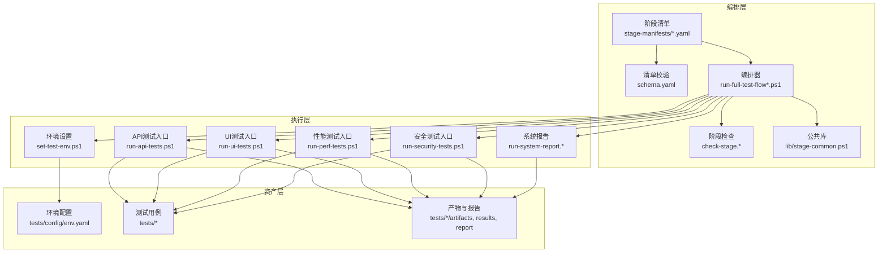
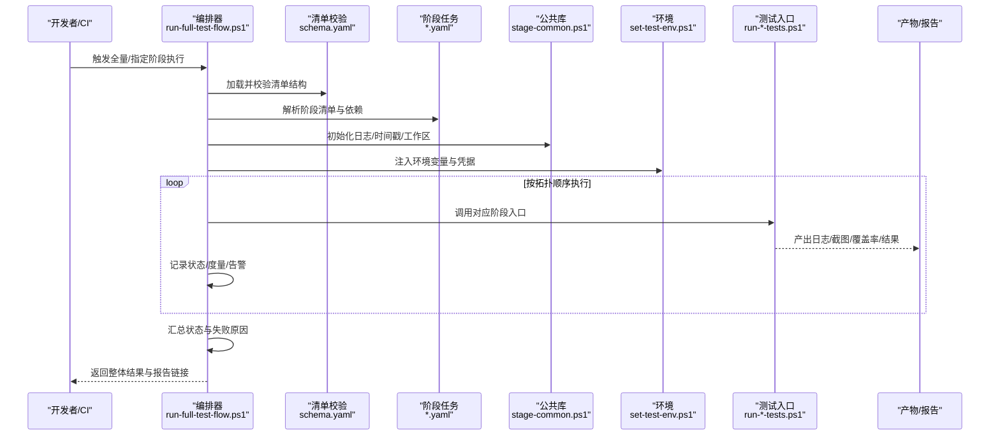
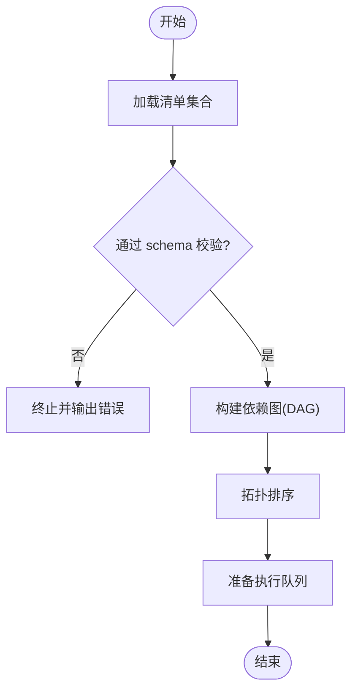
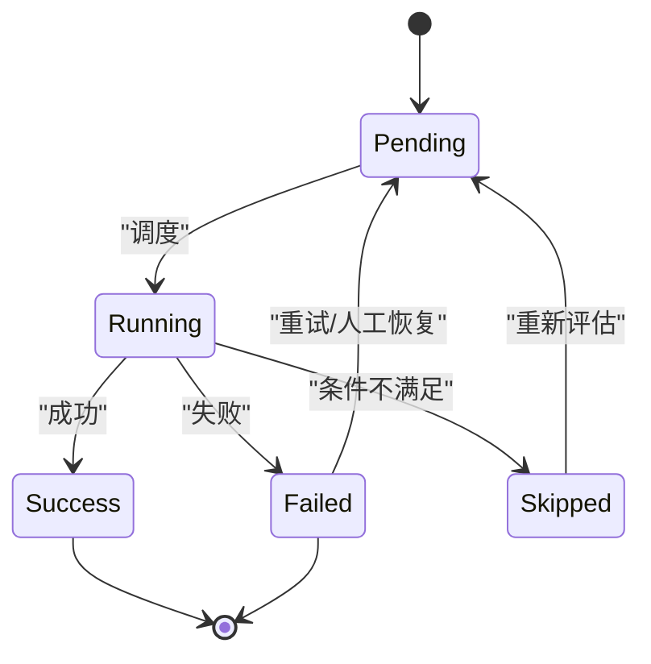
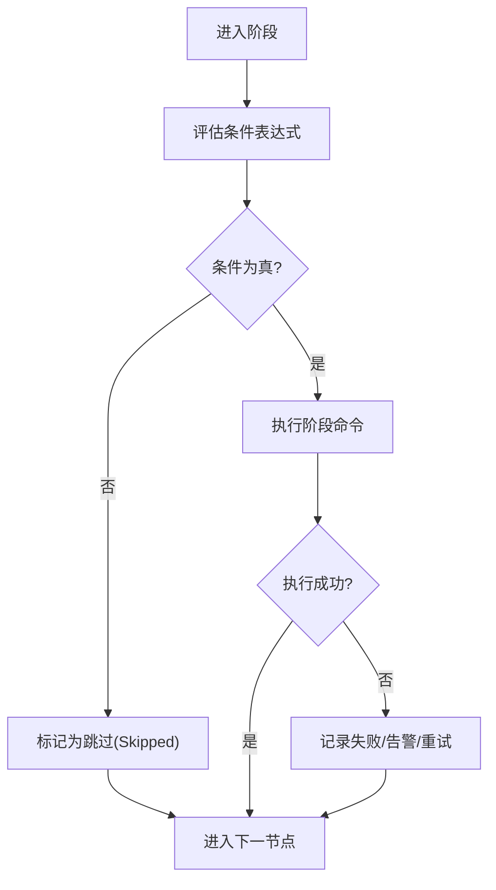
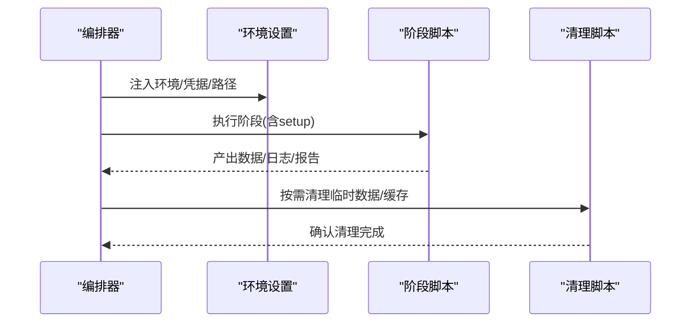
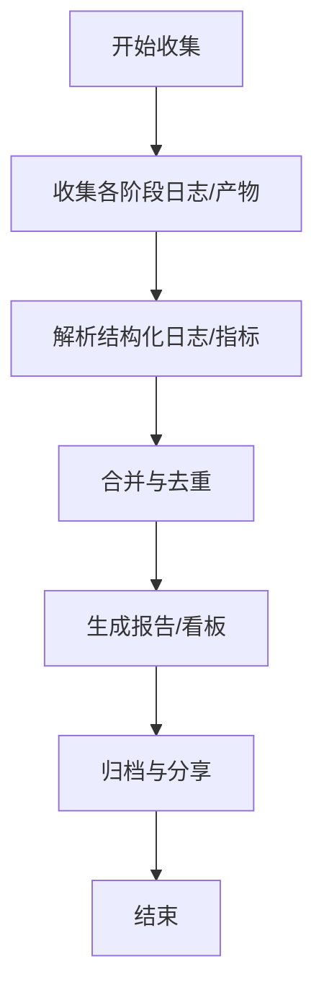
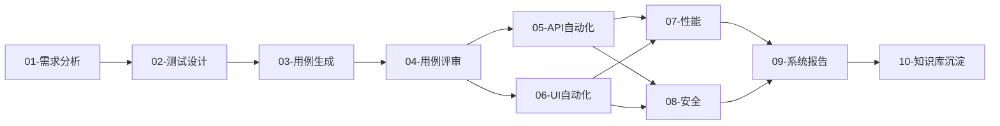

# 全链路测试流程编排

<cite>
**本文引用的文件**   
- [stage-manifests/01-req-analysis.yaml](file://stage-manifests/01-req-analysis.yaml)
- [stage-manifests/02-test-design.yaml](file://stage-manifests/02-test-design.yaml)
- [stage-manifests/03-case-generation.yaml](file://stage-manifests/03-case-generation.yaml)
- [stage-manifests/04-case-review.yaml](file://stage-manifests/04-case-review.yaml)
- [stage-manifests/05-api-automation.yaml](file://stage-manifests/05-api-automation.yaml)
- [stage-manifests/06-ui-automation.yaml](file://stage-manifests/06-ui-automation.yaml)
- [stage-manifests/07-performance.yaml](file://stage-manifests/07-performance.yaml)
- [stage-manifests/08-security.yaml](file://stage-manifests/08-security.yaml)
- [stage-manifests/09-system-test-report.yaml](file://stage-manifests/09-system-test-report.yaml)
- [stage-manifests/10-knowledge-base.yaml](file://stage-manifests/10-knowledge-base.yaml)
- [stage-manifests/schema.yaml](file://stage-manifests/schema.yaml)
- [scripts/run-full-test-flow.ps1](file://scripts/run-full-test-flow.ps1)
- [scripts/run-full-test-flow-simple.ps1](file://scripts/run-full-test-flow-simple.ps1)
- [scripts/check-stage.sh](file://scripts/check-stage.sh)
- [scripts/check-stage.ps1](file://scripts/check-stage.ps1)
- [scripts/lib/stage-common.ps1](file://scripts/lib/stage-common.ps1)
- [scripts/set-test-env.ps1](file://scripts/set-test-env.ps1)
- [scripts/clean-test-data.ps1](file://scripts/clean-test-data.ps1)
- [scripts/run-api-tests.ps1](file://scripts/run-api-tests.ps1)
- [scripts/run-ui-tests.ps1](file://scripts/run-ui-tests.ps1)
- [scripts/run-perf-tests.ps1](file://scripts/run-perf-tests.ps1)
- [scripts/run-security-tests.ps1](file://scripts/run-security-tests.ps1)
- [scripts/run-system-report.ps1](file://scripts/run-system-report.ps1)
- [scripts/run-system-report.py](file://scripts/run-system-report.py)
- [tests/config/env.yaml](file://tests/config/env.yaml)
- [tests/api/conftest.py](file://tests/api/conftest.py)
- [tests/ui/global-setup.ts](file://tests/ui/global-setup.ts)
- [tests/ui/playwright.config.ts](file://tests/ui/playwright.config.ts)
- [tests/performance/locust/utils/test_data_loader.py](file://tests/performance/locust/utils/test_data_loader.py)
- [tests/security/scanner/security_scanner.py](file://tests/security/scanner/security_scanner.py)
</cite>

## 目录
1. [简介](#简介)
2. [项目结构](#项目结构)
3. [核心组件](#核心组件)
4. [架构总览](#架构总览)
5. [详细组件分析](#详细组件分析)
6. [依赖关系分析](#依赖关系分析)
7. [性能与稳定性考虑](#性能与稳定性考虑)
8. [故障排查指南](#故障排查指南)
9. [结论](#结论)
10. [附录](#附录)

## 简介
本技术文档围绕 AutoTest Hub 的全链路测试流程编排，系统化阐述多阶段测试流水线的协调机制、阶段清单（YAML）配置语法、条件执行与分支策略、测试数据生命周期与环境隔离、进度监控与日志聚合、报告汇总、扩展与插件机制，以及 CI/CD 流水线设计模式、质量门禁与发布自动化最佳实践。目标是帮助读者在不深入源码细节的前提下，快速理解并高效使用这套端到端测试编排体系。

## 项目结构
AutoTest Hub 采用“清单驱动 + 脚本编排”的架构：
- 阶段清单位于 stage-manifests，以 YAML 描述每个阶段的元信息、依赖、输入输出、执行命令、条件与资源等。
- 编排与调度由 scripts 下的 PowerShell/Shell 脚本实现，负责解析清单、管理状态、串行或并行执行阶段、收集产物与日志。
- 具体测试用例与工具位于 tests 目录，按类型划分 API/UI/性能/安全等子域。
- 环境配置集中于 tests/config/env.yaml，供各阶段读取。

图表来源
- [stage-manifests/schema.yaml](file://stage-manifests/schema.yaml)
- [scripts/run-full-test-flow.ps1](file://scripts/run-full-test-flow.ps1)
- [scripts/check-stage.sh](file://scripts/check-stage.sh)
- [scripts/check-stage.ps1](file://scripts/check-stage.ps1)
- [scripts/lib/stage-common.ps1](file://scripts/lib/stage-common.ps1)
- [scripts/set-test-env.ps1](file://scripts/set-test-env.ps1)
- [scripts/run-api-tests.ps1](file://scripts/run-api-tests.ps1)
- [scripts/run-ui-tests.ps1](file://scripts/run-ui-tests.ps1)
- [scripts/run-perf-tests.ps1](file://scripts/run-perf-tests.ps1)
- [scripts/run-security-tests.ps1](file://scripts/run-security-tests.ps1)
- [scripts/run-system-report.ps1](file://scripts/run-system-report.ps1)
- [scripts/run-system-report.py](file://scripts/run-system-report.py)
- [tests/config/env.yaml](file://tests/config/env.yaml)

章节来源
- [stage-manifests/schema.yaml](file://stage-manifests/schema.yaml)
- [scripts/run-full-test-flow.ps1](file://scripts/run-full-test-flow.ps1)
- [scripts/check-stage.sh](file://scripts/check-stage.sh)
- [scripts/check-stage.ps1](file://scripts/check-stage.ps1)
- [scripts/lib/stage-common.ps1](file://scripts/lib/stage-common.ps1)
- [scripts/set-test-env.ps1](file://scripts/set-test-env.ps1)
- [scripts/run-api-tests.ps1](file://scripts/run-api-tests.ps1)
- [scripts/run-ui-tests.ps1](file://scripts/run-ui-tests.ps1)
- [scripts/run-perf-tests.ps1](file://scripts/run-perf-tests.ps1)
- [scripts/run-security-tests.ps1](file://scripts/run-security-tests.ps1)
- [scripts/run-system-report.ps1](file://scripts/run-system-report.ps1)
- [scripts/run-system-report.py](file://scripts/run-system-report.py)
- [tests/config/env.yaml](file://tests/config/env.yaml)

## 核心组件
- 阶段清单（Stage Manifest）：以 YAML 声明式定义阶段 ID、名称、顺序、依赖、条件、输入/输出、执行命令、重试、超时、资源、通知等。
- 编排器（Orchestrator）：解析清单、校验、构建 DAG、调度执行、维护状态机、处理异常与恢复、收集日志与产物、生成报告。
- 阶段检查器（Stage Checker）：在运行前验证前置条件、环境就绪、依赖产物存在性、权限与资源配额等。
- 公共库（Stage Common）：封装通用能力，如日志、时间戳、路径、重试、幂等、信号处理、退出码映射等。
- 环境配置（env.yaml）：集中管理目标环境、凭据、开关、阈值、路径等。
- 测试入口脚本：为 API/UI/性能/安全等提供统一入口，屏蔽底层差异，暴露标准化参数。
- 报告聚合器：汇总各阶段产物，生成可浏览的系统级报告与指标。

章节来源
- [stage-manifests/schema.yaml](file://stage-manifests/schema.yaml)
- [scripts/run-full-test-flow.ps1](file://scripts/run-full-test-flow.ps1)
- [scripts/check-stage.sh](file://scripts/check-stage.sh)
- [scripts/check-stage.ps1](file://scripts/check-stage.ps1)
- [scripts/lib/stage-common.ps1](file://scripts/lib/stage-common.ps1)
- [tests/config/env.yaml](file://tests/config/env.yaml)
- [scripts/run-api-tests.ps1](file://scripts/run-api-tests.ps1)
- [scripts/run-ui-tests.ps1](file://scripts/run-ui-tests.ps1)
- [scripts/run-perf-tests.ps1](file://scripts/run-perf-tests.ps1)
- [scripts/run-security-tests.ps1](file://scripts/run-security-tests.ps1)
- [scripts/run-system-report.ps1](file://scripts/run-system-report.ps1)
- [scripts/run-system-report.py](file://scripts/run-system-report.py)

## 架构总览
整体采用“声明式清单 + 命令式编排”的分层架构。编排器作为控制面，将阶段清单转换为有向无环图（DAG），依据依赖关系进行拓扑排序与并发调度；执行面由各阶段脚本承载，遵循统一的约定（输入/输出、日志格式、退出码）。

图表来源
- [scripts/run-full-test-flow.ps1](file://scripts/run-full-test-flow.ps1)
- [stage-manifests/schema.yaml](file://stage-manifests/schema.yaml)
- [scripts/lib/stage-common.ps1](file://scripts/lib/stage-common.ps1)
- [scripts/set-test-env.ps1](file://scripts/set-test-env.ps1)
- [scripts/run-api-tests.ps1](file://scripts/run-api-tests.ps1)
- [scripts/run-ui-tests.ps1](file://scripts/run-ui-tests.ps1)
- [scripts/run-perf-tests.ps1](file://scripts/run-perf-tests.ps1)
- [scripts/run-security-tests.ps1](file://scripts/run-security-tests.ps1)

## 详细组件分析

### 阶段清单（YAML）与校验
- 清单字段建议包含：id、name、order、depends_on、when/conditions、inputs、outputs、command、timeout、retry、resources、artifacts、notify 等。
- schema.yaml 用于约束清单结构，避免运行时错误。
- 编排器在启动时先校验所有清单，再构建 DAG。

图表来源
- [stage-manifests/schema.yaml](file://stage-manifests/schema.yaml)
- [scripts/run-full-test-flow.ps1](file://scripts/run-full-test-flow.ps1)

章节来源
- [stage-manifests/schema.yaml](file://stage-manifests/schema.yaml)
- [scripts/run-full-test-flow.ps1](file://scripts/run-full-test-flow.ps1)

### 阶段依赖管理与状态同步
- 依赖管理：基于 depends_on 列表构建 DAG，支持单/多依赖、跨阶段产物消费。
- 状态同步：编排器维护全局状态字典（如 pending/running/success/failed/skipped），并通过文件系统或轻量存储持久化，确保中断后可恢复。
- 幂等与重试：对关键阶段支持 retry 与 backoff，结合幂等写入策略避免重复污染。

图表来源
- [scripts/run-full-test-flow.ps1](file://scripts/run-full-test-flow.ps1)
- [scripts/lib/stage-common.ps1](file://scripts/lib/stage-common.ps1)

章节来源
- [scripts/run-full-test-flow.ps1](file://scripts/run-full-test-flow.ps1)
- [scripts/lib/stage-common.ps1](file://scripts/lib/stage-common.ps1)

### 条件执行与分支策略
- when/conditions：支持基于变量、标签、分支名、变更集、外部信号的条件判断。
- 分支策略：可按分支维度启用不同阶段组合（例如 feature 分支仅跑冒烟，main 分支全量回归）。
- 短路策略：当上游失败且下游非关键时，自动跳过以减少浪费。

图表来源
- [stage-manifests/05-api-automation.yaml](file://stage-manifests/05-api-automation.yaml)
- [stage-manifests/06-ui-automation.yaml](file://stage-manifests/06-ui-automation.yaml)
- [stage-manifests/07-performance.yaml](file://stage-manifests/07-performance.yaml)
- [stage-manifests/08-security.yaml](file://stage-manifests/08-security.yaml)
- [stage-manifests/09-system-test-report.yaml](file://stage-manifests/09-system-test-report.yaml)
- [stage-manifests/10-knowledge-base.yaml](file://stage-manifests/10-knowledge-base.yaml)

章节来源
- [stage-manifests/05-api-automation.yaml](file://stage-manifests/05-api-automation.yaml)
- [stage-manifests/06-ui-automation.yaml](file://stage-manifests/06-ui-automation.yaml)
- [stage-manifests/07-performance.yaml](file://stage-manifests/07-performance.yaml)
- [stage-manifests/08-security.yaml](file://stage-manifests/08-security.yaml)
- [stage-manifests/09-system-test-report.yaml](file://stage-manifests/09-system-test-report.yaml)
- [stage-manifests/10-knowledge-base.yaml](file://stage-manifests/10-knowledge-base.yaml)

### 测试数据生命周期与环境隔离
- 生命周期：创建（setup）→ 使用（execute）→ 清理（teardown）。建议在清单中显式声明 inputs/outputs 与 artifacts，便于追踪。
- 环境隔离：通过 set-test-env.ps1 注入独立的环境变量、凭据与工作目录；按阶段/租户/分支隔离数据与产物。
- 清理机制：clean-test-data.ps1 提供幂等清理能力，支持按标签/范围清理。

图表来源
- [scripts/set-test-env.ps1](file://scripts/set-test-env.ps1)
- [scripts/clean-test-data.ps1](file://scripts/clean-test-data.ps1)
- [tests/config/env.yaml](file://tests/config/env.yaml)

章节来源
- [scripts/set-test-env.ps1](file://scripts/set-test-env.ps1)
- [scripts/clean-test-data.ps1](file://scripts/clean-test-data.ps1)
- [tests/config/env.yaml](file://tests/config/env.yaml)

### 进度监控、日志聚合与报告汇总
- 进度监控：编排器输出阶段级进度、耗时、重试次数、失败原因；支持控制台与结构化日志。
- 日志聚合：各阶段入口脚本将标准输出/错误重定向到统一目录，并按阶段/时间组织。
- 报告汇总：run-system-report.* 聚合各阶段产物（覆盖率、截图、视频、性能曲线、安全扫描结果），生成系统级报告。

图表来源
- [scripts/run-system-report.ps1](file://scripts/run-system-report.ps1)
- [scripts/run-system-report.py](file://scripts/run-system-report.py)
- [scripts/run-api-tests.ps1](file://scripts/run-api-tests.ps1)
- [scripts/run-ui-tests.ps1](file://scripts/run-ui-tests.ps1)
- [scripts/run-perf-tests.ps1](file://scripts/run-perf-tests.ps1)
- [scripts/run-security-tests.ps1](file://scripts/run-security-tests.ps1)

章节来源
- [scripts/run-system-report.ps1](file://scripts/run-system-report.ps1)
- [scripts/run-system-report.py](file://scripts/run-system-report.py)
- [scripts/run-api-tests.ps1](file://scripts/run-api-tests.ps1)
- [scripts/run-ui-tests.ps1](file://scripts/run-ui-tests.ps1)
- [scripts/run-perf-tests.ps1](file://scripts/run-perf-tests.ps1)
- [scripts/run-security-tests.ps1](file://scripts/run-security-tests.ps1)

### 定制化扩展与插件机制
- 扩展点：
  - 新增阶段：在 stage-manifests 下添加新清单，并在编排器注册或自动发现。
  - 自定义条件：在 when/conditions 中引入新的变量或函数。
  - 钩子：在阶段前后插入预处理/后处理逻辑（如通知、指标上报）。
- 第三方工具集成：
  - 通过统一入口脚本包装外部工具（如 Lint、SAST、覆盖率、性能平台），保持与编排器一致的输入/输出约定。
  - 利用 env.yaml 管理密钥与端点，避免硬编码。

章节来源
- [stage-manifests/schema.yaml](file://stage-manifests/schema.yaml)
- [scripts/run-full-test-flow.ps1](file://scripts/run-full-test-flow.ps1)
- [tests/config/env.yaml](file://tests/config/env.yaml)

### CI/CD 流水线设计与质量门禁
- 流水线模式：
  - 触发：PR 触发冒烟+单元，主分支定时全量回归，发布前强化测试。
  - 分片：按模块/套件并行执行，缩短反馈周期。
  - 缓存：复用依赖与中间产物，提升速度。
- 质量门禁：
  - 通过率、覆盖率阈值、性能基线、安全漏洞等级、静态扫描规则。
  - 失败阻断：关键门禁不通过则阻止合并/发布。
- 发布自动化：
  - 版本打标、制品归档、报告发布、通知推送。

章节来源
- [scripts/run-full-test-flow.ps1](file://scripts/run-full-test-flow.ps1)
- [scripts/run-system-report.ps1](file://scripts/run-system-report.ps1)

## 依赖关系分析
阶段间依赖通过清单中的 depends_on 表达，编排器据此构建 DAG 并执行。下图展示典型阶段间的依赖关系。

图表来源
- [stage-manifests/01-req-analysis.yaml](file://stage-manifests/01-req-analysis.yaml)
- [stage-manifests/02-test-design.yaml](file://stage-manifests/02-test-design.yaml)
- [stage-manifests/03-case-generation.yaml](file://stage-manifests/03-case-generation.yaml)
- [stage-manifests/04-case-review.yaml](file://stage-manifests/04-case-review.yaml)
- [stage-manifests/05-api-automation.yaml](file://stage-manifests/05-api-automation.yaml)
- [stage-manifests/06-ui-automation.yaml](file://stage-manifests/06-ui-automation.yaml)
- [stage-manifests/07-performance.yaml](file://stage-manifests/07-performance.yaml)
- [stage-manifests/08-security.yaml](file://stage-manifests/08-security.yaml)
- [stage-manifests/09-system-test-report.yaml](file://stage-manifests/09-system-test-report.yaml)
- [stage-manifests/10-knowledge-base.yaml](file://stage-manifests/10-knowledge-base.yaml)

章节来源
- [stage-manifests/01-req-analysis.yaml](file://stage-manifests/01-req-analysis.yaml)
- [stage-manifests/02-test-design.yaml](file://stage-manifests/02-test-design.yaml)
- [stage-manifests/03-case-generation.yaml](file://stage-manifests/03-case-generation.yaml)
- [stage-manifests/04-case-review.yaml](file://stage-manifests/04-case-review.yaml)
- [stage-manifests/05-api-automation.yaml](file://stage-manifests/05-api-automation.yaml)
- [stage-manifests/06-ui-automation.yaml](file://stage-manifests/06-ui-automation.yaml)
- [stage-manifests/07-performance.yaml](file://stage-manifests/07-performance.yaml)
- [stage-manifests/08-security.yaml](file://stage-manifests/08-security.yaml)
- [stage-manifests/09-system-test-report.yaml](file://stage-manifests/09-system-test-report.yaml)
- [stage-manifests/10-knowledge-base.yaml](file://stage-manifests/10-knowledge-base.yaml)

## 性能与稳定性考虑
- 并发与限流：根据阶段特性合理并行，避免共享资源争用；对 IO 密集阶段限制并发度。
- 超时与重试：为长耗时阶段设置合理超时与指数退避重试，提高鲁棒性。
- 产物压缩与归档：大体积产物（视频、trace）压缩归档，降低存储与传输成本。
- 增量执行：基于变更集选择最小必要阶段集合，缩短反馈时间。
- 资源隔离：容器化或沙箱化执行，避免相互干扰。

[本节为通用指导，无需特定文件引用]

## 故障排查指南
- 常见错误定位：
  - 清单校验失败：检查 schema 约束与字段拼写。
  - 依赖缺失：确认上游阶段产物是否存在、路径是否正确。
  - 环境未就绪：核对 env.yaml 与 set-test-env.ps1 注入是否生效。
  - 超时/内存不足：调整 timeout 与资源配额。
- 诊断要点：
  - 查看阶段日志与产物目录，关注最后 N 行错误堆栈。
  - 使用 check-stage.* 预检前置条件。
  - 通过 run-system-report.* 定位失败阶段与根因。

章节来源
- [scripts/check-stage.sh](file://scripts/check-stage.sh)
- [scripts/check-stage.ps1](file://scripts/check-stage.ps1)
- [scripts/run-system-report.ps1](file://scripts/run-system-report.ps1)
- [scripts/run-system-report.py](file://scripts/run-system-report.py)

## 结论
本编排体系以清单驱动为核心，配合统一的编排器与入口脚本，实现了从需求分析到知识沉淀的全链路测试自动化。通过清晰的依赖管理、条件执行、状态同步与异常处理，以及完善的日志与报告聚合，显著提升了测试效率与可观测性。结合 CI/CD 的质量门禁与发布自动化，可有效保障交付质量与节奏。

[本节为总结性内容，无需特定文件引用]

## 附录

### 阶段清单关键字段说明（示例）
- id/name/order：唯一标识、显示名、执行顺序。
- depends_on：依赖的阶段 ID 列表。
- when/conditions：布尔表达式或变量匹配，决定是否执行。
- inputs/outputs/artifacts：阶段输入/输出路径与产物清单。
- command：实际执行的命令或脚本。
- timeout/retry/resources：超时、重试策略与资源限制。
- notify：完成后通知渠道与模板。

章节来源
- [stage-manifests/schema.yaml](file://stage-manifests/schema.yaml)

### 关键入口脚本职责
- run-full-test-flow.ps1 / run-full-test-flow-simple.ps1：全量/简化版编排入口。
- check-stage.*：阶段前置检查。
- set-test-env.ps1：环境注入。
- clean-test-data.ps1：数据清理。
- run-*-tests.ps1：各类型测试的统一入口。
- run-system-report.*：报告聚合与发布。

章节来源
- [scripts/run-full-test-flow.ps1](file://scripts/run-full-test-flow.ps1)
- [scripts/run-full-test-flow-simple.ps1](file://scripts/run-full-test-flow-simple.ps1)
- [scripts/check-stage.sh](file://scripts/check-stage.sh)
- [scripts/check-stage.ps1](file://scripts/check-stage.ps1)
- [scripts/set-test-env.ps1](file://scripts/set-test-env.ps1)
- [scripts/clean-test-data.ps1](file://scripts/clean-test-data.ps1)
- [scripts/run-api-tests.ps1](file://scripts/run-api-tests.ps1)
- [scripts/run-ui-tests.ps1](file://scripts/run-ui-tests.ps1)
- [scripts/run-perf-tests.ps1](file://scripts/run-perf-tests.ps1)
- [scripts/run-security-tests.ps1](file://scripts/run-security-tests.ps1)
- [scripts/run-system-report.ps1](file://scripts/run-system-report.ps1)
- [scripts/run-system-report.py](file://scripts/run-system-report.py)

### 测试框架与环境配置要点
- API 测试：conftest.py 提供夹具与共享配置；pytest.ini 定义运行参数。
- UI 测试：playwright.config.ts 与 global-setup.ts 管理浏览器、会话与全局初始化。
- 性能测试：test_data_loader.py 提供数据加载与构造能力。
- 安全测试：security_scanner.py 封装扫描器调用与结果解析。
- 环境配置：env.yaml 集中管理目标地址、凭据、开关与阈值。

章节来源
- [tests/api/conftest.py](file://tests/api/conftest.py)
- [tests/ui/playwright.config.ts](file://tests/ui/playwright.config.ts)
- [tests/ui/global-setup.ts](file://tests/ui/global-setup.ts)
- [tests/performance/locust/utils/test_data_loader.py](file://tests/performance/locust/utils/test_data_loader.py)
- [tests/security/scanner/security_scanner.py](file://tests/security/scanner/security_scanner.py)
- [tests/config/env.yaml](file://tests/config/env.yaml)