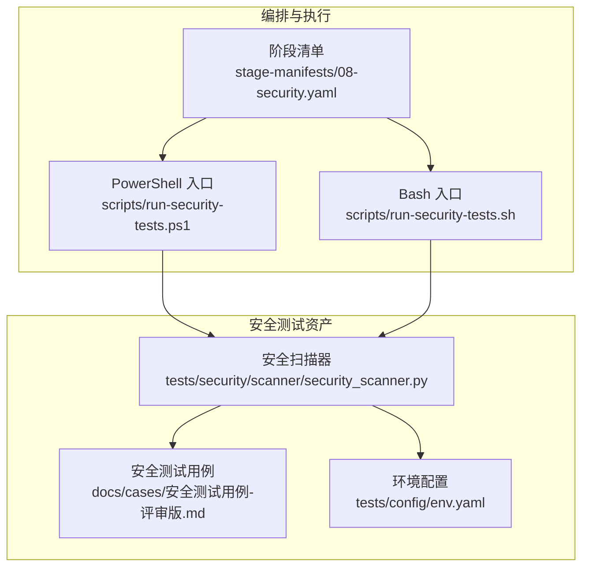
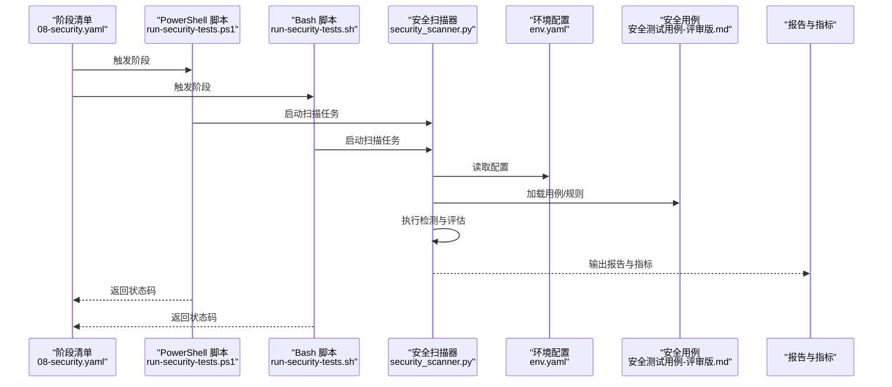
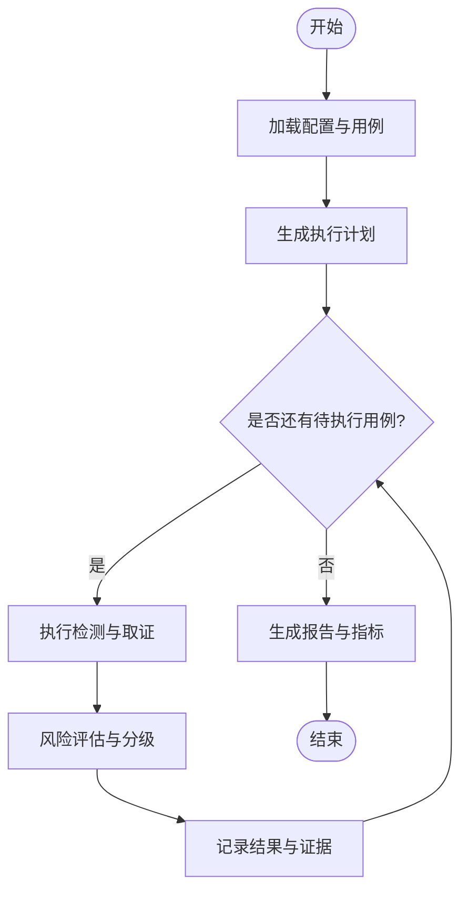
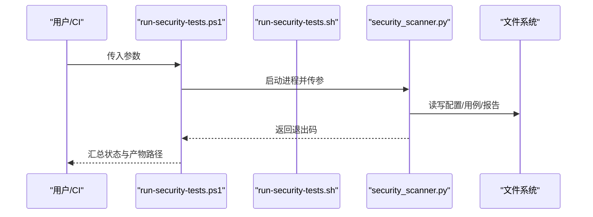
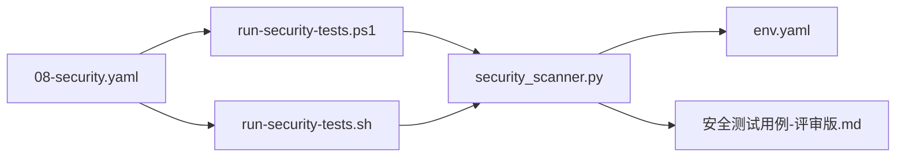

# 安全测试执行

<cite>
**本文引用的文件**   
- [security_scanner.py](file://tests/security/scanner/security_scanner.py)
- [run-security-tests.ps1](file://scripts/run-security-tests.ps1)
- [run-security-tests.sh](file://scripts/run-security-tests.sh)
- [08-security.yaml](file://stage-manifests/08-security.yaml)
- [env.yaml](file://tests/config/env.yaml)
- [安全测试用例-评审版.md](file://docs/cases/安全测试用例-评审版.md)
</cite>

## 目录
1. [简介](#简介)
2. [项目结构](#项目结构)
3. [核心组件](#核心组件)
4. [架构总览](#架构总览)
5. [详细组件分析](#详细组件分析)
6. [依赖关系分析](#依赖关系分析)
7. [性能与可扩展性](#性能与可扩展性)
8. [故障排查指南](#故障排查指南)
9. [结论](#结论)
10. [附录](#附录)

## 简介
本技术文档围绕 AutoTest Hub 的安全测试执行编排，系统化阐述自定义安全扫描器的执行流程、漏洞检测规则、安全策略配置与风险评估算法；说明环境隔离、敏感数据处理与合规性检查机制；并给出测试结果分析报告、漏洞等级分类与修复建议生成方法。同时覆盖自动化集成、定期扫描计划与威胁情报更新，提供最佳实践、漏洞修复跟踪与安全基线维护指导，以及常见安全威胁的检测方法与应急响应流程。

## 项目结构
与安全测试相关的代码与脚本主要分布在以下位置：
- 安全扫描器实现：tests/security/scanner/security_scanner.py
- 安全测试运行脚本（Windows/Unix）：scripts/run-security-tests.ps1、scripts/run-security-tests.sh
- 阶段编排清单：stage-manifests/08-security.yaml
- 环境配置：tests/config/env.yaml
- 安全测试用例：docs/cases/安全测试用例-评审版.md

图表来源
- [security_scanner.py](file://tests/security/scanner/security_scanner.py)
- [run-security-tests.ps1](file://scripts/run-security-tests.ps1)
- [run-security-tests.sh](file://scripts/run-security-tests.sh)
- [08-security.yaml](file://stage-manifests/08-security.yaml)
- [env.yaml](file://tests/config/env.yaml)
- [安全测试用例-评审版.md](file://docs/cases/安全测试用例-评审版.md)

章节来源
- [security_scanner.py](file://tests/security/scanner/security_scanner.py)
- [run-security-tests.ps1](file://scripts/run-security-tests.ps1)
- [run-security-tests.sh](file://scripts/run-security-tests.sh)
- [08-security.yaml](file://stage-manifests/08-security.yaml)
- [env.yaml](file://tests/config/env.yaml)
- [安全测试用例-评审版.md](file://docs/cases/安全测试用例-评审版.md)

## 核心组件
- 安全扫描器（Python）
  - 职责：加载配置与用例，执行扫描任务，收集结果，输出报告与指标。
  - 关键能力：规则匹配、策略控制、风险评估、结果聚合。
- 运行脚本（PowerShell/Bash）
  - 职责：统一入口，参数解析、环境准备、调用扫描器、归档产物。
- 阶段清单（YAML）
  - 职责：定义安全测试阶段的任务序列、输入输出与环境变量。
- 环境配置（env.yaml）
  - 职责：集中管理目标系统、凭据、开关与阈值等。
- 安全测试用例（Markdown）
  - 职责：描述测试场景、前置条件、步骤与预期结果，作为规则与策略的补充说明。

章节来源
- [security_scanner.py](file://tests/security/scanner/security_scanner.py)
- [run-security-tests.ps1](file://scripts/run-security-tests.ps1)
- [run-security-tests.sh](file://scripts/run-security-tests.sh)
- [08-security.yaml](file://stage-manifests/08-security.yaml)
- [env.yaml](file://tests/config/env.yaml)
- [安全测试用例-评审版.md](file://docs/cases/安全测试用例-评审版.md)

## 架构总览
下图展示了从编排到执行的端到端流程：阶段清单驱动运行脚本，脚本初始化环境后调用安全扫描器，扫描器读取配置与用例执行检测，最终产出报告与指标。

图表来源
- [08-security.yaml](file://stage-manifests/08-security.yaml)
- [run-security-tests.ps1](file://scripts/run-security-tests.ps1)
- [run-security-tests.sh](file://scripts/run-security-tests.sh)
- [security_scanner.py](file://tests/security/scanner/security_scanner.py)
- [env.yaml](file://tests/config/env.yaml)
- [安全测试用例-评审版.md](file://docs/cases/安全测试用例-评审版.md)

## 详细组件分析

### 安全扫描器（security_scanner.py）
- 设计要点
  - 模块化：将配置加载、用例解析、规则引擎、风险评估与报告生成解耦。
  - 可插拔：支持通过配置扩展检测规则与策略。
  - 幂等与可重试：对网络或外部依赖失败具备重试与回退逻辑。
- 执行流程
  - 初始化：解析命令行参数与环境变量，加载 env.yaml 与用例集。
  - 规划：根据策略与优先级生成执行计划。
  - 执行：按规则遍历目标，采集证据（请求/响应、日志片段、配置快照）。
  - 评估：基于风险模型计算严重度与置信度。
  - 输出：生成结构化报告与指标，写入制品目录。
- 关键数据结构（概念）
  - 配置对象：包含目标地址、认证信息、扫描范围、阈值与开关。
  - 用例对象：包含场景描述、前置条件、步骤、期望结果与关联规则。
  - 检测结果对象：包含漏洞标识、证据、严重度、置信度、修复建议与引用。
- 错误处理
  - 捕获异常并记录上下文，保证单条用例失败不影响整体流水线。
  - 对超时、权限不足、网络抖动进行差异化处理与告警。

图表来源
- [security_scanner.py](file://tests/security/scanner/security_scanner.py)

章节来源
- [security_scanner.py](file://tests/security/scanner/security_scanner.py)

### 运行脚本（run-security-tests.ps1 / run-security-tests.sh）
- 职责
  - 统一入口：封装平台差异，提供一致的参数与退出码。
  - 环境准备：校验依赖、设置临时工作区、清理历史产物。
  - 执行编排：调用安全扫描器，传递配置与用例路径。
  - 产物归档：压缩报告、上传至制品库（可选）。
- 参数与行为
  - 支持指定目标环境、并发度、超时与报告格式。
  - 在失败时保留现场以便回溯。

图表来源
- [run-security-tests.ps1](file://scripts/run-security-tests.ps1)
- [run-security-tests.sh](file://scripts/run-security-tests.sh)
- [security_scanner.py](file://tests/security/scanner/security_scanner.py)

章节来源
- [run-security-tests.ps1](file://scripts/run-security-tests.ps1)
- [run-security-tests.sh](file://scripts/run-security-tests.sh)

### 阶段清单（08-security.yaml）
- 作用
  - 定义安全测试阶段的输入、环境变量、命令与产物。
  - 与 CI/CD 集成，确保可重复执行与审计追踪。
- 典型字段
  - name、description、inputs、env、commands、artifacts、timeout、retry。

章节来源
- [08-security.yaml](file://stage-manifests/08-security.yaml)

### 环境配置（env.yaml）
- 内容范畴
  - 目标系统连接信息、认证凭据、扫描范围、阈值与开关。
- 安全要求
  - 禁止硬编码敏感值，优先使用密钥管理服务或 CI 加密变量注入。
  - 区分开发/测试/预生产/生产环境的差异化配置。

章节来源
- [env.yaml](file://tests/config/env.yaml)

### 安全测试用例（安全测试用例-评审版.md）
- 内容范畴
  - 覆盖身份认证、访问控制、输入验证、会话管理、数据保护、安全头、业务逻辑安全等。
- 与扫描器协作
  - 用例作为规则与策略的补充说明，帮助定位问题根因与修复建议。

章节来源
- [安全测试用例-评审版.md](file://docs/cases/安全测试用例-评审版.md)

## 依赖关系分析
- 组件耦合
  - 运行脚本仅负责编排与生命周期管理，不直接参与检测逻辑。
  - 扫描器依赖配置与用例，独立于平台脚本。
- 外部依赖
  - 目标系统接口、日志源、配置存储、制品库等。
- 潜在循环依赖
  - 当前为单向依赖，无循环。

图表来源
- [08-security.yaml](file://stage-manifests/08-security.yaml)
- [run-security-tests.ps1](file://scripts/run-security-tests.ps1)
- [run-security-tests.sh](file://scripts/run-security-tests.sh)
- [security_scanner.py](file://tests/security/scanner/security_scanner.py)
- [env.yaml](file://tests/config/env.yaml)
- [安全测试用例-评审版.md](file://docs/cases/安全测试用例-评审版.md)

章节来源
- [08-security.yaml](file://stage-manifests/08-security.yaml)
- [run-security-tests.ps1](file://scripts/run-security-tests.ps1)
- [run-security-tests.sh](file://scripts/run-security-tests.sh)
- [security_scanner.py](file://tests/security/scanner/security_scanner.py)
- [env.yaml](file://tests/config/env.yaml)
- [安全测试用例-评审版.md](file://docs/cases/安全测试用例-评审版.md)

## 性能与可扩展性
- 并发与限流
  - 通过脚本参数控制并发度，避免对目标系统造成过载。
- 增量扫描
  - 基于变更范围选择子集用例与规则，缩短反馈周期。
- 缓存与去重
  - 对静态规则与已知指纹进行缓存，减少重复计算。
- 可扩展点
  - 新增规则与策略以插件形式接入，无需修改核心流程。

[本节为通用指导，不涉及具体文件分析]

## 故障排查指南
- 常见问题
  - 凭据无效或权限不足：检查 env.yaml 与密钥注入是否正确。
  - 目标不可达或超时：确认网络连通性与防火墙策略。
  - 报告缺失或为空：检查扫描器日志与退出码，确认产物路径。
- 诊断步骤
  - 启用调试模式，查看详细日志。
  - 缩小范围，先执行最小用例集复现问题。
  - 对比不同环境配置，定位差异。
- 恢复措施
  - 清理临时目录并重试。
  - 降低并发度或增加超时。
  - 隔离受影响用例，单独排查。

章节来源
- [security_scanner.py](file://tests/security/scanner/security_scanner.py)
- [run-security-tests.ps1](file://scripts/run-security-tests.ps1)
- [run-security-tests.sh](file://scripts/run-security-tests.sh)

## 结论
本方案通过“编排脚本 + 扫描器 + 配置与用例”的分层设计，实现了安全测试的可重复、可审计与可扩展执行。结合阶段清单与 CI/CD，可实现自动化集成与持续安全治理。建议持续完善规则库与风险模型，强化敏感数据保护与合规检查，形成闭环的安全质量保障体系。

[本节为总结性内容，不涉及具体文件分析]

## 附录

### 漏洞等级分类与修复建议生成
- 等级划分（示例）
  - 致命/严重/高危/中危/低危/信息提示
- 评分维度
  - 可利用性、影响面、修复难度、业务重要性、合规要求
- 修复建议生成
  - 基于规则与用例映射，自动推荐修复步骤、参考标准与验证方式

[本节为通用指导，不涉及具体文件分析]

### 环境隔离、敏感数据处理与合规性检查
- 环境隔离
  - 使用独立命名空间/容器/虚拟机，限制网络与资源访问。
- 敏感数据处理
  - 脱敏与最小化原则，禁止明文落盘，使用受控密钥服务。
- 合规性检查
  - 对照内部安全基线与外部标准（如 OWASP），输出差距与整改项。

[本节为通用指导，不涉及具体文件分析]

### 自动化集成、定期扫描与威胁情报更新
- 自动化集成
  - 将阶段清单纳入 CI/CD 流水线，失败阻断合并。
- 定期扫描
  - 每日全量、每周深度、按需触发。
- 威胁情报更新
  - 定时拉取规则库与指纹库，灰度发布与回滚策略。

[本节为通用指导，不涉及具体文件分析]

### 最佳实践、修复跟踪与安全基线维护
- 最佳实践
  - 用例驱动、规则即代码、结果可度量、问题可追踪。
- 修复跟踪
  - 建立工单与里程碑，闭环验收与回归验证。
- 安全基线维护
  - 版本化基线，变更评审与影响评估。

[本节为通用指导，不涉及具体文件分析]

### 常见安全威胁检测方法
- 身份认证与会话
  - 弱口令、暴力破解、会话固定、越权访问
- 输入验证与注入
  - SQL/命令/模板注入、XSS、反序列化
- 数据安全
  - 明文传输、弱加密、敏感信息泄露
- 安全配置
  - 默认端口、调试开关、CORS/CSP 不当

[本节为通用指导，不涉及具体文件分析]

### 应急响应流程
- 发现与定级：快速复现与影响面评估
- 遏制与缓解：临时封禁、降级与回滚
- 根因分析与修复：补丁与配置加固
- 验证与复盘：回归测试与经验沉淀

[本节为通用指导，不涉及具体文件分析]