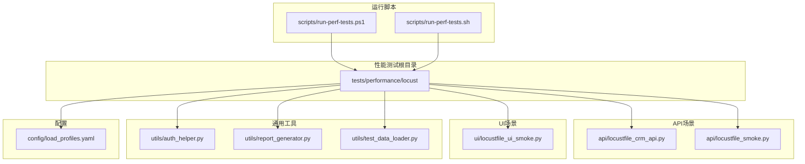
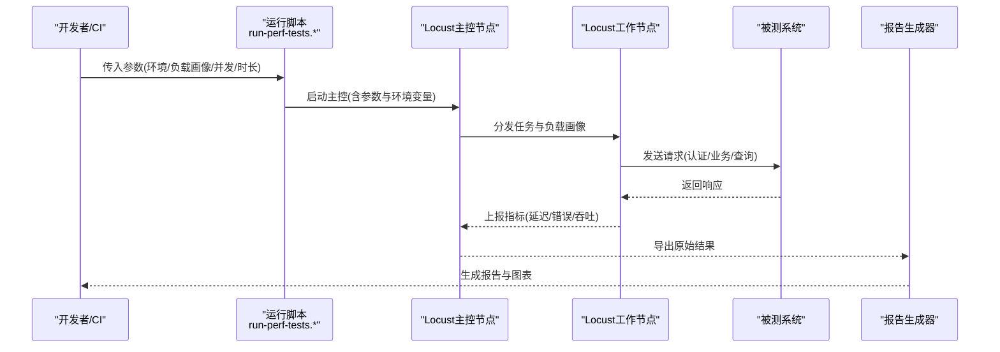
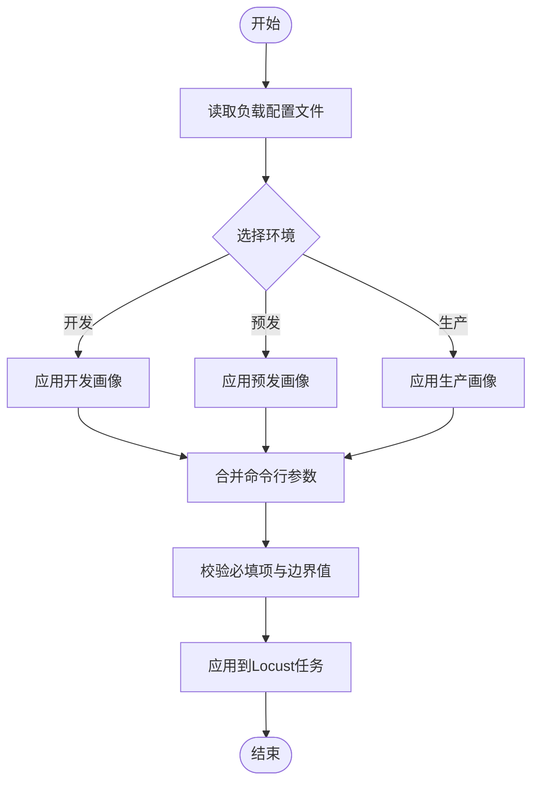
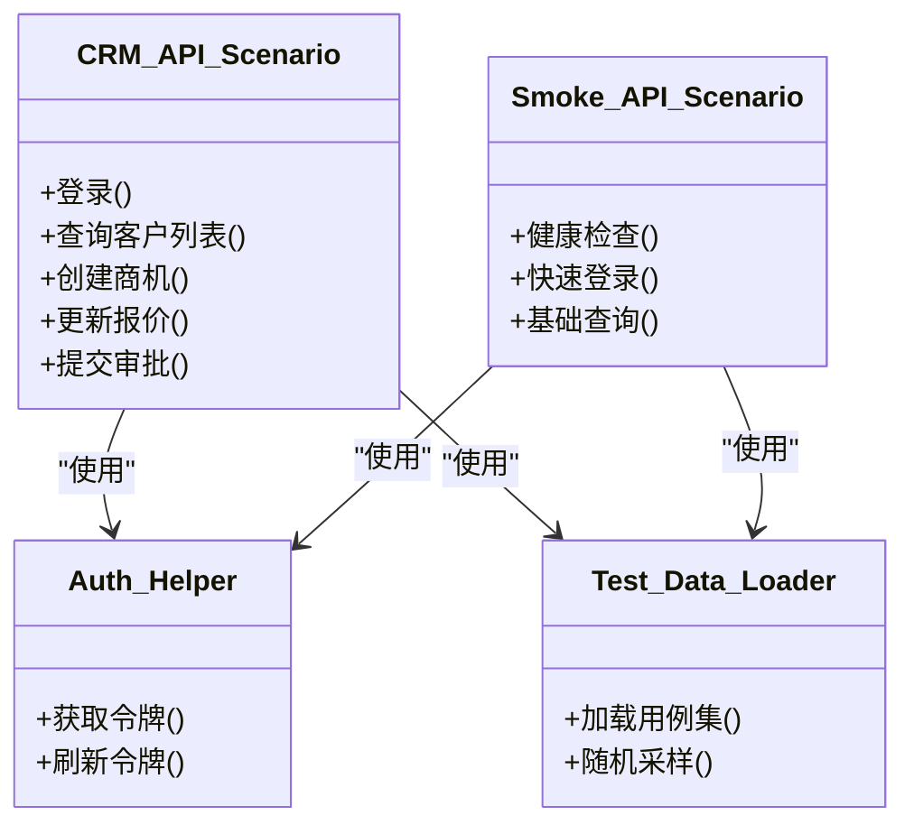
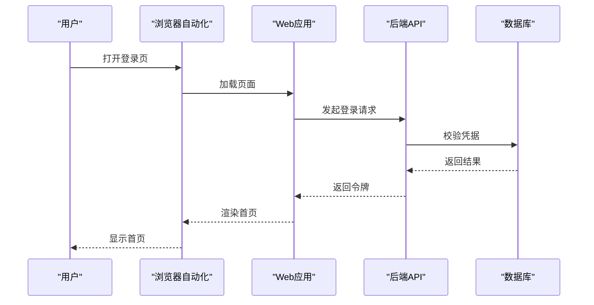
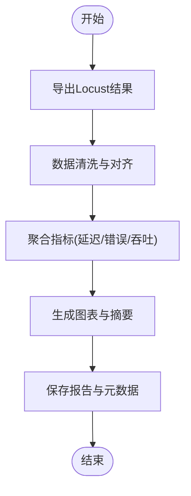
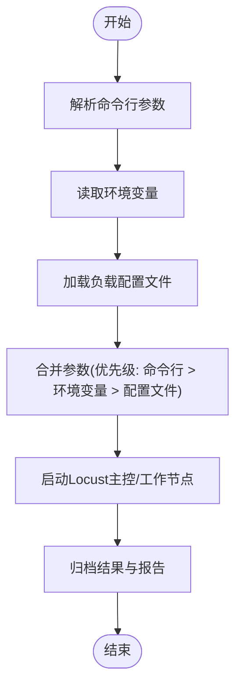
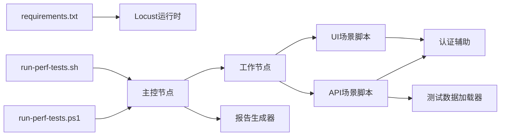

# 性能测试执行

<cite>
**本文引用的文件**   
- [scripts/run-perf-tests.ps1](file://scripts/run-perf-tests.ps1)
- [scripts/run-perf-tests.sh](file://scripts/run-perf-tests.sh)
- [tests/performance/locust/README.md](file://tests/performance/locust/README.md)
- [tests/performance/locust/requirements.txt](file://tests/performance/locust/requirements.txt)
- [tests/performance/locust/config/load_profiles.yaml](file://tests/performance/locust/config/load_profiles.yaml)
- [tests/performance/locust/api/locustfile_crm_api.py](file://tests/performance/locust/api/locustfile_crm_api.py)
- [tests/performance/locust/api/locustfile_smoke.py](file://tests/performance/locust/api/locustfile_smoke.py)
- [tests/performance/locust/ui/locustfile_ui_smoke.py](file://tests/performance/locust/ui/locustfile_ui_smoke.py)
- [tests/performance/locust/utils/auth_helper.py](file://tests/performance/locust/utils/auth_helper.py)
- [tests/performance/locust/utils/report_generator.py](file://tests/performance/locust/utils/report_generator.py)
- [tests/performance/locust/utils/test_data_loader.py](file://tests/performance/locust/utils/test_data_loader.py)
</cite>

## 目录
1. [简介](#简介)
2. [项目结构](#项目结构)
3. [核心组件](#核心组件)
4. [架构总览](#架构总览)
5. [详细组件分析](#详细组件分析)
6. [依赖关系分析](#依赖关系分析)
7. [性能考量](#性能考量)
8. [故障排查指南](#故障排查指南)
9. [结论](#结论)
10. [附录](#附录)

## 简介
本技术文档面向AutoTest Hub的性能测试执行编排，围绕基于Locust的压测流程进行系统化说明。内容涵盖负载场景定义、用户行为模拟、指标采集与报告生成、参数动态调整、分布式执行、资源监控与告警通知配置，以及最佳实践、基准方法与容量规划指导，并给出常见问题诊断与调优建议。

## 项目结构
性能测试相关代码位于 tests/performance/locust 目录，配套脚本位于 scripts 目录，用于统一触发不同环境的压测任务。

图表来源
- [tests/performance/locust/api/locustfile_crm_api.py](file://tests/performance/locust/api/locustfile_crm_api.py)
- [tests/performance/locust/api/locustfile_smoke.py](file://tests/performance/locust/api/locustfile_smoke.py)
- [tests/performance/locust/ui/locustfile_ui_smoke.py](file://tests/performance/locust/ui/locustfile_ui_smoke.py)
- [tests/performance/locust/utils/auth_helper.py](file://tests/performance/locust/utils/auth_helper.py)
- [tests/performance/locust/utils/report_generator.py](file://tests/performance/locust/utils/report_generator.py)
- [tests/performance/locust/utils/test_data_loader.py](file://tests/performance/locust/utils/test_data_loader.py)
- [tests/performance/locust/config/load_profiles.yaml](file://tests/performance/locust/config/load_profiles.yaml)
- [scripts/run-perf-tests.ps1](file://scripts/run-perf-tests.ps1)
- [scripts/run-perf-tests.sh](file://scripts/run-perf-tests.sh)

章节来源
- [tests/performance/locust/README.md](file://tests/performance/locust/README.md)
- [tests/performance/locust/requirements.txt](file://tests/performance/locust/requirements.txt)
- [scripts/run-perf-tests.ps1](file://scripts/run-perf-tests.ps1)
- [scripts/run-perf-tests.sh](file://scripts/run-perf-tests.sh)

## 核心组件
- 负载配置文件：集中管理不同负载画像（如冒烟、常规、峰值）的参数，包括并发用户数、持续时间、Ramp-up策略等，便于按环境切换与动态调整。
- API场景脚本：封装典型业务接口调用序列，模拟真实用户访问路径，聚合关键响应时间与成功率指标。
- UI场景脚本：通过浏览器自动化驱动模拟端到端交互，覆盖关键页面操作链路。
- 认证辅助：提供统一的登录与鉴权能力，避免在场景中重复实现登录逻辑。
- 测试数据加载器：从外部数据源或配置中读取用例数据，支持随机化与去重，保证压测数据的多样性与稳定性。
- 报告生成器：汇总Locust原始结果，输出结构化报告与可视化图表，便于趋势分析与瓶颈定位。
- 运行脚本：封装跨平台启动命令，统一环境变量注入、参数传递与结果归档。

章节来源
- [tests/performance/locust/config/load_profiles.yaml](file://tests/performance/locust/config/load_profiles.yaml)
- [tests/performance/locust/api/locustfile_crm_api.py](file://tests/performance/locust/api/locustfile_crm_api.py)
- [tests/performance/locust/api/locustfile_smoke.py](file://tests/performance/locust/api/locustfile_smoke.py)
- [tests/performance/locust/ui/locustfile_ui_smoke.py](file://tests/performance/locust/ui/locustfile_ui_smoke.py)
- [tests/performance/locust/utils/auth_helper.py](file://tests/performance/locust/utils/auth_helper.py)
- [tests/performance/locust/utils/test_data_loader.py](file://tests/performance/locust/utils/test_data_loader.py)
- [tests/performance/locust/utils/report_generator.py](file://tests/performance/locust/utils/report_generator.py)
- [scripts/run-perf-tests.ps1](file://scripts/run-perf-tests.ps1)
- [scripts/run-perf-tests.sh](file://scripts/run-perf-tests.sh)

## 架构总览
下图展示一次完整的性能测试执行流程：从脚本入口到Locust主控节点与各工作节点的交互，再到结果收集与报告生成。

图表来源
- [scripts/run-perf-tests.ps1](file://scripts/run-perf-tests.ps1)
- [scripts/run-perf-tests.sh](file://scripts/run-perf-tests.sh)
- [tests/performance/locust/api/locustfile_crm_api.py](file://tests/performance/locust/api/locustfile_crm_api.py)
- [tests/performance/locust/utils/report_generator.py](file://tests/performance/locust/utils/report_generator.py)

## 详细组件分析

### 负载配置文件管理
- 职责：定义多套负载画像，包含并发规模、持续时间、爬坡时间、失败阈值、目标QPS等；支持按环境选择默认画像。
- 使用方式：运行脚本在启动时读取当前环境对应的画像，并将参数传递给Locust主控与工作节点。
- 动态调整：可通过命令行参数覆盖部分字段，或在CI流水线中根据变更范围选择更严格的画像。

图表来源
- [tests/performance/locust/config/load_profiles.yaml](file://tests/performance/locust/config/load_profiles.yaml)
- [scripts/run-perf-tests.ps1](file://scripts/run-perf-tests.ps1)
- [scripts/run-perf-tests.sh](file://scripts/run-perf-tests.sh)

章节来源
- [tests/performance/locust/config/load_profiles.yaml](file://tests/performance/locust/config/load_profiles.yaml)
- [scripts/run-perf-tests.ps1](file://scripts/run-perf-tests.ps1)
- [scripts/run-perf-tests.sh](file://scripts/run-perf-tests.sh)

### API场景与用户行为模拟
- 场景组织：按业务域拆分场景脚本，例如CRM接口与冒烟场景，便于独立执行与组合。
- 行为建模：以用户会话为单位，串联登录、查询、更新、提交等操作，合理引入随机等待与异常分支，贴近真实流量。
- 指标采集：记录各接口的平均/分位延迟、错误率、吞吐量，并在必要时自定义事件上报。

图表来源
- [tests/performance/locust/api/locustfile_crm_api.py](file://tests/performance/locust/api/locustfile_crm_api.py)
- [tests/performance/locust/api/locustfile_smoke.py](file://tests/performance/locust/api/locustfile_smoke.py)
- [tests/performance/locust/utils/auth_helper.py](file://tests/performance/locust/utils/auth_helper.py)
- [tests/performance/locust/utils/test_data_loader.py](file://tests/performance/locust/utils/test_data_loader.py)

章节来源
- [tests/performance/locust/api/locustfile_crm_api.py](file://tests/performance/locust/api/locustfile_crm_api.py)
- [tests/performance/locust/api/locustfile_smoke.py](file://tests/performance/locust/api/locustfile_smoke.py)
- [tests/performance/locust/utils/auth_helper.py](file://tests/performance/locust/utils/auth_helper.py)
- [tests/performance/locust/utils/test_data_loader.py](file://tests/performance/locust/utils/test_data_loader.py)

### UI场景与端到端验证
- 场景设计：聚焦关键页面的核心路径，如登录、首页导航、表单提交等，确保在高压下仍具备可用性。
- 执行方式：通过浏览器自动化驱动发起请求，结合网络层指标与页面渲染耗时，评估前端与后端协同表现。
- 注意事项：控制截图与录屏频率，避免IO成为瓶颈；对长耗时操作采用异步或抽样策略。

图表来源
- [tests/performance/locust/ui/locustfile_ui_smoke.py](file://tests/performance/locust/ui/locustfile_ui_smoke.py)

章节来源
- [tests/performance/locust/ui/locustfile_ui_smoke.py](file://tests/performance/locust/ui/locustfile_ui_smoke.py)

### 报告生成与指标分析
- 数据采集：从Locust主控导出原始统计与事件日志。
- 处理流程：清洗异常点、计算分位延迟、聚合错误类型、绘制趋势图与热力图。
- 输出产物：结构化JSON、HTML报告、关键KPI摘要（P95/P99、错误率、吞吐曲线）。

图表来源
- [tests/performance/locust/utils/report_generator.py](file://tests/performance/locust/utils/report_generator.py)

章节来源
- [tests/performance/locust/utils/report_generator.py](file://tests/performance/locust/utils/report_generator.py)

### 运行脚本与参数传递
- 功能：封装跨平台启动命令，统一环境变量注入、负载画像选择、并发与时长设置、结果目录归档。
- 参数覆盖：支持通过命令行参数覆盖配置文件中的关键字段，便于CI按需调整。
- 集成点：可与CI流水线集成，自动触发不同阶段的压测任务并上传报告。

图表来源
- [scripts/run-perf-tests.ps1](file://scripts/run-perf-tests.ps1)
- [scripts/run-perf-tests.sh](file://scripts/run-perf-tests.sh)

章节来源
- [scripts/run-perf-tests.ps1](file://scripts/run-perf-tests.ps1)
- [scripts/run-perf-tests.sh](file://scripts/run-perf-tests.sh)

## 依赖关系分析
- 运行时依赖：Python环境与Locust库版本由 requirements.txt 管理，确保可复现的执行环境。
- 模块耦合：场景脚本依赖认证与数据加载工具；报告生成器依赖主控导出的结果文件；运行脚本负责装配与调度。
- 外部集成：被测系统为黑盒目标；可选地对接监控系统与告警通道，实现实时采集与通知。

图表来源
- [tests/performance/locust/requirements.txt](file://tests/performance/locust/requirements.txt)
- [scripts/run-perf-tests.ps1](file://scripts/run-perf-tests.ps1)
- [scripts/run-perf-tests.sh](file://scripts/run-perf-tests.sh)
- [tests/performance/locust/api/locustfile_crm_api.py](file://tests/performance/locust/api/locustfile_crm_api.py)
- [tests/performance/locust/api/locustfile_smoke.py](file://tests/performance/locust/api/locustfile_smoke.py)
- [tests/performance/locust/ui/locustfile_ui_smoke.py](file://tests/performance/locust/ui/locustfile_ui_smoke.py)
- [tests/performance/locust/utils/auth_helper.py](file://tests/performance/locust/utils/auth_helper.py)
- [tests/performance/locust/utils/test_data_loader.py](file://tests/performance/locust/utils/test_data_loader.py)
- [tests/performance/locust/utils/report_generator.py](file://tests/performance/locust/utils/report_generator.py)

章节来源
- [tests/performance/locust/requirements.txt](file://tests/performance/locust/requirements.txt)

## 性能考量
- 负载模型设计
  - 分层画像：冒烟（低并发短时长）、常规（中等并发稳定）、峰值（高并发短时冲击），逐步逼近系统容量上限。
  - 混合比例：按真实流量分布设定接口权重，避免单一热点导致误判。
- 指标基线
  - 关键KPI：P95/P99延迟、错误率、吞吐、CPU/内存/IO利用率、连接池与队列深度。
  - 基线方法：在稳定环境下多次执行取中位数作为基线，对比回归变化。
- 资源与瓶颈识别
  - 服务端：关注慢SQL、锁竞争、GC停顿、线程池耗尽、缓存命中率下降。
  - 客户端：注意连接复用、超时重试、带宽占用与本地IO。
- 分布式执行
  - 主控与工作节点分离，横向扩展工作节点提升压测能力；合理分配场景与数据分区，避免单点瓶颈。
- 监控与告警
  - 实时采集：将关键指标接入监控平台，设置阈值与趋势告警，及时阻断异常任务。
  - 结果归档：每次执行保留原始数据与报告，便于回溯与趋势分析。

[本节为通用指导，不直接分析具体文件]

## 故障排查指南
- 常见现象与定位
  - 错误率飙升：检查认证失败、上游限流、依赖服务降级、数据不一致。
  - 延迟突增：关注数据库慢查询、缓存穿透、线程池饱和、磁盘IO抖动。
  - 吞吐下降：排查连接泄漏、序列化开销、消息堆积、网络拥塞。
- 快速自检清单
  - 确认负载画像与参数是否匹配预期环境。
  - 验证认证与数据加载是否正常，是否存在幂等问题。
  - 检查主控与工作节点资源使用，避免压测机自身成为瓶颈。
  - 核对监控指标与日志，定位异常时间点与关联变更。
- 调优建议
  - 客户端：启用连接复用、合理设置超时与重试、减少不必要的数据传输。
  - 服务端：优化索引与查询、扩容缓存、调整线程池与队列大小、降低序列化成本。
  - 基础设施：升级带宽与存储IOPS、隔离压测环境、预热缓存与连接池。

章节来源
- [tests/performance/locust/utils/report_generator.py](file://tests/performance/locust/utils/report_generator.py)
- [tests/performance/locust/utils/auth_helper.py](file://tests/performance/locust/utils/auth_helper.py)
- [tests/performance/locust/utils/test_data_loader.py](file://tests/performance/locust/utils/test_data_loader.py)

## 结论
通过标准化的负载画像管理、清晰的场景划分与完善的报告体系，AutoTest Hub能够高效执行API与UI层面的性能测试，支撑持续交付与容量规划。建议在CI中常态化执行冒烟与常规画像，定期开展峰值与混沌演练，结合监控与告警形成闭环，持续提升系统韧性与用户体验。

[本节为总结性内容，不直接分析具体文件]

## 附录
- 术语
  - 负载画像：一组描述并发规模、持续时间、爬坡策略与阈值的配置集合。
  - 主控/工作节点：Locust分布式执行的主控与压力产生节点。
  - P95/P99：响应时间的第95/99百分位，衡量尾部延迟。
- 参考文件
  - 使用说明与依赖清单参见 README 与 requirements.txt。

章节来源
- [tests/performance/locust/README.md](file://tests/performance/locust/README.md)
- [tests/performance/locust/requirements.txt](file://tests/performance/locust/requirements.txt)