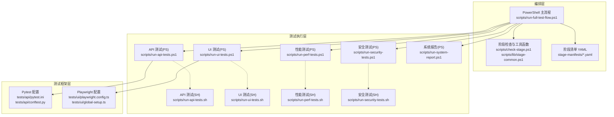
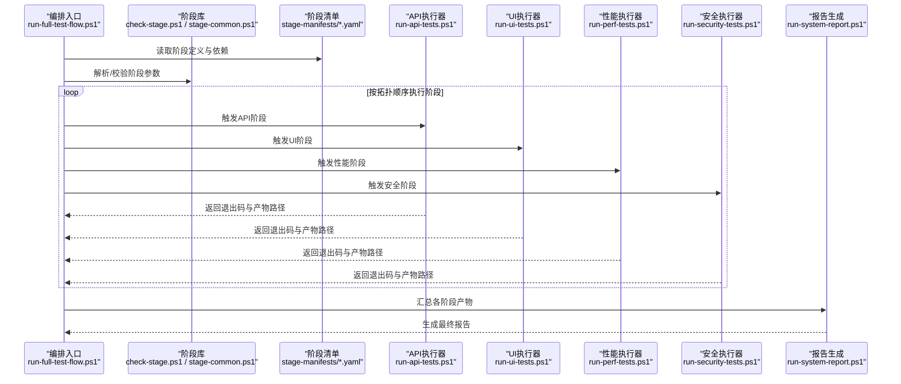
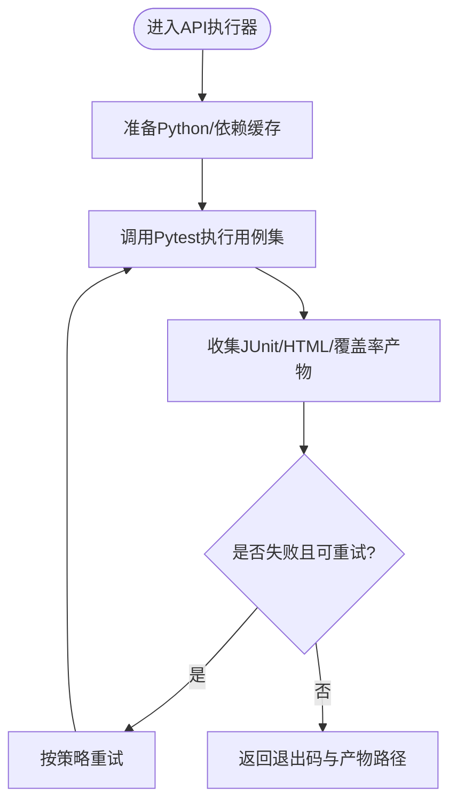
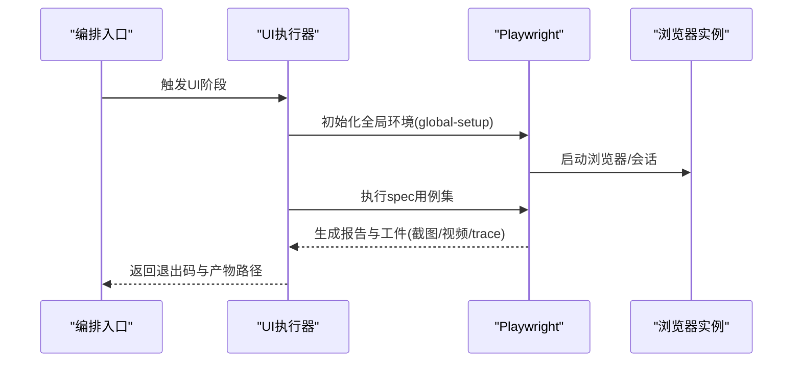
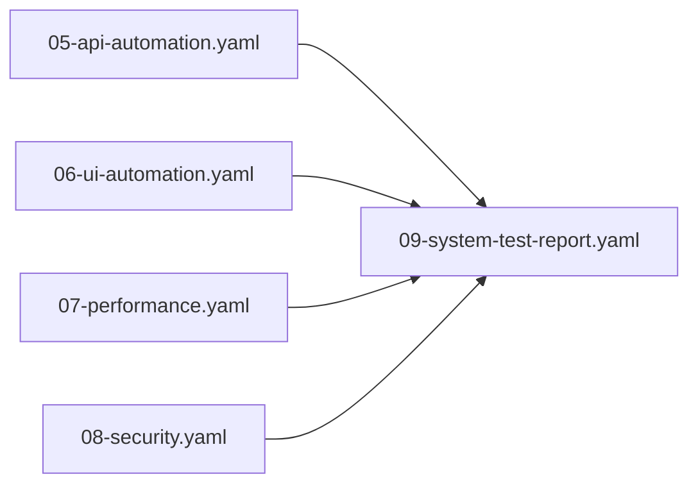

# 测试执行编排

<cite>
**本文引用的文件**   
- [run-full-test-flow.ps1](file://scripts/run-full-test-flow.ps1)
- [run-api-tests.ps1](file://scripts/run-api-tests.ps1)
- [run-ui-tests.ps1](file://scripts/run-ui-tests.ps1)
- [run-perf-tests.ps1](file://scripts/run-perf-tests.ps1)
- [run-security-tests.ps1](file://scripts/run-security-tests.ps1)
- [run-system-report.ps1](file://scripts/run-system-report.ps1)
- [check-stage.ps1](file://scripts/check-stage.ps1)
- [stage-common.ps1](file://scripts/lib/stage-common.ps1)
- [run-api-tests.sh](file://scripts/run-api-tests.sh)
- [run-ui-tests.sh](file://scripts/run-ui-tests.sh)
- [run-perf-tests.sh](file://scripts/run-perf-tests.sh)
- [run-security-tests.sh](file://scripts/run-security-tests.sh)
- [05-api-automation.yaml](file://stage-manifests/05-api-automation.yaml)
- [06-ui-automation.yaml](file://stage-manifests/06-ui-automation.yaml)
- [07-performance.yaml](file://stage-manifests/07-performance.yaml)
- [08-security.yaml](file://stage-manifests/08-security.yaml)
- [09-system-test-report.yaml](file://stage-manifests/09-system-test-report.yaml)
- [schema.yaml](file://stage-manifests/schema.yaml)
- [conftest.py](file://tests/api/conftest.py)
- [pytest.ini](file://tests/api/pytest.ini)
- [playwright.config.ts](file://tests/ui/playwright.config.ts)
- [global-setup.ts](file://tests/ui/global-setup.ts)
</cite>

## 目录
1. [简介](#简介)
2. [项目结构](#项目结构)
3. [核心组件](#核心组件)
4. [架构总览](#架构总览)
5. [详细组件分析](#详细组件分析)
6. [依赖关系分析](#依赖关系分析)
7. [性能与调度优化](#性能与调度优化)
8. [故障排查指南](#故障排查指南)
9. [结论](#结论)
10. [附录](#附录)

## 简介
本技术文档面向 AutoTest Hub 的测试执行编排系统，聚焦多语言测试脚本的统一编排机制（PowerShell 与 Shell 协作）、依赖管理、并行执行与资源调度、失败重试与超时处理、异常恢复、结果收集与汇总、状态监控与通知，以及 CI/CD 集成最佳实践与排障指南。文档以仓库中的实际脚本与清单为依据，提供可落地的工程化方案与图示说明。

## 项目结构
从仓库结构看，测试编排由以下层次构成：
- 编排入口与阶段脚本：位于 scripts 目录，包含 PowerShell 主流程与各类型测试的启动脚本，以及跨平台 Shell 对应实现。
- 阶段清单：位于 stage-manifests 目录，使用 YAML 描述各阶段的执行顺序、依赖与参数，作为统一编排的数据驱动来源。
- 测试用例与配置：位于 tests 目录，包含 API（Pytest）、UI（Playwright）、性能与安全等子域及其运行时配置。

图表来源
- [run-full-test-flow.ps1](file://scripts/run-full-test-flow.ps1)
- [check-stage.ps1](file://scripts/check-stage.ps1)
- [stage-common.ps1](file://scripts/lib/stage-common.ps1)
- [run-api-tests.ps1](file://scripts/run-api-tests.ps1)
- [run-ui-tests.ps1](file://scripts/run-ui-tests.ps1)
- [run-perf-tests.ps1](file://scripts/run-perf-tests.ps1)
- [run-security-tests.ps1](file://scripts/run-security-tests.ps1)
- [run-system-report.ps1](file://scripts/run-system-report.ps1)
- [run-api-tests.sh](file://scripts/run-api-tests.sh)
- [run-ui-tests.sh](file://scripts/run-ui-tests.sh)
- [run-perf-tests.sh](file://scripts/run-perf-tests.sh)
- [run-security-tests.sh](file://scripts/run-security-tests.sh)
- [05-api-automation.yaml](file://stage-manifests/05-api-automation.yaml)
- [06-ui-automation.yaml](file://stage-manifests/06-ui-automation.yaml)
- [07-performance.yaml](file://stage-manifests/07-performance.yaml)
- [08-security.yaml](file://stage-manifests/08-security.yaml)
- [09-system-test-report.yaml](file://stage-manifests/09-system-test-report.yaml)
- [pytest.ini](file://tests/api/pytest.ini)
- [conftest.py](file://tests/api/conftest.py)
- [playwright.config.ts](file://tests/ui/playwright.config.ts)
- [global-setup.ts](file://tests/ui/global-setup.ts)

章节来源
- [run-full-test-flow.ps1](file://scripts/run-full-test-flow.ps1)
- [check-stage.ps1](file://scripts/check-stage.ps1)
- [stage-common.ps1](file://scripts/lib/stage-common.ps1)
- [05-api-automation.yaml](file://stage-manifests/05-api-automation.yaml)
- [06-ui-automation.yaml](file://stage-manifests/06-ui-automation.yaml)
- [07-performance.yaml](file://stage-manifests/07-performance.yaml)
- [08-security.yaml](file://stage-manifests/08-security.yaml)
- [09-system-test-report.yaml](file://stage-manifests/09-system-test-report.yaml)
- [pytest.ini](file://tests/api/pytest.ini)
- [conftest.py](file://tests/api/conftest.py)
- [playwright.config.ts](file://tests/ui/playwright.config.ts)
- [global-setup.ts](file://tests/ui/global-setup.ts)

## 核心组件
- 统一编排入口（PowerShell）
  - 负责解析阶段清单、按依赖拓扑调度阶段、维护全局状态与产物路径、聚合最终报告。
  - 通过阶段检查脚本与公共库进行环境校验、日志与错误码标准化。
- 阶段清单（YAML）
  - 声明每个阶段的名称、前置依赖、执行命令（支持 PS 与 SH）、可选参数、是否允许失败、产物输出位置等。
  - 提供 schema 约束，确保清单一致性。
- 类型化执行器（PS/SH）
  - 针对 API、UI、性能、安全四类测试分别封装执行器，屏蔽底层框架差异，对外暴露统一接口。
  - Shell 版本用于非 Windows 环境或容器内执行。
- 测试框架适配
  - API 测试基于 Pytest，通过 conftest 与 pytest.ini 注入夹具与运行参数。
  - UI 测试基于 Playwright，通过 playwright.config.ts 与 global-setup.ts 管理浏览器生命周期与全局初始化。

章节来源
- [run-full-test-flow.ps1](file://scripts/run-full-test-flow.ps1)
- [check-stage.ps1](file://scripts/check-stage.ps1)
- [stage-common.ps1](file://scripts/lib/stage-common.ps1)
- [05-api-automation.yaml](file://stage-manifests/05-api-automation.yaml)
- [06-ui-automation.yaml](file://stage-manifests/06-ui-automation.yaml)
- [07-performance.yaml](file://stage-manifests/07-performance.yaml)
- [08-security.yaml](file://stage-manifests/08-security.yaml)
- [09-system-test-report.yaml](file://stage-manifests/09-system-test-report.yaml)
- [pytest.ini](file://tests/api/pytest.ini)
- [conftest.py](file://tests/api/conftest.py)
- [playwright.config.ts](file://tests/ui/playwright.config.ts)
- [global-setup.ts](file://tests/ui/global-setup.ts)

## 架构总览
整体采用“数据驱动 + 分层编排”的架构：YAML 清单定义阶段与依赖，PowerShell 主流程解析并调度；具体测试类型由专用执行器完成，最终由报告阶段汇总产出。

图表来源
- [run-full-test-flow.ps1](file://scripts/run-full-test-flow.ps1)
- [check-stage.ps1](file://scripts/check-stage.ps1)
- [stage-common.ps1](file://scripts/lib/stage-common.ps1)
- [run-api-tests.ps1](file://scripts/run-api-tests.ps1)
- [run-ui-tests.ps1](file://scripts/run-ui-tests.ps1)
- [run-perf-tests.ps1](file://scripts/run-perf-tests.ps1)
- [run-security-tests.ps1](file://scripts/run-security-tests.ps1)
- [run-system-report.ps1](file://scripts/run-system-report.ps1)
- [05-api-automation.yaml](file://stage-manifests/05-api-automation.yaml)
- [06-ui-automation.yaml](file://stage-manifests/06-ui-automation.yaml)
- [07-performance.yaml](file://stage-manifests/07-performance.yaml)
- [08-security.yaml](file://stage-manifests/08-security.yaml)
- [09-system-test-report.yaml](file://stage-manifests/09-system-test-report.yaml)

## 详细组件分析

### 统一编排入口（PowerShell）
- 职责
  - 加载并校验阶段清单（schema 校验）。
  - 构建依赖图，计算执行拓扑。
  - 维护全局上下文（工作目录、产物目录、环境变量、重试策略、超时设置）。
  - 调用各类型执行器，捕获退出码与标准输出/错误，记录阶段状态。
  - 在阶段完成后触发报告生成。
- 关键设计点
  - 幂等性：同一阶段多次执行不会破坏已有产物。
  - 可中断：支持外部信号中断后清理临时资源。
  - 可观测：结构化日志与阶段级指标采集。

章节来源
- [run-full-test-flow.ps1](file://scripts/run-full-test-flow.ps1)
- [check-stage.ps1](file://scripts/check-stage.ps1)
- [stage-common.ps1](file://scripts/lib/stage-common.ps1)

### 阶段清单与 Schema
- 阶段清单字段建议
  - name：阶段标识
  - depends_on：前置阶段列表
  - command：执行命令（支持 PS/SH）
  - args：参数映射
  - timeout_seconds：阶段超时
  - retry_count：失败重试次数
  - artifacts：产物路径集合
  - allow_failure：是否允许失败
- Schema 校验
  - 通过 schema.yaml 约束字段类型与必填项，避免配置漂移。

章节来源
- [05-api-automation.yaml](file://stage-manifests/05-api-automation.yaml)
- [06-ui-automation.yaml](file://stage-manifests/06-ui-automation.yaml)
- [07-performance.yaml](file://stage-manifests/07-performance.yaml)
- [08-security.yaml](file://stage-manifests/08-security.yaml)
- [09-system-test-report.yaml](file://stage-manifests/09-system-test-report.yaml)
- [schema.yaml](file://stage-manifests/schema.yaml)

### API 测试执行器（PS/SH）
- 职责
  - 准备 Python 环境与依赖。
  - 调用 Pytest 执行 API 用例集，合并结果与覆盖率。
  - 输出 JUnit XML、HTML 报告与覆盖率工件。
- 并行与隔离
  - 通过 Pytest 插件或进程隔离实现用例级并行。
  - 每个阶段独立虚拟环境或缓存目录，避免冲突。
- 失败重试与超时
  - 外层包装重试逻辑，对网络抖动类错误自动重试。
  - 为单用例或整批设置超时阈值，防止卡死。

图表来源
- [run-api-tests.ps1](file://scripts/run-api-tests.ps1)
- [run-api-tests.sh](file://scripts/run-api-tests.sh)
- [pytest.ini](file://tests/api/pytest.ini)
- [conftest.py](file://tests/api/conftest.py)

章节来源
- [run-api-tests.ps1](file://scripts/run-api-tests.ps1)
- [run-api-tests.sh](file://scripts/run-api-tests.sh)
- [pytest.ini](file://tests/api/pytest.ini)
- [conftest.py](file://tests/api/conftest.py)

### UI 测试执行器（PS/SH）
- 职责
  - 安装/复用浏览器二进制与驱动。
  - 通过 Playwright 执行 UI 用例，截图/录屏/Trace 归档。
  - 输出 Playwright 报告与调试工件。
- 稳定性保障
  - 全局初始化（登录态、基础数据）在 global-setup 中完成。
  - 失败自动截图与 Trace 收集，便于定位。
- 并行与资源
  - 按浏览器实例或 worker 并行执行，限制并发度以避免资源争用。

图表来源
- [run-ui-tests.ps1](file://scripts/run-ui-tests.ps1)
- [run-ui-tests.sh](file://scripts/run-ui-tests.sh)
- [playwright.config.ts](file://tests/ui/playwright.config.ts)
- [global-setup.ts](file://tests/ui/global-setup.ts)

章节来源
- [run-ui-tests.ps1](file://scripts/run-ui-tests.ps1)
- [run-ui-tests.sh](file://scripts/run-ui-tests.sh)
- [playwright.config.ts](file://tests/ui/playwright.config.ts)
- [global-setup.ts](file://tests/ui/global-setup.ts)

### 性能与安全测试执行器（PS/SH）
- 性能测试
  - 基于 Locust 或其他压测工具，加载负载模型与场景，输出性能指标与报告。
  - 支持分阶段压测（冒烟、基准、容量），按配置文件切换。
- 安全测试
  - 调用扫描器或规则引擎，输出漏洞清单与修复建议。
  - 将结果与制品归档，供后续流水线展示。

章节来源
- [run-perf-tests.ps1](file://scripts/run-perf-tests.ps1)
- [run-perf-tests.sh](file://scripts/run-perf-tests.sh)
- [run-security-tests.ps1](file://scripts/run-security-tests.ps1)
- [run-security-tests.sh](file://scripts/run-security-tests.sh)

### 系统报告与汇总（PS）
- 职责
  - 聚合各阶段产物（JUnit、HTML、覆盖率、截图、Trace、性能与安全报告）。
  - 生成统一的系统级报告与质量门禁判定。
  - 输出执行摘要（通过率、耗时、失败分布、回归趋势）。
- 通知与持久化
  - 将报告上传到制品库或存储桶，推送通知至 IM/邮件。

章节来源
- [run-system-report.ps1](file://scripts/run-system-report.ps1)
- [09-system-test-report.yaml](file://stage-manifests/09-system-test-report.yaml)

## 依赖关系分析
- 阶段间依赖
  - 通过 YAML 声明依赖关系，编排器构建有向无环图（DAG），按拓扑序执行。
- 工具与环境依赖
  - Python/Pytest、Node/Playwright、Locust、安全扫描器等，建议在阶段内按需安装或复用缓存。
- 产物依赖
  - 报告阶段依赖所有上游阶段产物，若某阶段被标记为允许失败，需明确降级策略。

图表来源
- [05-api-automation.yaml](file://stage-manifests/05-api-automation.yaml)
- [06-ui-automation.yaml](file://stage-manifests/06-ui-automation.yaml)
- [07-performance.yaml](file://stage-manifests/07-performance.yaml)
- [08-security.yaml](file://stage-manifests/08-security.yaml)
- [09-system-test-report.yaml](file://stage-manifests/09-system-test-report.yaml)

章节来源
- [05-api-automation.yaml](file://stage-manifests/05-api-automation.yaml)
- [06-ui-automation.yaml](file://stage-manifests/06-ui-automation.yaml)
- [07-performance.yaml](file://stage-manifests/07-performance.yaml)
- [08-security.yaml](file://stage-manifests/08-security.yaml)
- [09-system-test-report.yaml](file://stage-manifests/09-system-test-report.yaml)

## 性能与调度优化
- 增量执行
  - 基于变更检测（如 Git diff）仅执行受影响阶段或用例集，减少无效执行。
- 缓存利用
  - 依赖包缓存（pip、npm、Playwright 浏览器）、测试数据缓存、中间产物缓存。
- 并行与负载均衡
  - 用例级并行（Pytest workers、Playwright workers），控制并发度避免资源争用。
  - 多节点分发：将不同阶段或用例集分配到不同执行器节点。
- 超时与退避
  - 阶段级与用例级超时，指数退避重试，避免雪崩。
- 资源隔离
  - 容器化执行器，按阶段分配 CPU/内存配额，避免相互干扰。

[本节为通用指导，不直接分析具体文件]

## 故障排查指南
- 常见问题定位
  - 环境缺失：检查阶段前置条件与依赖安装日志。
  - 用例不稳定：查看截图/Trace/视频，结合失败堆栈定位。
  - 资源不足：降低并发度或扩容执行节点。
  - 网络抖动：启用重试与退避策略，必要时切换到备用端点。
- 快速诊断步骤
  - 查看阶段退出码与结构化日志。
  - 下载并分析产物（JUnit XML、HTML 报告、Trace）。
  - 复现最小用例集，逐步缩小范围。
- 恢复策略
  - 失败重试（幂等前提下）。
  - 跳过非关键阶段，优先保障核心链路。
  - 回滚到上一稳定版本，先恢复服务再排查问题。

章节来源
- [check-stage.ps1](file://scripts/check-stage.ps1)
- [stage-common.ps1](file://scripts/lib/stage-common.ps1)
- [run-system-report.ps1](file://scripts/run-system-report.ps1)

## 结论
AutoTest Hub 的测试执行编排系统通过 YAML 驱动的 DAG 调度、PowerShell 主流程与多语言执行器的解耦设计，实现了跨类型测试的统一编排与高效执行。借助完善的产物收集、重试与超时策略、以及可扩展的报告与通知机制，系统在稳定性、可观测性与可维护性方面具备良好工程化能力。配合增量执行、缓存与并行优化，可在保证质量的同时显著提升交付效率。

[本节为总结性内容，不直接分析具体文件]

## 附录
- CI/CD 集成建议
  - 将阶段清单与执行脚本纳入版本控制，CI 拉取后直接执行主流程。
  - 使用矩阵策略并行执行多个阶段，缩短端到端时间。
  - 将产物与报告持久化，建立质量门禁与可视化看板。
- 最佳实践
  - 严格遵循幂等与可重复执行原则。
  - 为每个阶段定义明确的输入/输出契约。
  - 保持执行器轻量，复杂逻辑下沉到测试框架与工具链。

[本节为通用指导，不直接分析具体文件]