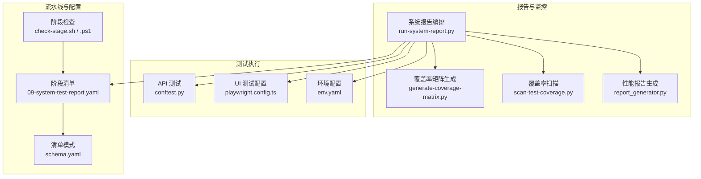
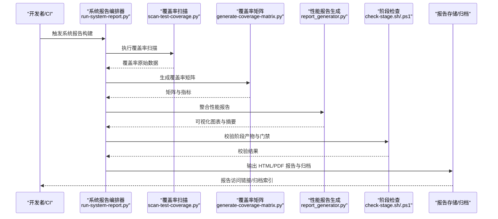
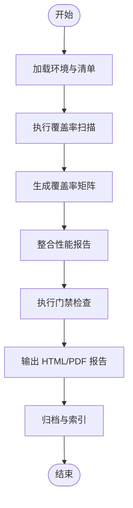
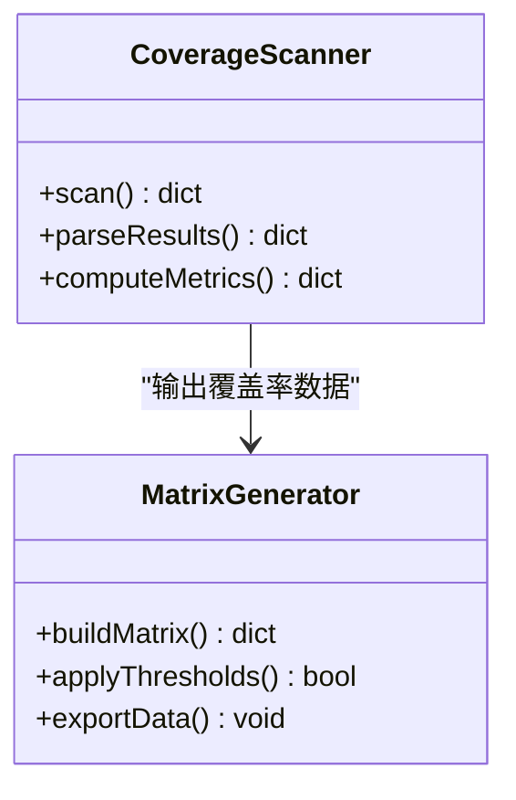
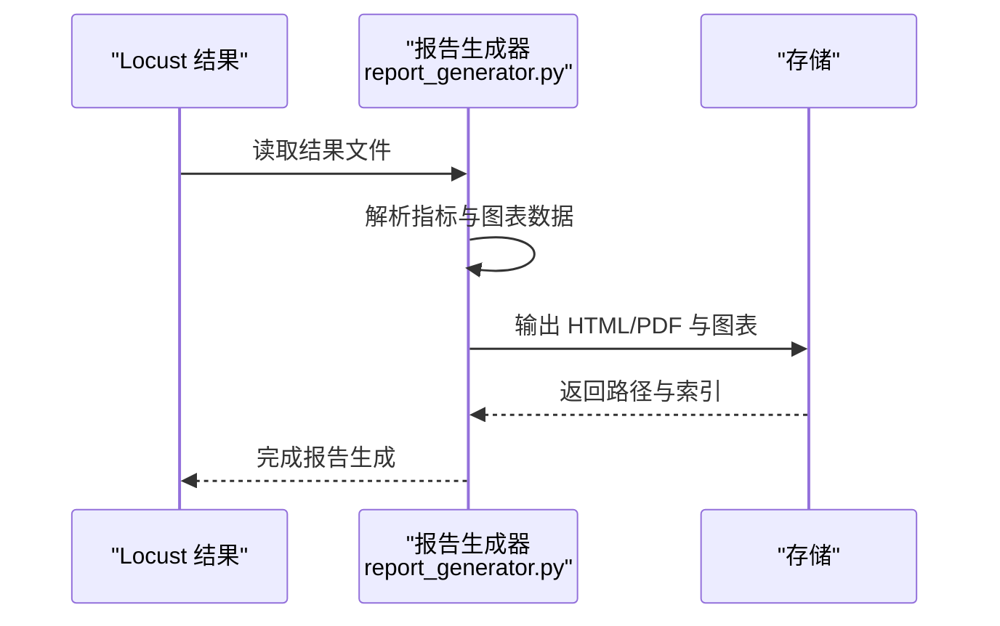
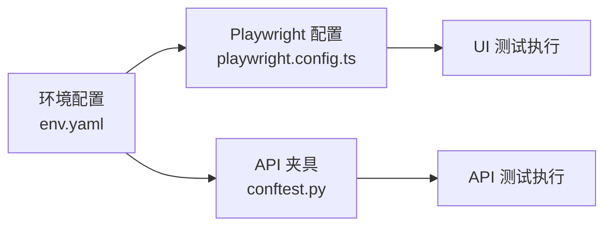
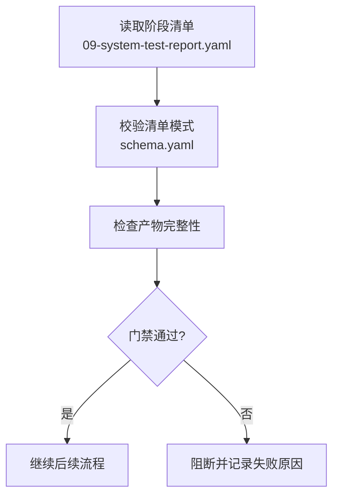
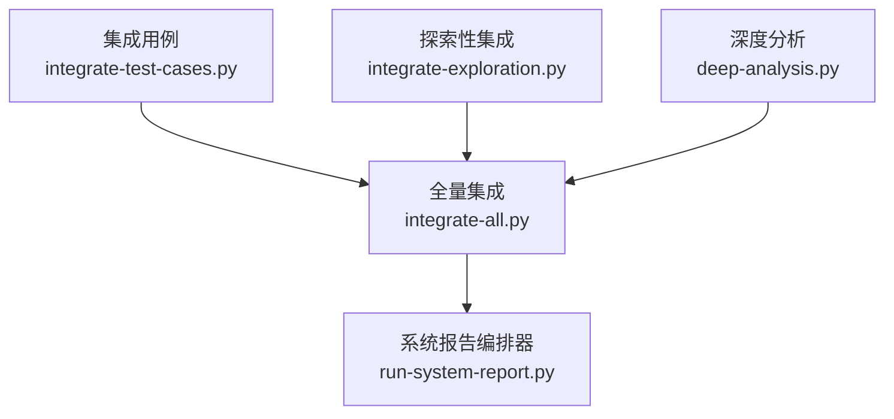
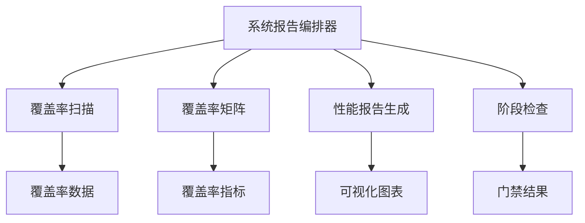

# 测试报告和监控

<cite>
**本文引用的文件**   
- [scripts/run-system-report.py](file://scripts/run-system-report.py)
- [scripts/run-system-report.ps1](file://scripts/run-system-report.ps1)
- [scripts/generate-coverage-matrix.py](file://scripts/generate-coverage-matrix.py)
- [scripts/scan-test-coverage.py](file://scripts/scan-test-coverage.py)
- [scripts/integrate-all.py](file://scripts/integrate-all.py)
- [scripts/integrate-test-cases.py](file://scripts/integrate-test-cases.py)
- [scripts/integrate-exploration.py](file://scripts/integrate-exploration.py)
- [scripts/deep-analysis.py](file://scripts/deep-analysis.py)
- [tests/performance/locust/utils/report_generator.py](file://tests/performance/locust/utils/report_generator.py)
- [tests/ui/playwright.config.ts](file://tests/ui/playwright.config.ts)
- [tests/api/conftest.py](file://tests/api/conftest.py)
- [tests/config/env.yaml](file://tests/config/env.yaml)
- [stage-manifests/09-system-test-report.yaml](file://stage-manifests/09-system-test-report.yaml)
- [stage-manifests/schema.yaml](file://stage-manifests/schema.yaml)
- [scripts/check-stage.sh](file://scripts/check-stage.sh)
- [scripts/check-stage.ps1](file://scripts/check-stage.ps1)
- [scripts/set-test-env.ps1](file://scripts/set-test-env.ps1)
</cite>

## 目录
1. [简介](#简介)
2. [项目结构](#项目结构)
3. [核心组件](#核心组件)
4. [架构总览](#架构总览)
5. [详细组件分析](#详细组件分析)
6. [依赖关系分析](#依赖关系分析)
7. [性能考虑](#性能考虑)
8. [故障排查指南](#故障排查指南)
9. [结论](#结论)
10. [附录](#附录)

## 简介
本技术文档围绕 AutoTest Hub 的测试报告与监控系统，系统性阐述多维度测试报告的生成机制（HTML、PDF 摘要、可视化图表）、测试覆盖率分析（代码覆盖率、用例覆盖率、质量门禁）、测试趋势分析与历史数据对比、自定义报告模板开发与集成、实时监控与告警通知配置及与其他监控系统的集成策略，以及报告存储、归档与访问控制的实现方案。文档面向不同技术背景的读者，提供从概览到代码级细节的分层说明，并辅以架构图、流程图和时序图帮助理解。

## 项目结构
AutoTest Hub 将测试执行、报告生成、覆盖率统计、阶段化流水线与配置管理解耦为多个脚本与配置文件：
- 系统报告编排与聚合：通过 Python 脚本统一收集各阶段产物，生成汇总报告。
- 覆盖率扫描与矩阵：自动化扫描测试与源码，产出覆盖率矩阵与指标。
- 性能报告生成：Locust 结果解析与可视化报告输出。
- UI 测试配置：Playwright 配置驱动截图、追踪与报告路径。
- 阶段化清单与校验：YAML 清单定义阶段产物与校验规则，Shell/PowerShell 脚本负责执行与检查。
- 环境配置：集中式环境变量与运行参数管理。

**图示来源** 
- [scripts/run-system-report.py](file://scripts/run-system-report.py)
- [scripts/generate-coverage-matrix.py](file://scripts/generate-coverage-matrix.py)
- [scripts/scan-test-coverage.py](file://scripts/scan-test-coverage.py)
- [tests/performance/locust/utils/report_generator.py](file://tests/performance/locust/utils/report_generator.py)
- [tests/ui/playwright.config.ts](file://tests/ui/playwright.config.ts)
- [tests/api/conftest.py](file://tests/api/conftest.py)
- [tests/config/env.yaml](file://tests/config/env.yaml)
- [stage-manifests/09-system-test-report.yaml](file://stage-manifests/09-system-test-report.yaml)
- [stage-manifests/schema.yaml](file://stage-manifests/schema.yaml)
- [scripts/check-stage.sh](file://scripts/check-stage.sh)
- [scripts/check-stage.ps1](file://scripts/check-stage.ps1)

**章节来源**
- [scripts/run-system-report.py](file://scripts/run-system-report.py)
- [scripts/generate-coverage-matrix.py](file://scripts/generate-coverage-matrix.py)
- [scripts/scan-test-coverage.py](file://scripts/scan-test-coverage.py)
- [tests/performance/locust/utils/report_generator.py](file://tests/performance/locust/utils/report_generator.py)
- [tests/ui/playwright.config.ts](file://tests/ui/playwright.config.ts)
- [tests/api/conftest.py](file://tests/api/conftest.py)
- [tests/config/env.yaml](file://tests/config/env.yaml)
- [stage-manifests/09-system-test-report.yaml](file://stage-manifests/09-system-test-report.yaml)
- [stage-manifests/schema.yaml](file://stage-manifests/schema.yaml)
- [scripts/check-stage.sh](file://scripts/check-stage.sh)
- [scripts/check-stage.ps1](file://scripts/check-stage.ps1)

## 核心组件
- 系统报告编排器：统一调度覆盖率扫描、矩阵生成、性能报告整合与 HTML/PDF 汇总输出，支持多阶段产物聚合与质量门禁判定。
- 覆盖率扫描与矩阵：基于测试与源码扫描，计算代码覆盖率与用例覆盖率，输出结构化矩阵与阈值门禁。
- 性能报告生成：解析 Locust 执行结果，生成可视化图表与摘要，支持导出 PDF 与 HTML。
- 测试配置与环境：集中管理运行环境、测试套件与报告输出路径，确保一致性与可重复性。
- 阶段化清单与校验：以 YAML 描述阶段产物与校验规则，配合 Shell/PowerShell 脚本进行一致性检查与门禁控制。

**章节来源**
- [scripts/run-system-report.py](file://scripts/run-system-report.py)
- [scripts/generate-coverage-matrix.py](file://scripts/generate-coverage-matrix.py)
- [scripts/scan-test-coverage.py](file://scripts/scan-test-coverage.py)
- [tests/performance/locust/utils/report_generator.py](file://tests/performance/locust/utils/report_generator.py)
- [tests/ui/playwright.config.ts](file://tests/ui/playwright.config.ts)
- [tests/api/conftest.py](file://tests/api/conftest.py)
- [tests/config/env.yaml](file://tests/config/env.yaml)
- [stage-manifests/09-system-test-report.yaml](file://stage-manifests/09-system-test-report.yaml)
- [stage-manifests/schema.yaml](file://stage-manifests/schema.yaml)

## 架构总览
系统报告编排器作为中枢，协调覆盖率扫描、矩阵生成、性能报告整合与最终报告输出。阶段清单定义产物结构与校验规则，环境配置提供运行时参数，Shell/PowerShell 脚本负责阶段检查与门禁控制。

**图示来源** 
- [scripts/run-system-report.py](file://scripts/run-system-report.py)
- [scripts/scan-test-coverage.py](file://scripts/scan-test-coverage.py)
- [scripts/generate-coverage-matrix.py](file://scripts/generate-coverage-matrix.py)
- [tests/performance/locust/utils/report_generator.py](file://tests/performance/locust/utils/report_generator.py)
- [scripts/check-stage.sh](file://scripts/check-stage.sh)
- [scripts/check-stage.ps1](file://scripts/check-stage.ps1)

## 详细组件分析

### 系统报告编排器（run-system-report）
- 职责：统一调度覆盖率扫描、矩阵生成、性能报告整合，输出 HTML 与 PDF 汇总报告；根据阶段清单与门禁规则判定质量状态。
- 输入：覆盖率原始数据、性能结果、阶段清单、环境配置。
- 输出：HTML 报告、PDF 摘要、可视化图表、归档索引。
- 关键流程：
  - 读取环境与清单，初始化报告上下文。
  - 调用覆盖率扫描与矩阵生成，合并指标。
  - 整合性能报告，生成图表与摘要。
  - 执行阶段检查与门禁判定，记录质量状态。
  - 输出报告至指定存储，生成访问索引。

**图示来源** 
- [scripts/run-system-report.py](file://scripts/run-system-report.py)
- [stage-manifests/09-system-test-report.yaml](file://stage-manifests/09-system-test-report.yaml)
- [stage-manifests/schema.yaml](file://stage-manifests/schema.yaml)

**章节来源**
- [scripts/run-system-report.py](file://scripts/run-system-report.py)
- [stage-manifests/09-system-test-report.yaml](file://stage-manifests/09-system-test-report.yaml)
- [stage-manifests/schema.yaml](file://stage-manifests/schema.yaml)

### 覆盖率扫描与矩阵（scan-test-coverage、generate-coverage-matrix）
- 覆盖率扫描：扫描测试与源码，计算代码覆盖率与用例覆盖率，输出结构化数据。
- 矩阵生成：基于扫描结果生成覆盖率矩阵，包含模块、文件、行覆盖等维度，支持阈值门禁。
- 质量门禁：依据清单配置的阈值判定是否通过，失败时阻断后续流程或标记风险。

**图示来源** 
- [scripts/scan-test-coverage.py](file://scripts/scan-test-coverage.py)
- [scripts/generate-coverage-matrix.py](file://scripts/generate-coverage-matrix.py)

**章节来源**
- [scripts/scan-test-coverage.py](file://scripts/scan-test-coverage.py)
- [scripts/generate-coverage-matrix.py](file://scripts/generate-coverage-matrix.py)

### 性能报告生成（report_generator）
- 职责：解析 Locust 执行结果，生成可视化图表与摘要，支持导出 HTML 与 PDF。
- 输入：Locust 结果文件、配置参数。
- 输出：HTML 报告、PDF 摘要、图表资源。
- 关键流程：
  - 读取结果文件，解析请求、响应、错误等指标。
  - 生成时间序列与分布图表。
  - 汇总摘要与关键指标。
  - 输出报告与资源文件。

**图示来源** 
- [tests/performance/locust/utils/report_generator.py](file://tests/performance/locust/utils/report_generator.py)

**章节来源**
- [tests/performance/locust/utils/report_generator.py](file://tests/performance/locust/utils/report_generator.py)

### 测试配置与环境（playwright.config.ts、conftest.py、env.yaml）
- Playwright 配置：定义 UI 测试的执行参数、截图、追踪与报告路径。
- API 测试夹具：集中管理测试客户端、认证与数据准备。
- 环境配置：统一管理运行环境、目标地址、凭据与报告输出路径。

**图示来源** 
- [tests/ui/playwright.config.ts](file://tests/ui/playwright.config.ts)
- [tests/api/conftest.py](file://tests/api/conftest.py)
- [tests/config/env.yaml](file://tests/config/env.yaml)

**章节来源**
- [tests/ui/playwright.config.ts](file://tests/ui/playwright.config.ts)
- [tests/api/conftest.py](file://tests/api/conftest.py)
- [tests/config/env.yaml](file://tests/config/env.yaml)

### 阶段化清单与校验（09-system-test-report.yaml、schema.yaml、check-stage）
- 阶段清单：定义系统测试报告阶段的产物结构、校验规则与门禁阈值。
- 清单模式：约束清单字段类型与必填项，保证一致性。
- 阶段检查：Shell/PowerShell 脚本执行清单校验与门禁判定，失败则阻断流程。

**图示来源** 
- [stage-manifests/09-system-test-report.yaml](file://stage-manifests/09-system-test-report.yaml)
- [stage-manifests/schema.yaml](file://stage-manifests/schema.yaml)
- [scripts/check-stage.sh](file://scripts/check-stage.sh)
- [scripts/check-stage.ps1](file://scripts/check-stage.ps1)

**章节来源**
- [stage-manifests/09-system-test-report.yaml](file://stage-manifests/09-system-test-report.yaml)
- [stage-manifests/schema.yaml](file://stage-manifests/schema.yaml)
- [scripts/check-stage.sh](file://scripts/check-stage.sh)
- [scripts/check-stage.ps1](file://scripts/check-stage.ps1)

### 集成脚本（integrate-all、integrate-test-cases、integrate-exploration、deep-analysis）
- 集成脚本：统一聚合测试用例、探索性测试与深度分析结果，支撑系统报告的数据源。
- 职责：读取各阶段产物，标准化数据结构，输出供报告编排器使用的中间格式。

**图示来源** 
- [scripts/integrate-test-cases.py](file://scripts/integrate-test-cases.py)
- [scripts/integrate-exploration.py](file://scripts/integrate-exploration.py)
- [scripts/integrate-all.py](file://scripts/integrate-all.py)
- [scripts/deep-analysis.py](file://scripts/deep-analysis.py)
- [scripts/run-system-report.py](file://scripts/run-system-report.py)

**章节来源**
- [scripts/integrate-test-cases.py](file://scripts/integrate-test-cases.py)
- [scripts/integrate-exploration.py](file://scripts/integrate-exploration.py)
- [scripts/integrate-all.py](file://scripts/integrate-all.py)
- [scripts/deep-analysis.py](file://scripts/deep-analysis.py)
- [scripts/run-system-report.py](file://scripts/run-system-report.py)

## 依赖关系分析
- 组件耦合：系统报告编排器依赖覆盖率扫描、矩阵生成、性能报告生成与阶段检查；这些组件之间通过结构化数据传递，降低耦合度。
- 外部依赖：Locust 结果、Playwright 产物、Python 库与 Shell/PowerShell 工具链。
- 潜在循环依赖：通过中间数据格式与清单模式避免循环依赖。
- 接口契约：清单模式与脚本输入输出约定确保一致性。

**图示来源** 
- [scripts/run-system-report.py](file://scripts/run-system-report.py)
- [scripts/scan-test-coverage.py](file://scripts/scan-test-coverage.py)
- [scripts/generate-coverage-matrix.py](file://scripts/generate-coverage-matrix.py)
- [tests/performance/locust/utils/report_generator.py](file://tests/performance/locust/utils/report_generator.py)
- [scripts/check-stage.sh](file://scripts/check-stage.sh)
- [scripts/check-stage.ps1](file://scripts/check-stage.ps1)

**章节来源**
- [scripts/run-system-report.py](file://scripts/run-system-report.py)
- [scripts/scan-test-coverage.py](file://scripts/scan-test-coverage.py)
- [scripts/generate-coverage-matrix.py](file://scripts/generate-coverage-matrix.py)
- [tests/performance/locust/utils/report_generator.py](file://tests/performance/locust/utils/report_generator.py)
- [scripts/check-stage.sh](file://scripts/check-stage.sh)
- [scripts/check-stage.ps1](file://scripts/check-stage.ps1)

## 性能考虑
- 并行执行：覆盖率扫描与性能报告生成可并行以提升吞吐。
- 增量处理：仅处理变更文件与新增用例，减少重复计算。
- 缓存策略：对中间数据与图表资源进行缓存，避免重复生成。
- 资源限制：合理设置内存与 CPU 使用上限，防止 OOM 与阻塞。

[本节为通用指导，不直接分析具体文件]

## 故障排查指南
- 覆盖率扫描失败：检查测试与源码路径、覆盖率工具安装与权限。
- 矩阵生成异常：确认覆盖率数据格式与阈值配置正确。
- 性能报告缺失：验证 Locust 结果文件存在且可读。
- 阶段检查失败：核对清单模式与产物完整性，查看门禁阈值。
- 环境配置错误：检查 env.yaml 中的目标地址、凭据与路径。

**章节来源**
- [scripts/scan-test-coverage.py](file://scripts/scan-test-coverage.py)
- [scripts/generate-coverage-matrix.py](file://scripts/generate-coverage-matrix.py)
- [tests/performance/locust/utils/report_generator.py](file://tests/performance/locust/utils/report_generator.py)
- [scripts/check-stage.sh](file://scripts/check-stage.sh)
- [scripts/check-stage.ps1](file://scripts/check-stage.ps1)
- [tests/config/env.yaml](file://tests/config/env.yaml)

## 结论
AutoTest Hub 的测试报告与监控系统通过模块化脚本与清单化管理，实现了多维度报告生成、覆盖率分析、质量门禁与阶段化校验。系统报告编排器作为中枢，协调各组件产出高质量 HTML/PDF 报告与可视化图表，支持趋势分析与历史对比。通过合理的依赖设计与性能优化，系统具备良好的可扩展性与稳定性。

[本节为总结，不直接分析具体文件]

## 附录
- 自定义报告模板开发指南：在报告编排器中扩展模板引擎，支持 HTML/PDF 模板替换与样式定制。
- 实时监控与告警通知：结合 CI/CD 平台与消息通道，配置阈值告警与通知策略。
- 报告存储与归档：采用版本化存储与索引管理，支持权限控制与访问审计。
- 与其他监控系统集成：通过 API 或事件总线对接 Prometheus、Grafana、ELK 等系统。

[本节为概念性内容，不直接分析具体文件]