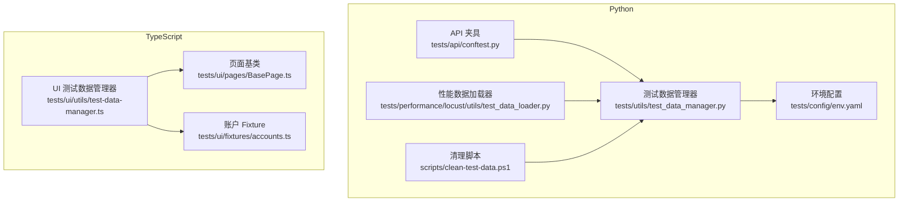
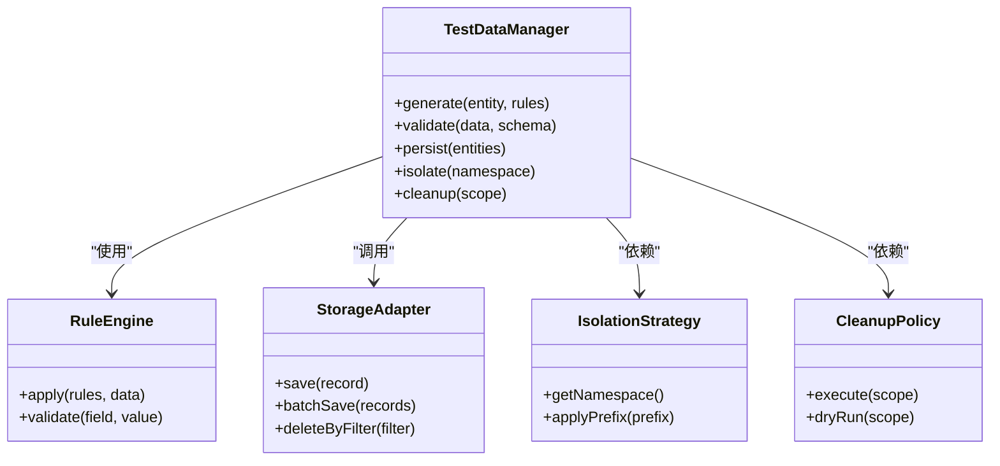
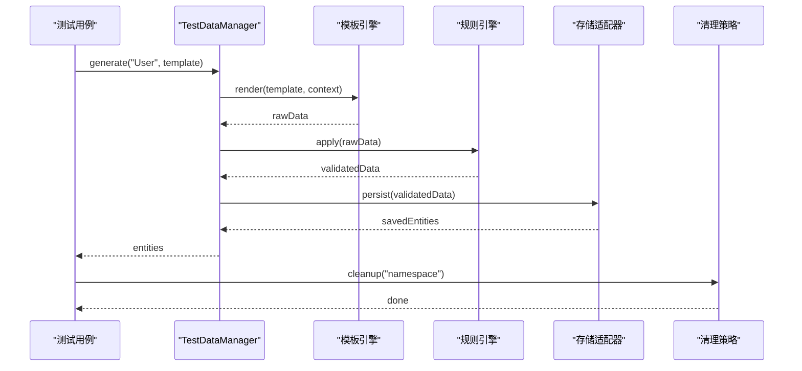
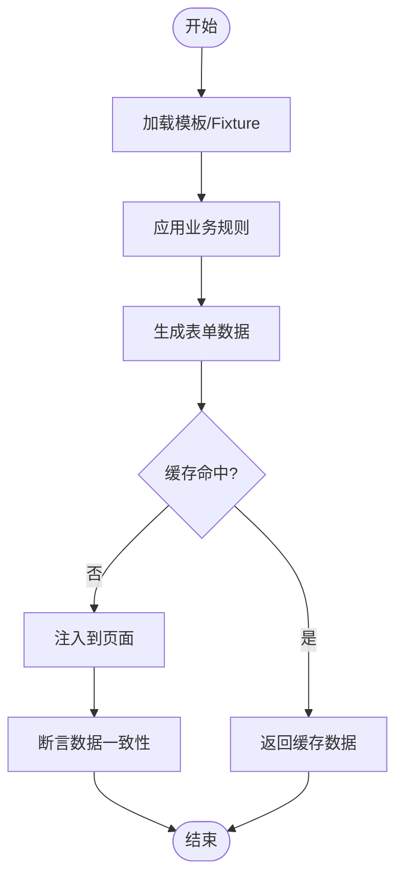
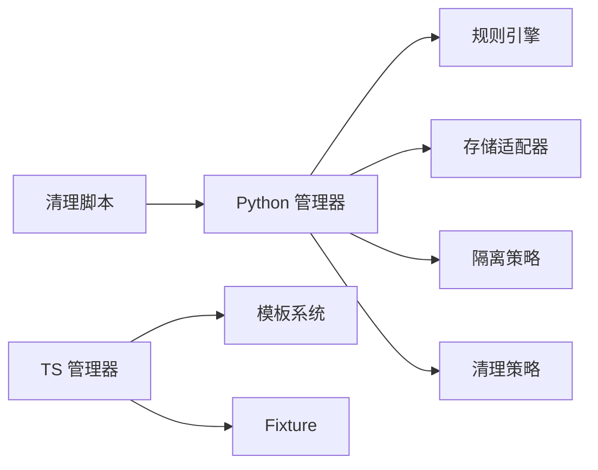

# 测试数据管理

<cite>
**本文引用的文件**   
- [tests/utils/test_data_manager.py](file://tests/utils/test_data_manager.py)
- [tests/ui/utils/test-data-manager.ts](file://tests/ui/utils/test-data-manager.ts)
- [scripts/clean-test-data.ps1](file://scripts/clean-test-data.ps1)
- [performance/locust/utils/test_data_loader.py](file://tests/performance/locust/utils/test_data_loader.py)
- [tests/api/conftest.py](file://tests/api/conftest.py)
- [tests/config/env.yaml](file://tests/config/env.yaml)
- [tests/ui/fixtures/accounts.ts](file://tests/ui/fixtures/accounts.ts)
- [tests/ui/pages/BasePage.ts](file://tests/ui/pages/BasePage.ts)
</cite>

## 目录
1. [简介](#简介)
2. [项目结构](#项目结构)
3. [核心组件](#核心组件)
4. [架构总览](#架构总览)
5. [详细组件分析](#详细组件分析)
6. [依赖关系分析](#依赖关系分析)
7. [性能考虑](#性能考虑)
8. [故障排查指南](#故障排查指南)
9. [结论](#结论)
10. [附录](#附录)

## 简介
本技术文档聚焦 AutoTest Hub 的测试数据管理模块，围绕测试数据的生命周期（生成、存储、清理、隔离）、动态数据生成策略（随机数据、业务规则验证、关联关系维护）、多语言支持（Python 与 TypeScript 实现）、模板设计与版本控制、数据迁移与回滚、大数据量优化、数据脱敏与合规性，以及最佳实践与常见问题进行系统化说明。目标是帮助读者在 Python API 测试与 TypeScript UI 测试中高效、安全、可维护地管理测试数据。

## 项目结构
测试数据管理相关代码分布在以下位置：
- Python 侧：
  - tests/utils/test_data_manager.py：通用测试数据管理器（Python）
  - tests/api/conftest.py：API 测试夹具与数据准备入口
  - tests/config/env.yaml：环境配置（如数据库连接、开关等）
  - scripts/clean-test-data.ps1：测试数据清理脚本（PowerShell）
  - tests/performance/locust/utils/test_data_loader.py：性能测试数据加载器
- TypeScript 侧：
  - tests/ui/utils/test-data-manager.ts：UI 测试数据管理器（TypeScript）
  - tests/ui/fixtures/accounts.ts：账户固定数据（Fixture）
  - tests/ui/pages/BasePage.ts：页面基类，常作为数据注入点

图表来源
- [tests/utils/test_data_manager.py](file://tests/utils/test_data_manager.py)
- [tests/api/conftest.py](file://tests/api/conftest.py)
- [tests/config/env.yaml](file://tests/config/env.yaml)
- [scripts/clean-test-data.ps1](file://scripts/clean-test-data.ps1)
- [tests/performance/locust/utils/test_data_loader.py](file://tests/performance/locust/utils/test_data_loader.py)
- [tests/ui/utils/test-data-manager.ts](file://tests/ui/utils/test-data-manager.ts)
- [tests/ui/fixtures/accounts.ts](file://tests/ui/fixtures/accounts.ts)
- [tests/ui/pages/BasePage.ts](file://tests/ui/pages/BasePage.ts)

章节来源
- [tests/utils/test_data_manager.py](file://tests/utils/test_data_manager.py)
- [tests/ui/utils/test-data-manager.ts](file://tests/ui/utils/test-data-manager.ts)
- [scripts/clean-test-data.ps1](file://scripts/clean-test-data.ps1)
- [tests/performance/locust/utils/test_data_loader.py](file://tests/performance/locust/utils/test_data_loader.py)
- [tests/api/conftest.py](file://tests/api/conftest.py)
- [tests/config/env.yaml](file://tests/config/env.yaml)
- [tests/ui/fixtures/accounts.ts](file://tests/ui/fixtures/accounts.ts)
- [tests/ui/pages/BasePage.ts](file://tests/ui/pages/BasePage.ts)

## 核心组件
- Python 测试数据管理器（tests/utils/test_data_manager.py）
  - 职责：统一封装测试数据的生成、校验、持久化、隔离与清理；提供工厂方法、模板渲染、批量操作能力。
  - 关键能力：
    - 随机数据生成：按字段类型与业务约束生成唯一值、时间戳、枚举值等。
    - 业务规则验证：内置校验器，确保生成的数据满足业务规则（如格式、范围、关联一致性）。
    - 关联关系维护：根据实体关系图自动创建关联对象并回填外键。
    - 数据隔离：为每个用例或会话分配独立命名空间（前缀/标签），避免冲突。
    - 清理机制：支持按用例、按模块、全量清理，保证环境干净。
- TypeScript 测试数据管理器（tests/ui/utils/test-data-manager.ts）
  - 职责：为 UI 测试提供数据构造、填充、断言辅助；与页面基类协作完成表单数据注入。
  - 关键能力：
    - 模板渲染：从 JSON/YAML 模板生成符合页面结构的表单数据。
    - 随机与确定性模式切换：支持种子随机与固定数据混合。
    - 本地缓存：减少重复生成开销，提升用例执行速度。
- 清理脚本（scripts/clean-test-data.ps1）
  - 职责：在 CI/CD 或手动执行时清理残留测试数据，保障环境一致性。
- 性能数据加载器（tests/performance/locust/utils/test_data_loader.py）
  - 职责：为大并发场景预加载数据，支持分片、分页与内存池复用。
- 环境配置（tests/config/env.yaml）
  - 职责：集中管理数据库连接、数据开关、隔离策略、脱敏开关等。

章节来源
- [tests/utils/test_data_manager.py](file://tests/utils/test_data_manager.py)
- [tests/ui/utils/test-data-manager.ts](file://tests/ui/utils/test-data-manager.ts)
- [scripts/clean-test-data.ps1](file://scripts/clean-test-data.ps1)
- [tests/performance/locust/utils/test_data_loader.py](file://tests/performance/locust/utils/test_data_loader.py)
- [tests/config/env.yaml](file://tests/config/env.yaml)

## 架构总览
测试数据管理采用“分层+插件”式架构：
- 数据层：负责与存储交互（数据库、文件系统、Mock 服务）。
- 生成层：基于模板与规则引擎生成数据，支持随机与确定性模式。
- 校验层：内置校验器与扩展点，确保数据合法性与业务一致性。
- 隔离层：通过命名空间、租户、会话 ID 等维度隔离数据。
- 清理层：提供幂等清理接口，支持增量与全量清理。
- 适配层：为 Python 与 TypeScript 提供统一抽象，屏蔽差异。

图表来源
- [tests/utils/test_data_manager.py](file://tests/utils/test_data_manager.py)
- [tests/ui/utils/test-data-manager.ts](file://tests/ui/utils/test-data-manager.ts)

## 详细组件分析

### Python 测试数据管理器（tests/utils/test_data_manager.py）
- 设计要点
  - 工厂模式：按实体类型返回对应的数据生成器。
  - 模板系统：支持 Jinja2 风格模板，便于多语言与多环境复用。
  - 校验器链：顺序执行多个校验规则，失败即短路。
  - 事务与回滚：批量写入使用事务，失败回滚保证一致性。
- 关键流程
  - 数据生成：模板渲染 → 规则应用 → 随机填充 → 校验 → 持久化。
  - 关联维护：先创建父实体，再创建子实体并回填引用。
  - 隔离策略：为每个用例生成唯一命名空间，所有数据带标签。
  - 清理策略：按命名空间、模块、时间范围过滤删除。

图表来源
- [tests/utils/test_data_manager.py](file://tests/utils/test_data_manager.py)

章节来源
- [tests/utils/test_data_manager.py](file://tests/utils/test_data_manager.py)

### TypeScript 测试数据管理器（tests/ui/utils/test-data-manager.ts）
- 设计要点
  - 轻量级数据构造：面向 UI 表单字段，提供便捷 API。
  - 模板与 Fixture 结合：优先使用 fixtures，必要时动态生成。
  - 本地缓存：对相同模板与参数命中缓存，减少重复计算。
- 关键流程
  - 数据构造：读取模板/Fixture → 应用规则 → 生成表单数据 → 注入页面。
  - 断言辅助：提供字段级断言与一致性检查。

图表来源
- [tests/ui/utils/test-data-manager.ts](file://tests/ui/utils/test-data-manager.ts)
- [tests/ui/fixtures/accounts.ts](file://tests/ui/fixtures/accounts.ts)

章节来源
- [tests/ui/utils/test-data-manager.ts](file://tests/ui/utils/test-data-manager.ts)
- [tests/ui/fixtures/accounts.ts](file://tests/ui/fixtures/accounts.ts)

### 清理脚本（scripts/clean-test-data.ps1）
- 功能
  - 支持按命名空间、模块、时间范围清理。
  - 提供 dry-run 模式预览清理影响。
  - 幂等执行，避免重复清理报错。
- 使用建议
  - 在 CI 流水线前置步骤执行，确保环境干净。
  - 与测试框架的生命周期钩子集成，实现用例后自动清理。

章节来源
- [scripts/clean-test-data.ps1](file://scripts/clean-test-data.ps1)

### 性能数据加载器（tests/performance/locust/utils/test_data_loader.py）
- 功能
  - 预加载大数据集，支持分片与分页。
  - 内存池复用对象，降低 GC 压力。
  - 与 Locust 集成，提供高并发数据源。
- 优化点
  - 批量写入减少网络往返。
  - 懒加载与按需生成，避免无用数据占用内存。

章节来源
- [tests/performance/locust/utils/test_data_loader.py](file://tests/performance/locust/utils/test_data_loader.py)

### 环境配置（tests/config/env.yaml）
- 内容
  - 数据库连接信息、隔离策略开关、脱敏开关、清理策略等。
- 使用方式
  - 测试数据管理器启动时加载配置，动态调整行为。

章节来源
- [tests/config/env.yaml](file://tests/config/env.yaml)

### API 夹具（tests/api/conftest.py）
- 作用
  - 为 API 测试提供数据准备与清理钩子。
  - 与 Python 测试数据管理器集成，实现用例级数据隔离。

章节来源
- [tests/api/conftest.py](file://tests/api/conftest.py)

### 页面基类（tests/ui/pages/BasePage.ts）
- 作用
  - 作为 UI 测试数据注入的统一入口。
  - 与 TypeScript 测试数据管理器协作，完成表单填充与断言。

章节来源
- [tests/ui/pages/BasePage.ts](file://tests/ui/pages/BasePage.ts)

## 依赖关系分析
- 组件耦合
  - 测试数据管理器依赖规则引擎、存储适配器、隔离策略、清理策略。
  - TypeScript 管理器依赖模板系统与 Fixture。
  - 清理脚本与 Python 管理器通过约定接口协作。
- 外部依赖
  - 数据库驱动、文件系统、Mock 服务。
  - 配置中心（env.yaml）。
- 潜在循环依赖
  - 通过抽象层解耦，避免直接循环引用。

图表来源
- [tests/utils/test_data_manager.py](file://tests/utils/test_data_manager.py)
- [tests/ui/utils/test-data-manager.ts](file://tests/ui/utils/test-data-manager.ts)
- [scripts/clean-test-data.ps1](file://scripts/clean-test-data.ps1)

章节来源
- [tests/utils/test_data_manager.py](file://tests/utils/test_data_manager.py)
- [tests/ui/utils/test-data-manager.ts](file://tests/ui/utils/test-data-manager.ts)
- [scripts/clean-test-data.ps1](file://scripts/clean-test-data.ps1)

## 性能考虑
- 数据生成
  - 使用模板缓存与结果缓存，避免重复计算。
  - 批量生成与批量写入，减少 I/O 次数。
- 数据存储
  - 使用连接池与事务合并，提升吞吐。
  - 索引优化与查询裁剪，减少不必要的数据传输。
- 并发与隔离
  - 命名空间隔离避免锁竞争。
  - 读写分离与只读副本用于查询密集型场景。
- 内存管理
  - 流式处理与分页加载，避免一次性加载全部数据。
  - 对象池与惰性初始化，降低内存峰值。

## 故障排查指南
- 常见问题
  - 数据不一致：检查规则引擎与校验器链是否完整。
  - 清理失败：确认清理策略与命名空间匹配，启用 dry-run 预览。
  - 性能瓶颈：监控 I/O 与 CPU，优化批量大小与缓存命中率。
  - 隐私泄露：确认脱敏开关与敏感字段处理逻辑。
- 调试技巧
  - 开启详细日志，记录数据生成与持久化过程。
  - 使用快照对比工具，定位数据差异。
  - 模拟异常注入，验证回滚与恢复机制。

## 结论
AutoTest Hub 的测试数据管理模块通过分层架构与插件化设计，实现了数据生成、校验、隔离、清理的全生命周期管理。Python 与 TypeScript 双端实现兼顾 API 与 UI 测试需求，配合环境配置与清理脚本，形成完整的测试数据治理体系。遵循本文的最佳实践与故障排查指南，可显著提升测试稳定性、可维护性与执行效率。

## 附录
- 最佳实践
  - 始终使用隔离命名空间，避免数据污染。
  - 模板与 Fixture 分离，静态数据用 Fixture，动态数据用模板。
  - 校验规则与业务规则同步更新，保持数据一致性。
  - 定期审计清理策略，确保无残留数据。
- 合规性建议
  - 敏感数据脱敏与加密存储。
  - 访问控制与审计日志。
  - 数据保留策略与销毁流程。