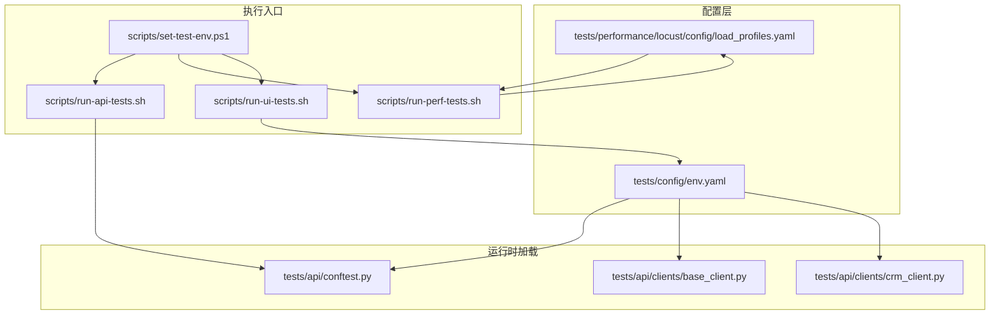
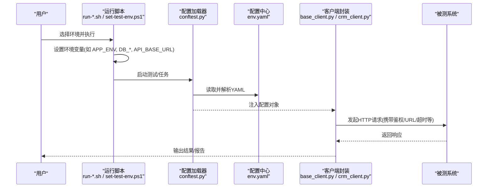
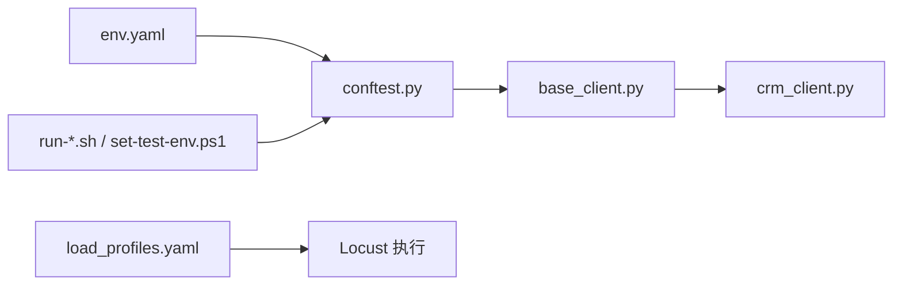

# 环境配置管理

<cite>
**本文引用的文件**   
- [env.yaml](file://tests/config/env.yaml)
- [conftest.py](file://tests/api/conftest.py)
- [base_client.py](file://tests/api/clients/base_client.py)
- [crm_client.py](file://tests/api/clients/crm_client.py)
- [load_profiles.yaml](file://tests/performance/locust/config/load_profiles.yaml)
- [set-test-env.ps1](file://scripts/set-test-env.ps1)
- [run-api-tests.sh](file://scripts/run-api-tests.sh)
- [run-perf-tests.sh](file://scripts/run-perf-tests.sh)
- [run-ui-tests.sh](file://scripts/run-ui-tests.sh)
</cite>

## 目录
1. [简介](#简介)
2. [项目结构](#项目结构)
3. [核心组件](#核心组件)
4. [架构总览](#架构总览)
5. [详细组件分析](#详细组件分析)
6. [依赖关系分析](#依赖关系分析)
7. [性能与可扩展性](#性能与可扩展性)
8. [故障排查指南](#故障排查指南)
9. [结论](#结论)
10. [附录](#附录)

## 简介
本技术文档面向 AutoTest Hub 的环境配置管理系统，聚焦于基于 YAML 的多环境配置架构。文档围绕以下目标展开：
- 解释开发、测试、预发布和生产环境的配置差异管理策略
- 定义 env.yaml 的结构与关键配置项（数据库连接、API 端点、认证信息、日志级别等）
- 说明配置继承机制与环境变量覆盖规则
- 提供配置验证机制、错误处理策略与安全敏感信息的加密存储方案
- 给出多环境部署最佳实践、配置热更新实现思路与故障排查指南
- 提供配置迁移脚本与环境切换工具的使用说明

## 项目结构
AutoTest Hub 将运行期配置集中于 tests/config/env.yaml，并通过测试框架与脚本在启动时加载。性能测试使用独立的 locust profiles 配置文件；UI 与 API 自动化通过 shell/PowerShell 脚本注入环境变量以驱动运行时行为。

图表来源
- [env.yaml](file://tests/config/env.yaml)
- [conftest.py](file://tests/api/conftest.py)
- [base_client.py](file://tests/api/clients/base_client.py)
- [crm_client.py](file://tests/api/clients/crm_client.py)
- [load_profiles.yaml](file://tests/performance/locust/config/load_profiles.yaml)
- [run-api-tests.sh](file://scripts/run-api-tests.sh)
- [run-perf-tests.sh](file://scripts/run-perf-tests.sh)
- [run-ui-tests.sh](file://scripts/run-ui-tests.sh)
- [set-test-env.ps1](file://scripts/set-test-env.ps1)

章节来源
- [env.yaml](file://tests/config/env.yaml)
- [conftest.py](file://tests/api/conftest.py)
- [base_client.py](file://tests/api/clients/base_client.py)
- [crm_client.py](file://tests/api/clients/crm_client.py)
- [load_profiles.yaml](file://tests/performance/locust/config/load_profiles.yaml)
- [run-api-tests.sh](file://scripts/run-api-tests.sh)
- [run-perf-tests.sh](file://scripts/run-perf-tests.sh)
- [run-ui-tests.sh](file://scripts/run-ui-tests.sh)
- [set-test-env.ps1](file://scripts/set-test-env.ps1)

## 核心组件
- 配置中心文件
  - tests/config/env.yaml：集中存放各环境通用与差异化配置项，如数据库连接、API 基础地址、认证凭据、日志级别等
- 配置加载器
  - tests/api/conftest.py：在测试会话初始化阶段读取并解析 env.yaml，将其注入到测试上下文或客户端基类中
- 客户端封装
  - tests/api/clients/base_client.py：统一封装 HTTP 请求参数（如 base_url、超时、重试、鉴权头），从配置源获取值
  - tests/api/clients/crm_client.py：业务客户端，继承自 base_client，复用公共配置
- 性能测试配置
  - tests/performance/locust/config/load_profiles.yaml：为 Locust 压测提供独立 profile 配置（并发、持续时间、目标 URL 等）
- 执行脚本与环境注入
  - scripts/run-api-tests.sh、scripts/run-perf-tests.sh、scripts/run-ui-tests.sh：在启动前设置环境变量，驱动不同环境行为
  - scripts/set-test-env.ps1：Windows 环境下批量设置环境变量，便于一键切换环境

章节来源
- [env.yaml](file://tests/config/env.yaml)
- [conftest.py](file://tests/api/conftest.py)
- [base_client.py](file://tests/api/clients/base_client.py)
- [crm_client.py](file://tests/api/clients/crm_client.py)
- [load_profiles.yaml](file://tests/performance/locust/config/load_profiles.yaml)
- [run-api-tests.sh](file://scripts/run-api-tests.sh)
- [run-perf-tests.sh](file://scripts/run-perf-tests.sh)
- [run-ui-tests.sh](file://scripts/run-ui-tests.sh)
- [set-test-env.ps1](file://scripts/set-test-env.ps1)

## 架构总览
下图展示了“配置中心 → 加载器 → 客户端 → 执行脚本”的端到端数据流。

图表来源
- [run-api-tests.sh](file://scripts/run-api-tests.sh)
- [run-perf-tests.sh](file://scripts/run-perf-tests.sh)
- [run-ui-tests.sh](file://scripts/run-ui-tests.sh)
- [set-test-env.ps1](file://scripts/set-test-env.ps1)
- [conftest.py](file://tests/api/conftest.py)
- [env.yaml](file://tests/config/env.yaml)
- [base_client.py](file://tests/api/clients/base_client.py)
- [crm_client.py](file://tests/api/clients/crm_client.py)

## 详细组件分析

### 配置中心：tests/config/env.yaml
- 作用
  - 作为单一事实源，承载多环境共用与差异化配置
  - 支持按环境键区分（例如 dev/test/staging/prod），并提供默认值
- 典型配置域
  - 数据库连接：主机、端口、库名、用户名、密码、连接池大小、SSL 开关等
  - API 端点：基础地址、版本路径、超时、重试次数、最大连接数
  - 认证信息：令牌签发地址、客户端 ID/密钥、JWT 过期时间、刷新策略
  - 日志级别：控制台/文件输出、滚动策略、保留天数
  - 其他：缓存、消息队列、第三方服务地址等
- 建议结构
  - 顶层包含 default 与各环境块
  - 每个环境块可引用 default 中的公共项，仅声明差异项
  - 对敏感字段采用占位符或加密标记，由外部注入真实值

章节来源
- [env.yaml](file://tests/config/env.yaml)

### 配置加载器：tests/api/conftest.py
- 职责
  - 在 pytest 会话初始化时加载 env.yaml
  - 合并 default 与当前环境块，应用环境变量覆盖
  - 校验必填项与类型，抛出明确错误信息
  - 将最终配置对象注入到测试夹具与客户端基类
- 关键流程
  - 读取环境变量确定目标环境
  - 解析 YAML 并深拷贝 default 作为基底
  - 逐层合并当前环境块
  - 应用环境变量覆盖（优先级最高）
  - 执行校验与转换（如端口转整型、布尔值规范化）
  - 暴露全局配置供后续模块消费

章节来源
- [conftest.py](file://tests/api/conftest.py)

### 客户端封装：tests/api/clients/base_client.py 与 tests/api/clients/crm_client.py
- base_client.py
  - 统一封装 HTTP 客户端初始化参数（base_url、timeout、retries、headers）
  - 从配置对象读取并设置默认值
  - 提供统一的鉴权头注入、重试与退避策略
- crm_client.py
  - 继承 base_client，扩展 CRM 业务相关方法与路径
  - 复用公共配置，避免重复声明

章节来源
- [base_client.py](file://tests/api/clients/base_client.py)
- [crm_client.py](file://tests/api/clients/crm_client.py)

### 性能测试配置：tests/performance/locust/config/load_profiles.yaml
- 作用
  - 为 Locust 提供独立于功能测试的配置（并发、持续时间、目标 URL、钩子等）
- 与主配置的关系
  - 可与 env.yaml 解耦，避免压测参数污染功能测试
  - 可通过环境变量或命令行参数选择 profile

章节来源
- [load_profiles.yaml](file://tests/performance/locust/config/load_profiles.yaml)

### 执行脚本与环境注入
- run-api-tests.sh / run-perf-tests.sh / run-ui-tests.sh
  - 在执行前设置环境变量（如 APP_ENV、DB_HOST、API_BASE_URL 等）
  - 调用对应测试框架命令（pytest/locust/playwright）
- set-test-env.ps1
  - Windows 下批量设置环境变量，便于一键切换环境
  - 可与 PowerShell 终端集成，提升本地体验

章节来源
- [run-api-tests.sh](file://scripts/run-api-tests.sh)
- [run-perf-tests.sh](file://scripts/run-perf-tests.sh)
- [run-ui-tests.sh](file://scripts/run-ui-tests.sh)
- [set-test-env.ps1](file://scripts/set-test-env.ps1)

## 依赖关系分析
- 耦合度
  - conftest.py 与 env.yaml 强耦合（读取与解析）
  - base_client.py 与 conftest.py 弱耦合（通过全局配置对象访问）
  - 执行脚本与 conftest.py 松耦合（通过环境变量间接影响）
- 外部依赖
  - YAML 解析库
  - HTTP 客户端库（requests/httpx 等）
  - 可选：加密库（用于敏感信息解密）

图表来源
- [env.yaml](file://tests/config/env.yaml)
- [conftest.py](file://tests/api/conftest.py)
- [base_client.py](file://tests/api/clients/base_client.py)
- [crm_client.py](file://tests/api/clients/crm_client.py)
- [load_profiles.yaml](file://tests/performance/locust/config/load_profiles.yaml)
- [run-api-tests.sh](file://scripts/run-api-tests.sh)
- [run-perf-tests.sh](file://scripts/run-perf-tests.sh)
- [run-ui-tests.sh](file://scripts/run-ui-tests.sh)
- [set-test-env.ps1](file://scripts/set-test-env.ps1)

章节来源
- [env.yaml](file://tests/config/env.yaml)
- [conftest.py](file://tests/api/conftest.py)
- [base_client.py](file://tests/api/clients/base_client.py)
- [crm_client.py](file://tests/api/clients/crm_client.py)
- [load_profiles.yaml](file://tests/performance/locust/config/load_profiles.yaml)
- [run-api-tests.sh](file://scripts/run-api-tests.sh)
- [run-perf-tests.sh](file://scripts/run-perf-tests.sh)
- [run-ui-tests.sh](file://scripts/run-ui-tests.sh)
- [set-test-env.ps1](file://scripts/set-test-env.ps1)

## 性能与可扩展性
- 配置加载开销
  - 建议在测试会话初始化时一次性加载并缓存配置对象，避免重复 I/O
- 大配置优化
  - 将大型配置拆分为多个 YAML 文件，按需合并
- 并发安全
  - 配置对象应为只读共享，避免并发写入
- 可扩展性
  - 通过插件式加载器支持新的配置源（如配置中心、KV 存储）

[本节为通用指导，不直接分析具体文件]

## 故障排查指南
- 常见问题
  - 环境变量未生效：检查执行脚本是否正确设置 APP_ENV 及相关变量
  - 配置缺失或类型错误：查看加载器的校验日志，确认必填项与类型转换
  - 鉴权失败：核对认证相关配置与令牌有效期
  - 连接超时：检查网络连通性与超时/重试配置
- 定位步骤
  - 打印最终合并后的配置快照（脱敏）
  - 逐步注释 env.yaml 中的差异项，定位问题键
  - 使用最小化配置复现问题
- 恢复策略
  - 回滚到上一个稳定版本的 env.yaml
  - 通过环境变量临时覆盖异常项进行快速修复

章节来源
- [conftest.py](file://tests/api/conftest.py)
- [base_client.py](file://tests/api/clients/base_client.py)
- [run-api-tests.sh](file://scripts/run-api-tests.sh)
- [set-test-env.ps1](file://scripts/set-test-env.ps1)

## 结论
通过以 env.yaml 为核心的配置中心与脚本化的环境变量注入，AutoTest Hub 实现了清晰的多环境配置管理与灵活的运行时切换。配合严格的加载与校验逻辑，系统在可维护性、安全性与可观测性方面具备良好基础。建议持续完善加密存储、热更新与配置审计能力，进一步提升生产可用性。

[本节为总结性内容，不直接分析具体文件]

## 附录

### 配置项参考与默认值
- 数据库连接
  - host、port、database、username、password、pool_size、ssl_enabled
  - 默认值：建议为开发环境提供本地默认值，生产环境强制通过环境变量覆盖
- API 端点
  - base_url、api_version、timeout、retries、max_connections
  - 默认值：开发/测试环境较短超时与较低重试，生产环境更稳健
- 认证信息
  - token_endpoint、client_id、client_secret、jwt_expiry、refresh_strategy
  - 默认值：禁止在仓库中提交明文，必须通过环境变量或加密存储注入
- 日志级别
  - level、output、rotation、retention_days
  - 默认值：开发环境 DEBUG，生产环境 WARNING 或 INFO

章节来源
- [env.yaml](file://tests/config/env.yaml)

### 配置继承与环境变量覆盖规则
- 继承顺序
  - default → 当前环境块 → 环境变量
- 覆盖优先级
  - 环境变量具有最高优先级，可覆盖任意层级配置
- 合并策略
  - 推荐深合并，避免意外覆盖嵌套对象

章节来源
- [conftest.py](file://tests/api/conftest.py)

### 配置验证与错误处理
- 验证项
  - 必填字段存在性、类型转换（字符串→整型/布尔）、格式校验（URL、邮箱、正则）
- 错误处理
  - 明确错误消息与位置，记录上下文，必要时中止测试会话
- 容错策略
  - 提供降级默认值与告警，避免单点失败导致整体不可用

章节来源
- [conftest.py](file://tests/api/conftest.py)

### 安全敏感信息加密存储方案
- 方案建议
  - 使用外部密钥管理服务（KMS/Vault）或本地加密文件，运行时解密后注入
  - 在 env.yaml 中以占位符或加密标记表示敏感项
- 实施要点
  - 解密过程需最小权限原则，避免持久化明文
  - 审计与轮换策略应纳入运维流程

章节来源
- [env.yaml](file://tests/config/env.yaml)
- [conftest.py](file://tests/api/conftest.py)

### 多环境部署最佳实践
- 环境隔离
  - 每个环境独立配置与凭据，禁止跨环境复用
- 变更控制
  - 配置变更走代码评审与版本标签，确保可追溯
- 灰度与回滚
  - 支持按环境快速回滚到上一稳定配置

章节来源
- [env.yaml](file://tests/config/env.yaml)
- [run-api-tests.sh](file://scripts/run-api-tests.sh)
- [run-perf-tests.sh](file://scripts/run-perf-tests.sh)
- [run-ui-tests.sh](file://scripts/run-ui-tests.sh)

### 配置热更新实现思路
- 设计要点
  - 监听配置变更事件（文件系统或配置中心推送）
  - 原子替换配置对象，保证并发安全
  - 对关键配置（如鉴权）提供重启或重新握手策略
- 风险控制
  - 变更前校验与预览，变更后自动回滚失败

章节来源
- [conftest.py](file://tests/api/conftest.py)
- [base_client.py](file://tests/api/clients/base_client.py)

### 配置迁移脚本与环境切换工具
- 迁移脚本
  - 提供从旧版配置结构向新版结构的自动迁移，生成 diff 与校验报告
- 环境切换工具
  - 通过 set-test-env.ps1 或 shell 脚本一键切换 APP_ENV 与相关变量
  - 支持列出可用环境与当前生效配置摘要

章节来源
- [set-test-env.ps1](file://scripts/set-test-env.ps1)
- [run-api-tests.sh](file://scripts/run-api-tests.sh)
- [run-perf-tests.sh](file://scripts/run-perf-tests.sh)
- [run-ui-tests.sh](file://scripts/run-ui-tests.sh)