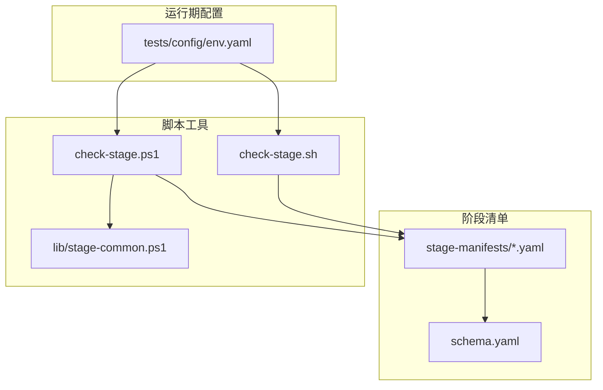
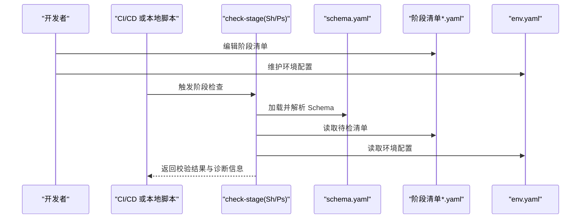
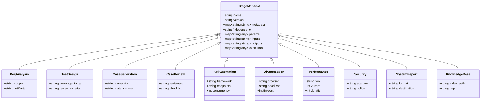
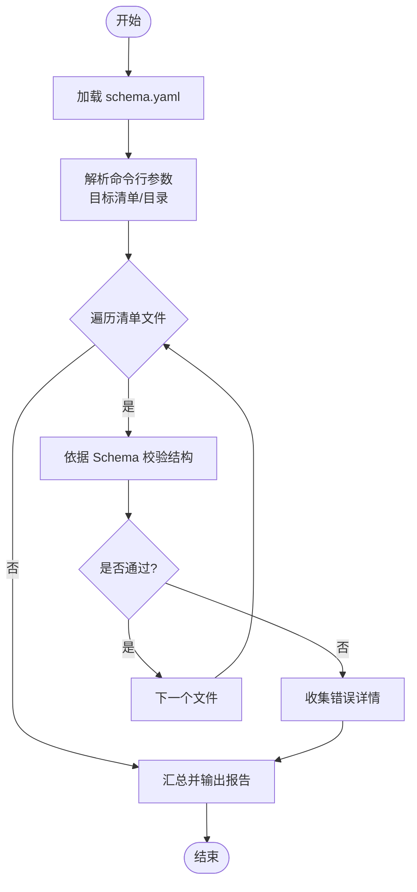
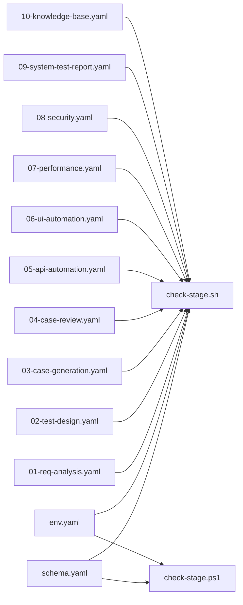

# 配置管理

<cite>
**本文引用的文件**   
- [stage-manifests/schema.yaml](file://stage-manifests/schema.yaml)
- [stage-manifests/01-req-analysis.yaml](file://stage-manifests/01-req-analysis.yaml)
- [stage-manifests/02-test-design.yaml](file://stage-manifests/02-test-design.yaml)
- [stage-manifests/03-case-generation.yaml](file://stage-manifests/03-case-generation.yaml)
- [stage-manifests/04-case-review.yaml](file://stage-manifests/04-case-review.yaml)
- [stage-manifests/05-api-automation.yaml](file://stage-manifests/05-api-automation.yaml)
- [stage-manifests/06-ui-automation.yaml](file://stage-manifests/06-ui-automation.yaml)
- [stage-manifests/07-performance.yaml](file://stage-manifests/07-performance.yaml)
- [stage-manifests/08-security.yaml](file://stage-manifests/08-security.yaml)
- [stage-manifests/09-system-test-report.yaml](file://stage-manifests/09-system-test-report.yaml)
- [stage-manifests/10-knowledge-base.yaml](file://stage-manifests/10-knowledge-base.yaml)
- [tests/config/env.yaml](file://tests/config/env.yaml)
- [scripts/check-stage.sh](file://scripts/check-stage.sh)
- [scripts/check-stage.ps1](file://scripts/check-stage.ps1)
- [scripts/lib/stage-common.ps1](file://scripts/lib/stage-common.ps1)
</cite>

## 目录
1. [简介](#简介)
2. [项目结构](#项目结构)
3. [核心组件](#核心组件)
4. [架构总览](#架构总览)
5. [详细组件分析](#详细组件分析)
6. [依赖关系分析](#依赖关系分析)
7. [性能与可扩展性](#性能与可扩展性)
8. [故障排查指南](#故障排查指南)
9. [结论](#结论)
10. [附录](#附录)

## 简介
本技术文档面向 AutoTest Hub 的配置管理系统，聚焦以下目标：
- 基于 YAML 的多环境配置管理方案（开发、测试、预发布、生产）
- 阶段清单（Stage Manifest）管理系统的设计原理与使用方式
- 配置文件层级结构与继承机制说明
- 配置项定义、默认值参考与校验规则
- 配置验证与错误处理机制
- 配置热更新与版本控制策略
- 最佳实践、安全考虑与迁移升级方案

## 项目结构
配置相关资源主要分布在如下位置：
- stage-manifests：阶段清单与 Schema 定义
- tests/config：运行时环境配置（如 env.yaml）
- scripts：阶段检查与通用脚本库

图表来源
- [stage-manifests/schema.yaml](file://stage-manifests/schema.yaml)
- [tests/config/env.yaml](file://tests/config/env.yaml)
- [scripts/check-stage.sh](file://scripts/check-stage.sh)
- [scripts/check-stage.ps1](file://scripts/check-stage.ps1)
- [scripts/lib/stage-common.ps1](file://scripts/lib/stage-common.ps1)

章节来源
- [stage-manifests/schema.yaml](file://stage-manifests/schema.yaml)
- [tests/config/env.yaml](file://tests/config/env.yaml)
- [scripts/check-stage.sh](file://scripts/check-stage.sh)
- [scripts/check-stage.ps1](file://scripts/check-stage.ps1)
- [scripts/lib/stage-common.ps1](file://scripts/lib/stage-common.ps1)

## 核心组件
- 阶段清单（Stage Manifest）
  - 以 YAML 描述单个阶段的执行流程、输入输出、依赖与参数。
  - 通过 schema.yaml 进行结构化约束与校验。
- 环境配置（env.yaml）
  - 提供运行期环境变量与平台差异的集中管理。
- 阶段检查脚本
  - 在 CI/CD 或本地执行前对清单与环境进行一致性检查。

章节来源
- [stage-manifests/schema.yaml](file://stage-manifests/schema.yaml)
- [tests/config/env.yaml](file://tests/config/env.yaml)
- [scripts/check-stage.sh](file://scripts/check-stage.sh)
- [scripts/check-stage.ps1](file://scripts/check-stage.ps1)

## 架构总览
下图展示了“阶段清单 + 环境配置 + 检查脚本”的整体交互关系。

图表来源
- [scripts/check-stage.sh](file://scripts/check-stage.sh)
- [scripts/check-stage.ps1](file://scripts/check-stage.ps1)
- [stage-manifests/schema.yaml](file://stage-manifests/schema.yaml)
- [tests/config/env.yaml](file://tests/config/env.yaml)

## 详细组件分析

### 阶段清单（Stage Manifest）设计
- 设计理念
  - 将每个测试阶段抽象为可组合、可复用的清单单元，便于流水线编排与回滚。
  - 通过统一的 Schema 保证结构一致性与可演进性。
- 典型字段类别（概念性说明）
  - 元数据：名称、版本、作者、描述等
  - 执行上下文：工作目录、并行度、超时、重试
  - 输入输出：产物路径、报告、覆盖率、日志
  - 依赖：前置阶段、外部服务、数据准备
  - 参数化：环境覆盖、开关、阈值
- 多环境差异管理
  - 通过 env.yaml 提供基础变量，并在清单中按环境覆盖关键参数（如端点、并发、超时）。
  - 建议在清单中使用占位符引用环境配置，避免硬编码。

章节来源
- [stage-manifests/01-req-analysis.yaml](file://stage-manifests/01-req-analysis.yaml)
- [stage-manifests/02-test-design.yaml](file://stage-manifests/02-test-design.yaml)
- [stage-manifests/03-case-generation.yaml](file://stage-manifests/03-case-generation.yaml)
- [stage-manifests/04-case-review.yaml](file://stage-manifests/04-case-review.yaml)
- [stage-manifests/05-api-automation.yaml](file://stage-manifests/05-api-automation.yaml)
- [stage-manifests/06-ui-automation.yaml](file://stage-manifests/06-ui-automation.yaml)
- [stage-manifests/07-performance.yaml](file://stage-manifests/07-performance.yaml)
- [stage-manifests/08-security.yaml](file://stage-manifests/08-security.yaml)
- [stage-manifests/09-system-test-report.yaml](file://stage-manifests/09-system-test-report.yaml)
- [stage-manifests/10-knowledge-base.yaml](file://stage-manifests/10-knowledge-base.yaml)

#### 阶段清单类图（概念映射到实际清单文件）

图表来源
- [stage-manifests/01-req-analysis.yaml](file://stage-manifests/01-req-analysis.yaml)
- [stage-manifests/02-test-design.yaml](file://stage-manifests/02-test-design.yaml)
- [stage-manifests/03-case-generation.yaml](file://stage-manifests/03-case-generation.yaml)
- [stage-manifests/04-case-review.yaml](file://stage-manifests/04-case-review.yaml)
- [stage-manifests/05-api-automation.yaml](file://stage-manifests/05-api-automation.yaml)
- [stage-manifests/06-ui-automation.yaml](file://stage-manifests/06-ui-automation.yaml)
- [stage-manifests/07-performance.yaml](file://stage-manifests/07-performance.yaml)
- [stage-manifests/08-security.yaml](file://stage-manifests/08-security.yaml)
- [stage-manifests/09-system-test-report.yaml](file://stage-manifests/09-system-test-report.yaml)
- [stage-manifests/10-knowledge-base.yaml](file://stage-manifests/10-knowledge-base.yaml)

### 环境配置（env.yaml）与多环境差异
- 职责
  - 集中管理不同环境的公共变量（如基地址、账号、超时、开关），供各阶段清单引用。
- 多环境建议
  - 采用分层组织：公共层 + 环境层（dev/test/stg/prod），合并时遵循“环境层覆盖公共层”的规则。
  - 敏感信息（密钥、令牌）应通过受控渠道注入，不在仓库中明文保存。
- 与清单的关系
  - 清单中通过占位符或变量名引用 env.yaml 中的键，实现“一次定义、多处复用”。

章节来源
- [tests/config/env.yaml](file://tests/config/env.yaml)

### 配置校验与错误处理
- 校验入口
  - check-stage.sh / check-stage.ps1 作为统一入口，负责加载 schema.yaml 并对目标清单进行结构校验。
- 校验维度（概念性说明）
  - 必填字段、类型约束、枚举取值、嵌套结构、依赖环检测、路径存在性等。
- 错误处理
  - 失败时输出清晰的诊断信息（文件名、行号、字段路径、期望类型），便于快速定位。
  - 支持批量扫描多个清单并汇总错误。

图表来源
- [scripts/check-stage.sh](file://scripts/check-stage.sh)
- [scripts/check-stage.ps1](file://scripts/check-stage.ps1)
- [stage-manifests/schema.yaml](file://stage-manifests/schema.yaml)

章节来源
- [scripts/check-stage.sh](file://scripts/check-stage.sh)
- [scripts/check-stage.ps1](file://scripts/check-stage.ps1)
- [stage-manifests/schema.yaml](file://stage-manifests/schema.yaml)

### 配置层级与继承机制
- 层级划分（建议）
  - 全局默认：适用于所有环境的公共配置
  - 环境覆盖：针对 dev/test/stg/prod 的差异项
  - 阶段覆盖：特定阶段对参数的微调
- 合并策略
  - 自底向上合并，上层覆盖下层同名键；列表型字段建议追加而非替换，避免丢失公共条目。
- 变更影响面
  - 任何覆盖都应评估对下游阶段的潜在影响，并通过自动化校验与回归用例保障稳定性。

章节来源
- [tests/config/env.yaml](file://tests/config/env.yaml)
- [stage-manifests/schema.yaml](file://stage-manifests/schema.yaml)

### 配置项说明与默认值参考
- 建议做法
  - 在 schema.yaml 中为每个字段标注：类型、是否必填、默认值、取值范围/枚举、示例与说明。
  - 在清单文件中保留最小必要覆盖，其余沿用默认值。
- 常见字段类别（概念性说明）
  - 执行参数：并发度、超时、重试次数
  - 产物路径：报告、覆盖率、截图、视频
  - 外部依赖：API 端点、数据库连接、浏览器驱动
  - 质量门禁：通过率阈值、性能指标上限

章节来源
- [stage-manifests/schema.yaml](file://stage-manifests/schema.yaml)

### 配置热更新与版本控制策略
- 热更新
  - 对于无需重启的服务，可通过监听配置变更事件并动态重载；需确保幂等与原子切换。
  - 对于需要重启的组件，建议使用蓝绿/金丝雀发布，配合健康检查完成平滑过渡。
- 版本控制
  - 清单与环境配置纳入 Git 版本管理，提交信息包含变更原因与影响范围。
  - 重要变更走评审与灰度流程，必要时打标签归档。

[本节为通用指导，不直接分析具体文件]

### 最佳实践与安全考虑
- 最佳实践
  - 单一事实源：仅 env.yaml 持有环境级常量，清单只引用不重复定义
  - 小步快跑：每次变更尽量小而明确，附带校验与回归
  - 可观测性：为关键阶段输出结构化日志与指标
- 安全
  - 敏感信息不进仓库，使用密钥管理服务或 CI 加密变量
  - 最小权限原则：运行账户仅具备必要访问能力
  - 定期审计清单与配置变更历史

[本节为通用指导，不直接分析具体文件]

### 故障排查指南
- 常见问题
  - 清单结构不符合 Schema：根据错误提示修正字段类型或缺失必填项
  - 环境变量缺失：确认 env.yaml 已正确加载且键名匹配
  - 依赖未就绪：检查前置阶段产物是否存在、路径是否正确
- 定位步骤
  - 使用 check-stage 进行离线校验
  - 缩小范围至单个清单与环境组合复现问题
  - 查看阶段产物与日志，结合 Schema 逐项核对

章节来源
- [scripts/check-stage.sh](file://scripts/check-stage.sh)
- [scripts/check-stage.ps1](file://scripts/check-stage.ps1)
- [stage-manifests/schema.yaml](file://stage-manifests/schema.yaml)

## 依赖关系分析
- 组件耦合
  - 阶段清单强依赖 schema.yaml 的结构定义
  - 检查脚本同时依赖清单与 env.yaml
- 外部依赖
  - 各阶段可能依赖外部系统（API、浏览器、性能/安全工具），应在清单中显式声明并做可用性检查

图表来源
- [stage-manifests/schema.yaml](file://stage-manifests/schema.yaml)
- [tests/config/env.yaml](file://tests/config/env.yaml)
- [scripts/check-stage.sh](file://scripts/check-stage.sh)
- [scripts/check-stage.ps1](file://scripts/check-stage.ps1)
- [stage-manifests/01-req-analysis.yaml](file://stage-manifests/01-req-analysis.yaml)
- [stage-manifests/02-test-design.yaml](file://stage-manifests/02-test-design.yaml)
- [stage-manifests/03-case-generation.yaml](file://stage-manifests/03-case-generation.yaml)
- [stage-manifests/04-case-review.yaml](file://stage-manifests/04-case-review.yaml)
- [stage-manifests/05-api-automation.yaml](file://stage-manifests/05-api-automation.yaml)
- [stage-manifests/06-ui-automation.yaml](file://stage-manifests/06-ui-automation.yaml)
- [stage-manifests/07-performance.yaml](file://stage-manifests/07-performance.yaml)
- [stage-manifests/08-security.yaml](file://stage-manifests/08-security.yaml)
- [stage-manifests/09-system-test-report.yaml](file://stage-manifests/09-system-test-report.yaml)
- [stage-manifests/10-knowledge-base.yaml](file://stage-manifests/10-knowledge-base.yaml)

章节来源
- [scripts/check-stage.sh](file://scripts/check-stage.sh)
- [scripts/check-stage.ps1](file://scripts/check-stage.ps1)
- [stage-manifests/schema.yaml](file://stage-manifests/schema.yaml)

## 性能与可扩展性
- 性能
  - 合理设置并发与超时，避免资源争用
  - 产物压缩与增量上传，减少 I/O 压力
- 可扩展性
  - 新增阶段只需新增清单与对应 Schema 扩展，保持向后兼容
  - 通过参数化与模板化提升复用率

[本节为通用指导，不直接分析具体文件]

## 故障排查指南
- 快速自检清单
  - 运行 check-stage 全量校验
  - 对比最新 schema.yaml 与当前清单差异
  - 检查 env.yaml 中关键键是否存在且格式正确
- 日志与产物
  - 定位阶段产物目录，确认报告与覆盖率生成成功
  - 若涉及外部系统，先做连通性与鉴权自检

章节来源
- [scripts/check-stage.sh](file://scripts/check-stage.sh)
- [scripts/check-stage.ps1](file://scripts/check-stage.ps1)
- [stage-manifests/schema.yaml](file://stage-manifests/schema.yaml)

## 结论
通过“阶段清单 + 环境配置 + 统一校验”的组合，AutoTest Hub 实现了可追溯、可复用、可演进的配置管理体系。借助 Schema 约束与脚本化校验，可在早期发现配置错误，降低上线风险；通过分层与覆盖策略，有效支撑多环境差异化需求。

[本节为总结性内容，不直接分析具体文件]

## 附录

### 配置迁移与升级方案
- 迁移步骤
  - 备份现有清单与环境配置
  - 逐步对齐新 Schema 字段，优先补齐必填项
  - 在本地或小流量环境验证通过后推广
- 兼容性策略
  - 新增字段设为可选并提供默认值
  - 废弃字段保留一段时间并给出告警提示
- 回滚策略
  - 基于 Git 标签快速回退到上一稳定版本
  - 配合灰度发布与健康检查，确保业务连续性

[本节为通用指导，不直接分析具体文件]