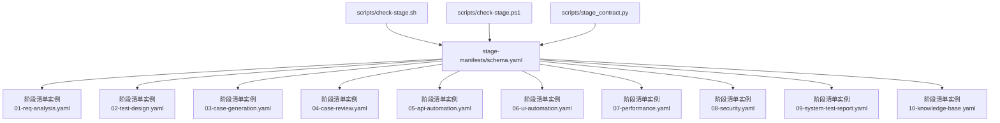
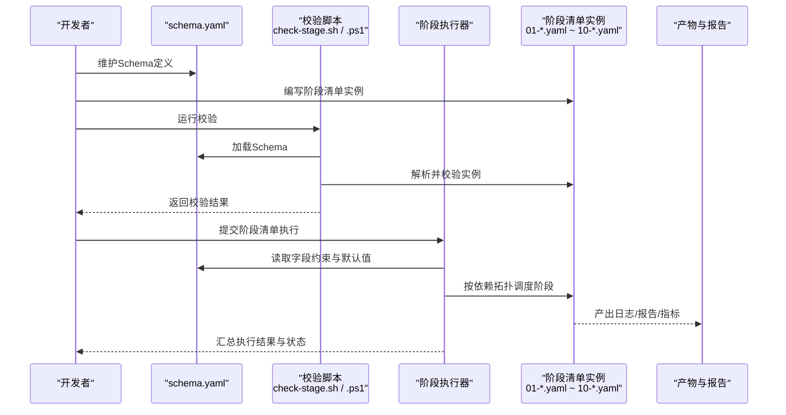
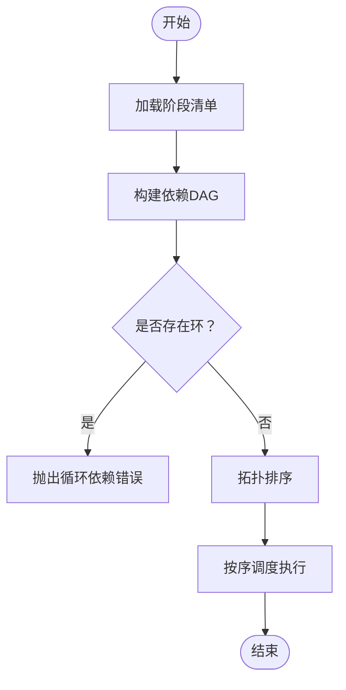
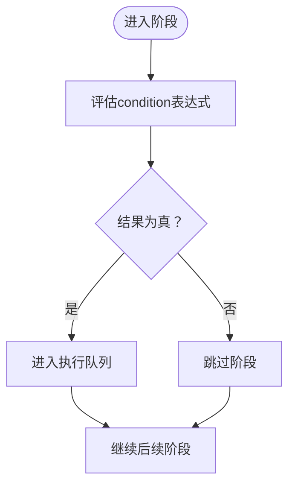
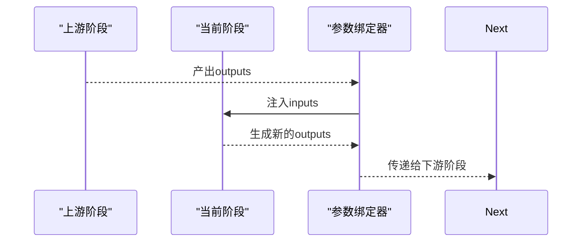
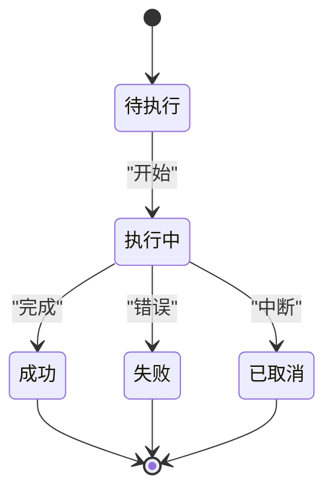
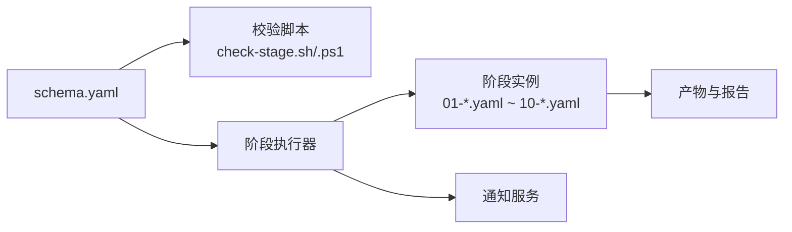

# 阶段清单Schema定义

<cite>
**本文档引用的文件**   
- [schema.yaml](file://stage-manifests/schema.yaml)
- [01-req-analysis.yaml](file://stage-manifests/01-req-analysis.yaml)
- [02-test-design.yaml](file://stage-manifests/02-test-design.yaml)
- [03-case-generation.yaml](file://stage-manifests/03-case-generation.yaml)
- [04-case-review.yaml](file://stage-manifests/04-case-review.yaml)
- [05-api-automation.yaml](file://stage-manifests/05-api-automation.yaml)
- [06-ui-automation.yaml](file://stage-manifests/06-ui-automation.yaml)
- [07-performance.yaml](file://stage-manifests/07-performance.yaml)
- [08-security.yaml](file://stage-manifests/08-security.yaml)
- [09-system-test-report.yaml](file://stage-manifests/09-system-test-report.yaml)
- [10-knowledge-base.yaml](file://stage-manifests/10-knowledge-base.yaml)
- [check-stage.sh](file://scripts/check-stage.sh)
- [check-stage.ps1](file://scripts/check-stage.ps1)
- [stage_contract.py](file://scripts/stage_contract.py)
</cite>

## 目录
1. [简介](#简介)
2. [项目结构](#项目结构)
3. [核心组件](#核心组件)
4. [架构总览](#架构总览)
5. [详细组件分析](#详细组件分析)
6. [依赖关系分析](#依赖关系分析)
7. [性能考虑](#性能考虑)
8. [故障排查指南](#故障排查指南)
9. [结论](#结论)
10. [附录](#附录)

## 简介
本技术文档围绕AutoTest Hub中的“阶段清单Schema”进行系统化说明，聚焦于stage-manifests/schema.yaml所定义的阶段清单数据结构规范。文档将深入解释：
- 所有必需字段与可选字段、数据类型与验证规则
- 阶段依赖关系定义、执行条件配置、参数传递机制与结果收集格式
- 阶段状态管理、错误处理模式与重试策略的配置方法
- 完整的字段参考手册（含义、取值范围、示例值）
- Schema版本兼容性与向后兼容策略
- Schema验证工具的使用方法与自定义扩展点实现指南

## 项目结构
与阶段清单Schema相关的核心位置如下：
- schema定义：stage-manifests/schema.yaml
- 阶段清单实例：stage-manifests/01-*.yaml 至 stage-manifests/10-*.yaml
- 校验与契约脚本：scripts/check-stage.sh、scripts/check-stage.ps1、scripts/stage_contract.py

图表来源
- [schema.yaml:1-200](file://stage-manifests/schema.yaml#L1-L200)
- [01-req-analysis.yaml:1-200](file://stage-manifests/01-req-analysis.yaml#L1-L200)
- [02-test-design.yaml:1-200](file://stage-manifests/02-test-design.yaml#L1-L200)
- [03-case-generation.yaml:1-200](file://stage-manifests/03-case-generation.yaml#L1-L200)
- [04-case-review.yaml:1-200](file://stage-manifests/04-case-review.yaml#L1-L200)
- [05-api-automation.yaml:1-200](file://stage-manifests/05-api-automation.yaml#L1-L200)
- [06-ui-automation.yaml:1-200](file://stage-manifests/06-ui-automation.yaml#L1-L200)
- [07-performance.yaml:1-200](file://stage-manifests/07-performance.yaml#L1-L200)
- [08-security.yaml:1-200](file://stage-manifests/08-security.yaml#L1-L200)
- [09-system-test-report.yaml:1-200](file://stage-manifests/09-system-test-report.yaml#L1-L200)
- [10-knowledge-base.yaml:1-200](file://stage-manifests/10-knowledge-base.yaml#L1-L200)

章节来源
- [schema.yaml:1-200](file://stage-manifests/schema.yaml#L1-L200)
- [check-stage.sh:1-200](file://scripts/check-stage.sh#L1-L200)
- [check-stage.ps1:1-200](file://scripts/check-stage.ps1#L1-L200)
- [stage_contract.py:1-200](file://scripts/stage_contract.py#L1-L200)

## 核心组件
- Schema根对象：包含元数据、阶段集合、全局配置等顶层键
- 阶段对象：描述单个阶段的标识、名称、类型、命令、依赖、条件、参数、产物、状态、错误与重试等
- 依赖关系：通过显式ID引用或表达式表达阶段间顺序与数据流转
- 执行条件：基于变量与环境布尔表达式控制阶段是否执行
- 参数传递：通过输入/输出映射在阶段间传递结构化数据
- 结果收集：统一产物结构与日志、指标、报告路径约定
- 状态管理：运行期状态机与持久化快照
- 错误处理：失败语义、恢复策略与告警
- 重试策略：次数、退避、幂等性要求

章节来源
- [schema.yaml:1-200](file://stage-manifests/schema.yaml#L1-L200)

## 架构总览
下图展示了阶段清单从定义到执行与校验的整体流程，以及各组件之间的交互关系。

图表来源
- [schema.yaml:1-200](file://stage-manifests/schema.yaml#L1-L200)
- [check-stage.sh:1-200](file://scripts/check-stage.sh#L1-L200)
- [check-stage.ps1:1-200](file://scripts/check-stage.ps1#L1-L200)
- [01-req-analysis.yaml:1-200](file://stage-manifests/01-req-analysis.yaml#L1-L200)
- [02-test-design.yaml:1-200](file://stage-manifests/02-test-design.yaml#L1-L200)
- [03-case-generation.yaml:1-200](file://stage-manifests/03-case-generation.yaml#L1-L200)
- [04-case-review.yaml:1-200](file://stage-manifests/04-case-review.yaml#L1-L200)
- [05-api-automation.yaml:1-200](file://stage-manifests/05-api-automation.yaml#L1-L200)
- [06-ui-automation.yaml:1-200](file://stage-manifests/06-ui-automation.yaml#L1-L200)
- [07-performance.yaml:1-200](file://stage-manifests/07-performance.yaml#L1-L200)
- [08-security.yaml:1-200](file://stage-manifests/08-security.yaml#L1-L200)
- [09-system-test-report.yaml:1-200](file://stage-manifests/09-system-test-report.yaml#L1-L200)
- [10-knowledge-base.yaml:1-200](file://stage-manifests/10-knowledge-base.yaml#L1-L200)

## 详细组件分析

### Schema根对象与版本兼容性
- 版本字段：用于声明Schema版本，驱动校验器选择对应规则集
- 元数据：作者、描述、更新时间等辅助信息
- 阶段集合：以列表或映射形式组织多个阶段对象
- 全局配置：环境变量、超时、并行度、缓存、存储路径等

兼容性要点
- 新增可选字段需保持向后兼容
- 废弃字段需保留兼容层并在警告中提示迁移建议
- 版本升级时提供迁移脚本或对照表

章节来源
- [schema.yaml:1-200](file://stage-manifests/schema.yaml#L1-L200)

### 阶段对象字段参考手册
以下为阶段对象的典型字段分类与说明（具体键名以schema.yaml为准）。每个字段均包含含义、类型、是否必需、默认值、取值范围与示例值指引。

- 基础信息
  - id：阶段唯一标识；字符串；必需；无默认；示例：见实例文件
  - name：人类可读名称；字符串；必需；无默认；示例：需求分析
  - description：阶段描述；字符串；可选；空串；示例：完成需求评审与基线化
  - tags：标签集合；字符串数组；可选；空数组；示例：["需求","评审"]

- 执行控制
  - type：阶段类型；枚举；必需；无默认；示例：script、api、ui、performance、security、report
  - command：执行命令或入口；字符串或对象；必需；无默认；示例：调用测试脚本
  - env：环境注入；键值映射；可选；空映射；示例：API_BASE_URL
  - timeout：最大执行时长；时间跨度；可选；默认由全局配置决定；示例：10m
  - parallel：是否允许并行；布尔；可选；默认false；示例：true
  - retry：重试策略；对象；可选；无默认；示例：见下方重试策略小节

- 依赖与条件
  - depends_on：前置阶段ID集合；字符串数组；可选；空数组；示例：["01-req-analysis"]
  - condition：执行条件表达式；字符串或对象；可选；空表达式；示例：基于变量与环境的布尔表达式
  - when：条件分支；对象；可选；无默认；示例：on_success/on_failure

- 参数与数据流
  - inputs：输入映射；对象；可选；空映射；示例：引用上游阶段输出
  - outputs：输出映射；对象；可选；空映射；示例：定义产物键与路径模板
  - artifacts：产物清单；对象或数组；可选；空清单；示例：报告、截图、覆盖率

- 状态与结果
  - status：运行期状态；枚举；只读；由执行器维护；示例：pending/running/success/failed/cancelled
  - result：结果摘要；对象；只读；由执行器写入；示例：耗时、指标、断言统计
  - logs：日志路径；字符串；只读；由执行器写入；示例：stdout/stderr归档路径

- 错误与告警
  - error_policy：错误策略；枚举；可选；默认继续或中止；示例：continue/fail-fast
  - alert：告警配置；对象；可选；无默认；示例：通知渠道与阈值

- 扩展点
  - hooks：钩子函数；对象；可选；无默认；示例：pre_run/post_run
  - metadata：自定义元数据；对象；可选；无默认；示例：业务相关扩展字段

注意：以上为通用字段模型，实际键名与约束以schema.yaml为准。

章节来源
- [schema.yaml:1-200](file://stage-manifests/schema.yaml#L1-L200)

### 阶段依赖关系定义
- 显式依赖：通过depends_on列出前置阶段ID，构建有向无环图（DAG）
- 条件依赖：结合condition与when实现动态依赖
- 循环检测：校验器需在加载阶段清单时进行环检测并报错
- 拓扑排序：执行器依据拓扑顺序调度阶段

图表来源
- [schema.yaml:1-200](file://stage-manifests/schema.yaml#L1-L200)

章节来源
- [schema.yaml:1-200](file://stage-manifests/schema.yaml#L1-L200)

### 执行条件配置
- 条件表达式：支持布尔逻辑、变量替换、环境判断
- 短路评估：当条件为假时跳过阶段，不进入执行队列
- 条件上下文：可访问全局变量、上游输出、运行时状态

图表来源
- [schema.yaml:1-200](file://stage-manifests/schema.yaml#L1-L200)

章节来源
- [schema.yaml:1-200](file://stage-manifests/schema.yaml#L1-L200)

### 参数传递机制
- 输入映射inputs：声明阶段所需的上游输出键
- 输出映射outputs：声明阶段产出的键与路径模板
- 数据绑定：执行器在阶段启动前注入inputs，完成后归档outputs
- 类型转换：根据Schema定义进行必要的数据类型校验与转换

图表来源
- [schema.yaml:1-200](file://stage-manifests/schema.yaml#L1-L200)

章节来源
- [schema.yaml:1-200](file://stage-manifests/schema.yaml#L1-L200)

### 结果收集格式
- 统一result结构：包含耗时、断言统计、指标摘要、关键路径
- artifacts清单：报告、截图、覆盖率、日志归档的路径与格式
- 标准化命名：便于检索与聚合展示

章节来源
- [schema.yaml:1-200](file://stage-manifests/schema.yaml#L1-L200)

### 阶段状态管理与错误处理
- 状态机：pending -> running -> success | failed | cancelled
- 失败语义：区分可恢复与不可恢复错误
- 错误策略：fail-fast立即终止流水线；continue继续执行其他阶段
- 告警：失败时触发通知，附带阶段上下文与产物链接

图表来源
- [schema.yaml:1-200](file://stage-manifests/schema.yaml#L1-L200)

章节来源
- [schema.yaml:1-200](file://stage-manifests/schema.yaml#L1-L200)

### 重试策略配置
- 次数与退避：固定次数、指数退避、抖动
- 幂等性：确保重试不会导致副作用重复
- 条件重试：仅对特定错误码或异常类型重试
- 资源清理：失败后清理中间态，避免污染下次重试

章节来源
- [schema.yaml:1-200](file://stage-manifests/schema.yaml#L1-L200)

### 阶段清单实例概览
以下实例文件展示了不同测试类型的阶段清单用法，可作为字段组合与最佳实践参考：
- 需求分析：01-req-analysis.yaml
- 测试设计：02-test-design.yaml
- 用例生成：03-case-generation.yaml
- 用例评审：04-case-review.yaml
- API自动化：05-api-automation.yaml
- UI自动化：06-ui-automation.yaml
- 性能测试：07-performance.yaml
- 安全测试：08-security.yaml
- 系统测试报告：09-system-test-report.yaml
- 知识库沉淀：10-knowledge-base.yaml

章节来源
- [01-req-analysis.yaml:1-200](file://stage-manifests/01-req-analysis.yaml#L1-L200)
- [02-test-design.yaml:1-200](file://stage-manifests/02-test-design.yaml#L1-L200)
- [03-case-generation.yaml:1-200](file://stage-manifests/03-case-generation.yaml#L1-L200)
- [04-case-review.yaml:1-200](file://stage-manifests/04-case-review.yaml#L1-L200)
- [05-api-automation.yaml:1-200](file://stage-manifests/05-api-automation.yaml#L1-L200)
- [06-ui-automation.yaml:1-200](file://stage-manifests/06-ui-automation.yaml#L1-L200)
- [07-performance.yaml:1-200](file://stage-manifests/07-performance.yaml#L1-L200)
- [08-security.yaml:1-200](file://stage-manifests/08-security.yaml#L1-L200)
- [09-system-test-report.yaml:1-200](file://stage-manifests/09-system-test-report.yaml#L1-L200)
- [10-knowledge-base.yaml:1-200](file://stage-manifests/10-knowledge-base.yaml#L1-L200)

## 依赖关系分析
- 耦合与内聚：阶段对象高内聚，依赖通过显式ID低耦合
- 直接依赖：depends_on指向的具体阶段
- 间接依赖：通过拓扑排序传播的上下游影响
- 外部依赖：执行器、校验器、存储与通知服务

图表来源
- [schema.yaml:1-200](file://stage-manifests/schema.yaml#L1-L200)
- [check-stage.sh:1-200](file://scripts/check-stage.sh#L1-L200)
- [check-stage.ps1:1-200](file://scripts/check-stage.ps1#L1-L200)
- [01-req-analysis.yaml:1-200](file://stage-manifests/01-req-analysis.yaml#L1-L200)
- [02-test-design.yaml:1-200](file://stage-manifests/02-test-design.yaml#L1-L200)
- [03-case-generation.yaml:1-200](file://stage-manifests/03-case-generation.yaml#L1-L200)
- [04-case-review.yaml:1-200](file://stage-manifests/04-case-review.yaml#L1-L200)
- [05-api-automation.yaml:1-200](file://stage-manifests/05-api-automation.yaml#L1-L200)
- [06-ui-automation.yaml:1-200](file://stage-manifests/06-ui-automation.yaml#L1-L200)
- [07-performance.yaml:1-200](file://stage-manifests/07-performance.yaml#L1-L200)
- [08-security.yaml:1-200](file://stage-manifests/08-security.yaml#L1-L200)
- [09-system-test-report.yaml:1-200](file://stage-manifests/09-system-test-report.yaml#L1-L200)
- [10-knowledge-base.yaml:1-200](file://stage-manifests/10-knowledge-base.yaml#L1-L200)

章节来源
- [schema.yaml:1-200](file://stage-manifests/schema.yaml#L1-L200)

## 性能考虑
- 并行执行：合理设置parallel与并发度，避免资源争用
- 超时控制：为长耗时阶段设置timeout，防止阻塞
- 产物压缩：对大体积报告与日志进行压缩归档
- 增量执行：利用inputs/outputs实现增量计算与缓存命中
- 资源隔离：为不同类型阶段分配独立工作空间

[本节为通用指导，无需代码来源]

## 故障排查指南
- 校验失败：使用check-stage.sh或check-stage.ps1定位字段缺失、类型错误或依赖环
- 执行失败：查看阶段logs与result，确认错误策略与重试配置
- 条件未满足：检查condition表达式与上下文变量
- 参数绑定错误：核对inputs/outputs键名与路径模板
- 状态卡住：检查执行器日志与资源占用，必要时重置状态

章节来源
- [check-stage.sh:1-200](file://scripts/check-stage.sh#L1-L200)
- [check-stage.ps1:1-200](file://scripts/check-stage.ps1#L1-L200)
- [stage_contract.py:1-200](file://scripts/stage_contract.py#L1-L200)

## 结论
本技术文档系统化梳理了AutoTest Hub的阶段清单Schema定义与使用方法，覆盖字段规范、依赖与条件、参数与结果、状态与错误、重试策略、版本兼容与扩展点，并提供校验工具与实例参考。遵循本指南可实现稳定、可观测、可扩展的测试流水线编排。

[本节为总结性内容，无需代码来源]

## 附录

### Schema验证工具使用方法
- 命令行校验（Linux/macOS）：
  - 执行：./scripts/check-stage.sh
  - 作用：加载schema.yaml并对阶段清单实例进行结构与约束校验
- 命令行校验（Windows PowerShell）：
  - 执行：.\scripts\check-stage.ps1
  - 作用：同上，适配PowerShell环境
- Python契约校验：
  - 执行：python scripts/stage_contract.py
  - 作用：基于Python实现的契约校验与诊断输出

章节来源
- [check-stage.sh:1-200](file://scripts/check-stage.sh#L1-L200)
- [check-stage.ps1:1-200](file://scripts/check-stage.ps1#L1-L200)
- [stage_contract.py:1-200](file://scripts/stage_contract.py#L1-L200)

### 自定义扩展点实现指南
- 扩展字段：在阶段对象metadata下添加业务相关键值，不影响核心校验
- 钩子函数：在hooks中定义pre_run/post_run回调，接入CI/CD或监控
- 插件类型：在type中注册自定义阶段类型，实现专用执行器
- 条件扩展：在condition中引入自定义函数或变量源，增强决策能力
- 产物扩展：在artifacts中定义新产物类型与归档策略

章节来源
- [schema.yaml:1-200](file://stage-manifests/schema.yaml#L1-L200)