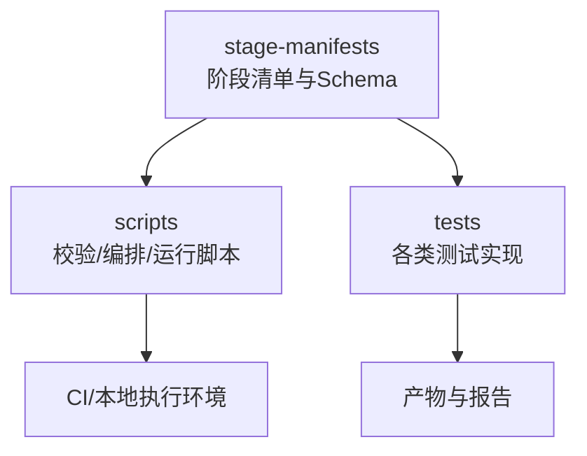
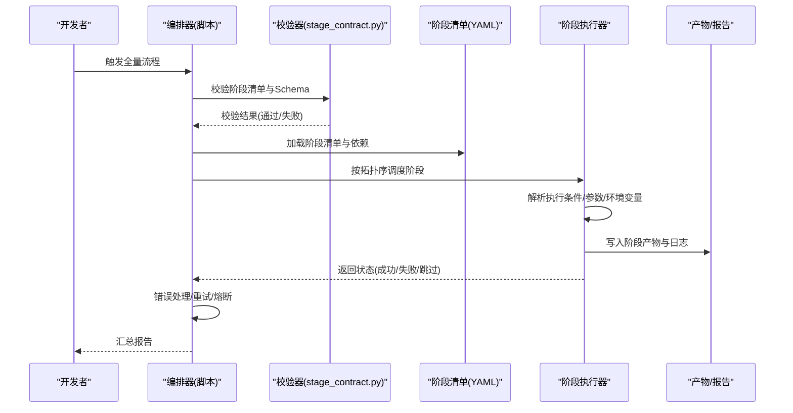
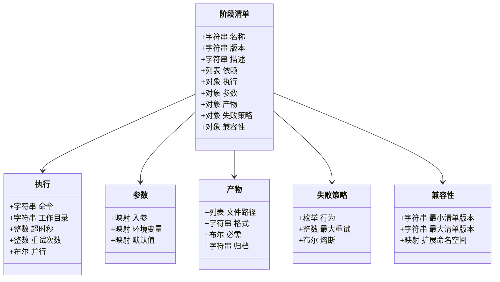
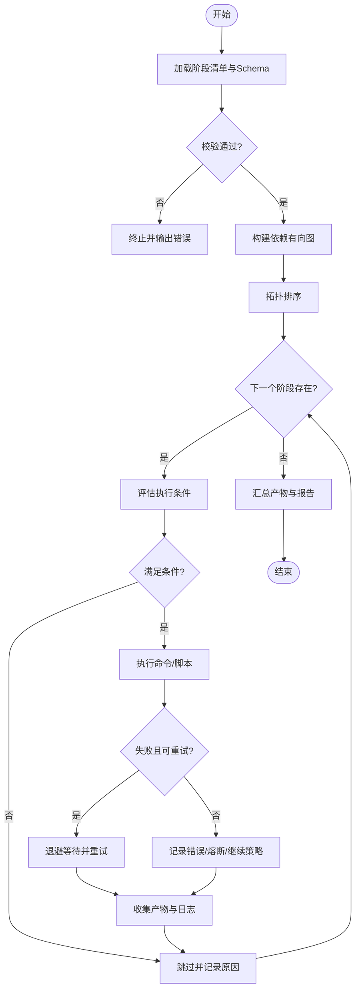
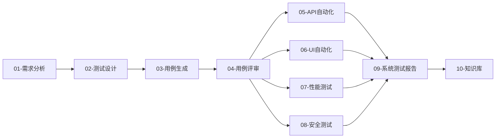

# 阶段清单管理

<cite>
**本文引用的文件**   
- [schema.yaml](file://stage-manifests/schema.yaml)
- [01-req-analysis.yaml](file://stage-manifests/01-req-analysis.yaml)
- [02-test-design.yaml](file://stage-manifests/02-test-design.yaml)
- [03-case-generation.yaml](file://stage-manifests/03-case-generation.yaml)
- [04-case-review.yaml](file://stage-manifests/04-case-review.yaml)
- [05-api-automation.yaml](file://stage-manifests/05-api-automation.yaml)
- [06-ui-automation.yaml](file://stage-manifests/06-ui-automation.yaml)
- [07-performance.yaml](file://stage-manifests/07-performance.yaml)
- [08-security.yaml](file://stage-manifests/08-security.yaml)
- [09-system-test-report.yaml](file://stage-manifests/09-system-test-report.yaml)
- [10-knowledge-base.yaml](file://stage-manifests/10-knowledge-base.yaml)
- [check-stage.sh](file://scripts/check-stage.sh)
- [check-stage.ps1](file://scripts/check-stage.ps1)
- [stage_contract.py](file://scripts/stage_contract.py)
- [run-full-test-flow.ps1](file://scripts/run-full-test-flow.ps1)
- [run-full-test-flow-simple.ps1](file://scripts/run-full-test-flow-simple.ps1)
- [run-api-tests.sh](file://scripts/run-api-tests.sh)
- [run-ui-tests.sh](file://scripts/run-ui-tests.sh)
- [run-perf-tests.sh](file://scripts/run-perf-tests.sh)
- [run-security-tests.sh](file://scripts/run-security-tests.sh)
</cite>

## 目录
1. [简介](#简介)
2. [项目结构](#项目结构)
3. [核心组件](#核心组件)
4. [架构总览](#架构总览)
5. [详细组件分析](#详细组件分析)
6. [依赖关系分析](#依赖关系分析)
7. [性能与稳定性考虑](#性能与稳定性考虑)
8. [故障排查指南](#故障排查指南)
9. [结论](#结论)
10. [附录](#附录)

## 简介
本技术文档面向AutoTest Hub的阶段清单管理系统，系统化说明基于YAML的测试阶段定义框架。内容覆盖需求分析、测试设计、用例生成、用例评审、API自动化、UI自动化、性能测试、安全测试等阶段的配置规范；深入解释schema.yaml定义的阶段清单数据结构（包括阶段依赖、执行条件、参数传递与结果收集）；文档化每个阶段清单文件的结构与字段含义，并提供完整配置示例与最佳实践；阐述阶段执行的编排逻辑、错误处理与重试机制；提供自定义阶段开发指南、模板使用方法与版本兼容性管理；并给出阶段清单验证工具与调试方法。

## 项目结构
阶段清单相关文件集中于stage-manifests目录，包含各阶段清单与统一的数据模式定义；脚本层提供校验、编排与运行能力。

**图表来源** 
- [schema.yaml:1-200](file://stage-manifests/schema.yaml#L1-L200)
- [check-stage.sh:1-200](file://scripts/check-stage.sh#L1-L200)
- [run-full-test-flow.ps1:1-200](file://scripts/run-full-test-flow.ps1#L1-L200)

**章节来源**
- [schema.yaml:1-200](file://stage-manifests/schema.yaml#L1-L200)
- [check-stage.sh:1-200](file://scripts/check-stage.sh#L1-L200)
- [run-full-test-flow.ps1:1-200](file://scripts/run-full-test-flow.ps1#L1-L200)

## 核心组件
- 阶段清单Schema：集中定义阶段清单的数据模型、约束与语义，确保所有阶段清单一致可校验。
- 阶段清单文件：每个阶段一个YAML文件，描述该阶段的元数据、输入输出、依赖、执行命令、环境变量、产物与失败策略等。
- 校验与契约工具：对阶段清单进行语法与语义校验，保障清单与运行时契约一致。
- 编排与运行脚本：按依赖顺序调度阶段执行，支持条件跳过、重试、超时、产物收集与报告汇总。

**章节来源**
- [schema.yaml:1-200](file://stage-manifests/schema.yaml#L1-L200)
- [stage_contract.py:1-200](file://scripts/stage_contract.py#L1-L200)
- [check-stage.sh:1-200](file://scripts/check-stage.sh#L1-L200)
- [check-stage.ps1:1-200](file://scripts/check-stage.ps1#L1-L200)

## 架构总览
阶段清单系统由“清单定义—校验—编排—执行—产物”五层构成。编排器读取schema与阶段清单，解析依赖图，按拓扑序执行阶段；每阶段通过命令与环境变量驱动具体测试实现，产出标准化产物供后续阶段消费。

**图表来源** 
- [schema.yaml:1-200](file://stage-manifests/schema.yaml#L1-L200)
- [stage_contract.py:1-200](file://scripts/stage_contract.py#L1-L200)
- [run-full-test-flow.ps1:1-200](file://scripts/run-full-test-flow.ps1#L1-L200)

## 详细组件分析

### Schema与数据结构
- 作用：定义阶段清单的必填字段、类型、枚举值、依赖关系、执行条件、参数传递、产物收集与失败策略等。
- 关键字段类别（概念性说明）：
  - 元信息：名称、版本、描述、标签
  - 依赖：前置阶段集合、条件表达式
  - 执行：命令、工作目录、超时、重试次数、并发度
  - 参数与环境：入参、默认值、注入的环境变量、敏感项标记
  - 产物：文件路径、格式、是否必需、归档方式
  - 失败策略：继续/中断、重试、回滚
  - 兼容性与扩展：最小/最大清单版本、扩展字段命名空间

**图表来源** 
- [schema.yaml:1-200](file://stage-manifests/schema.yaml#L1-L200)

**章节来源**
- [schema.yaml:1-200](file://stage-manifests/schema.yaml#L1-L200)

### 阶段清单文件结构与字段含义
以下对各阶段清单文件进行结构化说明（字段以概念性描述为主，避免直接粘贴源码）。

- 01-需求分析
  - 目标：将需求文档转换为结构化需求条目与验收标准。
  - 关键配置：输入源（需求文档路径）、输出（需求条目清单）、依赖（无或仅基础环境准备）、产物（需求索引与覆盖率矩阵）。
  
- 02-测试设计
  - 目标：基于需求生成测试策略、场景与边界条件。
  - 关键配置：输入（需求条目）、输出（测试设计文档）、依赖（01）、产物（设计文档与用例骨架）。

- 03-用例生成
  - 目标：从测试设计自动生成用例集（接口/UI/性能/安全等）。
  - 关键配置：输入（测试设计）、模板/规则、输出（用例文件）、依赖（02）、产物（用例清单与覆盖矩阵）。

- 04-用例评审
  - 目标：组织评审流程，记录评审意见与修订闭环。
  - 关键配置：输入（用例清单）、评审规则、输出（评审结论与修订记录）、依赖（03）、产物（评审报告）。

- 05-API自动化
  - 目标：执行接口自动化测试套件，生成报告与断言结果。
  - 关键配置：输入（用例集与环境配置）、命令（pytest/自定义runner）、超时/重试、产物（HTML/JSON报告、日志、覆盖率）。

- 06-UI自动化
  - 目标：执行UI端到端测试，采集截图/视频/trace。
  - 关键配置：输入（用例集与浏览器/设备配置）、命令（Playwright/自定义runner）、产物（截图/视频/trace/报告）。

- 07-性能测试
  - 目标：执行负载/压力测试，采集吞吐、延迟、资源指标。
  - 关键配置：输入（压测脚本与负载模型）、命令（Locust/JMeter）、产物（性能报告与指标）。

- 08-安全测试
  - 目标：执行静态/动态安全扫描，输出漏洞清单与修复建议。
  - 关键配置：输入（代码/制品/接口）、扫描器命令、产物（漏洞报告与风险等级）。

- 09-系统测试报告
  - 目标：聚合多阶段产物，生成综合质量报告。
  - 关键配置：输入（各阶段产物）、模板、输出（综合报告）、依赖（05~08）。

- 10-知识库
  - 目标：沉淀测试资产、经验与回归基线。
  - 关键配置：输入（报告与产物）、索引规则、输出（知识库条目）、依赖（09）。

**图表来源** 
- [schema.yaml:1-200](file://stage-manifests/schema.yaml#L1-L200)
- [run-full-test-flow.ps1:1-200](file://scripts/run-full-test-flow.ps1#L1-L200)

**章节来源**
- [01-req-analysis.yaml:1-200](file://stage-manifests/01-req-analysis.yaml#L1-L200)
- [02-test-design.yaml:1-200](file://stage-manifests/02-test-design.yaml#L1-L200)
- [03-case-generation.yaml:1-200](file://stage-manifests/03-case-generation.yaml#L1-L200)
- [04-case-review.yaml:1-200](file://stage-manifests/04-case-review.yaml#L1-L200)
- [05-api-automation.yaml:1-200](file://stage-manifests/05-api-automation.yaml#L1-L200)
- [06-ui-automation.yaml:1-200](file://stage-manifests/06-ui-automation.yaml#L1-L200)
- [07-performance.yaml:1-200](file://stage-manifests/07-performance.yaml#L1-L200)
- [08-security.yaml:1-200](file://stage-manifests/08-security.yaml#L1-L200)
- [09-system-test-report.yaml:1-200](file://stage-manifests/09-system-test-report.yaml#L1-L200)
- [10-knowledge-base.yaml:1-200](file://stage-manifests/10-knowledge-base.yaml#L1-L200)

### 阶段执行编排与错误处理
- 编排逻辑
  - 读取schema与阶段清单，构建依赖图并进行拓扑排序。
  - 逐阶段评估执行条件（如环境开关、前置产物是否存在、参数有效性）。
  - 按顺序调用阶段执行器，传入参数与环境变量，收集产物与日志。
- 错误处理与重试
  - 支持失败重试与指数退避，受阶段失败策略控制。
  - 支持熔断：当连续失败超过阈值时中止后续阶段。
  - 支持继续策略：在部分失败情况下仍可推进非阻塞下游阶段。
- 产物与报告
  - 标准化产物目录结构，便于下游阶段引用。
  - 汇总阶段状态与产物摘要，生成最终报告。

**章节来源**
- [run-full-test-flow.ps1:1-200](file://scripts/run-full-test-flow.ps1#L1-L200)
- [run-full-test-flow-simple.ps1:1-200](file://scripts/run-full-test-flow-simple.ps1#L1-L200)
- [schema.yaml:1-200](file://stage-manifests/schema.yaml#L1-L200)

### 阶段清单验证工具与调试方法
- 校验工具
  - 命令行校验脚本：检查清单语法、必填字段、依赖完整性与类型约束。
  - 契约校验器：基于schema进行强类型校验，输出详细错误定位。
- 调试方法
  - 单阶段调试：指定阶段ID，仅执行该阶段并打印详细日志。
  - 条件分支调试：打印执行条件评估结果与跳过原因。
  - 产物预览：列出预期产物与实际产物差异。
  - 版本兼容检查：对比当前清单版本与最小/最大兼容版本。

**章节来源**
- [check-stage.sh:1-200](file://scripts/check-stage.sh#L1-L200)
- [check-stage.ps1:1-200](file://scripts/check-stage.ps1#L1-L200)
- [stage_contract.py:1-200](file://scripts/stage_contract.py#L1-L200)

### 各阶段运行脚本集成
- API自动化
  - 使用独立脚本执行接口测试套件，支持环境切换与报告输出。
- UI自动化
  - 使用独立脚本执行UI测试，支持浏览器/设备选择与产物归档。
- 性能测试
  - 使用独立脚本执行压测任务，支持负载模型与指标导出。
- 安全测试
  - 使用独立脚本执行安全扫描，支持扫描器参数与漏洞报告。

**章节来源**
- [run-api-tests.sh:1-200](file://scripts/run-api-tests.sh#L1-L200)
- [run-ui-tests.sh:1-200](file://scripts/run-ui-tests.sh#L1-L200)
- [run-perf-tests.sh:1-200](file://scripts/run-perf-tests.sh#L1-L200)
- [run-security-tests.sh:1-200](file://scripts/run-security-tests.sh#L1-L200)

## 依赖关系分析
- 阶段间依赖
  - 01→02→03→04→(05,06,07,08)→09→10
  - 05~08可并行执行（若资源允许），但需保证上游产物可用。
- 产物依赖
  - 下游阶段通过约定路径访问上游产物，需在清单中明确声明。
- 条件依赖
  - 可通过执行条件表达式控制阶段跳过或强制执行。

**图表来源** 
- [01-req-analysis.yaml:1-200](file://stage-manifests/01-req-analysis.yaml#L1-L200)
- [02-test-design.yaml:1-200](file://stage-manifests/02-test-design.yaml#L1-L200)
- [03-case-generation.yaml:1-200](file://stage-manifests/03-case-generation.yaml#L1-L200)
- [04-case-review.yaml:1-200](file://stage-manifests/04-case-review.yaml#L1-L200)
- [05-api-automation.yaml:1-200](file://stage-manifests/05-api-automation.yaml#L1-L200)
- [06-ui-automation.yaml:1-200](file://stage-manifests/06-ui-automation.yaml#L1-L200)
- [07-performance.yaml:1-200](file://stage-manifests/07-performance.yaml#L1-L200)
- [08-security.yaml:1-200](file://stage-manifests/08-security.yaml#L1-L200)
- [09-system-test-report.yaml:1-200](file://stage-manifests/09-system-test-report.yaml#L1-L200)
- [10-knowledge-base.yaml:1-200](file://stage-manifests/10-knowledge-base.yaml#L1-L200)

**章节来源**
- [schema.yaml:1-200](file://stage-manifests/schema.yaml#L1-L200)
- [run-full-test-flow.ps1:1-200](file://scripts/run-full-test-flow.ps1#L1-L200)

## 性能与稳定性考虑
- 并行执行：对无数据竞争的非阻塞阶段（如05~08）启用并行以提升吞吐。
- 资源隔离：为不同阶段分配独立工作目录与临时空间，避免IO冲突。
- 超时与重试：合理设置超时与重试上限，防止长时间挂起与雪崩。
- 产物压缩：对大体积产物进行归档与增量上传，减少存储与传输开销。
- 缓存复用：对不频繁变更的依赖（如镜像、包）进行缓存，缩短冷启动时间。

[本节为通用指导，无需特定文件来源]

## 故障排查指南
- 清单校验失败
  - 使用校验脚本与契约校验器定位字段缺失、类型错误或依赖不完整问题。
- 阶段执行失败
  - 查看阶段日志与退出码，确认命令是否正确、环境变量是否注入、产物路径是否可达。
- 条件跳过异常
  - 打印条件评估中间结果，核对前置产物是否存在与参数有效性。
- 重试与熔断
  - 调整失败策略中的重试次数与熔断阈值，观察是否缓解瞬时不稳定。
- 产物缺失
  - 对照清单中产物声明与实际输出目录，修正路径或归档策略。

**章节来源**
- [check-stage.sh:1-200](file://scripts/check-stage.sh#L1-L200)
- [check-stage.ps1:1-200](file://scripts/check-stage.ps1#L1-L200)
- [stage_contract.py:1-200](file://scripts/stage_contract.py#L1-L200)

## 结论
阶段清单管理系统通过统一的Schema与清单文件，实现了测试全流程的可配置化与可观测化。借助校验与编排工具，系统能够稳定地驱动多阶段测试执行，并在错误与不稳定环境下具备重试与熔断能力。配合完善的产物与报告机制，团队可获得一致的交付质量与高效的回归效率。

[本节为总结性内容，无需特定文件来源]

## 附录

### 自定义阶段开发指南
- 步骤
  - 新增阶段清单文件：遵循schema定义，填写元信息、依赖、执行命令、参数与产物。
  - 编写执行脚本：封装具体测试实现，遵循统一入口与退出码约定。
  - 注册到编排器：确保依赖图正确，必要时添加条件与重试策略。
  - 验证与联调：使用校验工具与单阶段调试快速定位问题。
- 最佳实践
  - 幂等执行：同一清单重复执行应得到一致结果。
  - 清晰产物：产物命名与路径遵循约定，便于下游消费。
  - 可观测性：输出结构化日志与指标，便于追踪与告警。

**章节来源**
- [schema.yaml:1-200](file://stage-manifests/schema.yaml#L1-L200)
- [stage_contract.py:1-200](file://scripts/stage_contract.py#L1-L200)

### 阶段模板使用方法
- 模板要点
  - 提供最小可用清单样例，涵盖必填字段与常见可选配置。
  - 标注字段注释与取值范围，降低上手成本。
- 使用方式
  - 复制模板为新阶段清单，按需修改字段与命令。
  - 使用校验工具快速验证模板适配性。

**章节来源**
- [schema.yaml:1-200](file://stage-manifests/schema.yaml#L1-L200)

### 版本兼容性管理
- 清单版本
  - 通过最小/最大兼容版本控制演进节奏，避免破坏性变更。
- 向后兼容
  - 新增字段需保持默认值与旧版行为一致。
- 升级策略
  - 提供迁移脚本与提示，逐步淘汰废弃字段。

**章节来源**
- [schema.yaml:1-200](file://stage-manifests/schema.yaml#L1-L200)