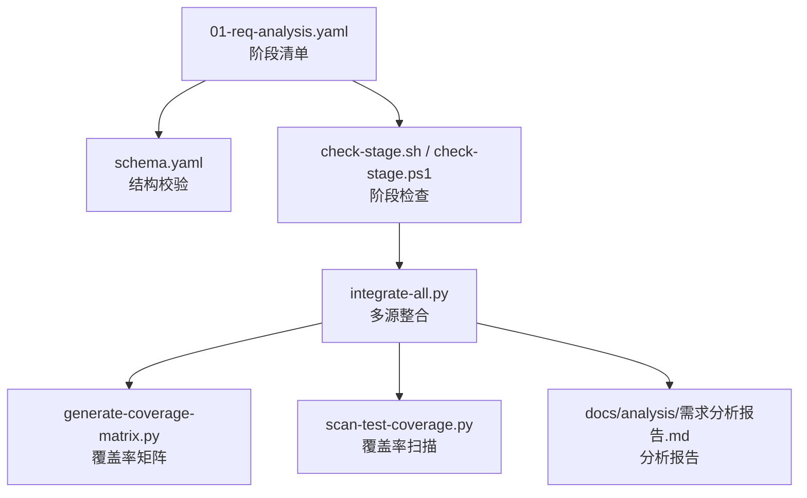
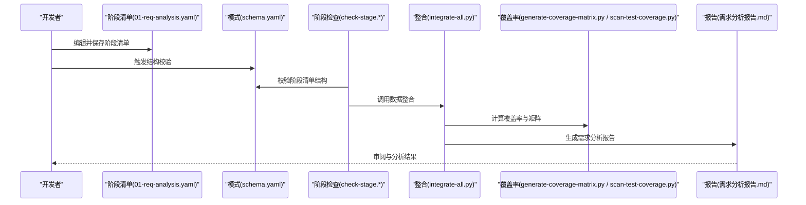
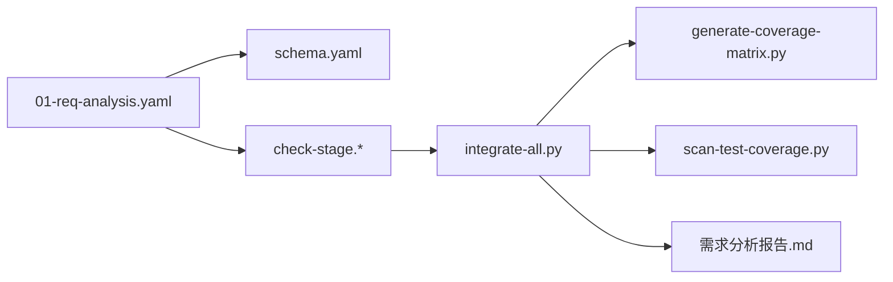
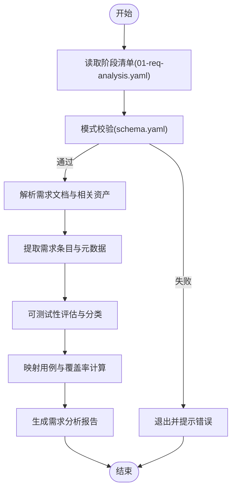

# 需求分析阶段

<cite>
**本文档引用的文件**   
- [01-req-analysis.yaml](file://stage-manifests/01-req-analysis.yaml)
- [schema.yaml](file://stage-manifests/schema.yaml)
- [需求分析报告.md](file://docs/analysis/需求分析报告.md)
- [check-stage.sh](file://scripts/check-stage.sh)
- [check-stage.ps1](file://scripts/check-stage.ps1)
- [integrate-all.py](file://scripts/integrate-all.py)
- [generate-coverage-matrix.py](file://scripts/generate-coverage-matrix.py)
- [scan-test-coverage.py](file://scripts/scan-test-coverage.py)
</cite>

## 目录
1. [简介](#简介)
2. [项目结构](#项目结构)
3. [核心组件](#核心组件)
4. [架构总览](#架构总览)
5. [详细组件分析](#详细组件分析)
6. [依赖分析](#依赖分析)
7. [性能考虑](#性能考虑)
8. [故障排查指南](#故障排查指南)
9. [结论](#结论)
10. [附录](#附录)

## 简介
本章节面向AutoTest Hub的需求分析阶段，提供基于01-req-analysis.yaml的完整使用文档。内容涵盖：
- 需求收集、分析与验证的自动化流程说明
- 需求文档解析、条目提取、可测试性评估与覆盖率分析的机制
- 输入输出格式、数据流转与处理逻辑
- 任务配置示例（需求文件路径、分析规则、报告生成、缺陷追踪集成）
- 与AI辅助工具的集成方式（理解、分类、自动标注）
- 需求变更跟踪与影响分析的自动化配置方法

## 项目结构
需求分析阶段的核心配置文件位于 stage-manifests/01-req-analysis.yaml，配合 schema.yaml 进行校验；脚本层通过 check-stage.* 执行阶段检查，并通过 integrate-all.py、generate-coverage-matrix.py、scan-test-coverage.py 等脚本完成数据整合与覆盖率分析；最终产出以 docs/analysis/需求分析报告.md 的形式呈现。

图表来源
- [01-req-analysis.yaml](file://stage-manifests/01-req-analysis.yaml)
- [schema.yaml](file://stage-manifests/schema.yaml)
- [check-stage.sh](file://scripts/check-stage.sh)
- [check-stage.ps1](file://scripts/check-stage.ps1)
- [integrate-all.py](file://scripts/integrate-all.py)
- [generate-coverage-matrix.py](file://scripts/generate-coverage-matrix.py)
- [scan-test-coverage.py](file://scripts/scan-test-coverage.py)
- [需求分析报告.md](file://docs/analysis/需求分析报告.md)

章节来源
- [01-req-analysis.yaml](file://stage-manifests/01-req-analysis.yaml)
- [schema.yaml](file://stage-manifests/schema.yaml)
- [check-stage.sh](file://scripts/check-stage.sh)
- [check-stage.ps1](file://scripts/check-stage.ps1)
- [integrate-all.py](file://scripts/integrate-all.py)
- [generate-coverage-matrix.py](file://scripts/generate-coverage-matrix.py)
- [scan-test-coverage.py](file://scripts/scan-test-coverage.py)
- [需求分析报告.md](file://docs/analysis/需求分析报告.md)

## 核心组件
- 阶段清单（01-req-analysis.yaml）
  - 定义需求分析阶段的输入、规则、工具链、输出与质量门禁
  - 包含需求文件路径、解析策略、分析规则、报告模板、覆盖率阈值、缺陷追踪集成等
- 模式校验（schema.yaml）
  - 对阶段清单的结构进行强约束，确保字段完整性与类型正确性
- 阶段检查脚本（check-stage.*）
  - 负责运行阶段前置检查、依赖校验、环境准备与结果汇总
- 数据整合与覆盖率脚本（integrate-all.py、generate-coverage-matrix.py、scan-test-coverage.py）
  - 聚合多源数据、计算覆盖率、生成矩阵与统计指标
- 分析报告（需求分析报告.md）
  - 标准化输出，包含需求条目、可测试性评分、覆盖率与问题清单

章节来源
- [01-req-analysis.yaml](file://stage-manifests/01-req-analysis.yaml)
- [schema.yaml](file://stage-manifests/schema.yaml)
- [check-stage.sh](file://scripts/check-stage.sh)
- [check-stage.ps1](file://scripts/check-stage.ps1)
- [integrate-all.py](file://scripts/integrate-all.py)
- [generate-coverage-matrix.py](file://scripts/generate-coverage-matrix.py)
- [scan-test-coverage.py](file://scripts/scan-test-coverage.py)
- [需求分析报告.md](file://docs/analysis/需求分析报告.md)

## 架构总览
下图展示了从配置到产出的端到端流程：阶段清单驱动校验与执行，脚本层完成解析、分析、整合与报告生成，最终形成标准化的需求分析报告与覆盖率矩阵。

图表来源
- [01-req-analysis.yaml](file://stage-manifests/01-req-analysis.yaml)
- [schema.yaml](file://stage-manifests/schema.yaml)
- [check-stage.sh](file://scripts/check-stage.sh)
- [check-stage.ps1](file://scripts/check-stage.ps1)
- [integrate-all.py](file://scripts/integrate-all.py)
- [generate-coverage-matrix.py](file://scripts/generate-coverage-matrix.py)
- [scan-test-coverage.py](file://scripts/scan-test-coverage.py)
- [需求分析报告.md](file://docs/analysis/需求分析报告.md)

## 详细组件分析

### 阶段清单（01-req-analysis.yaml）结构与配置选项
- 目标与作用
  - 统一描述需求分析阶段的输入来源、处理规则、工具链、输出产物与质量门禁
- 关键配置项（概念说明）
  - 输入来源：需求文档路径、原型或接口文档路径、历史需求基线
  - 解析策略：文档类型识别、结构化抽取规则、命名规范
  - 分析规则：需求分类、优先级、可测试性评估、覆盖度判定
  - 工具链：AI辅助（理解、分类、标注）、静态检查、覆盖率工具
  - 输出产物：需求条目清单、可测试性评分、覆盖率矩阵、问题清单
  - 质量门禁：覆盖率阈值、可测试性门槛、缺陷密度上限
  - 集成配置：缺陷追踪系统（如Jira）、知识库、CI流水线
- 建议的组织方式
  - 将“需求文件路径”“分析规则”“报告模板”“覆盖率阈值”“缺陷追踪”分节管理，便于维护与复用

章节来源
- [01-req-analysis.yaml](file://stage-manifests/01-req-analysis.yaml)
- [schema.yaml](file://stage-manifests/schema.yaml)

### 模式校验（schema.yaml）
- 作用
  - 对阶段清单进行强类型校验，确保关键字段存在且格式正确
- 典型约束
  - 必填字段、枚举值、数值范围、数组元素类型、嵌套对象结构
- 使用方式
  - 在阶段检查时优先执行，失败则阻断后续流程

章节来源
- [schema.yaml](file://stage-manifests/schema.yaml)

### 阶段检查（check-stage.sh / check-stage.ps1）
- 职责
  - 执行阶段前置检查、依赖校验、环境准备、阶段清单校验与结果汇总
- 行为要点
  - 支持跨平台（Shell/PowerShell），统一入口，错误码与日志输出

章节来源
- [check-stage.sh](file://scripts/check-stage.sh)
- [check-stage.ps1](file://scripts/check-stage.ps1)

### 数据整合与覆盖率（integrate-all.py / generate-coverage-matrix.py / scan-test-coverage.py）
- 数据整合（integrate-all.py）
  - 聚合多源需求与用例数据，去重与对齐标识，构建统一视图
- 覆盖率矩阵（generate-coverage-matrix.py）
  - 基于需求条目与用例映射生成覆盖率矩阵，统计覆盖率与缺口
- 覆盖率扫描（scan-test-coverage.py）
  - 扫描现有测试资产，计算覆盖率指标，输出统计摘要

章节来源
- [integrate-all.py](file://scripts/integrate-all.py)
- [generate-coverage-matrix.py](file://scripts/generate-coverage-matrix.py)
- [scan-test-coverage.py](file://scripts/scan-test-coverage.py)

### 分析报告（需求分析报告.md）
- 内容组成
  - 需求条目清单、可测试性评估、覆盖率统计、问题与改进建议
- 更新机制
  - 由整合与覆盖率脚本驱动生成，保持与输入一致

章节来源
- [需求分析报告.md](file://docs/analysis/需求分析报告.md)

## 依赖分析
- 组件耦合
  - 阶段清单驱动校验与执行；脚本层依赖清单中的路径与规则；报告为最终产物
- 外部依赖
  - 可能涉及AI服务API、缺陷追踪系统API、CI/CD环境
- 潜在风险
  - 路径不一致、规则不匹配、覆盖率阈值过严导致阻塞

图表来源
- [01-req-analysis.yaml](file://stage-manifests/01-req-analysis.yaml)
- [schema.yaml](file://stage-manifests/schema.yaml)
- [check-stage.sh](file://scripts/check-stage.sh)
- [check-stage.ps1](file://scripts/check-stage.ps1)
- [integrate-all.py](file://scripts/integrate-all.py)
- [generate-coverage-matrix.py](file://scripts/generate-coverage-matrix.py)
- [scan-test-coverage.py](file://scripts/scan-test-coverage.py)
- [需求分析报告.md](file://docs/analysis/需求分析报告.md)

章节来源
- [01-req-analysis.yaml](file://stage-manifests/01-req-analysis.yaml)
- [schema.yaml](file://stage-manifests/schema.yaml)
- [check-stage.sh](file://scripts/check-stage.sh)
- [check-stage.ps1](file://scripts/check-stage.ps1)
- [integrate-all.py](file://scripts/integrate-all.py)
- [generate-coverage-matrix.py](file://scripts/generate-coverage-matrix.py)
- [scan-test-coverage.py](file://scripts/scan-test-coverage.py)
- [需求分析报告.md](file://docs/analysis/需求分析报告.md)

## 性能考虑
- 大文档解析
  - 采用流式读取与增量解析，避免一次性加载全部文本
- 覆盖率计算
  - 缓存中间结果，按需刷新；对大规模用例集进行并行扫描
- 报告生成
  - 模板化与分页渲染，减少内存占用
- 资源限制
  - 设置超时与重试策略，防止长时间阻塞

[本节为通用指导，无需特定文件引用]

## 故障排查指南
- 阶段清单校验失败
  - 检查schema.yaml约束是否满足，确认必填字段与类型正确
- 路径或权限问题
  - 核对需求文件路径、输出目录权限与相对路径一致性
- 覆盖率异常
  - 检查用例与需求映射关系，确认覆盖率阈值配置合理
- 集成失败
  - 核查AI服务与缺陷追踪系统的凭据与网络连通性

章节来源
- [schema.yaml](file://stage-manifests/schema.yaml)
- [check-stage.sh](file://scripts/check-stage.sh)
- [check-stage.ps1](file://scripts/check-stage.ps1)
- [integrate-all.py](file://scripts/integrate-all.py)
- [generate-coverage-matrix.py](file://scripts/generate-coverage-matrix.py)
- [scan-test-coverage.py](file://scripts/scan-test-coverage.py)

## 结论
通过01-req-analysis.yaml与配套脚本，可实现需求分析阶段的端到端自动化：从文档解析、条目提取、可测试性评估到覆盖率分析与报告生成。结合AI辅助与缺陷追踪集成，能够显著提升需求质量与可追溯性。建议在团队内统一配置模板与阈值，持续优化规则与工具链，保障交付质量。

[本节为总结性内容，无需特定文件引用]

## 附录

### 配置示例（概念性）
- 需求文件路径
  - 指定需求文档、原型与接口文档的路径集合
- 分析规则
  - 定义分类维度（功能/非功能）、优先级、可测试性评分规则、覆盖度判定
- 报告生成
  - 选择报告模板、输出路径、语言与编码
- 覆盖率阈值
  - 设置最低覆盖率与可测试性门槛，作为质量门禁
- 缺陷追踪集成
  - 配置缺陷系统URL、认证信息、标签与状态映射

[本节为概念性说明，无需特定文件引用]

### 数据流转与处理逻辑

图表来源
- [01-req-analysis.yaml](file://stage-manifests/01-req-analysis.yaml)
- [schema.yaml](file://stage-manifests/schema.yaml)
- [需求分析报告.md](file://docs/analysis/需求分析报告.md)

### AI辅助集成（概念性）
- 需求理解
  - 利用AI对自然语言需求进行语义解析，抽取实体与关系
- 智能分类
  - 基于上下文与规则库自动归类需求类别与优先级
- 自动标注
  - 为需求条目添加标签、版本信息与关联用例ID

[本节为概念性说明，无需特定文件引用]

### 需求变更跟踪与影响分析（概念性）
- 变更采集
  - 监控需求文档与版本控制变更，记录差异
- 影响分析
  - 基于依赖关系推断受影响用例与模块
- 自动化配置
  - 在阶段清单中声明变更检测规则与影响分析策略，联动覆盖率与报告更新

[本节为概念性说明，无需特定文件引用]