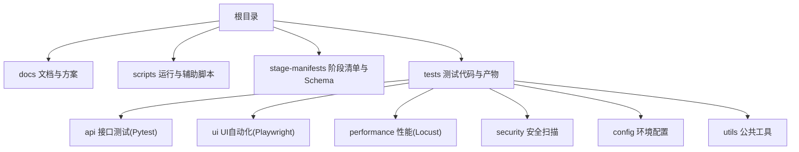
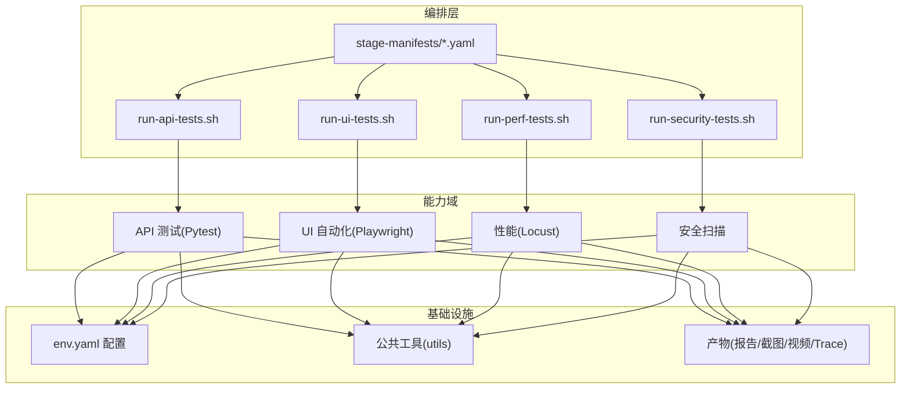
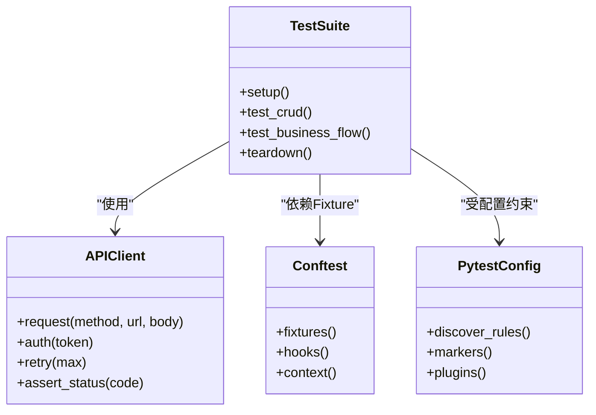
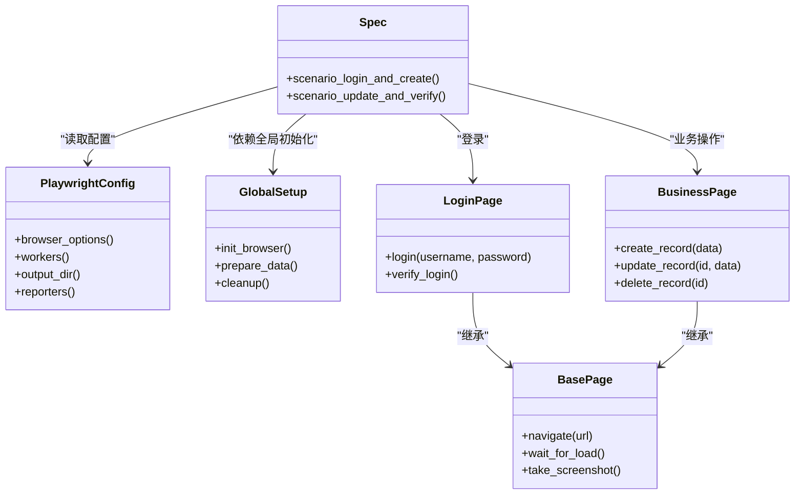
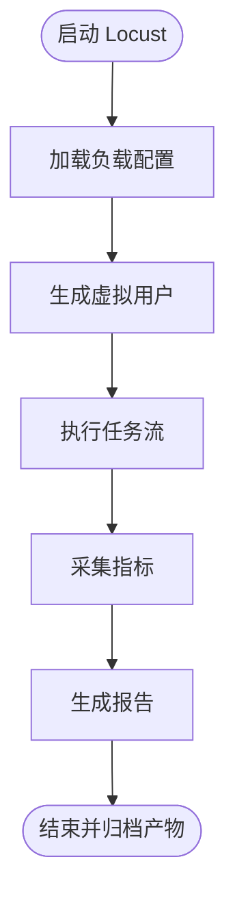
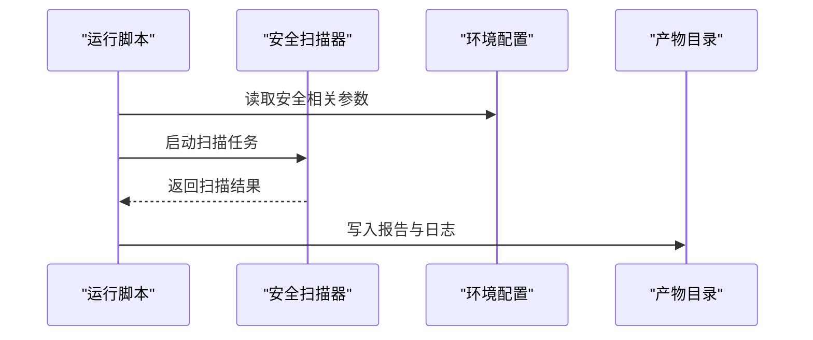
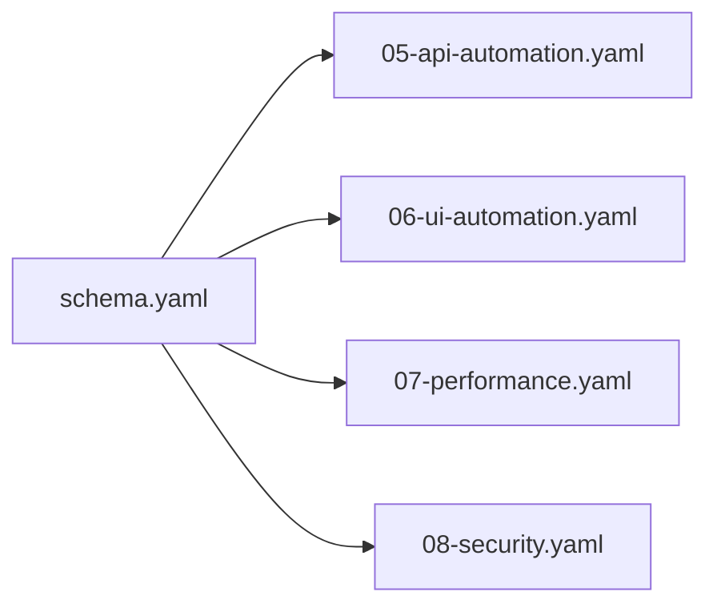
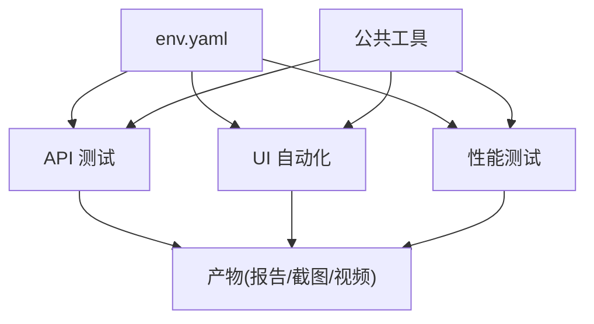

# 项目概述

<cite>
**本文引用的文件**   
- [tests/ui/playwright.config.ts](file://tests/ui/playwright.config.ts)
- [tests/api/conftest.py](file://tests/api/conftest.py)
- [tests/api/pytest.ini](file://tests/api/pytest.ini)
- [tests/config/env.yaml](file://tests/config/env.yaml)
- [tests/performance/locust/README.md](file://tests/performance/locust/README.md)
- [tests/performance/locust/requirements.txt](file://tests/performance/locust/requirements.txt)
- [scripts/run-api-tests.sh](file://scripts/run-api-tests.sh)
- [scripts/run-ui-tests.sh](file://scripts/run-ui-tests.sh)
- [scripts/run-perf-tests.sh](file://scripts/run-perf-tests.sh)
- [scripts/run-security-tests.sh](file://scripts/run-security-tests.sh)
- [stage-manifests/schema.yaml](file://stage-manifests/schema.yaml)
- [stage-manifests/05-api-automation.yaml](file://stage-manifests/05-api-automation.yaml)
- [stage-manifests/06-ui-automation.yaml](file://stage-manifests/06-ui-automation.yaml)
- [stage-manifests/07-performance.yaml](file://stage-manifests/07-performance.yaml)
- [stage-manifests/08-security.yaml](file://stage-manifests/08-security.yaml)
</cite>

## 目录
1. [简介](#简介)
2. [项目结构](#项目结构)
3. [核心组件](#核心组件)
4. [架构总览](#架构总览)
5. [详细组件分析](#详细组件分析)
6. [依赖分析](#依赖分析)
7. [性能考量](#性能考量)
8. [故障排查指南](#故障排查指南)
9. [结论](#结论)
10. [附录：快速开始](#附录快速开始)

## 简介
AutoTest Hub 是一个面向 CRM 系统的综合性自动化测试框架，覆盖 API 接口、UI 自动化、性能与安全等多维度测试。框架以 Python 与 TypeScript 为主语言，结合 Pytest、Playwright、Locust 等主流工具，提供从用例设计、数据准备、执行编排到报告产出的完整闭环。其设计理念强调“可维护、可扩展、可观测”，通过分层抽象（客户端封装、页面对象、配置与环境管理）和阶段化流水线（Stage Manifest），实现跨团队、跨环境的稳定交付。

核心价值
- 统一入口与标准化流程：通过脚本与清单驱动多类型测试的统一编排
- 高内聚低耦合：按能力域划分模块，降低变更影响面
- 可观测与可回溯：集中产物输出（截图、视频、Trace、报告）便于定位问题
- 环境可配置：基于 YAML 的环境配置与参数化，支持多环境切换
- 渐进式演进：阶段化清单驱动，逐步完善各测试域资产

## 项目结构
仓库采用“按能力域+按技术栈”的混合组织方式，顶层包含文档、脚本、阶段清单与测试代码；测试代码按 API/UI/性能/安全分域，每个域内再按“配置-数据-用例-工具-产物”进行细分。

图表来源
- [stage-manifests/schema.yaml](file://stage-manifests/schema.yaml)
- [stage-manifests/05-api-automation.yaml](file://stage-manifests/05-api-automation.yaml)
- [stage-manifests/06-ui-automation.yaml](file://stage-manifests/06-ui-automation.yaml)
- [stage-manifests/07-performance.yaml](file://stage-manifests/07-performance.yaml)
- [stage-manifests/08-security.yaml](file://stage-manifests/08-security.yaml)

章节来源
- [stage-manifests/schema.yaml](file://stage-manifests/schema.yaml)
- [stage-manifests/05-api-automation.yaml](file://stage-manifests/05-api-automation.yaml)
- [stage-manifests/06-ui-automation.yaml](file://stage-manifests/06-ui-automation.yaml)
- [stage-manifests/07-performance.yaml](file://stage-manifests/07-performance.yaml)
- [stage-manifests/08-security.yaml](file://stage-manifests/08-security.yaml)

## 核心组件
- 接口测试层（Pytest + Requests）
  - 职责：封装 HTTP 客户端、鉴权、断言与数据准备，组织业务场景套件
  - 关键位置：tests/api/clients、tests/api/testsuites、tests/api/conftest.py、tests/api/pytest.ini
- UI 自动化层（Playwright + TypeScript）
  - 职责：页面对象模型、浏览器会话、截图/视频/Trace 收集、全局初始化
  - 关键位置：tests/ui/pages、tests/ui/specs、tests/ui/utils、tests/ui/global-setup.ts、tests/ui/playwright.config.ts
- 性能测试层（Locust）
  - 职责：并发负载建模、指标采集、结果导出与报告生成
  - 关键位置：tests/performance/locust、tests/performance/locust/README.md、tests/performance/locust/requirements.txt
- 安全测试层（自定义扫描器）
  - 职责：基础安全扫描与规则校验
  - 关键位置：tests/security/scanner
- 配置与环境
  - 职责：多环境参数、凭据、开关控制
  - 关键位置：tests/config/env.yaml
- 运行编排
  - 职责：一键启动各类测试、汇总产物、清理临时数据
  - 关键位置：scripts/run-*.sh、scripts/run-*.ps1

章节来源
- [tests/api/conftest.py](file://tests/api/conftest.py)
- [tests/api/pytest.ini](file://tests/api/pytest.ini)
- [tests/ui/playwright.config.ts](file://tests/ui/playwright.config.ts)
- [tests/performance/locust/README.md](file://tests/performance/locust/README.md)
- [tests/performance/locust/requirements.txt](file://tests/performance/locust/requirements.txt)
- [tests/config/env.yaml](file://tests/config/env.yaml)

## 架构总览
整体采用“编排层 + 能力域 + 基础设施”的分层架构。编排层由 Shell/PowerShell 脚本与 Stage Manifest 组成，负责调用具体测试引擎；能力域按 API/UI/性能/安全划分；基础设施包括环境配置、公共工具与产物目录。

图表来源
- [scripts/run-api-tests.sh](file://scripts/run-api-tests.sh)
- [scripts/run-ui-tests.sh](file://scripts/run-ui-tests.sh)
- [scripts/run-perf-tests.sh](file://scripts/run-perf-tests.sh)
- [scripts/run-security-tests.sh](file://scripts/run-security-tests.sh)
- [stage-manifests/05-api-automation.yaml](file://stage-manifests/05-api-automation.yaml)
- [stage-manifests/06-ui-automation.yaml](file://stage-manifests/06-ui-automation.yaml)
- [stage-manifests/07-performance.yaml](file://stage-manifests/07-performance.yaml)
- [stage-manifests/08-security.yaml](file://stage-manifests/08-security.yaml)
- [tests/config/env.yaml](file://tests/config/env.yaml)

## 详细组件分析

### API 测试组件（Pytest）
- 角色与职责
  - conftest.py：提供共享 Fixture、钩子与测试上下文
  - pytest.ini：定义测试发现规则、标记与插件
  - clients：HTTP 客户端封装，统一鉴权、重试与错误处理
  - testsuites：按业务域组织测试套件
- 关键关系图

图表来源
- [tests/api/conftest.py](file://tests/api/conftest.py)
- [tests/api/pytest.ini](file://tests/api/pytest.ini)

章节来源
- [tests/api/conftest.py](file://tests/api/conftest.py)
- [tests/api/pytest.ini](file://tests/api/pytest.ini)

### UI 自动化组件（Playwright + TypeScript）
- 角色与职责
  - pages：页面对象模型，封装元素交互与业务操作
  - specs：端到端场景与回归用例
  - utils：通用工具（表单、选择器、加密、验证引擎等）
  - global-setup.ts：浏览器环境与全局前置
  - playwright.config.ts：浏览器、并行、超时、产物路径等配置
- 关键关系图

图表来源
- [tests/ui/playwright.config.ts](file://tests/ui/playwright.config.ts)

章节来源
- [tests/ui/playwright.config.ts](file://tests/ui/playwright.config.ts)

### 性能测试组件（Locust）
- 角色与职责
  - locustfile：定义用户行为与并发模型
  - config：负载曲线与场景参数
  - results：指标与报告输出
  - README.md：使用说明与运行指引
  - requirements.txt：依赖声明
- 关键流程图

图表来源
- [tests/performance/locust/README.md](file://tests/performance/locust/README.md)
- [tests/performance/locust/requirements.txt](file://tests/performance/locust/requirements.txt)

章节来源
- [tests/performance/locust/README.md](file://tests/performance/locust/README.md)
- [tests/performance/locust/requirements.txt](file://tests/performance/locust/requirements.txt)

### 安全测试组件（Scanner）
- 角色与职责
  - scanner：执行基础安全扫描与规则校验
  - 集成至统一运行脚本，输出扫描结果与告警
- 关键关系图

图表来源
- [scripts/run-security-tests.sh](file://scripts/run-security-tests.sh)

章节来源
- [scripts/run-security-tests.sh](file://scripts/run-security-tests.sh)

### 编排与阶段清单（Stage Manifest）
- 角色与职责
  - schema.yaml：定义清单结构与字段约束
  - 05~08：分别描述 API/UI/性能/安全的阶段目标、输入输出与产物
- 关键关系图

图表来源
- [stage-manifests/schema.yaml](file://stage-manifests/schema.yaml)
- [stage-manifests/05-api-automation.yaml](file://stage-manifests/05-api-automation.yaml)
- [stage-manifests/06-ui-automation.yaml](file://stage-manifests/06-ui-automation.yaml)
- [stage-manifests/07-performance.yaml](file://stage-manifests/07-performance.yaml)
- [stage-manifests/08-security.yaml](file://stage-manifests/08-security.yaml)

章节来源
- [stage-manifests/schema.yaml](file://stage-manifests/schema.yaml)
- [stage-manifests/05-api-automation.yaml](file://stage-manifests/05-api-automation.yaml)
- [stage-manifests/06-ui-automation.yaml](file://stage-manifests/06-ui-automation.yaml)
- [stage-manifests/07-performance.yaml](file://stage-manifests/07-performance.yaml)
- [stage-manifests/08-security.yaml](file://stage-manifests/08-security.yaml)

## 依赖分析
- 外部依赖
  - Python 生态：Pytest、Requests 等（由 Pytest 工程与脚本驱动）
  - Node/TypeScript 生态：Playwright（由 playwright.config.ts 与 TS 源码驱动）
  - Locust 生态：Locust 及其依赖（requirements.txt 声明）
- 内部依赖
  - 配置中心：tests/config/env.yaml 被各域读取
  - 工具库：tests/utils 与 tests/ui/utils 为跨域复用
  - 产物目录：tests/ui/artifacts、tests/performance/locust/results 等用于报告与取证

图表来源
- [tests/config/env.yaml](file://tests/config/env.yaml)

章节来源
- [tests/config/env.yaml](file://tests/config/env.yaml)

## 性能考量
- 并行与隔离
  - UI 侧可通过 workers 与隔离会话提升吞吐
  - API 侧建议按套件拆分，避免共享状态导致抖动
- 资源与产物
  - 合理设置超时与重试，避免长尾拖慢整体
  - 产物按需保留，定期清理以减少磁盘压力
- 稳定性
  - 使用幂等数据与固定种子，减少随机性
  - 对不稳定元素增加等待策略与重试机制

[本节为通用指导，不直接分析具体文件]

## 故障排查指南
- 常见问题定位
  - 环境不一致：检查 env.yaml 与运行脚本传入的参数
  - 浏览器异常：确认 Playwright 安装与版本匹配，查看 artifacts 中的截图/视频/trace
  - 接口失败：核对鉴权与网络可达性，查看 Pytest 日志与请求响应
  - 性能波动：检查负载配置与系统资源占用，关注 Locust 报告
- 建议步骤
  - 缩小范围：仅运行最小复现用例集
  - 开启详细日志：调整 Pytest/Playwright/Locust 的日志级别
  - 对比基线：与历史产物对比差异，定位回归点

章节来源
- [tests/ui/playwright.config.ts](file://tests/ui/playwright.config.ts)
- [tests/api/pytest.ini](file://tests/api/pytest.ini)
- [tests/performance/locust/README.md](file://tests/performance/locust/README.md)

## 结论
AutoTest Hub 以清晰的领域分层与统一的编排入口，将 API、UI、性能与安全测试整合在一致的工程实践中。通过配置驱动、产物集中与阶段化清单，既满足初学者的上手需求，也为资深开发者提供了扩展与定制的空间。建议在持续迭代中完善数据工厂、断言库与可视化看板，进一步提升效率与质量保障能力。

[本节为总结性内容，不直接分析具体文件]

## 附录：快速开始
- 环境准备
  - 安装 Python 与 Node.js，确保对应包管理器可用
  - 根据各域 requirements 或配置文件安装依赖
- 基础配置
  - 编辑 tests/config/env.yaml，填写目标环境地址、凭据与开关
- 首次运行示例
  - 运行 API 测试：执行 scripts/run-api-tests.sh
  - 运行 UI 测试：执行 scripts/run-ui-tests.sh
  - 运行性能测试：执行 scripts/run-perf-tests.sh
  - 运行安全测试：执行 scripts/run-security-tests.sh
- 查看产物
  - UI：tests/ui/artifacts（截图、视频、Trace）
  - 性能：tests/performance/locust/results（指标与报告）
  - API：Pytest 生成的报告与日志

章节来源
- [scripts/run-api-tests.sh](file://scripts/run-api-tests.sh)
- [scripts/run-ui-tests.sh](file://scripts/run-ui-tests.sh)
- [scripts/run-perf-tests.sh](file://scripts/run-perf-tests.sh)
- [scripts/run-security-tests.sh](file://scripts/run-security-tests.sh)
- [tests/config/env.yaml](file://tests/config/env.yaml)