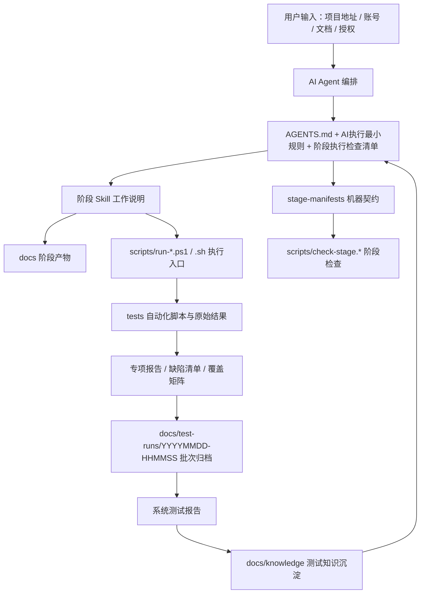

# AI 驱动完整测试流程配置项目

## 项目定位

本项目不是某一次测试结果的存放目录，而是一套可复用的 AI 驱动测试流程配置。

它的目标是把一个系统测试团队从“拿到需求后怎么分析、怎么设计、怎么生成用例、怎么自动化执行、怎么判断是否继续、怎么沉淀知识”这条链路配置成可迁移、可复用、可审计的工程资产。

这套配置可以用于当前被测系统，也可以迁移到其他电脑、其他项目，甚至换一个 AI 模型继续使用。迁移后只需要替换被测地址、账号、文档、工具路径和环境变量，流程本身不需要重新设计。

## 核心理念

### 1. 过程比单次结果更重要

本项目最重要的资产不是“某一次 API 通过多少条、UI 失败多少条”，而是这些问题：

- 每个测试阶段为什么要做。
- 每个阶段基于什么输入开始。
- 每个阶段应该产出什么。
- 哪些门禁满足后才能进入下一阶段。
- 冒烟失败后如何判断继续、复测、补证据、降级、停止或移交。
- 结果如何归档，知识如何沉淀，下一轮如何复用。

### 2. 真实系统优先

只要真实系统和真实接口可访问，需求分析、接口用例、API 自动化和系统报告都优先依据实测行为。

接口文档、需求文档和原型用于对照差异，但不能在未经确认前覆盖真实实现。文档与实际接口不一致时，必须单列为“文档与实际差异/待确认”，不能直接按文档断言把真实实现判为失败。

没有接口文档时，流程也能继续：通过前端 Network、页面操作、源码线索、接口探测或现有脚本形成“实测接口基线”，再基于基线设计用例和自动化断言。

### 3. 阶段门禁防止“为了跑而跑”

所有执行类专项都必须遵循：

```text
门禁检查 -> 冒烟执行 -> 结果分析 -> 下一步决策 -> 执行或停止 -> 沉淀配置
```

这意味着：

- 服务不通，不继续跑 API、UI、性能、安全。
- API 连接级失败，不继续 UI、性能、安全。
- API 文档差异不直接阻断 UI，必须先区分真实认证不可用、连接失败、断言口径问题。
- 性能 smoke 未达标，不直接加压。
- 安全基线未确认授权和目标稳定性，不主动扫描。
- 覆盖矩阵未生成，不允许宣称完整自动化。

### 4. 控制 token 浪费

AI 默认不读取整包文档，也不默认扫描全部测试结果。它应该先读轻量入口，再按需追证。

默认入口是：

- `docs/AI执行最小规则.md`
- 当前阶段正式输入
- 覆盖矩阵
- 本轮 `docs/test-runs/YYYYMMDD-HHMMSS/批次摘要.md`
- 专项报告和缺陷清单

只有当摘要无法回答问题、统计冲突、证据缺失时，才展开原始报告、脚本或历史归档。

## 总体架构



### 架构分层

| 层级 | 目录/文件 | 作用 |
|------|-----------|------|
| 总规则层 | `AGENTS.md` | 定义项目目标、全局流程约束、输入输出约定、阶段门禁和执行边界 |
| 最小读取层 | `docs/AI执行最小规则.md` | 降低 AI token 消耗，规定默认读取顺序和禁止默认整目录扫描 |
| 阶段门禁层 | `docs/阶段执行检查清单.md` | 解释每个阶段的准入、准出、执行顺序和风险处理 |
| 机器契约层 | `stage-manifests/*.yaml` | 给脚本和模型使用的阶段输入、输出、门禁、状态规则 |
| Skill 层 | `.codex/skills/*/SKILL.md` | 每个阶段的详细工作说明和强制规则 |
| 执行入口层 | `scripts/run-*.ps1`、`scripts/run-*.sh` | API、UI、性能、安全和完整流程的统一执行入口 |
| 脚本公共层 | `scripts/lib/stage-common.ps1`、`scripts/stage_contract.py` | 统一 RunId、批次目录、stage-status 和阶段契约检查 |
| 自动化资产层 | `tests/` | API pytest、UI Playwright、Locust、ZAP 相关脚本 |
| 阶段产物层 | `docs/analysis`、`docs/test-plan`、`docs/cases`、`docs/reports`、`docs/defects` | 当前最新正式报告、用例、缺陷和覆盖矩阵 |
| 批次归档层 | `docs/test-runs/YYYYMMDD-HHMMSS/` | 每轮测试的时间归档，包含报告、缺陷、原始结果和批次摘要 |
| 知识沉淀层 | `docs/knowledge/` | 可复用业务规则、回归资产、缺陷模式、环境工具问题和下一轮建议 |

## 阶段流程

当前流程分为 11 个阶段。

| 阶段 | 目标 | 主要产物 | 驱动方式 |
|------|------|----------|----------|
| 1. 需求分析 | 分析文档、原型、实际页面、实际接口，形成测试设计输入 | `docs/analysis/需求分析报告.md` | `req-analysis` skill |
| 2. 测试设计 | 明确测什么、不测什么、怎么测、阶段安排和门禁 | `docs/test-plan/测试方案.md`、`docs/test-plan/测试计划.md` | `test-plan` skill |
| 3. 用例生成 | 生成五类测试用例 | `docs/cases/*.md` | `case-gen-*` skills |
| 4. 用例评审 | 优先检查需求覆盖度，其次检查可执行性、重复、歧义、预期 | `docs/cases/*-评审版.md`、`docs/cases/测试用例评审记录.md` | `case-review` skill |
| 5. 覆盖矩阵 | 映射评审版用例到脚本、执行层级、状态和断言来源 | `docs/reports/*覆盖矩阵.md` | `coverage-matrix` skill |
| 6. API 自动化 | 生成/执行 pytest 接口自动化，先 smoke 再决策 | `tests/api/`、接口报告、接口缺陷清单 | `api-auto` skill + `scripts/run-api-tests.*` |
| 7. UI 自动化 | 生成/执行 Playwright UI 自动化和兼容性测试 | `tests/ui/`、UI 报告、UI 缺陷清单 | `ui-auto-playwright` skill + `scripts/run-ui-tests.*` |

| 8. 性能测试 | 使用 Locust，先性能 smoke，再决定是否加压 | `tests/performance/locust/`、性能报告、缺陷清单 | `perf-locust` skill + `scripts/run-locust-*.ps1` |
| 9. 安全测试 | 使用 ZAP，先安全基线，再决定是否主动扫描 | `tests/security/`、安全报告、漏洞清单 | `security-zap` skill + `scripts/run-security-tests.*` |
| 10. 系统测试报告 | 汇总所有专项测试结果，形成系统测试结论 | 系统测试报告 | `system-test-report` skill |
| 11. 测试知识沉淀 | 沉淀可复用业务规则、回归资产、缺陷模式和下一轮建议 | `docs/knowledge/*.md` | `knowledge-base` skill |

## Agent 与 Skill 设计

项目最终收敛为 5 类核心 agent 角色，避免早期 9 个 agent 过细导致职责重叠、上下文浪费和协作边界不清。

| Agent 角色 | 职责 |
|------------|------|
| `qa_orchestrator` | 完整测试流程总控，负责阶段推进、门禁判断、并行编排和系统报告收口 |
| `test_analyst` | 负责需求分析、历史知识复用、测试方案和测试计划设计 |
| `case_engineer` | 负责功能、接口、性能、安全测试用例生成 |
| `case_reviewer` | 负责用例评审，第一优先级是需求覆盖度 |
| `automation_engineer` | 负责 API、UI、性能、安全专项脚本生成、执行入口、报告和缺陷清单 |

Skill 是 agent 的可复用工作说明。当前项目内的核心 skills 包括：

- `req-analysis`
- `test-plan`
- `case-gen-functional`
- `case-gen-api`
- `case-gen-performance`
- `case-gen-security`
- `case-review`
- `coverage-matrix`
- `stage-gate`
- `api-auto`
- `ui-auto-playwright`
- `perf-locust`
- `security-zap`
- `system-test-report`
- `knowledge-base`

这些 skill 的职责是让不同模型在不同电脑上也能按同一套流程行动，而不是依赖某一次对话里的临时提示词。

## 如何驱动项目

### 1. 从完整流程开始

当需求、接口文档、原型等资料已经放入约定目录时，可以这样启动：

```text
需求、接口文档和原型已放到约定目录，请按 AGENTS.md 从需求分析开始执行完整测试流程。被测地址是 <URL>，测试账号是 <USERNAME>，密码 <PASSWORD>，允许性能压测与安全扫描。
```

AI 应按阶段执行，不允许跳过前置产物。

### 2. 只有项目地址时也可以开始

如果没有任何文档，也可以只给项目地址和账号：

```text
只有被测地址和账号密码，请先按需求分析阶段做黑盒探索，形成实测接口基线，再进入后续测试设计。
```

此时需求分析报告不能假装知道完整业务需求，只能写“实际可观察行为”和“待确认项”。

### 3. 自动化执行入口

Windows 优先使用 PowerShell：

```powershell
pwsh -File scripts/run-full-test-flow.ps1 `
  -FrontendUrl "http://example.com" `
  -ApiBaseUrl "http://example.com:8000" `
  -Username "admin" `
  -Password "******"
```

单项执行入口：

```powershell
pwsh -File scripts/run-api-tests.ps1 -Mode smoke
pwsh -File scripts/run-api-tests.ps1 -Mode full
pwsh -File scripts/run-ui-tests.ps1
pwsh -File scripts/run-locust-api.ps1 -Mode smoke
pwsh -File scripts/run-locust-api.ps1 -Mode full
pwsh -File scripts/run-locust-ui.ps1
pwsh -File scripts/run-security-tests.ps1
```

Bash 入口也存在，适合 Linux、macOS 或 Git Bash：

```bash
bash scripts/run-api-tests.sh
bash scripts/run-ui-tests.sh
bash scripts/run-locust-api.sh
bash scripts/run-locust-ui.sh
bash scripts/run-security-tests.sh
```

### 4. 阶段状态检查

机器可读阶段契约在 `stage-manifests/*.yaml`。

统一检查入口：

```powershell
pwsh -File scripts/check-stage.ps1 5-api-automation
pwsh -File scripts/check-stage.ps1 5-api-automation 20260430-101500 full -WriteStatus
```

或：

```bash
bash scripts/check-stage.sh 5-api-automation
bash scripts/check-stage.sh 5-api-automation 20260430-101500 full --write-status
```

这些脚本通过 `scripts/stage_contract.py` 读取 manifest，判断阶段是否 ready、blocked、not_ready、needs_update 或 completed。

常用阶段 ID 与 manifest 文件对应：

| 阶段 ID | 文件 |
|---------|------|
| `1-req-analysis` | `stage-manifests/01-req-analysis.yaml` |
| `2-test-design` | `stage-manifests/02-test-design.yaml` |
| `3-case-generation` | `stage-manifests/03-case-generation.yaml` |
| `4-case-review` | `stage-manifests/04-case-review.yaml` |
| `5-api-automation` | `stage-manifests/05-api-automation.yaml` |
| `6-ui-automation` | `stage-manifests/06-ui-automation.yaml` |
| `7-performance` | `stage-manifests/07-performance.yaml` |
| `8-security` | `stage-manifests/08-security.yaml` |
| `9-system-test-report` | `stage-manifests/09-system-test-report.yaml` |
| `10-system-test-report` | `stage-manifests/10-system-test-report.yaml` |
| `11-knowledge-base` | `stage-manifests/11-knowledge-base.yaml` |

## 自动化执行策略

### API 自动化

- 使用 pytest。
- smoke 只覆盖真实最小闭环：登录成功 + 大盘概览 + 设备列表 + 产品列表 + 告警列表。
- 不再把复杂筛选、导出、自定义趋势等容易超时的回归项放进 smoke。
- 登录断言以实测基线优先，支持 `loggedIn + user` 或已确认 JWT 契约。
- 文档差异只能作为差异核对或待确认项，不能未经确认直接阻断 UI。

### UI 自动化

- 使用 Playwright。
- smoke 覆盖登录、首页、一级菜单、核心页面可达性。
- readonly-regression 覆盖列表、筛选、详情、只读弹窗。
- semi-auto 覆盖写操作入口、弹窗、必填校验，不提交真实数据。
- write-regression 只有在有专用测试数据和回滚策略时执行。
- 当前环境对 Node 做门禁，Node 非 LTS 支持范围时写“未执行”，避免把运行环境问题误判为产品 UI 缺陷。

### 性能测试

- 使用 Locust（Python 协程模型）。
- 支持 API 压测和 UI 全链路压测。
- 统一配置入口：`scripts/set-test-env.ps1` + `tests/config/env.yaml`。
- 先做性能 smoke。
- 关注错误率、P95/P99、吞吐、超时类型、恢复 smoke。
- smoke 未达标时默认不加压，先判断 retest、collect-evidence、downgrade、stop 或 handoff。

### 安全测试

- 使用 ZAP。
- 本机示例路径：`C:\Program Files\ZAP\Zed Attack Proxy`。
- 先做安全基线，确认授权范围、认证上下文、目标稳定性和误伤风险。
- 只有授权明确、目标稳定、性能风险可接受时，才主动扫描。

## 覆盖矩阵设计

覆盖矩阵是自动化执行前的核心门禁。

它解决的问题是：不能只跑现有脚本就宣称完成自动化，必须逐条说明评审版用例是否已实现、是否已执行、是否阻塞、阻塞原因是什么。

矩阵字段包括：

- 序号。
- 用例编号。
- 模块/接口/场景。
- 用例标题。
- 断言来源。
- 评审自动化结论。
- 执行层级。
- 目标脚本。
- 当前状态。
- 执行状态。
- 执行编排。
- 说明。

其中“断言来源”用于区分：

- 实测接口基线。
- 文档差异核对。
- 已确认契约。
- 页面行为。
- 协议样例。
- 待确认。

## 测试产物归档

每一轮执行都必须按测试时间归档：

```text
docs/test-runs/YYYYMMDD-HHMMSS/
  批次摘要.md
  reports/
  defects/
  raw/
  stage-status/
```

其中：

- `批次摘要.md` 是系统报告和 AI 快速读取的入口。
- `reports/` 保存本轮报告副本。
- `defects/` 保存本轮缺陷副本。
- `raw/` 保存原始自动化结果、run logs、Locust HTML 报告、ZAP 报告等。
- `stage-status/` 保存阶段状态 JSON。

`docs/reports/` 和 `docs/defects/` 可以保留最新版本，但历史追溯以 `docs/test-runs/` 为准。

## 这套项目是如何演进到现在的

### 第一阶段：从“跑测试”转为“配置测试流程”

最开始关注的是 API 和 UI 自动化能不能跑起来。但很快发现，单纯跑脚本不能解决核心问题：

- UI 用例有几十条，但实际只跑了几条。
- API 服务不通时还继续跑后续专项。
- 性能和安全配置没准备好就尝试执行。
- 报告中结论、风险、建议放在正文前，阅读顺序不适合交付。

于是项目目标被重新定义为：构建一套完整、可复用、可迁移的测试流程配置。

### 第二阶段：重构 agent 和 skill

早期设计过 9 个 agent，但职责过细，容易重叠和浪费上下文。后来收敛为 5 个核心 agent，并按阶段拆分 skill。

新增了两个关键 skill：

- `stage-gate`：负责阶段门禁判断。
- `coverage-matrix`：负责自动化覆盖矩阵。

这一步解决了“流程不对齐”和“只跑已有脚本就说完成”的问题。

### 第三阶段：补齐性能和安全执行策略

配置了 Locust 和 ZAP 的本机路径，并明确：

- 性能必须在 API/UI 之后。
- 安全必须在性能之后。
- 性能先 smoke，不达标不加压。
- 安全先基线，不稳定不主动扫描。
- 未配置工具时写“未执行”，不强行跑。

这一步把性能和安全从“工具调用”变成了“风险受控的专项流程”。

### 第四阶段：引入真实环境后的阻断处理

真实环境执行时发现：

- 前端地址和后端地址需要区分，后端要自行分析。
- API 并非连接拒绝，而是服务可达但存在响应超时、错误密码 500、未授权访问等问题。
- UI 的 Playwright worker 在 Node v25 下出现 `spawn EPERM`，属于本机运行环境问题，不是产品 UI 缺陷。

于是统一执行入口做了改造：

- 先服务预检。
- 再 API smoke。
- smoke 通过才进入 API full。
- API 连接级失败或真实认证不可用时停止后续专项。
- UI 环境不满足时写“未执行”。
- 原始结果只归档实际执行的专项，不复制旧 raw 目录。

### 第五阶段：修正"文档优先"的错误口径

后来进一步发现，即使有接口文档，也不能让文档覆盖真实系统。

因此项目统一改成：

- 真实接口可访问时，实测行为优先。
- 文档差异单列待确认。
- 未确认文档契约不能作为 smoke 阻断。
- 登录返回 `loggedIn + user` 这类真实响应先作为实测基线。
- JWT `access/refresh` 只有确认以接口文档为准后，才作为硬断言。

这一步是整个项目逻辑上最重要的收敛之一。

### 第六阶段：统一配置管理与性能测试工具迁移

随着测试框架增多（pytest、Playwright、Locust），配置分散在多个文件中难以维护。

因此项目统一改成：
- 使用 `scripts/set-test-env.ps1` 作为统一环境变量设置入口。
- 创建 `tests/config/env.yaml` 作为统一配置文件，所有测试框架共享。
- 采用“环境变量优先 + 配置文件兜底”的策略。
- 将性能测试工具从 JMeter 迁移到 Locust（Python 协程模型），与项目技术栈统一。
- Locust 支持 API 压测和 UI 全链路压测，代码复用率大幅提升。

### 第七阶段：控制 token 浪费

随着报告和历史批次越来越多，AI 很容易误扫整目录、读取历史归档、重复展开长文档。

因此补充了：

- 默认先读 `docs/AI执行最小规则.md`。
- 默认不整包读取 `docs/reports/`、`docs/defects/`、`docs/knowledge/`、`tests/`。
- 系统报告优先读取批次摘要、覆盖矩阵、专项报告、缺陷清单。
- 知识沉淀优先读取系统报告、批次摘要、覆盖矩阵、缺陷清单。
- pytest 静态 collect-only 必须覆盖默认 addopts，避免污染正式原始报告。

### 第八阶段：修复时序问题与全链路测试验证

在全链路测试执行中发现，`10-system-test-report` 阶段的 check 在批次摘要生成之前执行，导致状态检查返回 `blocked`，系统测试报告无法生成。

因此修复了：

- 调整 `scripts/run-full-test-flow.ps1` 中的执行顺序，确保 `10-system-test-report` 和 `11-knowledge-base` 的 check 在批次摘要生成之后执行。
- 修复 PowerShell 脚本编码问题（UTF-8 with BOM）。
- 修复性能测试认证失败问题（密码加密逻辑）。
- 修复 UI 测试超时问题（延长超时时间至 900 秒）。

验证结果：
- 全链路测试完整执行，所有阶段状态正常。
- API 自动化测试：通过（100%）。
- UI 自动化测试：通过（100%）。
- 性能测试：通过（smoke 级别）。
- 安全测试：失败（发现 3 个高危、6 个中危漏洞）。
- 系统测试报告：正常生成。
- 测试知识沉淀：正常完成。

## 当前项目的关键能力

### 已具备

- 11 阶段完整测试流程配置。
- 5 类核心 agent 职责设计。
- 15 个阶段 skill。
- API/UI/性能/安全统一执行入口。
- stage-manifests 机器契约。
- 阶段状态检查脚本。
- 测试时间归档。
- 批次摘要。
- 覆盖矩阵。
- 冒烟后自适应决策。
- 真实接口优先规则。
- token 节省规则。
- 系统测试报告和知识沉淀规则。
- 全链路测试时序修复，确保系统测试报告和知识沉淀阶段正常执行。
- 性能测试认证修复，支持 AES-256-ECB 加密密码认证。
- 脚本编码统一为 UTF-8 with BOM，避免中文乱码。

### 仍需按项目现场补齐

- 当前被测系统的正式需求确认。
- 真实后端接口稳定性。
- 写操作测试数据和回滚策略。
- Locust 压测参数和监控指标。
- ZAP 扫描范围、认证上下文和授权边界。
- Node.js LTS、浏览器、Python、Locust、ZAP 等本机工具环境。

## 如何迁移到其他项目

### 1. 复制配置

复制以下核心目录和文件：

```text
AGENTS.md
.codex/config.toml
.codex/agents/
.codex/skills/
docs/AI执行最小规则.md
docs/阶段执行检查清单.md
stage-manifests/
scripts/
tests/
docs/reports/README.md
```

### 2. 替换项目输入

按约定放入：

```text
docs/requirements/
docs/prototype/
docs/api/
```

如果没有文档，只提供项目地址和账号也可以，但需求分析报告必须写明“基于实际可观察行为”。

### 3. 配置环境变量

常用环境变量：

```text
BASE_URL
API_BASE_URL
TEST_USERNAME
TEST_PASSWORD
API_TIMEOUT_SECONDS
LOCUST_HOST
LOCUST_USERS
LOCUST_SPAWN_RATE
LOCUST_RUN_TIME
ZAP_HOME
CHROMIUM_EXECUTABLE_PATH
```

### 4. 从需求分析重新开始

不能直接复用旧系统的业务结论。迁移后必须重新执行：

```text
需求分析 -> 测试设计 -> 用例生成 -> 用例评审 -> 覆盖矩阵 -> 自动化与专项执行 -> 系统报告 -> 知识沉淀
```

## 适合分享时强调的亮点

1. **这不是脚本集合，而是一套流程操作系统。**
   脚本只是执行入口，真正有价值的是阶段门禁、决策规则、产物结构和知识沉淀。

2. **AI 不再只是生成测试用例，而是被流程约束。**
   它必须按阶段读输入、写产物、做门禁、给证据、落决策。

3. **真实接口优先解决了文档过期问题。**
   有文档时对照差异，没有文档时形成实测基线。

4. **覆盖矩阵解决了“只跑已有脚本”的假覆盖。**
   每条评审版用例都必须映射到脚本、状态、执行层级和阻塞原因。

5. **冒烟后决策让性能和安全更安全。**
   不是有工具就跑，而是先看目标是否稳定、授权是否明确、指标是否达标。

6. **时间归档让每一轮测试可追溯。**
   当前报告可以更新，但历史批次不丢。

7. **知识沉淀让下一轮迭代越来越省力。**
   规则、缺陷模式、回归资产、环境问题都会被保存为可复用资产。

## 分享讲解提纲

如果要把这个项目介绍给别人，可以按下面 6 个部分讲：

### 1. 先讲问题

传统测试自动化经常遇到这些问题：

- 有脚本，但不知道覆盖了多少真实需求。
- 有报告，但不知道能不能继续下一阶段。
- 有接口文档，但真实接口已经变了。
- 服务不通还继续跑 UI、性能、安全，浪费时间。
- 性能和安全工具能调用，但风险边界不清。
- AI 每次都重新读大量文档，浪费 token，也容易读到旧结论。

本项目就是为了解决这些“流程不稳”的问题。

### 2. 再讲核心设计

核心设计可以概括成一句话：

```text
用 AGENTS.md 定义总规则，用 skill 定义阶段做法，用 stage-manifests 定义机器契约，用 scripts 执行门禁和专项，用 docs/test-runs 留痕，用 docs/knowledge 沉淀复用知识。
```

### 3. 讲 11 阶段流程

从需求分析开始，到测试设计、用例、评审、覆盖矩阵、五类专项执行、系统报告、知识沉淀结束。

重点强调：每个阶段都有输入、输出、门禁和完成判定，不是 AI 想到哪做到哪。

### 4. 讲真实接口优先

这是项目最重要的工程判断之一。

有文档时，文档是对照源；真实系统可访问时，实测行为是主依据。文档差异必须记录，但未确认前不能直接把真实实现判失败。

### 5. 讲冒烟后决策

所有执行专项都不直接全量跑，而是先 smoke，再判断：

- `continue`
- `retest`
- `collect-evidence`
- `downgrade`
- `stop`
- `handoff`

这让 AI 的执行动作有证据依据。

### 6. 最后讲可迁移性

迁移到新项目时，不复用旧业务结论，只复用流程配置。

新项目只需要替换：

- 被测地址。
- 账号。
- 文档。
- 工具路径。
- 环境变量。
- 必要测试数据。

然后从需求分析重新开始。

## 常见问答

### Q1：这是不是一个自动化测试框架？

不只是。它包含自动化脚本，但更准确地说是一套 AI 驱动的完整测试流程配置。自动化只是其中一个阶段。

### Q2：没有需求文档能不能测？

可以。没有文档时，需求分析阶段会基于项目地址做黑盒探索，观察页面、路由、接口请求和响应，形成实测接口基线。但报告必须说明这是“实际可观察行为”，不能假装是完整产品需求。

### Q3：有接口文档时为什么还要以真实接口为准？

因为接口文档可能过期。测试首先要准确描述真实系统，再把文档差异列为待确认。只有产品或研发确认“以文档为准”后，文档契约才会成为硬断言。

### Q4：为什么不能 API、UI、性能、安全一起跑？

因为后置专项依赖前置门禁。服务不通、认证不可用、接口严重超时的时候继续压测或安全扫描没有价值，还可能误伤环境。API/UI 可以受控并行，但性能和安全必须后置。

### Q5：覆盖矩阵解决了什么？

覆盖矩阵防止“跑了已有脚本就说完成”。它要求每条评审版用例都有对应的脚本状态、执行状态、执行层级、断言来源和阻塞原因。

### Q6：为什么要有 stage-manifests？

`AGENTS.md` 和 skill 更适合人和 AI 阅读，但脚本需要机器可读的阶段契约。`stage-manifests/*.yaml` 就是给脚本判断阶段状态用的唯一真源。

### Q7：为什么要做知识沉淀？

系统测试报告只回答这一轮测试是否闭环。知识沉淀回答下一轮怎么复用，包括缺陷模式、回归资产、环境工具问题、自动化维护项和下一轮测试建议。

### Q8：换一个 AI 模型还能用吗？

设计目标就是可以。新模型只要读取 `AGENTS.md`、`docs/AI执行最小规则.md`、`docs/阶段执行检查清单.md` 和对应 skill，就能按同一套流程继续工作。

## 推荐阅读顺序

第一次了解项目，建议按这个顺序阅读：

1. `README.md`
2. `AGENTS.md`
3. `docs/AI执行最小规则.md`
4. `docs/阶段执行检查清单.md`
5. `stage-manifests/schema.yaml`
6. `.codex/skills/req-analysis/SKILL.md`
7. `.codex/skills/stage-gate/SKILL.md`
8. `.codex/skills/coverage-matrix/SKILL.md`
9. `scripts/run-full-test-flow.ps1`
10. `docs/reports/README.md`

如果要看当前执行结果，再进入：

```text
docs/test-runs/YYYYMMDD-HHMMSS/批次摘要.md
docs/reports/系统测试报告.md
docs/knowledge/README.md
```

## 当前状态总结

当前项目已经从“能跑 API/UI 自动化脚本”的初级状态，演进为一套完整的 AI 驱动测试流程配置：

- 有阶段。
- 有门禁。
- 有 agent/skill 职责。
- 有机器契约。
- 有执行入口。
- 有覆盖矩阵。
- 有批次归档。
- 有系统报告。
- 有知识沉淀。
- 有 token 节省策略。
- 有真实接口优先原则。

下一步真正要做的，不是继续堆更多脚本，而是在真实项目中反复跑闭环，让每一次执行暴露的流程问题继续反哺配置。

这也是本项目最有价值的地方：它会随着测试实践变得越来越稳。
